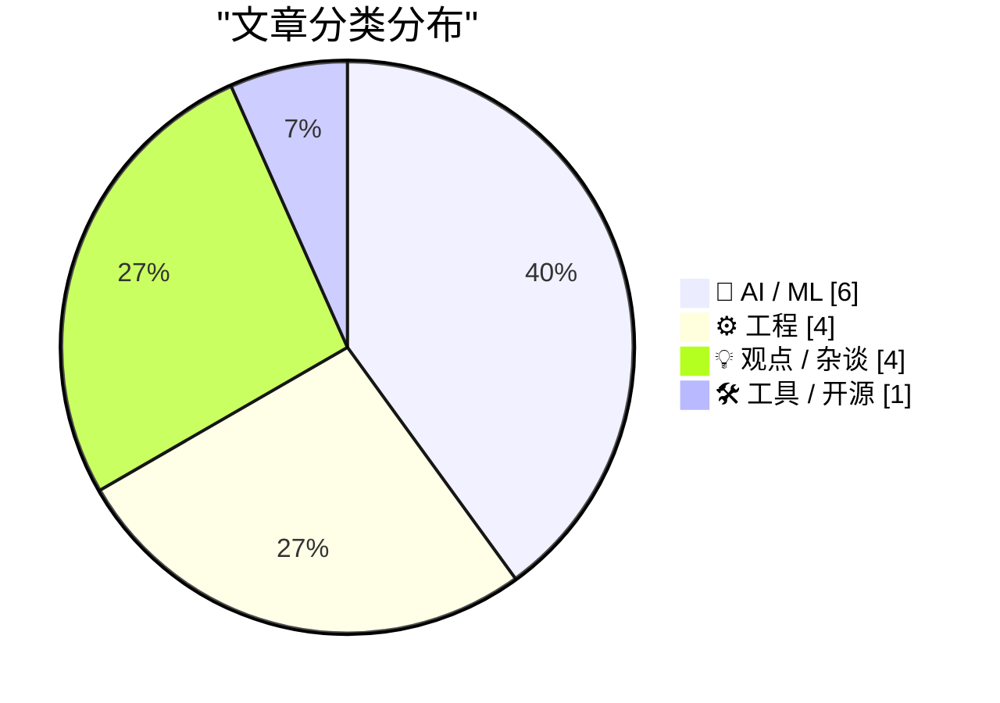
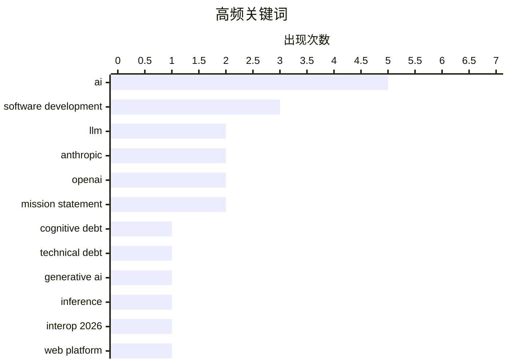

# 📰 AI 博客每日精选 — 2026-02-15

> 来自 Karpathy 推荐的 92 个顶级技术博客，AI 精选 Top 15

## 📝 今日看点

今日看点：AI领域正经历快速发展带来的新挑战，包括认知债务和数据中心建设的巨大投入。同时，AI对软件工程的影响备受关注，工程师的角色依然重要，初级开发者或将受益于AI工具。此外，Web平台互操作性成为行业共识，Interop 2026 旨在提升跨浏览器体验。

---

## 🏆 今日必读

🥇 **生成式和代理式AI将关注点从技术债务转移到认知债务**

[How Generative and Agentic AI Shift Concern from Technical Debt to Cognitive Debt](https://simonwillison.net/2026/Feb/15/cognitive-debt/#atom-everything) — simonwillison.net · 9 小时前 · 🤖 AI / ML

> 文章探讨了随着生成式和代理式AI的兴起，软件开发中的关注点正在从传统的技术债务转向“认知债务”。认知债务指的是理解和维护AI系统所需的额外认知负担，包括理解AI的决策过程、调试其行为以及管理其潜在的偏见。这种债务的累积可能导致项目延误、质量下降和维护成本增加。文章强调，我们需要新的工具和方法来管理和减少认知债务，以确保AI系统的可靠性和可维护性。因此，理解和解决认知债务对于成功应用AI至关重要。

💡 **为什么值得读**: 了解“认知债务”这一新兴概念，有助于更好地应对AI时代软件开发的新挑战。

🏷️ cognitive debt, technical debt, generative AI

🥈 **快速LLM推理的两种不同技巧**

[Two different tricks for fast LLM inference](https://seangoedecke.com/fast-llm-inference/) — seangoedecke.com · 14 小时前 · 🤖 AI / ML

> Anthropic和OpenAI最近都推出了“快速模式”，旨在显著提高其最佳编码模型的交互速度。Anthropic的快速模式提供高达2.5倍的tokens/秒的速度提升，通过减少模型大小和训练数据来实现。而OpenAI的快速模式则基于GPT-3.5 Codex Spark，通过牺牲部分准确性来换取速度。这两种方法代表了在LLM推理速度和准确性之间进行权衡的不同策略。选择哪种方法取决于具体的应用场景和对速度或准确性的优先级。

💡 **为什么值得读**: 了解Anthropic和OpenAI在加速LLM推理方面的不同策略，有助于选择最适合自身需求的方案。

🏷️ LLM, inference, Anthropic, OpenAI

🥉 **启动Interop 2026**

[Launching Interop 2026](https://simonwillison.net/2026/Feb/15/interop-2026/#atom-everything) — simonwillison.net · 10 小时前 · ⚙️ 工程

> Interop 2026是由Apple、Google、Igalia、Microsoft和Mozilla共同发起的一项倡议，旨在确保一组特定的Web平台功能在今年内实现跨浏览器的一致性。该项目延续了Interop系列成功的经验，自2021年起，Interop系列致力于解决Web平台的兼容性问题。Interop 2026将重点关注特定功能，以提升Web开发者的体验，减少跨浏览器兼容性带来的困扰。该合作体现了行业对Web平台互操作性的重视。

💡 **为什么值得读**: 关注Interop 2026，了解Web平台互操作性的最新进展，有助于提升Web开发效率。

🏷️ Interop 2026, web platform, browser compatibility

---

## 📊 数据概览

| 扫描源 | 抓取文章 | 时间范围 | 精选 |
|:---:|:---:|:---:|:---:|
| 84/92 | 2407 篇 → 31 篇 | 48h | **15 篇** |

### 分类分布



### 高频关键词



<details>
<summary>📈 纯文本关键词图（终端友好）</summary>

```
ai                   │ ████████████████████ 5
software development │ ████████████░░░░░░░░ 3
llm                  │ ████████░░░░░░░░░░░░ 2
anthropic            │ ████████░░░░░░░░░░░░ 2
openai               │ ████████░░░░░░░░░░░░ 2
mission statement    │ ████████░░░░░░░░░░░░ 2
cognitive debt       │ ████░░░░░░░░░░░░░░░░ 1
technical debt       │ ████░░░░░░░░░░░░░░░░ 1
generative ai        │ ████░░░░░░░░░░░░░░░░ 1
inference            │ ████░░░░░░░░░░░░░░░░ 1
```

</details>

### 🏷️ 话题标签

**ai**(5) · **software development**(3) · **llm**(2) · anthropic(2) · openai(2) · mission statement(2) · cognitive debt(1) · technical debt(1) · generative ai(1) · inference(1) · interop 2026(1) · web platform(1) · browser compatibility(1) · data center(1) · financial crisis(1) · capital expenditures(1) · product launch(1) · iteration(1) · startup(1) · engineering(1)

---

## 🤖 AI / ML

### 1. 生成式和代理式AI将关注点从技术债务转移到认知债务

[How Generative and Agentic AI Shift Concern from Technical Debt to Cognitive Debt](https://simonwillison.net/2026/Feb/15/cognitive-debt/#atom-everything) — **simonwillison.net** · 9 小时前 · ⭐ 25/30

> 文章探讨了随着生成式和代理式AI的兴起，软件开发中的关注点正在从传统的技术债务转向“认知债务”。认知债务指的是理解和维护AI系统所需的额外认知负担，包括理解AI的决策过程、调试其行为以及管理其潜在的偏见。这种债务的累积可能导致项目延误、质量下降和维护成本增加。文章强调，我们需要新的工具和方法来管理和减少认知债务，以确保AI系统的可靠性和可维护性。因此，理解和解决认知债务对于成功应用AI至关重要。

🏷️ cognitive debt, technical debt, generative AI

---

### 2. 快速LLM推理的两种不同技巧

[Two different tricks for fast LLM inference](https://seangoedecke.com/fast-llm-inference/) — **seangoedecke.com** · 14 小时前 · ⭐ 24/30

> Anthropic和OpenAI最近都推出了“快速模式”，旨在显著提高其最佳编码模型的交互速度。Anthropic的快速模式提供高达2.5倍的tokens/秒的速度提升，通过减少模型大小和训练数据来实现。而OpenAI的快速模式则基于GPT-3.5 Codex Spark，通过牺牲部分准确性来换取速度。这两种方法代表了在LLM推理速度和准确性之间进行权衡的不同策略。选择哪种方法取决于具体的应用场景和对速度或准确性的优先级。

🏷️ LLM, inference, Anthropic, OpenAI

---

### 3. 高级：AI数据中心金融危机

[Premium: The AI Data Center Financial Crisis](https://www.wheresyoured.at/data-center-crisis/) — **wheresyoured.at** · 1 天前 · ⭐ 23/30

> 自2023年初以来，大型科技公司已在资本支出上投入超过8140亿美元，其中很大一部分用于满足OpenAI和Anthropic等AI公司的需求。这些支出主要集中在GPU、电力基础设施和数据中心建设上，表明了AI发展对硬件资源和基础设施的巨大需求。文章暗示这种大规模投资可能带来金融风险，需要密切关注AI数据中心建设的经济可持续性。因此，需要审慎评估AI发展带来的经济影响。

🏷️ AI, data center, financial crisis, capital expenditures

---

### 4. OpenAI使命宣言的演变

[The evolution of OpenAI's mission statement](https://simonwillison.net/2026/Feb/13/openai-mission-statement/#atom-everything) — **simonwillison.net** · 1 天前 · ⭐ 22/30

> 作为一家美国的501(c)(3)非营利组织，OpenAI每年都需要向美国国税局(IRS)提交纳税申报表。申报表中的一个必填字段是“简要描述该组织的使命或最重要的活动”，这具有实际的法律效力，因为IRS可以使用它来评估该组织是否坚持其使命并有资格维持其非营利免税地位。因此，OpenAI的使命宣言的演变反映了其战略重点的变化。

🏷️ OpenAI, mission statement, non-profit

---

### 5. Dario Amodei — “我们接近指数增长的尾声”

[Dario Amodei — "We are near the end of the exponential"](https://www.dwarkesh.com/p/dario-amodei-2) — **dwarkesh.com** · 1 天前 · ⭐ 22/30

> Dario Amodei 认为我们正接近AI指数增长的尾声，并以此传达紧迫感。具体原因和论据需要阅读原文。

🏷️ Dario Amodei, AI, exponential growth, urgency

---

### 6. Anthropic 的公共利益使命

[Anthropic's public benefit mission](https://simonwillison.net/2026/Feb/13/anthropic-public-benefit-mission/#atom-everything) — **simonwillison.net** · 1 天前 · ⭐ 21/30

> 本文探讨了 Anthropic 作为一家“公共利益公司”的使命，并对比了其与 OpenAI 的不同之处。Anthropic 虽然不是非营利组织，因此不像 OpenAI 那样需要每年向 IRS 提交公开文件，但仍然致力于公共利益。文章通过 Claude 搜索，挖掘了 Anthropic 相关的公开信息。Anthropic 的独特组织形式使其在追求商业利益的同时，也肩负着服务社会的责任。

🏷️ Anthropic, public benefit, mission statement

---

## ⚙️ 工程

### 7. 启动Interop 2026

[Launching Interop 2026](https://simonwillison.net/2026/Feb/15/interop-2026/#atom-everything) — **simonwillison.net** · 10 小时前 · ⭐ 23/30

> Interop 2026是由Apple、Google、Igalia、Microsoft和Mozilla共同发起的一项倡议，旨在确保一组特定的Web平台功能在今年内实现跨浏览器的一致性。该项目延续了Interop系列成功的经验，自2021年起，Interop系列致力于解决Web平台的兼容性问题。Interop 2026将重点关注特定功能，以提升Web开发者的体验，减少跨浏览器兼容性带来的困扰。该合作体现了行业对Web平台互操作性的重视。

🏷️ Interop 2026, web platform, browser compatibility

---

### 8. 在Docker构建中分离下载和安装

[Separating Download from Install in Docker Builds](https://nesbitt.io/2026/02/15/separating-download-from-install-in-docker-builds.html) — **nesbitt.io** · 14 小时前 · ⭐ 22/30

> 大多数包管理器都可以将下载和安装分离，以实现更好的Docker层缓存。通过将下载步骤与安装步骤分开，可以更有效地利用Docker的层缓存机制，从而加快构建速度。当依赖项没有更改时，可以重用已缓存的下载层，避免重复下载。因此，分离下载和安装是优化Docker构建过程的有效方法。

🏷️ Docker, layer caching, package manager

---

### 9. Michael Abrash 如何将 Quake 帧率翻倍

[How Michael Abrash doubled Quake framerate](https://fabiensanglard.net/quake_asm_optimizations/index.html) — **fabiensanglard.net** · 1 天前 · ⭐ 21/30

> 本文深入分析了 Michael Abrash 如何通过汇编优化将 Quake 游戏的帧率提高一倍。文章详细剖析了 Abrash 使用的优化技巧，包括底层汇编代码的改进。这些优化技术在当时极大地提升了 Quake 的性能，使其成为游戏史上的一个里程碑。通过学习这些优化方法，可以了解早期游戏开发的底层优化思路。

🏷️ Quake, Michael Abrash, performance, optimization

---

### 10. 包管理命名空间

[Package Management Namespaces](https://nesbitt.io/2026/02/14/package-management-namespaces.html) — **nesbitt.io** · 1 天前 · ⭐ 20/30

> 本文对比了 npm、Maven、Go、Swift 和 crates.io 等不同包管理器的命名空间模型。文章分析了各种命名空间模型的优缺点，以及它们如何解决包名冲突问题。通过对比不同包管理器的设计，可以更好地理解命名空间在软件依赖管理中的作用。选择合适的包管理器和命名空间策略对于构建大型项目至关重要。

🏷️ package management, namespaces, npm, Maven

---

## 💡 观点 / 杂谈

### 11. 引用Eric Meyer

[Quoting Eric Meyer](https://simonwillison.net/2026/Feb/15/eric-meyer/#atom-everything) — **simonwillison.net** · 1 小时前 · ⭐ 22/30

> Eric Meyer反驳了关于“CSS是一个过度臃肿的烂摊子”的抱怨。他认为，CSS正在尽其所能地以人类可读的文本格式表达视觉呈现、布局设计、排版、动画、数字交互等所有内容。CSS并非臃肿，而是极具野心，其覆盖范围超出了大多数人的理解。因此，应该以更积极的视角看待CSS的复杂性。

🏷️ product launch, iteration, startup

---

### 12. 引用Boris Cherny

[Quoting Boris Cherny](https://simonwillison.net/2026/Feb/14/boris/#atom-everything) — **simonwillison.net** · 14 小时前 · ⭐ 22/30

> Claude Code的创建者Boris Cherny指出，即使在AI时代，工程师仍然至关重要。因为仍然需要有人来prompt Claude，与客户沟通，与其他团队协调，并决定下一步构建什么。工程正在发生变化，但优秀的工程师比以往任何时候都更加重要。因此，AI并不能完全取代工程师，而是改变了他们的工作方式。

🏷️ AI, engineering, software development

---

### 13. 引用Thoughtworks

[Quoting Thoughtworks](https://simonwillison.net/2026/Feb/14/thoughtworks/#atom-everything) — **simonwillison.net** · 1 天前 · ⭐ 22/30

> Thoughtworks的报告挑战了AI会消除对初级开发人员需求的说法。报告指出，初级开发人员现在比以往任何时候都更有利可图，因为AI工具可以帮助他们更快地度过最初的净负收益阶段。他们是未来生产力的看涨期权，并且比高级工程师更擅长使用AI工具。因此，AI工具的普及反而提升了初级开发人员的价值。

🏷️ AI, junior developers, software development

---

### 14. AI 推特最喜欢的谎言：每个人都想成为开发者

[AI twitter's favourite lie: everyone wants to be a developer](https://www.joanwestenberg.com/ai-twitters-favourite-lie-everyone-wants-to-be-a-developer/) — **joanwestenberg.com** · 1 天前 · ⭐ 21/30

> 文章批判了“大型语言模型可以编写代码后，每个人都将成为软件开发者”这一观点。作者认为，虽然 AI 降低了软件开发的门槛，但并非所有人都有成为开发者的意愿或需求。人们解决问题的方式多种多样，并非只有软件开发一条路。AI 赋能不等于全民皆开发者，这种观点过于理想化。

🏷️ AI, software development, LLM

---

## 🛠 工具 / 开源

### 15. Reachy Mini 测试：Hugging Face 的树莓派驱动机器人

[Testing Reachy Mini - Hugging Face's Pi powered robot](https://www.jeffgeerling.com/blog/2026/testing-reachy-mini-hugging-face-robot/) — **jeffgeerling.com** · 1 天前 · ⭐ 21/30

> 本文评测了 Hugging Face 推出的 Reachy Mini 机器人。Reachy Mini 是一款由树莓派驱动的小型机器人，能够在接收到人类指令后做出反应，例如转头查看墙上的待办事项列表、发送电子邮件以及将图纸转换为建筑渲染图。作者最初认为这只是一个噱头，但经过测试后，对 Reachy Mini 的潜力表示认可。该机器人展示了 AI 和机器人技术结合的趣味性和可能性。

🏷️ Reachy Mini, robot, Hugging Face, Raspberry Pi

---

*生成于 2026-02-15 14:55 | 扫描 84 源 → 获取 2407 篇 → 精选 15 篇*
*基于 [Hacker News Popularity Contest 2025](https://refactoringenglish.com/tools/hn-popularity/) RSS 源列表，由 [Andrej Karpathy](https://x.com/karpathy) 推荐*
*由「懂点儿AI」制作，欢迎关注同名微信公众号获取更多 AI 实用技巧 💡*
