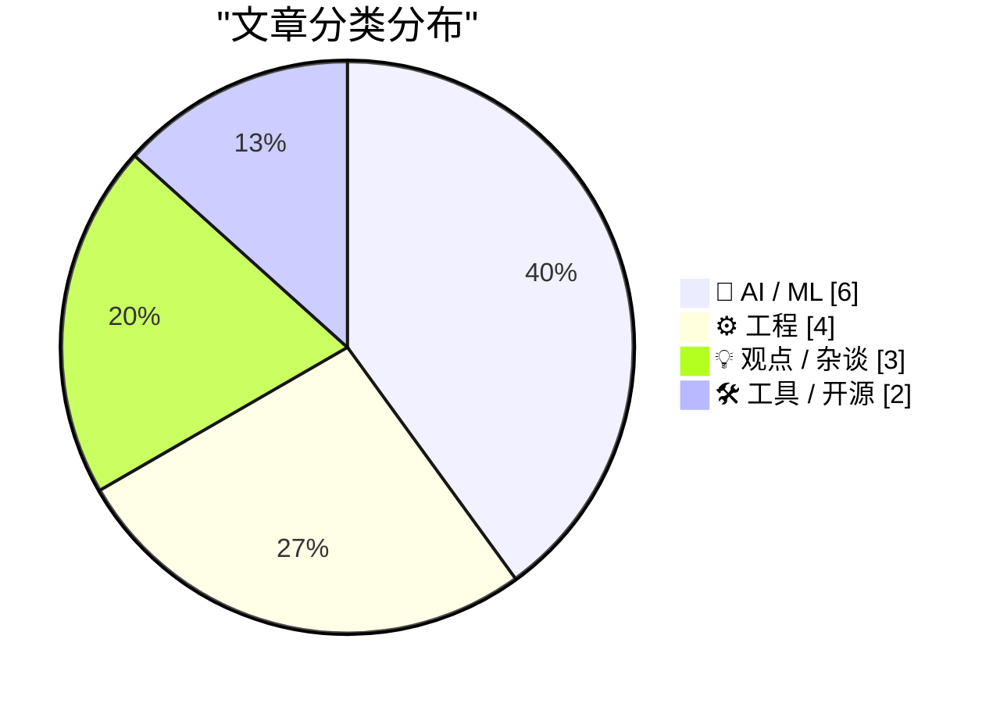
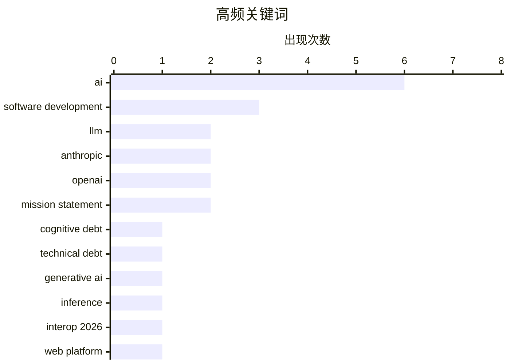

# 📰 AI 博客每日精选 — 2026-02-15

> 来自 Karpathy 推荐的 92 个顶级技术博客，AI 精选 Top 15

## 📝 今日看点

今日看点：AI发展或将面临瓶颈，行业正关注“认知债务”等隐性成本。提升LLM推理速度成为新焦点，各大厂商纷纷推出“快速模式”。同时，跨浏览器互操作性成为重要议题，Interop 2026 旨在提升Web平台一致性。

---

## 🏆 今日必读

🥇 **生成式和代理式AI将关注点从技术债务转移到认知债务**

[How Generative and Agentic AI Shift Concern from Technical Debt to Cognitive Debt](https://simonwillison.net/2026/Feb/15/cognitive-debt/#atom-everything) — simonwillison.net · 9 小时前 · 🤖 AI / ML

> Margaret-Anne Storey 的文章阐述了“认知债务”的概念，它指的是在使用生成式和代理式 AI 时，由于对系统工作原理理解不足而产生的隐性成本。认知债务强调了理解和维护 AI 系统内部运作的重要性，类似于传统软件开发中的技术债务。随着 AI 系统的复杂性增加，理解其决策过程变得至关重要，否则可能导致不可预测的结果和维护难题。因此，我们需要投入精力来理解和记录 AI 系统的内部机制，以避免认知债务的累积。认知债务的概念提醒我们，在使用 AI 技术时，不仅要关注其功能，还要关注其可理解性和可维护性。

💡 **为什么值得读**: 了解认知债务的概念有助于更好地管理和维护日益复杂的 AI 系统，避免潜在的风险和问题。

🏷️ cognitive debt, technical debt, AI, generative AI

🥈 **快速LLM推理的两种不同技巧**

[Two different tricks for fast LLM inference](https://seangoedecke.com/fast-llm-inference/) — seangoedecke.com · 14 小时前 · 🤖 AI / ML

> Anthropic 和 OpenAI 近期都推出了“快速模式”，旨在提高其最佳编码模型的交互速度。Anthropic 的快速模式提供高达 2.5 倍的 tokens/秒的速度提升，通过减少计算量来实现。而 OpenAI 的快速模式则通过模型蒸馏，使用一个更小、更快的模型来近似原始模型的输出。这两种方法在加速 LLM 推理方面采取了不同的策略，前者侧重于计算优化，后者侧重于模型简化。选择哪种方法取决于具体的应用场景和对速度与精度的权衡。

💡 **为什么值得读**: 了解 Anthropic 和 OpenAI 提供的快速 LLM 推理技术，可以帮助开发者在实际应用中选择更合适的加速方案。

🏷️ LLM, inference, Anthropic, OpenAI

🥉 **启动 Interop 2026**

[Launching Interop 2026](https://simonwillison.net/2026/Feb/15/interop-2026/#atom-everything) — simonwillison.net · 10 小时前 · ⚙️ 工程

> Interop 2026 是由 Apple、Google、Igalia、Microsoft 和 Mozilla 共同发起的一项倡议，旨在合作确保一组特定的 Web 平台功能在今年内实现跨浏览器的一致性。该系列从 2021 年开始，最初名为 Compat2021，Interop 旨在解决 Web 平台的兼容性问题，提高开发者的效率和用户体验。Interop 2026 延续了这一目标，将重点放在解决特定领域的兼容性挑战上。该计划的成功表明，跨浏览器厂商的合作对于推动 Web 平台的发展至关重要。

💡 **为什么值得读**: 了解 Interop 2026 的目标和范围，可以帮助开发者更好地了解 Web 平台的未来发展方向，并为跨浏览器兼容性做好准备。

🏷️ Interop 2026, web platform, browser compatibility

---

## 📊 数据概览

| 扫描源 | 抓取文章 | 时间范围 | 精选 |
|:---:|:---:|:---:|:---:|
| 84/92 | 2405 篇 → 30 篇 | 48h | **15 篇** |

### 分类分布



### 高频关键词



<details>
<summary>📈 纯文本关键词图（终端友好）</summary>

```
ai                   │ ████████████████████ 6
software development │ ██████████░░░░░░░░░░ 3
llm                  │ ███████░░░░░░░░░░░░░ 2
anthropic            │ ███████░░░░░░░░░░░░░ 2
openai               │ ███████░░░░░░░░░░░░░ 2
mission statement    │ ███████░░░░░░░░░░░░░ 2
cognitive debt       │ ███░░░░░░░░░░░░░░░░░ 1
technical debt       │ ███░░░░░░░░░░░░░░░░░ 1
generative ai        │ ███░░░░░░░░░░░░░░░░░ 1
inference            │ ███░░░░░░░░░░░░░░░░░ 1
```

</details>

### 🏷️ 话题标签

**ai**(6) · **software development**(3) · **llm**(2) · anthropic(2) · openai(2) · mission statement(2) · cognitive debt(1) · technical debt(1) · generative ai(1) · inference(1) · interop 2026(1) · web platform(1) · browser compatibility(1) · dario amodei(1) · exponential growth(1) · data center(1) · financial crisis(1) · gpu(1) · engineering(1) · prompt engineering(1)

---

## 🤖 AI / ML

### 1. 生成式和代理式AI将关注点从技术债务转移到认知债务

[How Generative and Agentic AI Shift Concern from Technical Debt to Cognitive Debt](https://simonwillison.net/2026/Feb/15/cognitive-debt/#atom-everything) — **simonwillison.net** · 9 小时前 · ⭐ 25/30

> Margaret-Anne Storey 的文章阐述了“认知债务”的概念，它指的是在使用生成式和代理式 AI 时，由于对系统工作原理理解不足而产生的隐性成本。认知债务强调了理解和维护 AI 系统内部运作的重要性，类似于传统软件开发中的技术债务。随着 AI 系统的复杂性增加，理解其决策过程变得至关重要，否则可能导致不可预测的结果和维护难题。因此，我们需要投入精力来理解和记录 AI 系统的内部机制，以避免认知债务的累积。认知债务的概念提醒我们，在使用 AI 技术时，不仅要关注其功能，还要关注其可理解性和可维护性。

🏷️ cognitive debt, technical debt, AI, generative AI

---

### 2. 快速LLM推理的两种不同技巧

[Two different tricks for fast LLM inference](https://seangoedecke.com/fast-llm-inference/) — **seangoedecke.com** · 14 小时前 · ⭐ 24/30

> Anthropic 和 OpenAI 近期都推出了“快速模式”，旨在提高其最佳编码模型的交互速度。Anthropic 的快速模式提供高达 2.5 倍的 tokens/秒的速度提升，通过减少计算量来实现。而 OpenAI 的快速模式则通过模型蒸馏，使用一个更小、更快的模型来近似原始模型的输出。这两种方法在加速 LLM 推理方面采取了不同的策略，前者侧重于计算优化，后者侧重于模型简化。选择哪种方法取决于具体的应用场景和对速度与精度的权衡。

🏷️ LLM, inference, Anthropic, OpenAI

---

### 3. Dario Amodei — “我们接近指数增长的尾声”

[Dario Amodei — "We are near the end of the exponential"](https://www.dwarkesh.com/p/dario-amodei-2) — **dwarkesh.com** · 1 天前 · ⭐ 23/30

> 文章引用了 Dario Amodei 的观点，暗示当前 AI 领域可能正处于指数增长的末期。他传递了一种紧迫感，暗示未来 AI 发展可能面临新的挑战或瓶颈。具体内容需要阅读原文才能了解。

🏷️ Dario Amodei, AI, exponential growth

---

### 4. 高级：AI数据中心的金融危机

[Premium: The AI Data Center Financial Crisis](https://www.wheresyoured.at/data-center-crisis/) — **wheresyoured.at** · 1 天前 · ⭐ 23/30

> 自 2023 年初以来，大型科技公司已在资本支出上花费超过 8140 亿美元，其中很大一部分用于满足 OpenAI 和 Anthropic 等 AI 公司的需求。这些支出主要集中在 GPU、电力基础设施和数据中心建设上。文章探讨了 AI 发展对数据中心基础设施带来的巨大需求，以及由此可能引发的金融风险。这种大规模的投资也反映了 AI 领域竞争的激烈程度和对算力的迫切需求。

🏷️ AI, data center, financial crisis, GPU

---

### 5. OpenAI使命声明的演变

[The evolution of OpenAI's mission statement](https://simonwillison.net/2026/Feb/13/openai-mission-statement/#atom-everything) — **simonwillison.net** · 1 天前 · ⭐ 22/30

> 作为一家美国 501(c)(3) 组织，OpenAI 每年都需要向 IRS 提交纳税申报表。申报表中的一个必填字段是“简要描述该组织的使命或最重要的活动”，这具有实际的法律效力，因为 IRS 可以使用它来评估该组织是否坚持其使命并应继续保持其非营利免税地位。文章分析了 OpenAI 历年来的 IRS 使命声明，揭示了其使命的演变过程。

🏷️ OpenAI, mission statement, non-profit

---

### 6. Anthropic的公共利益使命

[Anthropic's public benefit mission](https://simonwillison.net/2026/Feb/13/anthropic-public-benefit-mission/#atom-everything) — **simonwillison.net** · 1 天前 · ⭐ 21/30

> 文章探讨了 Anthropic 的公共利益使命，并试图找到与 OpenAI 的 IRS 使命声明相对应的文件。Anthropic 是一家“公共利益公司”，但不是非营利组织，因此他们没有义务每年向 IRS 提交公开文件。然而，通过 Claude 的搜索，找到了一份描述 Anthropic 使命的文件。这表明，即使不是非营利组织，一些 AI 公司也致力于追求公共利益。

🏷️ Anthropic, public benefit, mission statement

---

## ⚙️ 工程

### 7. 启动 Interop 2026

[Launching Interop 2026](https://simonwillison.net/2026/Feb/15/interop-2026/#atom-everything) — **simonwillison.net** · 10 小时前 · ⭐ 23/30

> Interop 2026 是由 Apple、Google、Igalia、Microsoft 和 Mozilla 共同发起的一项倡议，旨在合作确保一组特定的 Web 平台功能在今年内实现跨浏览器的一致性。该系列从 2021 年开始，最初名为 Compat2021，Interop 旨在解决 Web 平台的兼容性问题，提高开发者的效率和用户体验。Interop 2026 延续了这一目标，将重点放在解决特定领域的兼容性挑战上。该计划的成功表明，跨浏览器厂商的合作对于推动 Web 平台的发展至关重要。

🏷️ Interop 2026, web platform, browser compatibility

---

### 8. Docker 构建中分离下载与安装

[Separating Download from Install in Docker Builds](https://nesbitt.io/2026/02/15/separating-download-from-install-in-docker-builds.html) — **nesbitt.io** · 14 小时前 · ⭐ 21/30

> 文章讨论了在 Docker 构建过程中，将软件包的下载和安装步骤分离的重要性，以优化 Docker 层的缓存利用率。通过分离这两个步骤，可以避免每次构建都重新下载软件包，从而显著提升构建速度。文章指出，大多数软件包管理器都具备分离下载和安装的能力。这种优化策略对于频繁构建 Docker 镜像的项目尤其有效。

🏷️ Docker, layer caching, package manager

---

### 9. 包管理命名空间

[Package Management Namespaces](https://nesbitt.io/2026/02/14/package-management-namespaces.html) — **nesbitt.io** · 1 天前 · ⭐ 20/30

> 文章对比了 npm、Maven、Go、Swift 和 crates.io 等不同包管理器的命名空间模型。文章分析了各种命名空间模型的设计理念和实现方式，并探讨了它们在解决依赖冲突和提高代码可维护性方面的作用。通过比较不同包管理器的命名空间机制，读者可以更深入地理解包管理的核心概念。

🏷️ package management, namespaces, npm, Maven

---

### 10. Michael Abrash 如何将 Quake 的帧率提高一倍

[How Michael Abrash doubled Quake framerate](https://fabiensanglard.net/quake_asm_optimizations/index.html) — **fabiensanglard.net** · 1 天前 · ⭐ 20/30

> 文章深入分析了 Michael Abrash 如何通过汇编语言优化 Quake 引擎，从而将游戏帧率提高一倍。文章详细剖析了 Abrash 使用的各种优化技巧，包括内存管理、循环展开、以及利用 CPU 特性等。这些优化技术在当时极大地提升了 Quake 的性能，使其成为划时代的游戏作品。文章通过分析具体的代码示例，揭示了底层优化的重要性。

🏷️ Quake, Michael Abrash, performance, optimization

---

## 💡 观点 / 杂谈

### 11. 引用 Boris Cherny

[Quoting Boris Cherny](https://simonwillison.net/2026/Feb/14/boris/#atom-everything) — **simonwillison.net** · 14 小时前 · ⭐ 22/30

> Boris Cherny，Claude Code 的创建者，指出即使在 AI 时代，工程师仍然至关重要。他强调，仍然需要有人来提示 Claude，与客户沟通，与其他团队协调，并决定下一步构建什么。工程的角色正在发生变化，但优秀的工程师比以往任何时候都更加重要。即使在 AI 辅助下，人类的创造力、沟通能力和问题解决能力仍然是不可替代的。

🏷️ AI, engineering, prompt engineering, software development

---

### 12. 引用 Thoughtworks

[Quoting Thoughtworks](https://simonwillison.net/2026/Feb/14/thoughtworks/#atom-everything) — **simonwillison.net** · 1 天前 · ⭐ 22/30

> Thoughtworks 的观点挑战了 AI 会取代初级开发者的说法。他们认为，初级开发者现在比以往任何时候都更有价值，AI 工具可以帮助他们更快地度过最初的净负收益阶段。初级开发者可以作为未来生产力的期权，并且他们比高级工程师更擅长使用 AI 工具。这表明 AI 并非要取代初级开发者，而是要赋能他们，提高他们的效率和价值。

🏷️ AI, junior developers, software development, Thoughtworks

---

### 13. AI Twitter 最喜欢的谎言：每个人都想成为开发者

[AI twitter's favourite lie: everyone wants to be a developer](https://www.joanwestenberg.com/ai-twitters-favourite-lie-everyone-wants-to-be-a-developer/) — **joanwestenberg.com** · 1 天前 · ⭐ 21/30

> 文章探讨了大型语言模型（LLM）兴起后，关于“每个人都将成为开发者”这一观点的谬误。作者认为，虽然LLM降低了代码编写的门槛，但解决问题并不仅仅是编写代码。真正的挑战在于理解问题、设计解决方案，以及维护和迭代软件。因此，即使AI能够生成代码，也并不意味着每个人都能有效地利用软件解决自身问题。作者强调，编程的本质在于解决问题，而不仅仅是生成代码。

🏷️ AI, software development, LLM

---

## 🛠 工具 / 开源

### 14. 测试 Reachy Mini - Hugging Face 的 Pi 驱动机器人

[Testing Reachy Mini - Hugging Face's Pi powered robot](https://www.jeffgeerling.com/blog/2026/testing-reachy-mini-hugging-face-robot/) — **jeffgeerling.com** · 1 天前 · ⭐ 21/30

> Jeff Geerling 评测了 Hugging Face 的 Reachy Mini 机器人。这款机器人由树莓派驱动，能够响应人类输入，转头查看墙上的待办事项列表，发送电子邮件，并将图纸转化为建筑渲染图。文章探讨了 Reachy Mini 的功能和应用场景，以及 Hugging Face 在机器人领域的探索。该机器人展示了 AI 和机器人技术的结合，为未来的应用提供了新的可能性。

🏷️ Reachy Mini, Hugging Face, robot, Raspberry Pi

---

### 15. 在 Godot 4.1 中重制 Windows 2000 扫雷

[Windows 2000 Minesweeper recreated in Godot 4.1](https://jayd.ml/2026/02/14/godot-minesweeper.html) — **jayd.ml** · 1 天前 · ⭐ 20/30

> 作者使用 Godot 4.1 游戏引擎重制了 Windows 2000 扫雷游戏，并开源了 AGPL 许可的源代码。项目地址为 minesweeper.jayd.ml。作者旨在通过这个项目熟悉 Godot 引擎，并专注于实现细节，最终将大部分时间花在了菜单、对话框等琐碎的界面元素上。这个项目展示了使用 Godot 引擎进行游戏开发的实践过程。

🏷️ Godot, Minesweeper, game development

---

*生成于 2026-02-15 14:49 | 扫描 84 源 → 获取 2405 篇 → 精选 15 篇*
*基于 [Hacker News Popularity Contest 2025](https://refactoringenglish.com/tools/hn-popularity/) RSS 源列表，由 [Andrej Karpathy](https://x.com/karpathy) 推荐*
*由「懂点儿AI」制作，欢迎关注同名微信公众号获取更多 AI 实用技巧 💡*
