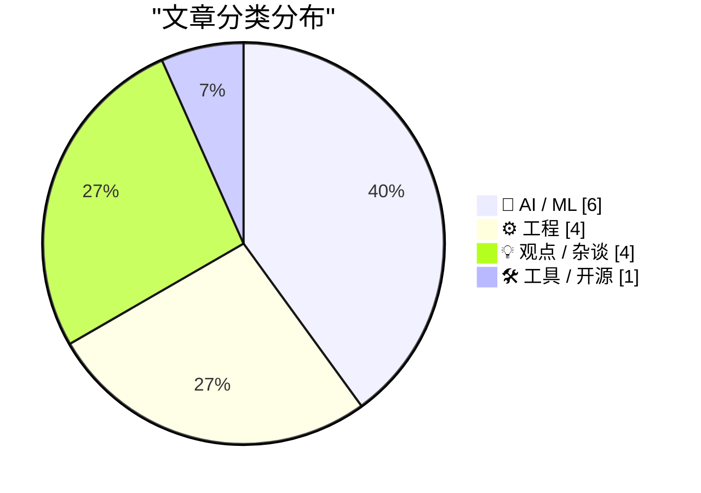
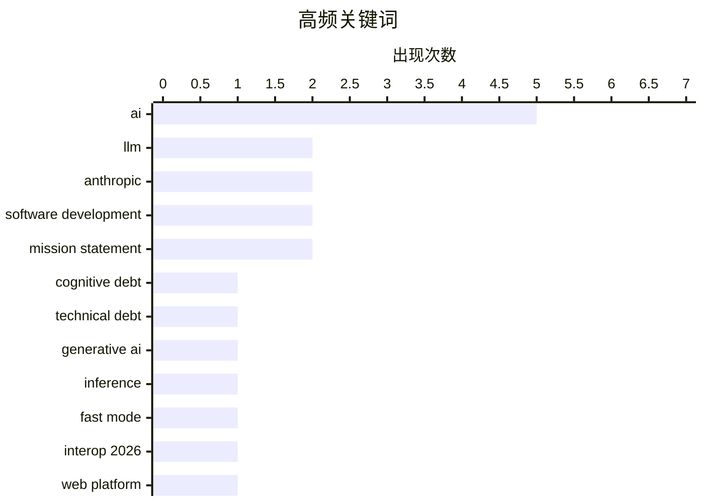

# 📰 AI 博客每日精选 — 2026-02-15

> 来自 Karpathy 推荐的 92 个顶级技术博客，AI 精选 Top 15

## 📝 今日看点

今日看点：AI发展进入新阶段，关注点从技术转向认知，指数增长或将放缓。AI数据中心建设带来巨额资本支出，或引发金融风险。尽管AI工具涌现，但工程师，尤其是初级工程师，在AI时代依然至关重要。

---

## 🏆 今日必读

🥇 **生成式和代理式AI将关注点从技术债务转移到认知债务**

[How Generative and Agentic AI Shift Concern from Technical Debt to Cognitive Debt](https://simonwillison.net/2026/Feb/15/cognitive-debt/#atom-everything) — simonwillison.net · 8 小时前 · 🤖 AI / ML

> 文章探讨了随着生成式和代理式AI的兴起，软件开发中的关注点正在从传统的技术债务转向“认知债务”。认知债务指的是理解和维护AI系统所需的努力，包括理解AI的决策过程、调试其行为以及确保其与人类意图对齐。作者认为，认知债务的累积可能导致系统难以理解、维护和信任。因此，我们需要新的工具和方法来管理和减少认知债务，例如更好的可解释性工具和更清晰的AI系统文档。理解并解决认知债务对于AI的长期可持续发展至关重要。

💡 **为什么值得读**: 这篇文章提出了一个关于AI发展的新视角，即认知债务，这对于理解AI的未来影响至关重要。

🏷️ cognitive debt, technical debt, generative AI

🥈 **快速LLM推理的两种不同技巧**

[Two different tricks for fast LLM inference](https://seangoedecke.com/fast-llm-inference/) — seangoedecke.com · 14 小时前 · 🤖 AI / ML

> Anthropic和OpenAI最近都推出了“快速模式”，旨在以更高的速度与他们的最佳编码模型进行交互。Anthropic的快速模式提供高达2.5倍的tokens/秒的速度提升，而OpenAI的GPT-5-3 Codex Spark则通过其他方式加速。这两种快速模式的实现方式截然不同，Anthropic侧重于优化推理速度，而OpenAI可能采用了不同的模型架构或量化技术。了解这些差异有助于开发者根据自身需求选择合适的LLM服务。

💡 **为什么值得读**: 如果你正在寻找加速LLM推理的方法，这篇文章对比了Anthropic和OpenAI的两种不同策略，为你提供了有价值的参考。

🏷️ LLM, inference, fast mode, Anthropic

🥉 **启动 Interop 2026**

[Launching Interop 2026](https://simonwillison.net/2026/Feb/15/interop-2026/#atom-everything) — simonwillison.net · 9 小时前 · ⚙️ 工程

> Interop 2026是由Apple、Google、Igalia、Microsoft和Mozilla共同发起的一项倡议，旨在确保一组特定的Web平台特性在今年内实现跨浏览器的一致性。该系列始于2021年的Compat2021，并取得了显著成功。Interop的目标是解决Web开发中长期存在的跨浏览器兼容性问题，从而提升开发者的效率和用户体验。通过合作和标准化，Interop致力于构建更加统一和可靠的Web平台。

💡 **为什么值得读**: 如果你关注Web开发的跨浏览器兼容性问题，这篇文章介绍了Interop 2026，一个旨在解决这些问题的行业合作项目。

🏷️ Interop 2026, web platform, browser compatibility

---

## 📊 数据概览

| 扫描源 | 抓取文章 | 时间范围 | 精选 |
|:---:|:---:|:---:|:---:|
| 85/92 | 2417 篇 → 31 篇 | 48h | **15 篇** |

### 分类分布



### 高频关键词



<details>
<summary>📈 纯文本关键词图（终端友好）</summary>

```
ai                   │ ████████████████████ 5
llm                  │ ████████░░░░░░░░░░░░ 2
anthropic            │ ████████░░░░░░░░░░░░ 2
software development │ ████████░░░░░░░░░░░░ 2
mission statement    │ ████████░░░░░░░░░░░░ 2
cognitive debt       │ ████░░░░░░░░░░░░░░░░ 1
technical debt       │ ████░░░░░░░░░░░░░░░░ 1
generative ai        │ ████░░░░░░░░░░░░░░░░ 1
inference            │ ████░░░░░░░░░░░░░░░░ 1
fast mode            │ ████░░░░░░░░░░░░░░░░ 1
```

</details>

### 🏷️ 话题标签

**ai**(5) · **llm**(2) · **anthropic**(2) · software development(2) · mission statement(2) · cognitive debt(1) · technical debt(1) · generative ai(1) · inference(1) · fast mode(1) · interop 2026(1) · web platform(1) · browser compatibility(1) · dario amodei(1) · exponential growth(1) · data center(1) · financial crisis(1) · gpu(1) · engineering(1) · prompt engineering(1)

---

## 🤖 AI / ML

### 1. 生成式和代理式AI将关注点从技术债务转移到认知债务

[How Generative and Agentic AI Shift Concern from Technical Debt to Cognitive Debt](https://simonwillison.net/2026/Feb/15/cognitive-debt/#atom-everything) — **simonwillison.net** · 8 小时前 · ⭐ 25/30

> 文章探讨了随着生成式和代理式AI的兴起，软件开发中的关注点正在从传统的技术债务转向“认知债务”。认知债务指的是理解和维护AI系统所需的努力，包括理解AI的决策过程、调试其行为以及确保其与人类意图对齐。作者认为，认知债务的累积可能导致系统难以理解、维护和信任。因此，我们需要新的工具和方法来管理和减少认知债务，例如更好的可解释性工具和更清晰的AI系统文档。理解并解决认知债务对于AI的长期可持续发展至关重要。

🏷️ cognitive debt, technical debt, generative AI

---

### 2. 快速LLM推理的两种不同技巧

[Two different tricks for fast LLM inference](https://seangoedecke.com/fast-llm-inference/) — **seangoedecke.com** · 14 小时前 · ⭐ 24/30

> Anthropic和OpenAI最近都推出了“快速模式”，旨在以更高的速度与他们的最佳编码模型进行交互。Anthropic的快速模式提供高达2.5倍的tokens/秒的速度提升，而OpenAI的GPT-5-3 Codex Spark则通过其他方式加速。这两种快速模式的实现方式截然不同，Anthropic侧重于优化推理速度，而OpenAI可能采用了不同的模型架构或量化技术。了解这些差异有助于开发者根据自身需求选择合适的LLM服务。

🏷️ LLM, inference, fast mode, Anthropic

---

### 3. Dario Amodei — “我们接近指数增长的尾声”

[Dario Amodei — "We are near the end of the exponential"](https://www.dwarkesh.com/p/dario-amodei-2) — **dwarkesh.com** · 1 天前 · ⭐ 23/30

> 文章引用了Anthropic CEO Dario Amodei的观点，他认为当前AI领域的指数增长可能接近尾声。Amodei表达了紧迫感，暗示AI发展可能面临瓶颈或挑战。具体原因和细节需要阅读原文才能了解。

🏷️ Dario Amodei, AI, exponential growth

---

### 4. 高级：AI数据中心的金融危机

[Premium: The AI Data Center Financial Crisis](https://www.wheresyoured.at/data-center-crisis/) — **wheresyoured.at** · 1 天前 · ⭐ 23/30

> 自2023年初以来，大型科技公司在资本支出方面投入了超过8140亿美元，其中很大一部分用于满足OpenAI和Anthropic等AI公司的需求。这些支出主要集中在GPU、电力基础设施和数据中心建设上。文章暗示了这种大规模投资可能导致数据中心领域的金融风险。

🏷️ AI, data center, financial crisis, GPU

---

### 5. Anthropic 的公共利益使命

[Anthropic's public benefit mission](https://simonwillison.net/2026/Feb/13/anthropic-public-benefit-mission/#atom-everything) — **simonwillison.net** · 1 天前 · ⭐ 22/30

> 文章探讨了Anthropic作为一家“公共利益公司”的使命，并试图寻找类似于OpenAI向IRS提交的使命声明的公开文件。虽然Anthropic不是非营利组织，因此没有相同的公开文件要求，但Claude搜索到了相关信息，具体内容需要阅读原文。

🏷️ Anthropic, public benefit, mission statement

---

### 6. OpenAI 使命声明的演变

[The evolution of OpenAI's mission statement](https://simonwillison.net/2026/Feb/13/openai-mission-statement/#atom-everything) — **simonwillison.net** · 1 天前 · ⭐ 22/30

> 文章分析了OpenAI作为一家美国501(c)(3)非营利组织，每年向IRS提交的税务申报表中的使命声明。这些声明具有法律效力，IRS会根据它们来评估OpenAI是否坚持其使命并维持其免税地位。通过研究这些声明的演变，可以了解OpenAI的发展方向和重点。

🏷️ OpenAI, mission statement, non-profit

---

## ⚙️ 工程

### 7. 启动 Interop 2026

[Launching Interop 2026](https://simonwillison.net/2026/Feb/15/interop-2026/#atom-everything) — **simonwillison.net** · 9 小时前 · ⭐ 23/30

> Interop 2026是由Apple、Google、Igalia、Microsoft和Mozilla共同发起的一项倡议，旨在确保一组特定的Web平台特性在今年内实现跨浏览器的一致性。该系列始于2021年的Compat2021，并取得了显著成功。Interop的目标是解决Web开发中长期存在的跨浏览器兼容性问题，从而提升开发者的效率和用户体验。通过合作和标准化，Interop致力于构建更加统一和可靠的Web平台。

🏷️ Interop 2026, web platform, browser compatibility

---

### 8. Docker 构建中分离下载与安装以优化缓存

[Separating Download from Install in Docker Builds](https://nesbitt.io/2026/02/15/separating-download-from-install-in-docker-builds.html) — **nesbitt.io** · 14 小时前 · ⭐ 22/30

> Docker 构建中，包管理器的下载和安装步骤通常耦合在一起，导致缓存失效。文章提出将下载步骤与安装步骤分离，利用 Docker Layer 缓存机制，提高构建效率。通过将依赖下载到单独的层，只有在依赖列表发生变化时才需要重新下载，避免了每次构建都重新下载依赖的问题。这种方法可以显著减少构建时间，尤其是在依赖项较多且不经常更改的项目中。

🏷️ Docker, layer caching, package manager

---

### 9. Michael Abrash 如何使 Quake 帧率翻倍

[How Michael Abrash doubled Quake framerate](https://fabiensanglard.net/quake_asm_optimizations/index.html) — **fabiensanglard.net** · 1 天前 · ⭐ 21/30

> 文章深入探讨了 Michael Abrash 如何通过汇编语言优化 Quake 引擎，使其帧率翻倍。具体优化手段包括使用查表法代替复杂的浮点运算，以及针对 i386 架构的指令级优化。这些优化技术在资源有限的早期硬件上实现了显著的性能提升，对现代游戏开发仍有借鉴意义。

🏷️ Quake, Michael Abrash, performance, optimization

---

### 10. 包管理命名空间

[Package Management Namespaces](https://nesbitt.io/2026/02/14/package-management-namespaces.html) — **nesbitt.io** · 1 天前 · ⭐ 20/30

> 文章对比了 npm、Maven、Go、Swift 和 crates.io 等不同包管理器的命名空间模型。命名空间用于解决包名冲突问题，并提供更好的模块化和代码组织方式。文章分析了各种命名空间模型的优缺点，以及它们对包管理生态系统的影响。

🏷️ package management, namespaces, npm, Maven

---

## 💡 观点 / 杂谈

### 11. 引用 Boris Cherny

[Quoting Boris Cherny](https://simonwillison.net/2026/Feb/14/boris/#atom-everything) — **simonwillison.net** · 14 小时前 · ⭐ 22/30

> 文章引用了Claude Code的创建者Boris Cherny的观点，他认为即使在AI时代，工程师仍然至关重要。即使有了Claude这样的AI工具，仍然需要有人来prompt模型、与客户沟通、协调团队以及决定下一步构建什么。工程正在发生变化，但优秀的工程师比以往任何时候都更加重要。

🏷️ AI, engineering, prompt engineering

---

### 12. 引用 Thoughtworks

[Quoting Thoughtworks](https://simonwillison.net/2026/Feb/14/thoughtworks/#atom-everything) — **simonwillison.net** · 1 天前 · ⭐ 22/30

> 文章引用了Thoughtworks的观点，他们认为AI并没有消除对初级开发人员的需求，反而使他们比以往任何时候都更有价值。AI工具可以帮助初级开发人员更快地度过最初的负收益阶段，并为未来的生产力提供保障。此外，初级开发人员在使用AI工具方面通常比高级工程师更擅长。

🏷️ AI, junior developers, software development

---

### 13. AI Twitter 最喜欢的谎言：每个人都想成为一名开发者

[AI twitter's favourite lie: everyone wants to be a developer](https://www.joanwestenberg.com/ai-twitters-favourite-lie-everyone-wants-to-be-a-developer/) — **joanwestenberg.com** · 1 天前 · ⭐ 22/30

> 文章批判了Twitter上一种流行的观点，即由于大型语言模型可以编写代码，所以每个人都会成为软件开发人员。文章认为，虽然AI可以降低软件开发的门槛，但这并不意味着每个人都渴望或有能力成为一名开发者。人们有各种各样的问题需要解决，而软件只是其中的一种解决方案。

🏷️ AI, LLM, software development

---

### 14. 引用 Eric Meyer

[Quoting Eric Meyer](https://simonwillison.net/2026/Feb/15/eric-meyer/#atom-everything) — **simonwillison.net** · 33 分钟前 · ⭐ 21/30

> Eric Meyer 在 Mastodon 上回应了关于“CSS 是一个臃肿的烂摊子”的抱怨，他认为这种说法忽略了 CSS 的雄心壮志。CSS 试图用人类可读的文本格式来表达视觉呈现、布局设计、排版、动画、数字交互等所有内容。因此，CSS 不是臃肿，而是极具野心，其范围超出了大多数人的理解。

🏷️ product launch, iteration, startup

---

## 🛠 工具 / 开源

### 15. Reachy Mini 测评 - Hugging Face 的树莓派驱动机器人

[Testing Reachy Mini - Hugging Face's Pi powered robot](https://www.jeffgeerling.com/blog/2026/testing-reachy-mini-hugging-face-robot/) — **jeffgeerling.com** · 1 天前 · ⭐ 20/30

> 文章测评了 Hugging Face 的 Reachy Mini 机器人，这是一款由树莓派驱动的小型机器人。作者最初认为它只是一个噱头，但在体验后发现它可以响应人类输入，例如转头查看待办事项列表、发送电子邮件以及将图纸转换为建筑渲染图。Reachy Mini 展示了机器人技术在人机交互和自动化方面的潜力。

🏷️ Reachy Mini, Hugging Face, robotics, Raspberry Pi

---

*生成于 2026-02-15 14:09 | 扫描 85 源 → 获取 2417 篇 → 精选 15 篇*
*基于 [Hacker News Popularity Contest 2025](https://refactoringenglish.com/tools/hn-popularity/) RSS 源列表，由 [Andrej Karpathy](https://x.com/karpathy) 推荐*
*由「懂点儿AI」制作，欢迎关注同名微信公众号获取更多 AI 实用技巧 💡*
