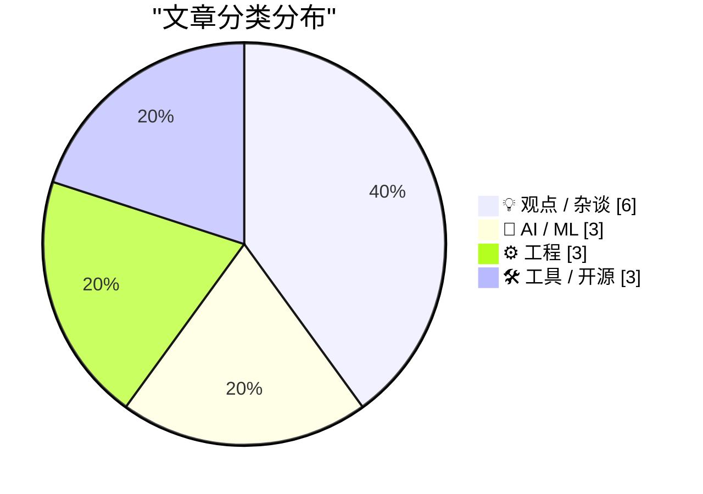
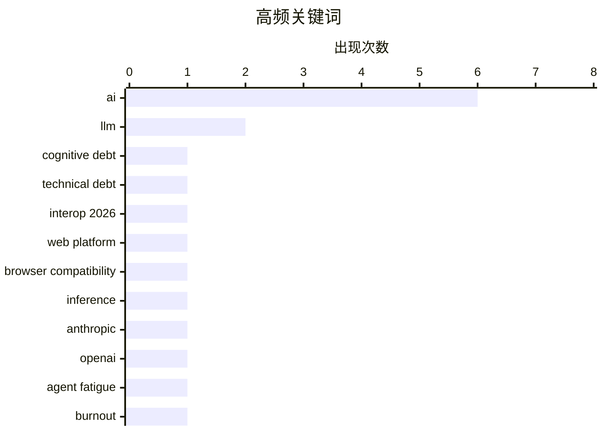

# 📰 AI 博客每日精选 — 2026-02-16

> 来自 Karpathy 推荐的 92 个顶级技术博客，AI 精选 Top 15

## 📝 今日看点

今日看点：AI发展引发多重讨论，从认知债务到伦理问题，再到对开发者角色的影响，AI的快速渗透正重塑技术生态。同时，提升Web平台一致性和优化Docker构建效率等工程实践也在不断进步，开发者工具也在简化第三方API连接。技术社区对AI的未来发展保持关注与反思。

---

## 🏆 今日必读

🥇 **生成式和代理式AI将关注点从技术债务转移到认知债务**

[How Generative and Agentic AI Shift Concern from Technical Debt to Cognitive Debt](https://simonwillison.net/2026/Feb/15/cognitive-debt/#atom-everything) — simonwillison.net · 19 小时前 · 🤖 AI / ML

> Margaret-Anne Storey的文章阐述了“认知债务”的概念，即使用生成式AI工具可能导致理解和维护系统所需的认知负担增加。认知债务指的是为了快速交付成果而牺牲了对系统工作原理的清晰理解，类似于技术债务。如果团队不投入精力去理解和管理AI生成的代码和系统，认知债务会迅速累积，导致长期维护困难和潜在的错误。因此，理解和管理认知债务对于有效利用生成式AI至关重要。

💡 **为什么值得读**: 了解认知债务的概念有助于更好地管理和利用生成式AI，避免长期维护问题。

🏷️ AI, cognitive debt, technical debt

🥈 **启动 Interop 2026**

[Launching Interop 2026](https://simonwillison.net/2026/Feb/15/interop-2026/#atom-everything) — simonwillison.net · 20 小时前 · ⚙️ 工程

> Interop 2026是由Apple、Google、Igalia、Microsoft和Mozilla共同发起的一项倡议，旨在确保一系列特定的Web平台特性在今年内实现跨浏览器的一致性。Interop系列自2021年启动以来，在提高Web平台的互操作性方面取得了显著成功。该计划通过合作解决浏览器兼容性问题，为开发者提供更可靠的开发体验，并促进Web标准的统一。

💡 **为什么值得读**: 关注Interop 2026可以了解Web平台互操作性的最新进展，以及各大浏览器厂商的合作方向。

🏷️ Interop 2026, web platform, browser compatibility

🥉 **快速LLM推理的两种不同技巧**

[Two different tricks for fast LLM inference](https://seangoedecke.com/fast-llm-inference/) — seangoedecke.com · 1 天前 · 🤖 AI / ML

> Anthropic和OpenAI最近都推出了“快速模式”，旨在以更高的速度与他们的最佳编码模型进行交互。Anthropic的Claude提供了高达2.5倍的tokens/秒的速度提升，而OpenAI的GPT-5-3 Codex-Spark则侧重于优化特定任务的性能。这两种快速模式的实现方式截然不同，Anthropic侧重于整体速度提升，而OpenAI则针对特定场景进行优化。选择哪种快速模式取决于具体的应用场景和性能需求。

💡 **为什么值得读**: 了解Anthropic和OpenAI的快速模式，可以根据需求选择合适的LLM推理加速方案。

🏷️ LLM, inference, Anthropic, OpenAI

---

## 📊 数据概览

| 扫描源 | 抓取文章 | 时间范围 | 精选 |
|:---:|:---:|:---:|:---:|
| 84/92 | 2407 篇 → 32 篇 | 48h | **15 篇** |

### 分类分布



### 高频关键词



<details>
<summary>📈 纯文本关键词图（终端友好）</summary>

```
ai                    │ ████████████████████ 6
llm                   │ ███████░░░░░░░░░░░░░ 2
cognitive debt        │ ███░░░░░░░░░░░░░░░░░ 1
technical debt        │ ███░░░░░░░░░░░░░░░░░ 1
interop 2026          │ ███░░░░░░░░░░░░░░░░░ 1
web platform          │ ███░░░░░░░░░░░░░░░░░ 1
browser compatibility │ ███░░░░░░░░░░░░░░░░░ 1
inference             │ ███░░░░░░░░░░░░░░░░░ 1
anthropic             │ ███░░░░░░░░░░░░░░░░░ 1
openai                │ ███░░░░░░░░░░░░░░░░░ 1
```

</details>

### 🏷️ 话题标签

**ai**(6) · **llm**(2) · **cognitive debt**(1) · technical debt(1) · interop 2026(1) · web platform(1) · browser compatibility(1) · inference(1) · anthropic(1) · openai(1) · agent fatigue(1) · burnout(1) · ai agents(1) · crawler(1) · user-agent(1) · feed fetcher(1) · gwtar(1) · html(1) · archiving(1) · docker(1)

---

## 💡 观点 / 杂谈

### 1. AI吸血鬼

[The AI Vampire](https://simonwillison.net/2026/Feb/15/the-ai-vampire/#atom-everything) — **simonwillison.net** · 1 小时前 · ⭐ 22/30

> Steve Yegge提出了“AI吸血鬼”的概念，探讨了过度使用AI工具可能导致的代理疲劳以及与倦怠的关系。文章描述了一种情景，即个人过度依赖AI提高工作效率，导致其他人相形见绌，最终可能导致团队内部的压力和不平衡。这种过度依赖AI的行为，就像吸血鬼一样，会逐渐消耗个人的精力和创造力，最终导致倦怠。

🏷️ AI, agent fatigue, burnout

---

### 2. 深蓝

[Deep Blue](https://simonwillison.net/2026/Feb/15/deep-blue/#atom-everything) — **simonwillison.net** · 4 小时前 · ⭐ 20/30

> 在Oxide and Friends podcast节目中，Adam Leventhal提出了一个新术语“深蓝”（Deep Blue），用来描述由于生成式AI侵入软件开发领域，许多软件开发人员感受到的心理倦怠，并最终导致对存在意义的恐惧。这个术语反映了开发者对AI可能取代其工作的焦虑和不安。

🏷️ AI, software developers, ennui

---

### 3. AI Twitter最喜欢的谎言：每个人都想成为一名开发者

[AI twitter's favourite lie: everyone wants to be a developer](https://www.joanwestenberg.com/ai-twitters-favourite-lie-everyone-wants-to-be-a-developer/) — **joanwestenberg.com** · 1 天前 · ⭐ 20/30

> 文章批判了Twitter上的一种观点，即大型语言模型可以编写代码后，每个人都会成为软件开发者。文章认为，虽然AI可以降低开发门槛，但并非所有人都有成为开发者的意愿或能力。解决问题的方式有很多种，并非只有软件开发一条路。

🏷️ AI, developers, LLM

---

### 4. 引用 Boris Cherny

[Quoting Boris Cherny](https://simonwillison.net/2026/Feb/14/boris/#atom-everything) — **simonwillison.net** · 1 天前 · ⭐ 18/30

> Anthropic 的 Claude Code 创建者 Boris Cherny 指出，即使在 AI 时代，工程师的角色仍然至关重要。工程师需要负责提示 Claude 模型、与客户沟通、协调团队以及决定下一步的开发方向。工程领域正在发生变化，但优秀的工程师比以往任何时候都更加重要。Anthropic 仍在招聘开发人员的事实进一步印证了这一点。

🏷️ AI, engineering, prompt engineering

---

### 5. 引用 Thoughtworks

[Quoting Thoughtworks](https://simonwillison.net/2026/Feb/14/thoughtworks/#atom-everything) — **simonwillison.net** · 1 天前 · ⭐ 18/30

> Thoughtworks 的一份报告指出，AI 工具并没有消除对初级开发人员的需求，反而使他们比以往任何时候都更有价值。AI 工具可以帮助初级开发人员更快地度过最初的负收益阶段，并为未来的生产力提供保障。此外，初级开发人员比高级工程师更擅长使用 AI 工具，因为他们没有形成固有的思维模式。因此，初级开发人员在 AI 时代扮演着重要的角色。

🏷️ AI, junior developers, software development

---

### 6. 社交媒体支付与扭曲的激励

[Social Media Payments and Perverse Incentives](https://shkspr.mobi/blog/2026/02/social-media-payments-and-perverse-incentives/) — **shkspr.mobi** · 12 小时前 · ⭐ 18/30

> 文章探讨了在社交媒体上直接向记者或创作者打赏的可能性，例如购买一杯啤酒表示感谢。作者提出了一个简单的原型，设想用户可以在社交媒体平台上直接进行小额支付，以支持他们喜欢的内容创作者。这种机制旨在解决新闻付费墙、社交媒体推广以及创作者难以直接请求资金支持的问题。然而，文章也暗示了这种支付方式可能带来的潜在问题，例如扭曲的激励机制。

🏷️ social media, payments, journalism, incentives

---

## 🤖 AI / ML

### 7. 生成式和代理式AI将关注点从技术债务转移到认知债务

[How Generative and Agentic AI Shift Concern from Technical Debt to Cognitive Debt](https://simonwillison.net/2026/Feb/15/cognitive-debt/#atom-everything) — **simonwillison.net** · 19 小时前 · ⭐ 24/30

> Margaret-Anne Storey的文章阐述了“认知债务”的概念，即使用生成式AI工具可能导致理解和维护系统所需的认知负担增加。认知债务指的是为了快速交付成果而牺牲了对系统工作原理的清晰理解，类似于技术债务。如果团队不投入精力去理解和管理AI生成的代码和系统，认知债务会迅速累积，导致长期维护困难和潜在的错误。因此，理解和管理认知债务对于有效利用生成式AI至关重要。

🏷️ AI, cognitive debt, technical debt

---

### 8. 快速LLM推理的两种不同技巧

[Two different tricks for fast LLM inference](https://seangoedecke.com/fast-llm-inference/) — **seangoedecke.com** · 1 天前 · ⭐ 23/30

> Anthropic和OpenAI最近都推出了“快速模式”，旨在以更高的速度与他们的最佳编码模型进行交互。Anthropic的Claude提供了高达2.5倍的tokens/秒的速度提升，而OpenAI的GPT-5-3 Codex-Spark则侧重于优化特定任务的性能。这两种快速模式的实现方式截然不同，Anthropic侧重于整体速度提升，而OpenAI则针对特定场景进行优化。选择哪种快速模式取决于具体的应用场景和性能需求。

🏷️ LLM, inference, Anthropic, OpenAI

---

### 9. 你的feed抓取器看起来像一个AI代理或爬虫

[Your feed fetcher appears to be an AI agent or crawler](https://utcc.utoronto.ca/~cks/cspace-no-ai-agents.html) — **utcc.utoronto.ca/~cks** · 21 小时前 · ⭐ 22/30

> 该作者屏蔽了所有使用看起来像AI代理或爬虫的User-Agent header的软件来抓取其聚合feeds。原因是作者认为AI代理的产生过程存在伦理问题，并且不希望帮助那些不关心工具伦理的人。作者明确表示不接受任何形式的AI代理访问，无论背后是否有真人操作。

🏷️ AI agents, crawler, User-Agent, feed fetcher

---

## ⚙️ 工程

### 10. 启动 Interop 2026

[Launching Interop 2026](https://simonwillison.net/2026/Feb/15/interop-2026/#atom-everything) — **simonwillison.net** · 20 小时前 · ⭐ 24/30

> Interop 2026是由Apple、Google、Igalia、Microsoft和Mozilla共同发起的一项倡议，旨在确保一系列特定的Web平台特性在今年内实现跨浏览器的一致性。Interop系列自2021年启动以来，在提高Web平台的互操作性方面取得了显著成功。该计划通过合作解决浏览器兼容性问题，为开发者提供更可靠的开发体验，并促进Web标准的统一。

🏷️ Interop 2026, web platform, browser compatibility

---

### 11. 在Docker构建中分离下载和安装

[Separating Download from Install in Docker Builds](https://nesbitt.io/2026/02/15/separating-download-from-install-in-docker-builds.html) — **nesbitt.io** · 1 天前 · ⭐ 21/30

> 大多数包管理器可以分离下载和安装步骤，以实现更好的Docker层缓存。通过将下载步骤与安装步骤分离，可以避免在安装包发生变化时重新下载所有依赖，从而提高Docker构建效率。

🏷️ Docker, caching, package manager

---

### 12. WorkOS Pipes

[WorkOS Pipes](https://workos.com/docs/pipes?utm_source=daringfireball&amp;utm_medium=newsletter&amp;utm_campaign=q12026&amp;utm_content=no_rebuild) — **daringfireball.net** · 1 小时前 · ⭐ 20/30

> WorkOS Pipes 简化了用户账户与第三方API的连接过程，消除了OAuth流程、token存储、刷新逻辑以及特定provider的复杂性。用户可以通过一个嵌入式widget连接GitHub、Slack、Google、Salesforce等服务。后端可以通过Pipes API请求有效的访问令牌，而Pipes负责处理凭证存储和token刷新。

🏷️ WorkOS, API, OAuth, integration

---

## 🛠 工具 / 开源

### 13. Gwtar：一种静态高效的单文件HTML格式

[Gwtar: a static efficient single-file HTML format](https://simonwillison.net/2026/Feb/15/gwtar/#atom-everything) — **simonwillison.net** · 6 小时前 · ⭐ 21/30

> Gwtar是由Gwern Branwen和Said Achmiz开发的一个新项目，旨在解决将大量资源合并到单个HTML存档文件中，同时保证该文件在浏览器中易于查看的问题。其关键技巧是在页面加载初期调用`window.stop()`，以阻止浏览器尝试加载所有嵌入的资源，从而避免浏览器崩溃。Gwtar格式适用于需要将大量静态资源打包成单个文件的场景。

🏷️ Gwtar, HTML, archiving

---

### 14. 在 Godot 4.1 中重现 Windows 2000 扫雷

[Windows 2000 Minesweeper recreated in Godot 4.1](https://jayd.ml/2026/02/14/godot-minesweeper.html) — **jayd.ml** · 1 天前 · ⭐ 20/30

> 本文介绍了作者使用 Godot 4.1 引擎精确重现 Windows 2000 扫雷游戏的过程。该项目旨在熟悉 Godot 引擎，并提供一个无需过多考虑“做什么”，只需关注“如何做”的实践机会。虽然最终游戏本身只占用了作者 30% 的时间，剩余 70% 用于菜单、对话框等琐碎功能的开发，但作者乐在其中。读者可以在 minesweeper.jayd.ml 体验游戏，并在 GitHub 上查看 AGPL 许可的源代码。这个项目展示了使用游戏引擎复刻经典应用的可能性，并强调了在项目开发中，周边功能往往比核心功能更耗时。

🏷️ Godot, game development, minesweeper

---

### 15. OpenClaw 三个月回顾

[Three months of OpenClaw](https://simonwillison.net/2026/Feb/15/openclaw/#atom-everything) — **simonwillison.net** · 7 小时前 · ⭐ 19/30

> OpenClaw 项目在短短三个月内取得了惊人的进展。该项目于 2025 年 11 月 25 日首次提交，至今已吸引了 600 位贡献者，提交了 10,000 次代码，并在 GitHub 上获得了 196,000 个 star。甚至还在 AI.com 的超级碗商业广告中以模糊的方式亮相。OpenClaw 的快速发展表明了开源社区的强大力量和 AI 相关项目的巨大潜力。

🏷️ OpenClaw, GitHub, open source

---

*生成于 2026-02-16 01:11 | 扫描 84 源 → 获取 2407 篇 → 精选 15 篇*
*基于 [Hacker News Popularity Contest 2025](https://refactoringenglish.com/tools/hn-popularity/) RSS 源列表，由 [Andrej Karpathy](https://x.com/karpathy) 推荐*
*由「懂点儿AI」制作，欢迎关注同名微信公众号获取更多 AI 实用技巧 💡*
