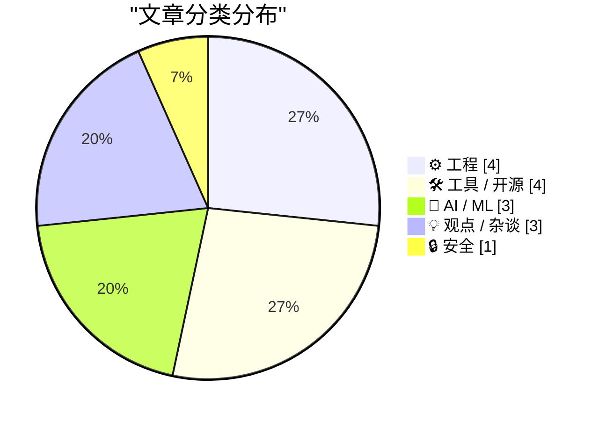
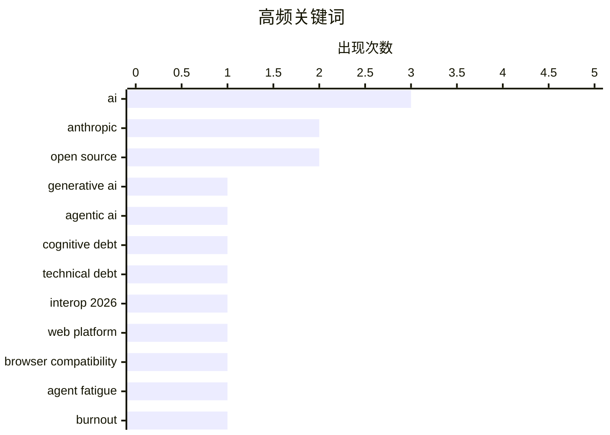

# 📰 AI 博客每日精选 — 2026-02-17

> 来自 Karpathy 推荐的 92 个顶级技术博客，AI 精选 Top 15

## 📝 今日看点

今日看点：AI应用持续深化，但其带来的“认知债务”、滥用风险和安全漏洞日益凸显，引发开发者关注。同时，跨浏览器兼容性成为焦点，Interop 2026 旨在提升Web平台一致性。此外，开源项目蓬勃发展，吸引大量贡献者，展现社区力量。

---

## 🏆 今日必读

🥇 **生成式和代理式AI将关注点从技术债务转移到认知债务**

[How Generative and Agentic AI Shift Concern from Technical Debt to Cognitive Debt](https://simonwillison.net/2026/Feb/15/cognitive-debt/#atom-everything) — simonwillison.net · 1 天前 · 🤖 AI / ML

> 文章探讨了随着生成式和代理式AI的兴起，软件开发中的关注点从传统的技术债务转向了“认知债务”。认知债务指的是理解、维护和演进AI系统所需的努力，它源于AI系统的复杂性、不透明性和难以预测的行为。作者认为，与可以通过重构和测试来解决的技术债务不同，认知债务更难量化和管理，需要新的工具和方法来应对。认知债务的累积可能会阻碍AI系统的长期成功，因此需要开发者和组织认真对待。因此，理解和管理认知债务对于构建可靠和可持续的AI系统至关重要。

💡 **为什么值得读**: 了解认知债务的概念有助于开发者更好地应对AI时代带来的新挑战，构建更易于理解和维护的AI系统。

🏷️ Generative AI, Agentic AI, Cognitive Debt, Technical Debt

🥈 **启动 Interop 2026**

[Launching Interop 2026](https://simonwillison.net/2026/Feb/15/interop-2026/#atom-everything) — simonwillison.net · 1 天前 · ⚙️ 工程

> Interop 2026 是由 Apple、Google、Igalia、Microsoft 和 Mozilla 共同发起的一项倡议，旨在确保一组特定的 Web 平台特性在今年内实现跨浏览器的一致性。该系列活动始于 2021 年的 Compat2021，并取得了显著成功。Interop 2026 将专注于解决浏览器兼容性问题，提升 Web 开发者的开发体验。通过合作和标准化，Interop 2026 致力于构建更加统一和可靠的 Web 平台。

💡 **为什么值得读**: Interop 2026 的启动预示着 Web 开发将迎来更好的跨浏览器兼容性，开发者可以从中受益。

🏷️ Interop 2026, web platform, browser compatibility

🥉 **AI吸血鬼**

[The AI Vampire](https://simonwillison.net/2026/Feb/15/the-ai-vampire/#atom-everything) — simonwillison.net · 1 天前 · 💡 观点 / 杂谈

> 文章探讨了过度使用AI可能导致的“代理疲劳”以及它与职业倦怠之间的关系。作者通过一个假设场景，描述了当一个人过度依赖AI来提高工作效率时，可能导致其他同事相形见绌，从而引发团队内部的紧张关系。这种过度依赖AI的行为就像“吸血鬼”一样，会逐渐消耗团队的活力和创造力。因此，合理使用AI，避免过度依赖，对于维护团队的健康和创新能力至关重要。

💡 **为什么值得读**: 这篇文章提醒我们警惕过度使用AI可能带来的负面影响，并思考如何更健康地利用AI提升工作效率。

🏷️ AI, agent fatigue, burnout, cognitive load

---

## 📊 数据概览

| 扫描源 | 抓取文章 | 时间范围 | 精选 |
|:---:|:---:|:---:|:---:|
| 81/92 | 2347 篇 → 35 篇 | 48h | **15 篇** |

### 分类分布



### 高频关键词



<details>
<summary>📈 纯文本关键词图（终端友好）</summary>

```
ai                    │ ████████████████████ 3
anthropic             │ █████████████░░░░░░░ 2
open source           │ █████████████░░░░░░░ 2
generative ai         │ ███████░░░░░░░░░░░░░ 1
agentic ai            │ ███████░░░░░░░░░░░░░ 1
cognitive debt        │ ███████░░░░░░░░░░░░░ 1
technical debt        │ ███████░░░░░░░░░░░░░ 1
interop 2026          │ ███████░░░░░░░░░░░░░ 1
web platform          │ ███████░░░░░░░░░░░░░ 1
browser compatibility │ ███████░░░░░░░░░░░░░ 1
```

</details>

### 🏷️ 话题标签

**ai**(3) · **anthropic**(2) · **open source**(2) · generative ai(1) · agentic ai(1) · cognitive debt(1) · technical debt(1) · interop 2026(1) · web platform(1) · browser compatibility(1) · agent fatigue(1) · burnout(1) · cognitive load(1) · llm(1) · terraform(1) · automation(1) · infrastructure(1) · claude(1) · vulnerabilities(1) · ai security(1)

---

## ⚙️ 工程

### 1. 启动 Interop 2026

[Launching Interop 2026](https://simonwillison.net/2026/Feb/15/interop-2026/#atom-everything) — **simonwillison.net** · 1 天前 · ⭐ 24/30

> Interop 2026 是由 Apple、Google、Igalia、Microsoft 和 Mozilla 共同发起的一项倡议，旨在确保一组特定的 Web 平台特性在今年内实现跨浏览器的一致性。该系列活动始于 2021 年的 Compat2021，并取得了显著成功。Interop 2026 将专注于解决浏览器兼容性问题，提升 Web 开发者的开发体验。通过合作和标准化，Interop 2026 致力于构建更加统一和可靠的 Web 平台。

🏷️ Interop 2026, web platform, browser compatibility

---

### 2. OpenClaw 的三个月

[Three months of OpenClaw](https://simonwillison.net/2026/Feb/15/openclaw/#atom-everything) — **simonwillison.net** · 1 天前 · ⭐ 22/30

> OpenClaw 项目在不到三个月的时间内取得了惊人的进展，从 2025 年 11 月 25 日的第一次提交开始，已经积累了 10,000 次提交，600 名贡献者，196,000 个 GitHub 星星，甚至在 AI.com 的超级碗广告中有所提及。OpenClaw 的快速发展表明了开源社区的强大活力和 AI 领域的巨大潜力。

🏷️ OpenClaw, GitHub, open source

---

### 3. 诊断工厂

[Diagnostics Factory](https://matklad.github.io/2026/02/16/diagnostics-factory.html) — **matklad.github.io** · 1 天前 · ⭐ 22/30

> 文章介绍了作者在 Zig 语言中处理错误报告的个人方法。Zig 的强类型错误代码解决了错误管理的处理部分，但报告问题仍然需要解决。作者提出了一种默认方法，旨在向用户显示有用的错误消息，从而提高开发效率。

🏷️ Zig, error handling, diagnostics, compiler

---

### 4. Gwtar：一种静态高效的单文件HTML格式

[Gwtar: a static efficient single-file HTML format](https://simonwillison.net/2026/Feb/15/gwtar/#atom-everything) — **simonwillison.net** · 1 天前 · ⭐ 20/30

> Gwtar 是 Gwern Branwen 和 Said Achmiz 提出的一个新项目，旨在解决将大量资源合并到单个 HTML 存档文件中的问题，同时保证该文件在浏览器中易于查看。其关键技巧是在页面加载早期调用 `window.stop()`，阻止浏览器加载不必要的内容，从而提高加载速度和效率。

🏷️ Gwtar, HTML, single-file format, archiving

---

## 🛠 工具 / 开源

### 5. 两个新的 Showboat 工具：Chartroom 和 datasette-showboat

[Two new Showboat tools: Chartroom and datasette-showboat](https://simonwillison.net/2026/Feb/17/chartroom-and-datasette-showboat/#atom-everything) — **simonwillison.net** · 27 分钟前 · ⭐ 22/30

> 文章介绍了 Showboat，一个 CLI 工具，可以帮助编码代理创建 Markdown 文档来展示它们生成的代码。作者发布了两个新的工具来增强 Showboat 的功能：Chartroom 是一个与 Showboat 配合良好的 CLI 图表工具，而 datasette-showboat 则允许将 Showboat 文档集成到 Datasette 中。这些工具旨在简化编码代理的输出展示，并提高其可用性。

🏷️ Showboat, CLI, Markdown, coding agents

---

### 6. Rodney 和 Claude Code for Desktop

[Rodney and Claude Code for Desktop](https://simonwillison.net/2026/Feb/16/rodney-claude-code/#atom-everything) — **simonwillison.net** · 8 小时前 · ⭐ 22/30

> 作者是 Anthropic 的 Claude Code 的重度用户，特别是其云版本，该版本在 Anthropic 管理的容器环境中运行，从而大大降低了对计算机造成损害的风险。作者不使用网页界面，而是通过 iPhone 和 Mac 桌面应用程序访问 Claude Code。这种方式可以提供更好的用户体验和更高的安全性。

🏷️ Claude Code, Anthropic, container environment

---

### 7. Sentry实战工作坊：更快修复iOS应用问题 - 崩溃报告、追踪和日志

[[Sponsor] Hands-On Workshop: Fix It Faster — Crash Reporting, Tracing, and Logs for iOS in Sentry](https://sentry.io/resources/ios-workshop-jan-2026/?utm_source=daringfireball&amp;utm_medium=paid-display&amp;utm_campaign=general-fy27q1-evergreen&amp;utm_content=static-ad-mobilerss-trysentry) — **daringfireball.net** · 1 小时前 · ⭐ 21/30

> 本次Sentry提供的在线工作坊旨在帮助开发者连接iOS应用中的性能瓶颈、崩溃和用户体验问题。通过Sentry，开发者可以设置高优先级问题提醒，避免信息过载；利用日志和面包屑重现崩溃场景；使用追踪功能定位性能瓶颈；以及使用Size Analysis监控并减少iOS应用体积。该工作坊提供了一套完整的解决方案，帮助开发者更高效地诊断和解决iOS应用问题。

🏷️ Sentry, iOS, crash reporting, debugging

---

### 8. WorkOS Pipes

[WorkOS Pipes](https://workos.com/docs/pipes?utm_source=daringfireball&amp;utm_medium=newsletter&amp;utm_campaign=q12026&amp;utm_content=no_rebuild) — **daringfireball.net** · 1 天前 · ⭐ 20/30

> WorkOS Pipes 旨在简化用户账户与第三方 API 的连接过程，省去 OAuth 流程、token 存储、刷新逻辑以及特定服务提供商的适配工作。用户可以通过一个嵌入式组件连接 GitHub、Slack、Google、Salesforce 等服务。后端可以通过 Pipes API 请求有效的访问 token，Pipes 负责处理凭据存储和 token 刷新。

🏷️ WorkOS, API, OAuth, integration

---

## 🤖 AI / ML

### 9. 生成式和代理式AI将关注点从技术债务转移到认知债务

[How Generative and Agentic AI Shift Concern from Technical Debt to Cognitive Debt](https://simonwillison.net/2026/Feb/15/cognitive-debt/#atom-everything) — **simonwillison.net** · 1 天前 · ⭐ 24/30

> 文章探讨了随着生成式和代理式AI的兴起，软件开发中的关注点从传统的技术债务转向了“认知债务”。认知债务指的是理解、维护和演进AI系统所需的努力，它源于AI系统的复杂性、不透明性和难以预测的行为。作者认为，与可以通过重构和测试来解决的技术债务不同，认知债务更难量化和管理，需要新的工具和方法来应对。认知债务的累积可能会阻碍AI系统的长期成功，因此需要开发者和组织认真对待。因此，理解和管理认知债务对于构建可靠和可持续的AI系统至关重要。

🏷️ Generative AI, Agentic AI, Cognitive Debt, Technical Debt

---

### 10. 我每月花 20 美元购买了完美生成的 Terraform

[I Sold Out for $20 a Month and All I Got Was This Perfectly Generated Terraform](https://matduggan.com/i-sold-out-for-200-a-month-and-all-i-got-was-this-perfectly-generated-terraform/) — **matduggan.com** · 13 小时前 · ⭐ 23/30

> 作者分享了使用 LLM 工具生成 Terraform 代码的体验。作者之前尝试过的 LLM 工具效果不佳，例如 Copilot 擅长编写冗长的注释，而 Gemini 会将 200 行脚本扩展到 700 行的无意义代码。但最近，LLM 在生成 Terraform 代码方面表现出色，每月花费 20 美元即可获得完美生成的 Terraform 代码。这表明 LLM 在特定领域的代码生成方面取得了显著进展。

🏷️ LLM, Terraform, automation, infrastructure

---

### 11. 你的 feed 抓取器似乎是一个 AI 代理或爬虫

[Your feed fetcher appears to be an AI agent or crawler](https://utcc.utoronto.ca/~cks/cspace-no-ai-agents.html) — **utcc.utoronto.ca/~cks** · 1 天前 · ⭐ 22/30

> 作者阻止了使用 AI 代理或爬虫 User-Agent 标头的软件抓取其联合提要。作者认为 AI 代理是滥用过程的产物，并且不希望帮助那些不关心工具伦理的人。因此，作者采取了强硬措施，禁止所有 AI 代理访问其内容。

🏷️ AI, crawler, User-Agent, web scraping

---

## 💡 观点 / 杂谈

### 12. AI吸血鬼

[The AI Vampire](https://simonwillison.net/2026/Feb/15/the-ai-vampire/#atom-everything) — **simonwillison.net** · 1 天前 · ⭐ 23/30

> 文章探讨了过度使用AI可能导致的“代理疲劳”以及它与职业倦怠之间的关系。作者通过一个假设场景，描述了当一个人过度依赖AI来提高工作效率时，可能导致其他同事相形见绌，从而引发团队内部的紧张关系。这种过度依赖AI的行为就像“吸血鬼”一样，会逐渐消耗团队的活力和创造力。因此，合理使用AI，避免过度依赖，对于维护团队的健康和创新能力至关重要。

🏷️ AI, agent fatigue, burnout, cognitive load

---

### 13. 深蓝

[Deep Blue](https://simonwillison.net/2026/Feb/15/deep-blue/#atom-everything) — **simonwillison.net** · 1 天前 · ⭐ 20/30

> 文章介绍了一个新词“深蓝 (Deep Blue)”，由 Oxide and Friends 播客创造，用来描述由于生成式AI的入侵，许多软件开发者感受到的心理上的倦怠，并最终导致对自身价值的存在的恐惧。

🏷️ Deep Blue, psychological ennui, software developers

---

### 14. AI正在摧毁开源，而且它还不够好

[AI is destroying Open Source, and it's not even good yet](https://www.jeffgeerling.com/blog/2026/ai-is-destroying-open-source/) — **jeffgeerling.com** · 3 小时前 · ⭐ 20/30

> Ars Technica 撤回了一篇由 AI 撰写的文章，原因是 AI 捏造了开源库维护者 Scott Shambaugh 的引言。文章指出，AI 的不准确性和错误信息正在对开源社区造成损害，即使 AI 技术尚未成熟。

🏷️ AI, Open Source, ethics, hallucination

---

## 🔒 安全

### 15. Anthropic 发现的 500 个漏洞只是冰山一角

[Anthropic's 500 vulns are the tip of the iceberg](https://martinalderson.com/posts/anthropic-found-500-zero-days/?utm_source=rss) — **martinalderson.com** · 1 小时前 · ⭐ 23/30

> Anthropic 的红队在 Claude 中发现了 500 多个关键漏洞，但他们主要关注的是维护良好的软件。文章指出，更可怕的问题是那些无人维护的长尾漏洞，这些漏洞永远不会被修复。这意味着即使大型公司能够发现并修复大量漏洞，仍然存在大量未知的安全风险。因此，关注软件供应链的安全，并采取措施应对长尾漏洞至关重要。

🏷️ Anthropic, Claude, vulnerabilities, AI security

---

*生成于 2026-02-17 01:11 | 扫描 81 源 → 获取 2347 篇 → 精选 15 篇*
*基于 [Hacker News Popularity Contest 2025](https://refactoringenglish.com/tools/hn-popularity/) RSS 源列表，由 [Andrej Karpathy](https://x.com/karpathy) 推荐*
*由「懂点儿AI」制作，欢迎关注同名微信公众号获取更多 AI 实用技巧 💡*
