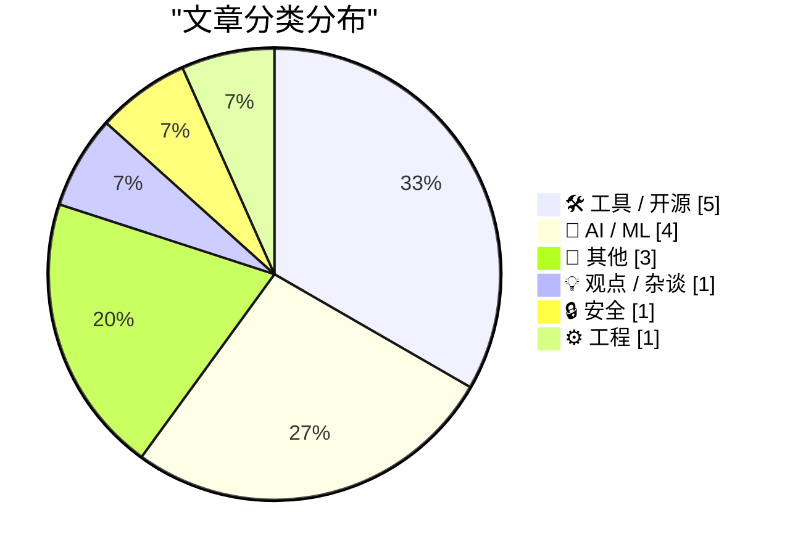
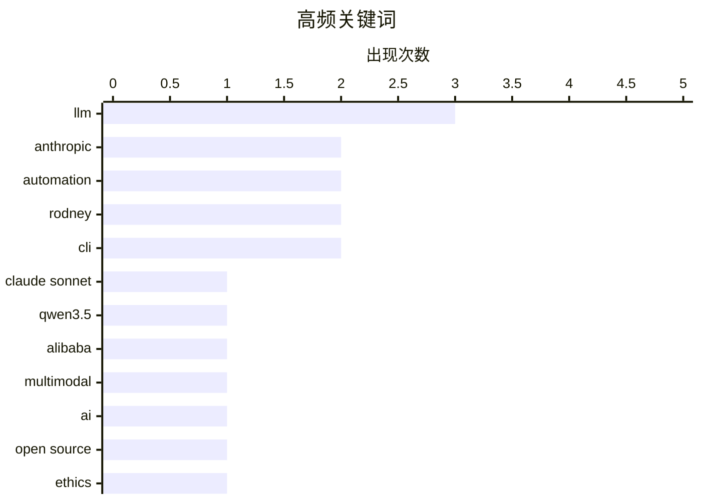

# 📰 AI 博客每日精选 — 2026-02-18

> 来自 Karpathy 推荐的 92 个顶级技术博客，AI 精选 Top 15

## 📝 今日看点

今日看点：AI 模型能力持续进化，多模态应用涌现，但同时也暴露出安全漏洞和开源生态挑战。LLM 在特定任务如代码生成方面展现潜力，但其生成内容的可靠性仍需关注。同时，开发者工具不断涌现，旨在提升效率和问题修复能力。

---

## 🏆 今日必读

🥇 **Claude Sonnet 4.6 发布**

[Introducing Claude Sonnet 4.6](https://simonwillison.net/2026/Feb/17/claude-sonnet-46/#atom-everything) — simonwillison.net · 1 小时前 · 🤖 AI / ML

> Anthropic 发布了 Claude Sonnet 4.6，声称其性能与去年 11 月的 Opus 4.5 相似，但保持了 Sonnet 的定价：输入 3 美元/百万 tokens，输出 15 美元/百万 tokens。这意味着用户可以以更低的成本获得接近 Opus 4.5 的性能。该模型在性能和成本之间取得了平衡。因此，对于追求性价比的用户来说，是一个不错的选择。

💡 **为什么值得读**: 如果你需要强大的语言模型能力，但又不想支付 Opus 系列的高昂价格，Claude Sonnet 4.6 值得关注。

🏷️ Claude Sonnet, Anthropic, LLM

🥈 **Qwen3.5：迈向原生多模态智能体**

[Qwen3.5: Towards Native Multimodal Agents](https://simonwillison.net/2026/Feb/17/qwen35/#atom-everything) — simonwillison.net · 20 小时前 · 🤖 AI / ML

> 阿里巴巴的 Qwen 发布了 Qwen 3.5 系列的首批两个模型，一个开源权重模型，一个专有模型。这两个模型都支持视觉输入，具备多模态能力。开源模型 Qwen3.5-397B-A17B 是一个混合专家模型，其架构的优势在于服务效率。Qwen3.5 的发布标志着多模态大模型在开源领域的进一步发展。

💡 **为什么值得读**: 如果你对开源多模态大模型感兴趣，或者需要高效的模型服务能力，Qwen3.5 是一个值得研究的对象。

🏷️ Qwen3.5, Alibaba, multimodal

🥉 **AI 正在摧毁开源，而且它还不够好**

[AI is destroying Open Source, and it's not even good yet](https://www.jeffgeerling.com/blog/2026/ai-is-destroying-open-source/) — jeffgeerling.com · 1 天前 · 💡 观点 / 杂谈

> AI 工具正在对开源社区产生负面影响。Ars Technica 因为其作者使用 AI 产生的幻觉引用而撤回了一篇文章，该文章错误地引用了一位开源库维护者。这突显了 AI 在生成内容时的可靠性问题，以及对开源社区声誉的潜在损害。文章指出，AI 并非总是可靠的，需要谨慎使用，尤其是在涉及开源项目时。

💡 **为什么值得读**: 这篇文章揭示了 AI 在新闻报道和内容创作中可能存在的风险，提醒我们对 AI 生成的内容保持警惕。

🏷️ AI, open source, ethics

---

## 📊 数据概览

| 扫描源 | 抓取文章 | 时间范围 | 精选 |
|:---:|:---:|:---:|:---:|
| 85/92 | 2412 篇 → 36 篇 | 48h | **15 篇** |

### 分类分布



### 高频关键词



<details>
<summary>📈 纯文本关键词图（终端友好）</summary>

```
llm           │ ████████████████████ 3
anthropic     │ █████████████░░░░░░░ 2
automation    │ █████████████░░░░░░░ 2
rodney        │ █████████████░░░░░░░ 2
cli           │ █████████████░░░░░░░ 2
claude sonnet │ ███████░░░░░░░░░░░░░ 1
qwen3.5       │ ███████░░░░░░░░░░░░░ 1
alibaba       │ ███████░░░░░░░░░░░░░ 1
multimodal    │ ███████░░░░░░░░░░░░░ 1
ai            │ ███████░░░░░░░░░░░░░ 1
```

</details>

### 🏷️ 话题标签

**llm**(3) · **anthropic**(2) · **automation**(2) · rodney(2) · cli(2) · claude sonnet(1) · qwen3.5(1) · alibaba(1) · multimodal(1) · ai(1) · open source(1) · ethics(1) · claude(1) · vulnerabilities(1) · ai security(1) · terraform(1) · iac(1) · browser automation(1) · showboat(1) · markdown(1)

---

## 🛠 工具 / 开源

### 1. Rodney v0.4.0

[Rodney v0.4.0](https://simonwillison.net/2026/Feb/17/rodney/#atom-everything) — **simonwillison.net** · 2 小时前 · ⭐ 22/30

> Rodney v0.4.0 发布，这是一个用于浏览器自动化的 CLI 工具。自上周发布以来，该项目吸引了大量的 PR。新版本改进了错误处理，现在使用退出代码来指示错误。Rodney 的快速迭代和社区贡献表明其在浏览器自动化领域具有潜力。

🏷️ Rodney, CLI, browser automation

---

### 2. 两个新的 Showboat 工具：Chartroom 和 datasette-showboat

[Two new Showboat tools: Chartroom and datasette-showboat](https://simonwillison.net/2026/Feb/17/chartroom-and-datasette-showboat/#atom-everything) — **simonwillison.net** · 1 天前 · ⭐ 22/30

> 作者发布了两个新的 Showboat 工具：Chartroom 和 datasette-showboat。Showboat 是一个 CLI 工具，可以帮助编码代理创建演示代码的 Markdown 文档。Chartroom 是一个与 Showboat 配合良好的 CLI 图表工具，datasette-showboat 则集成了 Showboat 和 Datasette。这些工具扩展了 Showboat 的功能，使其更易于创建和展示代码示例。

🏷️ Showboat, CLI, Markdown

---

### 3. Rodney 和 Claude Code for Desktop

[Rodney and Claude Code for Desktop](https://simonwillison.net/2026/Feb/16/rodney-claude-code/#atom-everything) — **simonwillison.net** · 1 天前 · ⭐ 22/30

> 作者是 Claude Code 的重度用户，Claude Code 是 Anthropic 提供的云端代码运行环境。作者主要通过 iPhone 和 Mac 桌面应用访问 Claude Code，而不是网页界面。这种方式可以降低在本地计算机上运行代码的风险。文章分享了作者使用 Claude Code 的个人偏好和工作流程。

🏷️ Claude Code, Rodney, automation

---

### 4. [赞助] 实践工作坊：更快地修复问题 - Sentry 中用于 iOS 的崩溃报告、追踪和日志

[[Sponsor] Hands-On Workshop: Fix It Faster — Crash Reporting, Tracing, and Logs for iOS in Sentry](https://sentry.io/resources/ios-workshop-jan-2026/?utm_source=daringfireball&amp;utm_medium=paid-display&amp;utm_campaign=general-fy27q1-evergreen&amp;utm_content=static-ad-mobilerss-trysentry) — **daringfireball.net** · 1 天前 · ⭐ 22/30

> Sentry 提供了一个在线工作坊，教你如何将 iOS 应用中的减速、崩溃和用户体验联系起来。工作坊内容包括：设置 Sentry 以发现高优先级移动问题；使用日志和面包屑重现崩溃场景；使用追踪查找性能瓶颈；使用大小分析监控和减少 iOS 应用的大小。通过 Sentry，开发者可以更有效地诊断和解决 iOS 应用中的问题。

🏷️ Sentry, iOS, crash reporting

---

### 5. 评测：Epomaker Split 70 分体式机械键盘 ★★★★⯪

[Gadget Review: Epomaker Split 70 Mechanical Keyboard ★★★★⯪](https://shkspr.mobi/blog/2026/02/gadget-review-epomaker-split-70-mechanical-keyboard/) — **shkspr.mobi** · 12 小时前 · ⭐ 19/30

> Epomaker Split 70 是一款分体式人体工学机械键盘，由通过 USB-C 连接的两部分组成，允许用户自由调整键盘的布局。这种设计旨在提供更舒适的打字体验，并减少手腕和手臂的压力。评测者对这款键盘的整体体验给予了四星半的评价。

🏷️ keyboard, mechanical, ergonomic

---

## 🤖 AI / ML

### 6. Claude Sonnet 4.6 发布

[Introducing Claude Sonnet 4.6](https://simonwillison.net/2026/Feb/17/claude-sonnet-46/#atom-everything) — **simonwillison.net** · 1 小时前 · ⭐ 26/30

> Anthropic 发布了 Claude Sonnet 4.6，声称其性能与去年 11 月的 Opus 4.5 相似，但保持了 Sonnet 的定价：输入 3 美元/百万 tokens，输出 15 美元/百万 tokens。这意味着用户可以以更低的成本获得接近 Opus 4.5 的性能。该模型在性能和成本之间取得了平衡。因此，对于追求性价比的用户来说，是一个不错的选择。

🏷️ Claude Sonnet, Anthropic, LLM

---

### 7. Qwen3.5：迈向原生多模态智能体

[Qwen3.5: Towards Native Multimodal Agents](https://simonwillison.net/2026/Feb/17/qwen35/#atom-everything) — **simonwillison.net** · 20 小时前 · ⭐ 25/30

> 阿里巴巴的 Qwen 发布了 Qwen 3.5 系列的首批两个模型，一个开源权重模型，一个专有模型。这两个模型都支持视觉输入，具备多模态能力。开源模型 Qwen3.5-397B-A17B 是一个混合专家模型，其架构的优势在于服务效率。Qwen3.5 的发布标志着多模态大模型在开源领域的进一步发展。

🏷️ Qwen3.5, Alibaba, multimodal

---

### 8. 我每月花 20 美元购买了完美生成的 Terraform

[I Sold Out for $20 a Month and All I Got Was This Perfectly Generated Terraform](https://matduggan.com/i-sold-out-for-200-a-month-and-all-i-got-was-this-perfectly-generated-terraform/) — **matduggan.com** · 1 天前 · ⭐ 23/30

> 作者分享了使用 LLM 工具生成 Terraform 代码的体验。之前尝试过的 LLM 工具效果不佳，但最近发现 LLM 在生成 Terraform 代码方面表现出色。这表明 LLM 在某些特定任务上已经可以提供有价值的帮助，并提高了工作效率。文章展示了 LLM 在基础设施即代码领域的应用潜力。

🏷️ LLM, Terraform, automation, IaC

---

### 9. LLM 生成的技能有效，如果你在之后生成它们

[LLM-generated skills work, if you generate them afterwards](https://seangoedecke.com/generate-skills-afterwards/) — **seangoedecke.com** · 1 天前 · ⭐ 20/30

> LLM “技能”是针对特定任务的简短解释性提示，通常与辅助脚本捆绑在一起。一项新的研究表明，虽然技能对 LLM 有用，但 *LLM 编写的* 技能并非如此。研究表明，模型无法可靠地编写它们可以从中受益的过程知识。这意味着人工编写的技能比 LLM 自行生成的技能更有效。

🏷️ LLM, skills, prompt engineering

---

## 📝 其他

### 10. 强制重启 iPhone 方法

[How to Force Restart an iPhone](https://support.apple.com/guide/iphone/force-restart-iphone-iph8903c3ee6/ios) — **daringfireball.net** · 7 小时前 · ⭐ 20/30

> 当 iPhone 无响应且无法正常关机时，可以尝试强制重启。强制重启的操作步骤为：快速按下并松开音量增大按钮，快速按下并松开音量减小按钮，然后按住侧边按钮。当 Apple 标志出现时，松开侧边按钮。例如，作者在将 iPhone 17 Pro 升级到 iOS 26.3 后，设备卡在了锁屏界面，通过此方法成功重启。

🏷️ iPhone, restart, troubleshooting

---

### 11. 苹果邀请媒体参加 3 月 4 日在纽约、伦敦和上海举行的特别“体验”活动

[Apple Invites Media to Special ‘Experience’ in New York, London, and Shanghai on March 4](https://www.macrumors.com/2026/02/16/apple-announces-special-event-in-new-york/) — **daringfireball.net** · 1 小时前 · ⭐ 19/30

> 苹果公司邀请了部分媒体成员参加 3 月 4 日在纽约、伦敦和上海举行的特别活动，活动被描述为“特别苹果体验”，没有提供更多细节。邀请函上的 Apple 标志设计为由黄色、绿色和蓝色圆盘组成的 3D 效果。值得注意的是，苹果使用了“体验”一词，而非“活动”。与 Apple Park 的完整直播活动不同，本次活动可能侧重于更具互动性和参与性的体验。

🏷️ Apple, event, media

---

### 12. 第一个 BBS 于 1978 年 2 月 16 日上线

[First BBS goes online Feb. 16, 1978](https://dfarq.homeip.net/first-bbs-goes-online-feb-16-1978/?utm_source=rss&#038;utm_medium=rss&#038;utm_campaign=first-bbs-goes-online-feb-16-1978) — **dfarq.homeip.net** · 13 小时前 · ⭐ 19/30

> 1978 年 2 月 16 日，Ward Christensen 和 Randy Suess 推出了第一个公共拨号 BBS（电子公告牌系统），它是在线讨论论坛和 Reddit、Digg 等网站的前身。BBS 通过拨号连接提供电子公告牌服务。

🏷️ BBS, bulletin board system, history

---

## 💡 观点 / 杂谈

### 13. AI 正在摧毁开源，而且它还不够好

[AI is destroying Open Source, and it's not even good yet](https://www.jeffgeerling.com/blog/2026/ai-is-destroying-open-source/) — **jeffgeerling.com** · 1 天前 · ⭐ 25/30

> AI 工具正在对开源社区产生负面影响。Ars Technica 因为其作者使用 AI 产生的幻觉引用而撤回了一篇文章，该文章错误地引用了一位开源库维护者。这突显了 AI 在生成内容时的可靠性问题，以及对开源社区声誉的潜在损害。文章指出，AI 并非总是可靠的，需要谨慎使用，尤其是在涉及开源项目时。

🏷️ AI, open source, ethics

---

## 🔒 安全

### 14. Anthropic 发现的 500 个漏洞只是冰山一角

[Anthropic's 500 vulns are the tip of the iceberg](https://martinalderson.com/posts/anthropic-found-500-zero-days/?utm_source=rss) — **martinalderson.com** · 1 天前 · ⭐ 25/30

> Anthropic 的红队在 Claude 中发现了 500 多个关键漏洞。然而，他们主要关注的是维护良好的软件。更可怕的问题是那些永远不会被修复的长尾漏洞。这意味着即使大型公司投入资源进行安全测试，仍然存在大量未知的安全风险。

🏷️ Anthropic, Claude, vulnerabilities, AI security

---

## ⚙️ 工程

### 15. 平台字符串

[Platform Strings](https://nesbitt.io/2026/02/17/platform-strings.html) — **nesbitt.io** · 15 小时前 · ⭐ 19/30

> 在不同的工具中，M1 Mac 的平台字符串表示方式不同。根据使用的工具，M1 Mac 可能被识别为 aarch64-apple-darwin, arm64-darwin, darwin/arm64, 或 macosx_11_0_arm64。

🏷️ platform strings, M1 Mac, aarch64

---

*生成于 2026-02-18 01:13 | 扫描 85 源 → 获取 2412 篇 → 精选 15 篇*
*基于 [Hacker News Popularity Contest 2025](https://refactoringenglish.com/tools/hn-popularity/) RSS 源列表，由 [Andrej Karpathy](https://x.com/karpathy) 推荐*
*由「懂点儿AI」制作，欢迎关注同名微信公众号获取更多 AI 实用技巧 💡*
