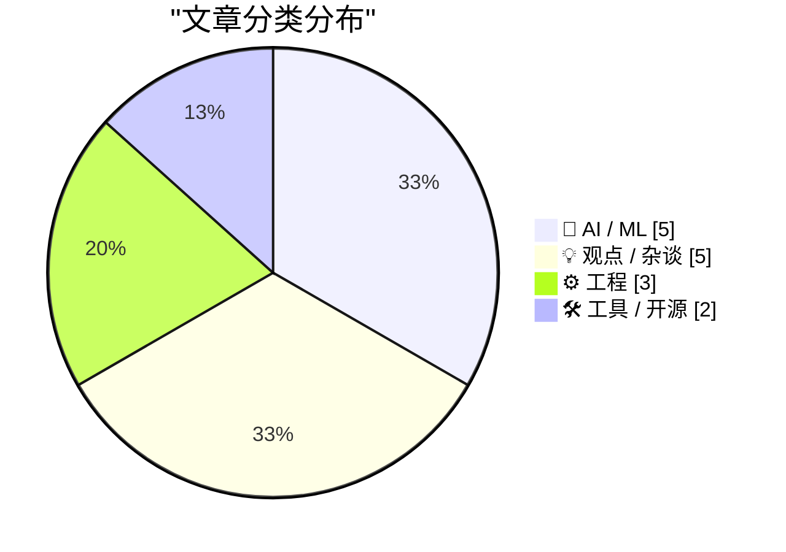
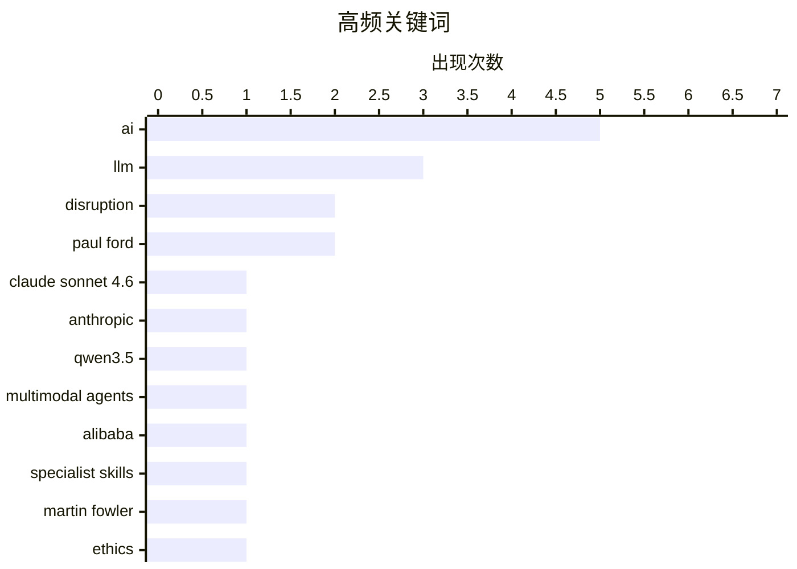

# 📰 AI 博客每日精选 — 2026-02-19

> 来自 Karpathy 推荐的 92 个顶级技术博客，AI 精选 Top 15

## 📝 今日看点

今日看点：AI 浪潮加速颠覆，大型语言模型能力持续增强，并开始渗透到多模态应用中。与此同时，AI 对儿童安全的影响以及 AI 生成内容对开源社区的冲击也引发关注。开发者们也在探索 AI 辅助编程的新模式。

---

## 🏆 今日必读

🥇 **Claude Sonnet 4.6 发布**

[Introducing Claude Sonnet 4.6](https://simonwillison.net/2026/Feb/17/claude-sonnet-46/#atom-everything) — simonwillison.net · 1 天前 · 🤖 AI / ML

> Anthropic 发布了 Claude Sonnet 4.6，声称其性能与去年 11 月发布的 Opus 4.5 相似，但保持了 Sonnet 的定价：输入 $3/百万 tokens，输出 $15/百万 tokens（Opus 模型为 $5/$25）。Sonnet 4.6 旨在提供与 Opus 4.5 相当的性能，同时保持更具竞争力的价格。这意味着用户可以在不增加成本的情况下获得接近顶级模型的性能。Anthropic 旨在通过 Sonnet 4.6 在性能和成本之间取得平衡。

💡 **为什么值得读**: 如果你正在寻找性价比高的AI模型，想以更低的价格获得接近顶级模型的性能，那么 Claude Sonnet 4.6 值得关注。

🏷️ Claude Sonnet 4.6, Anthropic, LLM

🥈 **Qwen3.5：迈向原生多模态智能体**

[Qwen3.5: Towards Native Multimodal Agents](https://simonwillison.net/2026/Feb/17/qwen35/#atom-everything) — simonwillison.net · 1 天前 · 🤖 AI / ML

> 阿里巴巴的 Qwen 发布了 Qwen 3.5 系列的首批两个模型，一个开源权重模型，一个专有模型，两者都支持视觉输入的多模态能力。开源权重模型名为 Qwen3.5-397B-A17B，是一个混合专家模型。Qwen 强调了这种架构在服务效率方面的优势。Qwen3.5 的发布标志着其在多模态智能体方向上的重要进展，并开源了部分模型，促进了社区的进一步研究和应用。

💡 **为什么值得读**: 如果你对多模态大模型，特别是开源的多模态大模型感兴趣，并且关注模型的服务效率，那么 Qwen3.5 值得关注。

🏷️ Qwen3.5, multimodal agents, Alibaba

🥉 **我们期待的人工智能颠覆已经到来**

[The A.I. Disruption We’ve Been Waiting for Has Arrived](https://simonwillison.net/2026/Feb/18/the-ai-disruption/#atom-everything) — simonwillison.net · 8 小时前 · 💡 观点 / 杂谈

> Paul Ford 在《纽约时报》发表了一篇关于人工智能颠覆的评论文章，文章重点描述了去年 11 月发生的“拐点”时刻。该文章探讨了人工智能对软件开发和更广泛行业的潜在影响。文章认为，人工智能正在加速发展，并将对各行各业带来深远的影响。Paul Ford 的观点引发了人们对人工智能未来发展方向的思考。

💡 **为什么值得读**: 如果你想了解人工智能对社会和行业的潜在影响，以及专家对未来趋势的看法，那么这篇文章值得一读。

🏷️ AI, disruption, Paul Ford

---

## 📊 数据概览

| 扫描源 | 抓取文章 | 时间范围 | 精选 |
|:---:|:---:|:---:|:---:|
| 82/92 | 2373 篇 → 36 篇 | 48h | **15 篇** |

### 分类分布



### 高频关键词



<details>
<summary>📈 纯文本关键词图（终端友好）</summary>

```
ai                │ ████████████████████ 5
llm               │ ████████████░░░░░░░░ 3
disruption        │ ████████░░░░░░░░░░░░ 2
paul ford         │ ████████░░░░░░░░░░░░ 2
claude sonnet 4.6 │ ████░░░░░░░░░░░░░░░░ 1
anthropic         │ ████░░░░░░░░░░░░░░░░ 1
qwen3.5           │ ████░░░░░░░░░░░░░░░░ 1
multimodal agents │ ████░░░░░░░░░░░░░░░░ 1
alibaba           │ ████░░░░░░░░░░░░░░░░ 1
specialist skills │ ████░░░░░░░░░░░░░░░░ 1
```

</details>

### 🏷️ 话题标签

**ai**(5) · **llm**(3) · **disruption**(2) · paul ford(2) · claude sonnet 4.6(1) · anthropic(1) · qwen3.5(1) · multimodal agents(1) · alibaba(1) · specialist skills(1) · martin fowler(1) · ethics(1) · children(1) · typing(1) · type hints(1) · repl(1) · magic box(1) · question answering(1) · open source(1) · ai generated(1)

---

## 🤖 AI / ML

### 1. Claude Sonnet 4.6 发布

[Introducing Claude Sonnet 4.6](https://simonwillison.net/2026/Feb/17/claude-sonnet-46/#atom-everything) — **simonwillison.net** · 1 天前 · ⭐ 27/30

> Anthropic 发布了 Claude Sonnet 4.6，声称其性能与去年 11 月发布的 Opus 4.5 相似，但保持了 Sonnet 的定价：输入 $3/百万 tokens，输出 $15/百万 tokens（Opus 模型为 $5/$25）。Sonnet 4.6 旨在提供与 Opus 4.5 相当的性能，同时保持更具竞争力的价格。这意味着用户可以在不增加成本的情况下获得接近顶级模型的性能。Anthropic 旨在通过 Sonnet 4.6 在性能和成本之间取得平衡。

🏷️ Claude Sonnet 4.6, Anthropic, LLM

---

### 2. Qwen3.5：迈向原生多模态智能体

[Qwen3.5: Towards Native Multimodal Agents](https://simonwillison.net/2026/Feb/17/qwen35/#atom-everything) — **simonwillison.net** · 1 天前 · ⭐ 27/30

> 阿里巴巴的 Qwen 发布了 Qwen 3.5 系列的首批两个模型，一个开源权重模型，一个专有模型，两者都支持视觉输入的多模态能力。开源权重模型名为 Qwen3.5-397B-A17B，是一个混合专家模型。Qwen 强调了这种架构在服务效率方面的优势。Qwen3.5 的发布标志着其在多模态智能体方向上的重要进展，并开源了部分模型，促进了社区的进一步研究和应用。

🏷️ Qwen3.5, multimodal agents, Alibaba

---

### 3. 引用 Martin Fowler

[Quoting Martin Fowler](https://simonwillison.net/2026/Feb/18/martin-fowler/#atom-everything) — **simonwillison.net** · 8 小时前 · ⭐ 24/30

> Martin Fowler 认为，大型语言模型（LLM）正在蚕食专业技能。随着驱动 LLM 的技能变得比平台使用的细节更重要，对专业前端和后端开发人员的需求将会减少。他提出了 LLM 的发展是否会导致对“专家通才”角色的更多认可，或者 LLM 编写大量代码的能力是否意味着它们会绕过孤岛进行编码，而不是打破孤岛的问题。Fowler 的观点引发了关于 LLM 对软件开发人员角色影响的讨论。

🏷️ LLM, specialist skills, Martin Fowler

---

### 4. 我们是如何最终用人工智能威胁我们孩子的生命的？

[How did we end up threatening our kids’ lives with AI?](https://anildash.com/2026/02/18/threatening-kids-with-AI/) — **anildash.com** · 1 天前 · ⭐ 24/30

> 这篇文章讨论了大型人工智能公司在影响儿童方面所做出的选择，并警告读者文章包含令人不安的内容。文章表达了对人工智能技术可能被滥用，从而威胁儿童安全的担忧。作者认为，有必要对人工智能技术对儿童的影响进行诚实的对话。文章旨在引起人们对人工智能伦理问题的重视，并呼吁采取措施保护儿童免受人工智能潜在危害。

🏷️ AI, ethics, children

---

### 5. 引用 Dimitris Papailiopoulos

[Quoting Dimitris Papailiopoulos](https://simonwillison.net/2026/Feb/17/dimitris-papailiopoulos/#atom-everything) — **simonwillison.net** · 1 天前 · ⭐ 23/30

> Dimitris Papailiopoulos 认为，他现在拥有一个接近“魔盒”的东西，可以免费获得问题的初步答案。在此之前，他探索新想法的方式要么是自己笨拙地拼凑一些东西，要么是让学生运行一些简短的东西来获取信号，如果信号存在，他们就会深入研究。Papailiopoulos 的观点强调了 LLM 在加速研究和探索新想法方面的潜力。

🏷️ LLM, magic box, question answering

---

## 💡 观点 / 杂谈

### 6. 我们期待的人工智能颠覆已经到来

[The A.I. Disruption We’ve Been Waiting for Has Arrived](https://simonwillison.net/2026/Feb/18/the-ai-disruption/#atom-everything) — **simonwillison.net** · 8 小时前 · ⭐ 24/30

> Paul Ford 在《纽约时报》发表了一篇关于人工智能颠覆的评论文章，文章重点描述了去年 11 月发生的“拐点”时刻。该文章探讨了人工智能对软件开发和更广泛行业的潜在影响。文章认为，人工智能正在加速发展，并将对各行各业带来深远的影响。Paul Ford 的观点引发了人们对人工智能未来发展方向的思考。

🏷️ AI, disruption, Paul Ford

---

### 7. 支持守门人的理由，或者：为什么中世纪的行会想明白了

[The case for gatekeeping, or: why medieval guilds had it figured out](https://www.joanwestenberg.com/the-case-for-gatekeeping-or-why-medieval-guilds-had-it-figured-out/) — **joanwestenberg.com** · 22 小时前 · ⭐ 23/30

> 文章指出，过去六个月里，每个开源维护者都在抱怨：大量由人工智能生成的大规模提交请求已经将他们的存储库变成了一个垃圾堆。这些贡献看起来像是贡献，它们有提交消息，它们引用问题并且遵循约定，但它们通常是无用的。文章讨论了开源项目维护者面临的挑战，以及人工智能生成的内容对开源生态系统的潜在影响。

🏷️ open source, AI generated, gatekeeping, contributions

---

### 8. 人工智能颠覆已至，而且确实很有趣

[Paul Ford: ‘The A.I. Disruption Has Arrived, and It Sure Is Fun’](https://www.nytimes.com/2026/02/18/opinion/ai-software.html?unlocked_article_code=1.NFA.djaw.TBlAp8kE_N-i) — **daringfireball.net** · 3 小时前 · ⭐ 21/30

> Paul Ford 在《纽约时报》的评论文章中表达了他对人工智能的复杂情感，他发现自己既兴奋又矛盾。他指出，他所爱的人都讨厌人工智能，而他讨厌的人却喜欢它。尽管如此，他仍然对人工智能的潜力感到兴奋，这源于他最初被技术吸引的性格缺陷。文章暗示了人工智能带来的社会分歧，以及技术爱好者在这种变革中的复杂心态。

🏷️ AI, disruption, Paul Ford

---

### 9. Markdown 的时代

[Markdown’s Moment](https://feed.tedium.co/link/15204/17278321/markdown-growing-influence-cloudflare-ai) — **tedium.co** · 21 小时前 · ⭐ 20/30

> 目前，许多大型公司都在积极采用 Markdown 格式。文章认为，人工智能可能是推动 Markdown 普及的原因，并对由此可能带来的好处表示乐观。

🏷️ Markdown, AI, text format

---

### 10. 你以为他们在为你工作

[You Only Think They Work For You](https://steveblank.com/2026/02/18/you-only-think-they-work-for-you/) — **steveblank.com** · 11 小时前 · ⭐ 20/30

> 作者分享了作为市场营销副总裁时，关于公关公司实际服务对象的惨痛教训。他意识到，所有外部供应商的情况都是如此。更重要的是，他反思了自己真正应该要求他们做什么。这些经验教训至今仍然适用。

🏷️ vendor management, PR, marketing

---

## ⚙️ 工程

### 11. 无需打字的打字

[Typing without having to type](https://simonwillison.net/2026/Feb/18/typing/#atom-everything) — **simonwillison.net** · 6 小时前 · ⭐ 23/30

> 作者在 25 年的编程生涯后，开始倾向于类型提示甚至强类型。过去，他抵制这些，因为它们减慢了代码迭代的速度，尤其是在 REPL 环境中。但如果编码代理正在为他完成所有的“打字”工作，那么显式定义所有这些类型的好处突然变得更具吸引力。作者的观点表明，随着人工智能编码助手的普及，开发者对类型系统的态度可能会发生转变。

🏷️ typing, type hints, REPL

---

### 12. 在 Raspberry Pi 上使用 Hailo 进行 Frigate 对象检测

[Frigate with Hailo for object detection on a Raspberry Pi](https://www.jeffgeerling.com/blog/2026/frigate-with-hailo-for-object-detection-on-a-raspberry-pi/) — **jeffgeerling.com** · 4 小时前 · ⭐ 22/30

> 作者使用 Frigate 记录安全摄像头，并在视野中检测到人、汽车和动物。当前的 Frigate 服务器运行在 Raspberry Pi CM4 和通过 USB 插入的 Coral TPU 上。Raspberry Pi 为 Raspberry Pi 5 提供了多个带有板载 AI 加速器的 AI HAT+。文章探讨了在 Raspberry Pi 上使用 Frigate 和 Hailo 进行对象检测的方案。

🏷️ Frigate, Hailo, object detection, Raspberry Pi

---

### 13. Nano Banana Pro diff 到网络漫画

[Nano Banana Pro diff to webcomic](https://simonwillison.net/2026/Feb/17/release-notes-webcomic/#atom-everything) — **simonwillison.net** · 1 天前 · ⭐ 19/30

> 鉴于人工智能加速软件开发可能导致认知负债，即项目增多但对项目工作原理和实际作用的理解减少，文章探讨了可以帮助缓解认知负债的工具。Nathan Baschez 提出了一个减少认知负债的技巧。

🏷️ cognitive debt, AI, software development

---

## 🛠 工具 / 开源

### 14. Rodney v0.4.0

[Rodney v0.4.0](https://simonwillison.net/2026/Feb/17/rodney/#atom-everything) — **simonwillison.net** · 1 天前 · ⭐ 22/30

> 作者的浏览器自动化 CLI 工具 Rodney 自发布以来吸引了大量的 PR。该版本 v0.4.0 的更新包括：错误现在使用退出代码，添加了 `rodney install` 命令，以及对 `rodney run` 命令的改进。Rodney v0.4.0 的发布标志着该工具的持续发展和改进，为用户提供了更强大的浏览器自动化能力。

🏷️ Rodney, browser automation, CLI tool

---

### 15. Epomaker Split 70 分体式机械键盘测评 ★★★★⯪

[Gadget Review: Epomaker Split 70 Mechanical Keyboard ★★★★⯪](https://shkspr.mobi/blog/2026/02/gadget-review-epomaker-split-70-mechanical-keyboard/) — **shkspr.mobi** · 1 天前 · ⭐ 20/30

> Epomaker Split 70 是一款人体工学分体式机械键盘，由两个独立的键盘通过 USB-C 连接组成，允许用户自定义键盘的摆放位置。这款键盘并非传统的人体工学设计，而是通过分离式设计来提供更灵活的输入体验。评测者对这款键盘进行了体验，并分享了一个展示其使用效果的视频。

🏷️ Epomaker, Split 70, mechanical keyboard, ergonomic

---

*生成于 2026-02-19 01:12 | 扫描 82 源 → 获取 2373 篇 → 精选 15 篇*
*基于 [Hacker News Popularity Contest 2025](https://refactoringenglish.com/tools/hn-popularity/) RSS 源列表，由 [Andrej Karpathy](https://x.com/karpathy) 推荐*
*由「懂点儿AI」制作，欢迎关注同名微信公众号获取更多 AI 实用技巧 💡*
