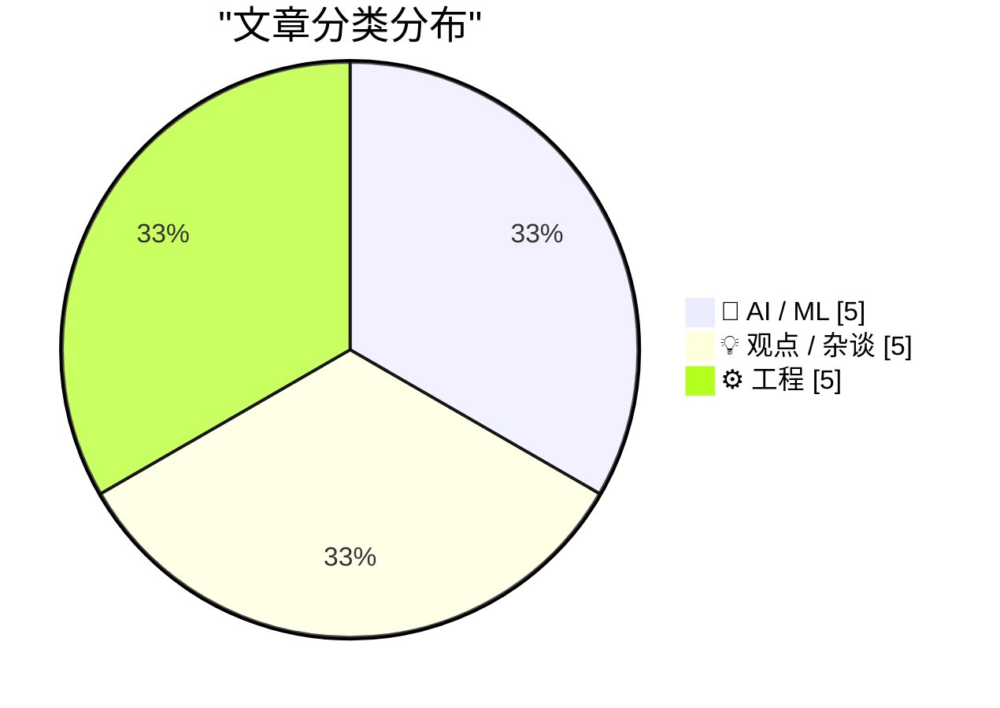
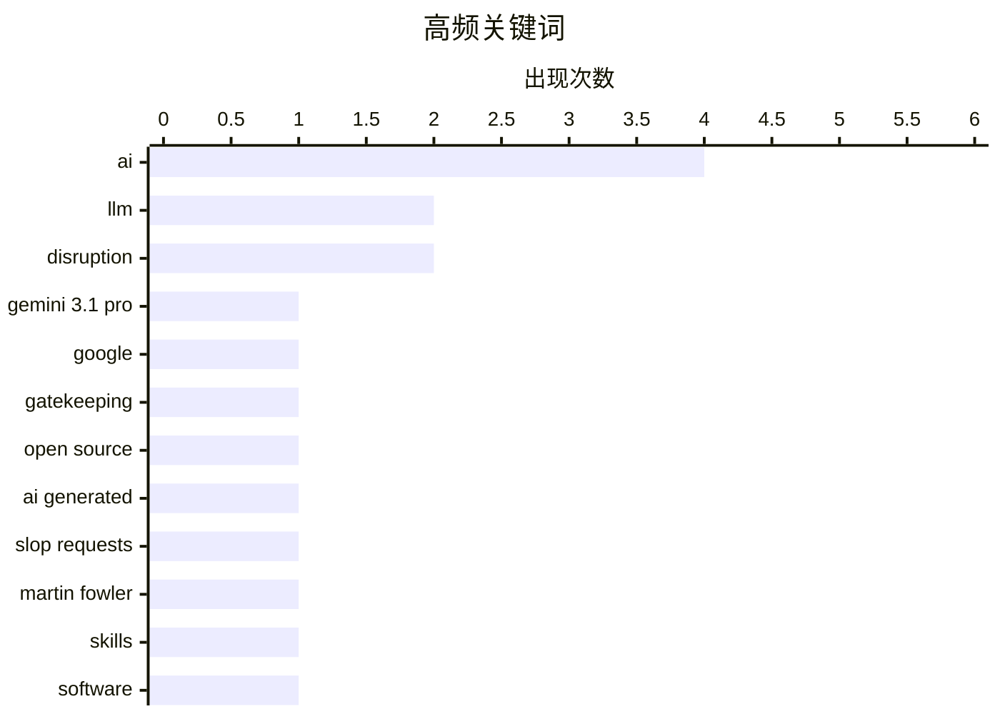

# 📰 AI 博客每日精选 — 2026-02-20

> 来自 Karpathy 推荐的 92 个顶级技术博客，AI 精选 Top 15

## 📝 今日看点

今日看点：AI持续渗透软件开发，引发行业角色转变和技能需求重塑，同时对硬件资源的需求激增。开源社区面临AI生成低质量代码的挑战，呼唤更严格的代码质量控制机制。Markdown因其简洁性和AI兼容性，在大型公司中日益普及。

---

## 🏆 今日必读

🥇 **Gemini 3.1 Pro**

[Gemini 3.1 Pro](https://simonwillison.net/2026/Feb/19/gemini-31-pro/#atom-everything) — simonwillison.net · 7 小时前 · 🤖 AI / ML

> Google发布了Gemini 3.1 Pro，这是Gemini 3.1系列的首款产品，定价与Gemini 3 Pro相同。该模型在20万token以内输入价格为2美元/百万token，输出价格为12美元/百万token；20万到100万token的价格分别为4美元和18美元。Gemini 3.1 Pro的基准测试分数与Claude Opus 4.6非常相似，但价格却不到后者的一半。此外，该模型在SVG动画性能方面优于Gemini 3 Pro。

💡 **为什么值得读**: 如果你正在寻找性价比高的AI模型，Gemini 3.1 Pro是一个值得关注的选择，它在性能接近Claude Opus 4.6的同时，价格更具竞争力。

🏷️ Gemini 3.1 Pro, LLM, Google

🥈 **支持门卫制度：为什么中世纪的行会制度是明智的**

[The case for gatekeeping, or: why medieval guilds had it figured out](https://www.joanwestenberg.com/the-case-for-gatekeeping-or-why-medieval-guilds-had-it-figured-out/) — joanwestenberg.com · 1 天前 · 💡 观点 / 杂谈

> 开源维护者普遍抱怨大量AI生成的垃圾提交请求淹没了他们的代码仓库。这些提交看似合理，包含提交信息、引用问题和遵循代码规范，但实际上质量低下。文章认为，这种现象表明需要某种形式的“门卫制度”来过滤低质量的贡献，类似于中世纪行会制度对质量的把控。

💡 **为什么值得读**: 本文揭示了AI生成内容对开源社区的潜在威胁，并提出了对开源项目质量控制的新思考。

🏷️ gatekeeping, open source, AI generated, slop requests

🥉 **引用 Martin Fowler**

[Quoting Martin Fowler](https://simonwillison.net/2026/Feb/18/martin-fowler/#atom-everything) — simonwillison.net · 1 天前 · 🤖 AI / ML

> Martin Fowler 认为，大型语言模型（LLM）正在蚕食专业技能，对前端和后端开发人员的需求将减少，而驱动 LLM 的技能将变得更加重要。这可能会导致人们更加重视“专家通才”的角色。或者，LLM 编写大量代码的能力是否意味着他们会绕过孤岛进行编码，而不是打破孤岛？

💡 **为什么值得读**: 本文引用了Martin Fowler的观点，预示了LLM对软件开发领域带来的变革，以及对开发者技能的新要求。

🏷️ LLM, Martin Fowler, skills

---

## 📊 数据概览

| 扫描源 | 抓取文章 | 时间范围 | 精选 |
|:---:|:---:|:---:|:---:|
| 82/92 | 2373 篇 → 27 篇 | 48h | **15 篇** |

### 分类分布



### 高频关键词



<details>
<summary>📈 纯文本关键词图（终端友好）</summary>

```
ai             │ ████████████████████ 4
llm            │ ██████████░░░░░░░░░░ 2
disruption     │ ██████████░░░░░░░░░░ 2
gemini 3.1 pro │ █████░░░░░░░░░░░░░░░ 1
google         │ █████░░░░░░░░░░░░░░░ 1
gatekeeping    │ █████░░░░░░░░░░░░░░░ 1
open source    │ █████░░░░░░░░░░░░░░░ 1
ai generated   │ █████░░░░░░░░░░░░░░░ 1
slop requests  │ █████░░░░░░░░░░░░░░░ 1
martin fowler  │ █████░░░░░░░░░░░░░░░ 1
```

</details>

### 🏷️ 话题标签

**ai**(4) · **llm**(2) · **disruption**(2) · gemini 3.1 pro(1) · google(1) · gatekeeping(1) · open source(1) · ai generated(1) · slop requests(1) · martin fowler(1) · skills(1) · software(1) · paul ford(1) · swe-bench(1) · benchmark(1) · leaderboard(1) · type hints(1) · strong typing(1) · repl(1) · frigate(1)

---

## 🤖 AI / ML

### 1. Gemini 3.1 Pro

[Gemini 3.1 Pro](https://simonwillison.net/2026/Feb/19/gemini-31-pro/#atom-everything) — **simonwillison.net** · 7 小时前 · ⭐ 26/30

> Google发布了Gemini 3.1 Pro，这是Gemini 3.1系列的首款产品，定价与Gemini 3 Pro相同。该模型在20万token以内输入价格为2美元/百万token，输出价格为12美元/百万token；20万到100万token的价格分别为4美元和18美元。Gemini 3.1 Pro的基准测试分数与Claude Opus 4.6非常相似，但价格却不到后者的一半。此外，该模型在SVG动画性能方面优于Gemini 3 Pro。

🏷️ Gemini 3.1 Pro, LLM, Google

---

### 2. 引用 Martin Fowler

[Quoting Martin Fowler](https://simonwillison.net/2026/Feb/18/martin-fowler/#atom-everything) — **simonwillison.net** · 1 天前 · ⭐ 24/30

> Martin Fowler 认为，大型语言模型（LLM）正在蚕食专业技能，对前端和后端开发人员的需求将减少，而驱动 LLM 的技能将变得更加重要。这可能会导致人们更加重视“专家通才”的角色。或者，LLM 编写大量代码的能力是否意味着他们会绕过孤岛进行编码，而不是打破孤岛？

🏷️ LLM, Martin Fowler, skills

---

### 3. 我们期待的人工智能颠覆已经到来

[The A.I. Disruption We’ve Been Waiting for Has Arrived](https://simonwillison.net/2026/Feb/18/the-ai-disruption/#atom-everything) — **simonwillison.net** · 1 天前 · ⭐ 23/30

> Paul Ford 在《纽约时报》发表了一篇新的观点文章，描述了2026年1月出现的“转折时刻”，即AI开始真正改变软件开发的方式。文章充满了值得引用的片段，引发了人们对AI在软件开发领域影响的思考。

🏷️ AI, disruption, software

---

### 4. SWE-bench 2026 年 2 月排行榜更新

[SWE-bench February 2026 leaderboard update](https://simonwillison.net/2026/Feb/19/swe-bench/#atom-everything) — **simonwillison.net** · 20 小时前 · ⭐ 22/30

> SWE-bench 是一个用于评估代码生成模型的基准测试，实验室喜欢在模型发布时列出其结果。官方排行榜更新频率不高，但最近对当前一代模型进行了全面测试，值得注意的是，这些基准测试结果并非由实验室自行报告。最新的结果是针对他们的“仅 Bash”基准。

🏷️ SWE-bench, benchmark, leaderboard

---

### 5. 人工智能是 NAND 最大化器

[AI is a NAND Maximiser](https://shkspr.mobi/blog/2026/02/ai-is-a-nand-maximiser/) — **shkspr.mobi** · 12 小时前 · ⭐ 21/30

> PC Gamer 报道称，目前人工智能公司对计算机芯片的需求对其他行业产生了灾难性的影响。Phison 的 CEO 表示，如果 NVIDIA Vera Rubin 出货数千万台，每台需要 20+TB 的 SSD，这将消耗去年全球 NAND 产量的约 20%。NAND 是一种微芯片。

🏷️ AI, NAND, SSD, chip demand

---

## 💡 观点 / 杂谈

### 6. 支持门卫制度：为什么中世纪的行会制度是明智的

[The case for gatekeeping, or: why medieval guilds had it figured out](https://www.joanwestenberg.com/the-case-for-gatekeeping-or-why-medieval-guilds-had-it-figured-out/) — **joanwestenberg.com** · 1 天前 · ⭐ 25/30

> 开源维护者普遍抱怨大量AI生成的垃圾提交请求淹没了他们的代码仓库。这些提交看似合理，包含提交信息、引用问题和遵循代码规范，但实际上质量低下。文章认为，这种现象表明需要某种形式的“门卫制度”来过滤低质量的贡献，类似于中世纪行会制度对质量的把控。

🏷️ gatekeeping, open source, AI generated, slop requests

---

### 7. Paul Ford: ‘人工智能颠覆已经到来，而且确实很有趣’

[Paul Ford: ‘The A.I. Disruption Has Arrived, and It Sure Is Fun’](https://www.nytimes.com/2026/02/18/opinion/ai-software.html?unlocked_article_code=1.NFA.djaw.TBlAp8kE_N-i) — **daringfireball.net** · 1 天前 · ⭐ 23/30

> Paul Ford 在《纽约时报》发表了一篇专栏文章，表达了他对人工智能的复杂情感。他指出，他喜欢的人讨厌人工智能，而他讨厌的人却喜欢它。尽管存在一些性格缺陷，但他仍然对人工智能感到兴奋。

🏷️ AI, disruption, Paul Ford

---

### 8. 博客和 Newsletter 赞助实验

[Experimenting with sponsorship for my blog and newsletter](https://simonwillison.net/2026/Feb/19/sponsorship/#atom-everything) — **simonwillison.net** · 19 小时前 · ⭐ 20/30

> 作者 Simonwillison.net 一直对博客赞助持谨慎态度，担心影响其独立性和信誉。受到 Troy Hunt 的赞助模式启发，作者尝试了一种简单的文本横幅赞助方式，无需 JavaScript 和 cookies，不影响用户体验。这种方式旨在测试赞助是否能带来收益，同时保持博客的独立性。作者希望通过这种克制的赞助方式，找到一种既能支持内容创作，又不损害用户体验的平衡点。

🏷️ sponsorship, blog, newsletter

---

### 9. 你只是以为他们在为你工作

[You Only Think They Work For You](https://steveblank.com/2026/02/18/you-only-think-they-work-for-you/) — **steveblank.com** · 1 天前 · ⭐ 20/30

> 作者分享了作为营销副总裁时，关于公关公司实际服务对象的惨痛教训。作者意识到，所有外部供应商的情况都是如此。作者反思了应该要求他们做什么。这些经验教训至今仍然适用。

🏷️ PR agency, vendors, marketing

---

### 10. 思考提升思考能力

[Thinking Improves Thinking](https://idiallo.com/blog/taking-our-mind-for-granted?src=feed) — **idiallo.com** · 1 天前 · ⭐ 19/30

> 文章探讨了在 ChatGPT 出现之前，人们如何独立思考并解决问题。作者认为，关键在于能够静下心来，忍受不适，直到解决方案出现。即使在散步时，大脑也会在潜意识中处理问题。作者强调了独立思考的重要性，以及在没有 AI 辅助的情况下解决问题的能力。

🏷️ thinking, ChatGPT, problem solving

---

## ⚙️ 工程

### 11. 无需打字的打字

[Typing without having to type](https://simonwillison.net/2026/Feb/18/typing/#atom-everything) — **simonwillison.net** · 1 天前 · ⭐ 22/30

> 在编程生涯超过 25 年后，作者开始倾向于类型提示甚至强类型。过去，他抵制这些，因为它们减慢了代码迭代速度，尤其是在 REPL 环境中。但是，如果编码代理正在为他完成所有这些“打字”工作，那么显式定义所有这些类型的好处突然变得更具吸引力。

🏷️ type hints, strong typing, REPL

---

### 12. 在树莓派上使用 Hailo 进行 Frigate 目标检测

[Frigate with Hailo for object detection on a Raspberry Pi](https://www.jeffgeerling.com/blog/2026/frigate-with-hailo-for-object-detection-on-a-raspberry-pi/) — **jeffgeerling.com** · 1 天前 · ⭐ 22/30

> 作者使用 Frigate 记录安全摄像头，并在视野范围内检测到人、汽车和动物。他当前的 Frigate 服务器运行在 Raspberry Pi CM4 和通过 USB 插入的 Coral TPU 上。Raspberry Pi 为 Raspberry Pi 5 提供了多个带有内置 Hailo-8L AI 加速器的 AI HAT+。

🏷️ Frigate, Hailo, object detection, Raspberry Pi

---

### 13. Markdown 的时刻

[Markdown’s Moment](https://feed.tedium.co/link/15204/17278321/markdown-growing-influence-cloudflare-ai) — **tedium.co** · 1 天前 · ⭐ 21/30

> 目前，许多大型公司都在大力采用 Markdown。人工智能可能是原因，但作者喜欢它可能带来的额外好处。Cloudflare AI 也开始使用 Markdown。

🏷️ Markdown, AI, text format

---

### 14. Ladybird 浏览器：放弃采用 Swift

[LadybirdBrowser/ladybird: Abandon Swift adoption](https://simonwillison.net/2026/Feb/19/ladybird/#atom-everything) — **simonwillison.net** · 23 小时前 · ⭐ 20/30

> Ladybird 浏览器项目宣布放弃采用 Swift 作为其内存安全语言的计划。该项目曾在 2024 年 8 月宣布计划采用 Swift。然而，由于实际开发中遇到的问题，项目决定放弃这一方案。此次放弃意味着 Ladybird 将继续使用其他语言进行开发，而非转向 Swift。

🏷️ Ladybird, browser, Swift

---

### 15. 意识流驱动开发

[Stream of Consciousness Driven Development](https://buttondown.com/hillelwayne/archive/stream-of-consciousness-driven-development/) — **buttondown.com/hillelwayne** · 1 天前 · ⭐ 20/30

> 作者介绍了一种名为“意识流驱动开发”的新方法，用于解决规范编写中的问题。该方法通过创建一个新的 Markdown 文件，记录问题概要、详细描述和解决方案。作者在与客户合作编写规范时尝试了这种方法，并认为它具有潜力。这种方法的核心在于将思考过程直接记录下来，而不是试图口头解释。

🏷️ Stream of Consciousness, development, specification

---

*生成于 2026-02-20 01:08 | 扫描 82 源 → 获取 2373 篇 → 精选 15 篇*
*基于 [Hacker News Popularity Contest 2025](https://refactoringenglish.com/tools/hn-popularity/) RSS 源列表，由 [Andrej Karpathy](https://x.com/karpathy) 推荐*
*由「懂点儿AI」制作，欢迎关注同名微信公众号获取更多 AI 实用技巧 💡*
