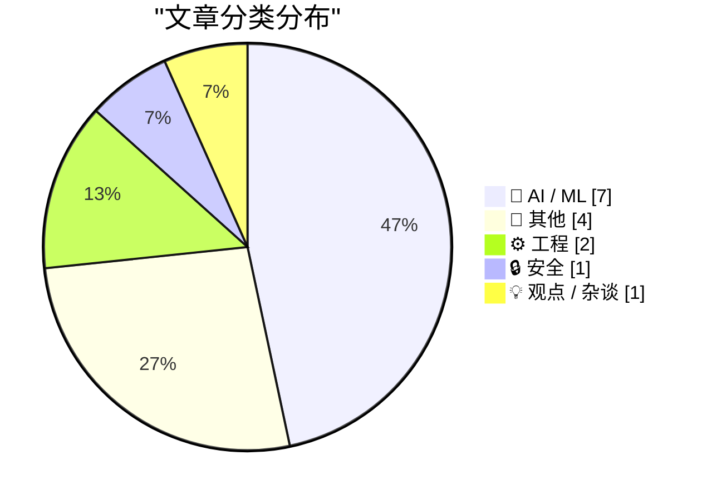
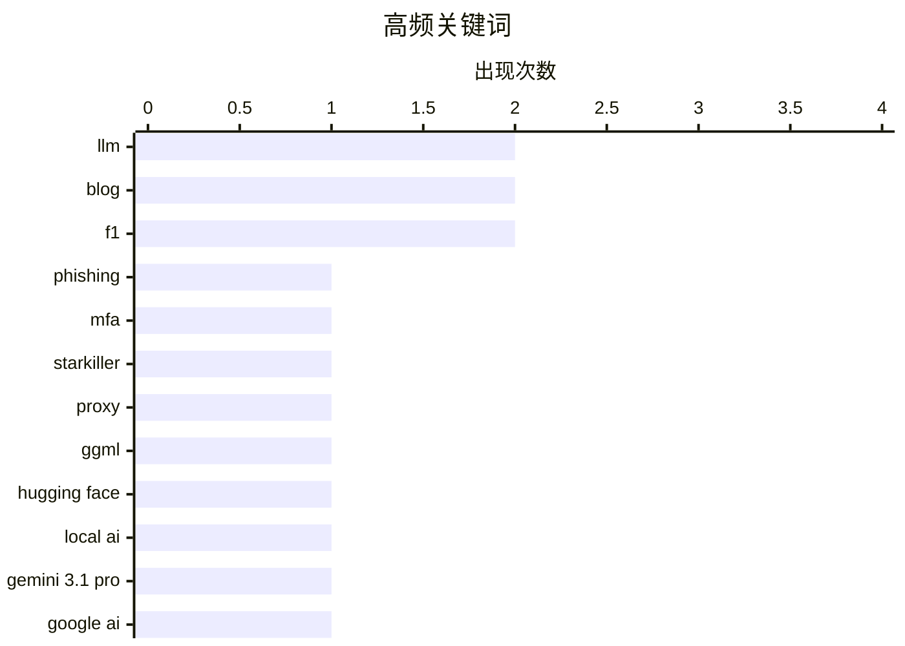

# 📰 AI 博客每日精选 — 2026-02-21

> 来自 Karpathy 推荐的 92 个顶级技术博客，AI 精选 Top 15

## 📝 今日看点

今日看点：AI领域持续火热，本地AI发展受关注，硬件加速方案不断涌现，但同时也面临芯片需求带来的挑战。网络安全方面，新型钓鱼攻击手段更加隐蔽，安全防护面临升级。此外，技术选型需谨慎，Ladybird浏览器放弃Swift的案例值得反思。

---

## 🏆 今日必读

🥇 **“弑星者”钓鱼服务：代理真实登录页面和多因素认证**

[‘Starkiller’ Phishing Service Proxies Real Login Pages, MFA](https://krebsonsecurity.com/2026/02/starkiller-phishing-service-proxies-real-login-pages-mfa/) — krebsonsecurity.com · 5 小时前 · 🔒 安全

> 传统的钓鱼网站通常只是流行网站登录页面的静态副本，容易被反滥用组织和安全公司迅速下线。而一种名为“弑星者 (Starkiller)”的新型钓鱼即服务 (Phishing-as-a-Service) 采用巧妙伪装的链接加载目标品牌的真实网站，充当受害者和合法网站之间的中继，从而绕过了这些陷阱。它会转发受害者的用户名、密码和多因素认证信息。这种服务隐蔽性强，难以被检测和阻止。

💡 **为什么值得读**: 了解新型钓鱼攻击手段，可以帮助企业和个人更好地防范网络安全威胁。

🏷️ phishing, MFA, Starkiller, proxy

🥈 **ggml.ai 加入 Hugging Face，确保本地 AI 的长期发展**

[ggml.ai joins Hugging Face to ensure the long-term progress of Local AI](https://simonwillison.net/2026/Feb/20/ggmlai-joins-hugging-face/#atom-everything) — simonwillison.net · 7 小时前 · 🤖 AI / ML

> ggml.ai 加入 Hugging Face 旨在推动本地 AI 的长期发展。Georgi Gerganov 在本地模型领域影响深远，他在 2023 年 3 月发布的 llama.cpp 使得在消费级硬件上运行本地 LLM 成为可能。此次收购预示着 Hugging Face 将在本地 AI 领域投入更多资源，进一步推动相关技术的发展。

💡 **为什么值得读**: 关注 AI 领域的重要收购事件，有助于把握技术发展趋势。

🏷️ ggml, Hugging Face, Local AI

🥉 **Gemini 3.1 Pro**

[Gemini 3.1 Pro](https://simonwillison.net/2026/Feb/19/gemini-31-pro/#atom-everything) — simonwillison.net · 1 天前 · 🤖 AI / ML

> Gemini 3.1 Pro 是 Gemini 3.1 系列的首款产品，定价与 Gemini 3 Pro 相同（低于 20 万 token 时，输入 2 美元/百万 token，输出 12 美元/百万 token；20 万到 100 万 token 时，输入 4 美元/百万 token，输出 18 美元/百万 token）。其价格不到 Claude Opus 4.6 的一半，但基准测试分数却非常相似。Gemini 3.1 Pro 在 SVG 动画性能方面也优于 Gemini 3 Pro。

💡 **为什么值得读**: 了解最新 AI 模型的性能和价格，有助于在实际应用中做出更明智的选择。

🏷️ Gemini 3.1 Pro, Google AI, LLM

---

## 📊 数据概览

| 扫描源 | 抓取文章 | 时间范围 | 精选 |
|:---:|:---:|:---:|:---:|
| 83/92 | 2389 篇 → 30 篇 | 48h | **15 篇** |

### 分类分布



### 高频关键词



<details>
<summary>📈 纯文本关键词图（终端友好）</summary>

```
llm          │ ████████████████████ 2
blog         │ ████████████████████ 2
f1           │ ████████████████████ 2
phishing     │ ██████████░░░░░░░░░░ 1
mfa          │ ██████████░░░░░░░░░░ 1
starkiller   │ ██████████░░░░░░░░░░ 1
proxy        │ ██████████░░░░░░░░░░ 1
ggml         │ ██████████░░░░░░░░░░ 1
hugging face │ ██████████░░░░░░░░░░ 1
local ai     │ ██████████░░░░░░░░░░ 1
```

</details>

### 🏷️ 话题标签

**llm**(2) · **blog**(2) · **f1**(2) · phishing(1) · mfa(1) · starkiller(1) · proxy(1) · ggml(1) · hugging face(1) · local ai(1) · gemini 3.1 pro(1) · google ai(1) · llama 3.1(1) · ai hardware(1) · taalas(1) · ai(1) · nand(1) · ssd(1) · chip shortage(1) · swe-bench(1)

---

## 🤖 AI / ML

### 1. ggml.ai 加入 Hugging Face，确保本地 AI 的长期发展

[ggml.ai joins Hugging Face to ensure the long-term progress of Local AI](https://simonwillison.net/2026/Feb/20/ggmlai-joins-hugging-face/#atom-everything) — **simonwillison.net** · 7 小时前 · ⭐ 24/30

> ggml.ai 加入 Hugging Face 旨在推动本地 AI 的长期发展。Georgi Gerganov 在本地模型领域影响深远，他在 2023 年 3 月发布的 llama.cpp 使得在消费级硬件上运行本地 LLM 成为可能。此次收购预示着 Hugging Face 将在本地 AI 领域投入更多资源，进一步推动相关技术的发展。

🏷️ ggml, Hugging Face, Local AI

---

### 2. Gemini 3.1 Pro

[Gemini 3.1 Pro](https://simonwillison.net/2026/Feb/19/gemini-31-pro/#atom-everything) — **simonwillison.net** · 1 天前 · ⭐ 24/30

> Gemini 3.1 Pro 是 Gemini 3.1 系列的首款产品，定价与 Gemini 3 Pro 相同（低于 20 万 token 时，输入 2 美元/百万 token，输出 12 美元/百万 token；20 万到 100 万 token 时，输入 4 美元/百万 token，输出 18 美元/百万 token）。其价格不到 Claude Opus 4.6 的一半，但基准测试分数却非常相似。Gemini 3.1 Pro 在 SVG 动画性能方面也优于 Gemini 3 Pro。

🏷️ Gemini 3.1 Pro, Google AI, LLM

---

### 3. Taalas 以 17,000 token/秒的速度运行 Llama 3.1 8B

[Taalas serves Llama 3.1 8B at 17,000 tokens/second](https://simonwillison.net/2026/Feb/20/taalas/#atom-everything) — **simonwillison.net** · 2 小时前 · ⭐ 23/30

> 加拿大硬件初创公司 Taalas 发布了其首款产品，这是一款 Llama 3.1 8B 模型的定制硬件实现，能够以惊人的 17,000 token/秒的速度运行。该硬件加速方案显著提升了 Llama 3.1 8B 模型的推理速度。

🏷️ Llama 3.1, AI hardware, Taalas

---

### 4. AI 是一个 NAND 最大化器

[AI is a NAND Maximiser](https://shkspr.mobi/blog/2026/02/ai-is-a-nand-maximiser/) — **shkspr.mobi** · 1 天前 · ⭐ 22/30

> AI 公司对计算机芯片的巨大需求正在对整个行业产生灾难性的影响。Phison 的 CEO 表示，如果 NVIDIA Vera Rubin 出货数千万台，每台需要 20+TB 的 SSD，这将消耗去年全球 NAND 产量的大约 20%。AI 需求的增长正在挤压其他行业的 NAND 芯片供应。

🏷️ AI, NAND, SSD, chip shortage

---

### 5. SWE-bench 2026 年 2 月排行榜更新

[SWE-bench February 2026 leaderboard update](https://simonwillison.net/2026/Feb/19/swe-bench/#atom-everything) — **simonwillison.net** · 1 天前 · ⭐ 21/30

> SWE-bench 是一个评估模型在软件工程任务上表现的基准测试。官方 SWE-bench 排行榜进行了更新，展示了当前一代模型在“Bash Only”基准测试中的表现。这些结果并非由各实验室自行报告，因此更具参考价值。

🏷️ SWE-bench, benchmark, AI models

---

### 6. 高级：对 Anthropic 的差评指南

[Premium: The Hater's Guide to Anthropic](https://www.wheresyoured.at/premium-the-haters-guide-to-anthropic/) — **wheresyoured.at** · 6 小时前 · ⭐ 21/30

> Dario Amodei 和其他前 OpenAI 研究人员于 2021 年 5 月成立了 Anthropic，致力于构建最安全的（也可能是最令人讨厌的）大型语言模型公司。文章以一种幽默的方式，对 Anthropic 及其产品进行了评价。

🏷️ Anthropic, LLM, AI safety

---

### 7. 引用 Thariq Shihipar 的话

[Quoting Thariq Shihipar](https://simonwillison.net/2026/Feb/20/thariq-shihipar/#atom-everything) — **simonwillison.net** · 17 小时前 · ⭐ 20/30

> Claude Code 等长期运行的 Agentic 产品之所以可行，是因为使用了 prompt 缓存技术，该技术允许重复利用先前往返的计算结果，从而显著降低延迟和成本。Claude Code 的整个架构都围绕 prompt 缓存构建，高 prompt 缓存命中率可以降低成本，并为订阅计划提供更慷慨的速率限制。

🏷️ Claude Code, prompt caching, latency

---

## 📝 其他

### 8. IMAX 和 Apple 合作，将在影院直播 F1 赛事

[IMAX and Apple Collaborate to Screen F1 Races Live in Theaters](https://www.motorsport.com/f1/news/f1-to-screen-live-in-imax-theatres-in-2026-as-apple-tv-unveils-new-us-viewing-experience/10798974/) — **daringfireball.net** · 1 天前 · ⭐ 18/30

> IMAX 宣布与 Apple TV 合作，自 2026 年起在美国的 IMAX 影院直播部分 F1 赛事。这项合作是 Apple TV 获得美国 F1 赛事多年转播权的一部分。通过在 IMAX 影院直播 F1 赛事，旨在为观众提供更具沉浸感和能量的观赛体验。此举反映了 F1 在美国体育和文化领域日益增长的影响力。

🏷️ IMAX, Apple TV, F1, live broadcast

---

### 9. 关于苹果 3 月 4 日媒体活动 '体验' 的一个想法：Vision Pro 上的沉浸式 F1 体验？

[One More Spitball Idea for Apple’s March 4 Media Event ‘Experience’: Immersive F1 on Vision Pro?](https://www.formula1.com/en/latest/article/official-grand-prix-start-times-for-2026-f1-season-confirmed.2UgPfArqH76tzlOYh21jSG) — **daringfireball.net** · 1 天前 · ⭐ 18/30

> 文章推测苹果可能在 3 月 4 日的媒体活动中展示 Vision Pro 上的沉浸式 F1 直播体验。Apple TV 已成为美国 F1 赛事的独家转播合作伙伴，并且已经在 VisionOS 上尝试了有限的湖人队比赛的沉浸式直播。考虑到 2026 年 F1 赛季将于 3 月 8 日在澳大利亚开始，苹果可能会利用此次活动向媒体展示其在 Vision Pro 上直播 F1 赛事的计划，提供某种程度的沉浸感。

🏷️ Apple Vision Pro, F1, immersive, sports

---

### 10. Pluralistic：一个多孔的公司面纱（2026 年 2 月 20 日）

[Pluralistic: A perforated corporate veil (20 Feb 2026)](https://pluralistic.net/2026/02/20/karioca-konzernrecht/) — **pluralistic.net** · 10 小时前 · ⭐ 18/30

> 文章讨论了巴西遏制公司权力的“多孔公司面纱”方法。同时，文章还涉及社交媒体如何将美国政党转变为第三方寄主，以及“公民”如何成为受雇演员等话题。此外，还提到了投保的外骨骼，以及与斯诺登和吉布森的对话。文章是作者日常链接分享的一部分，包含作者的最新书籍和即将出版的书籍信息。

🏷️ corporate power, social media, politics

---

### 11. Pluralistic：Pluralistic 六周年（2026 年 2 月 19 日）

[Pluralistic: Six Years of Pluralistic (19 Feb 2026)](https://pluralistic.net/2026/02/19/now-we-are-six/) — **pluralistic.net** · 1 天前 · ⭐ 17/30

> 文章庆祝 Pluralistic 博客成立六周年，并分享了作者的一些思考。文章链接到了一些有趣的内容，包括 MBA 相面术、索尼的 DRM CEO 离职、中西部解放广场、反向半人马和 AI 等。文章是作者日常链接分享的一部分，包含作者的最新书籍和即将出版的书籍信息。

🏷️ blog, Pluralistic, Cory Doctorow

---

## ⚙️ 工程

### 12. LadybirdBrowser/ladybird：放弃采用 Swift

[LadybirdBrowser/ladybird: Abandon Swift adoption](https://simonwillison.net/2026/Feb/19/ladybird/#atom-everything) — **simonwillison.net** · 1 天前 · ⭐ 20/30

> Ladybird 浏览器项目在 2024 年 8 月宣布计划采用 Swift 作为其内存安全语言。但由于实际开发中遇到的问题，该项目最终放弃了采用 Swift 的计划，转而继续使用 C++。

🏷️ Ladybird, Swift, browser

---

### 13. ActivityPub

[ActivityPub](https://nesbitt.io/2026/02/20/activitypub.html) — **nesbitt.io** · 1 天前 · ⭐ 19/30

> ActivityPub 是一种用于发布活动信息的联邦协议，于 1714 年首次标准化，至今仍在 46,000 个活跃实例中使用。该协议支持去中心化的社交网络和内容发布。

🏷️ ActivityPub, federated protocol, social network

---

## 🔒 安全

### 14. “弑星者”钓鱼服务：代理真实登录页面和多因素认证

[‘Starkiller’ Phishing Service Proxies Real Login Pages, MFA](https://krebsonsecurity.com/2026/02/starkiller-phishing-service-proxies-real-login-pages-mfa/) — **krebsonsecurity.com** · 5 小时前 · ⭐ 25/30

> 传统的钓鱼网站通常只是流行网站登录页面的静态副本，容易被反滥用组织和安全公司迅速下线。而一种名为“弑星者 (Starkiller)”的新型钓鱼即服务 (Phishing-as-a-Service) 采用巧妙伪装的链接加载目标品牌的真实网站，充当受害者和合法网站之间的中继，从而绕过了这些陷阱。它会转发受害者的用户名、密码和多因素认证信息。这种服务隐蔽性强，难以被检测和阻止。

🏷️ phishing, MFA, Starkiller, proxy

---

## 💡 观点 / 杂谈

### 15. 博客和 Newsletter 赞助实验

[Experimenting with sponsorship for my blog and newsletter](https://simonwillison.net/2026/Feb/19/sponsorship/#atom-everything) — **simonwillison.net** · 1 天前 · ⭐ 18/30

> 作者长期以来对博客赞助持抵触态度，担心影响其独立性和信誉。受到 Troy Hunt 赞助模式的启发，作者开始尝试一种简单的文本横幅赞助方式，不使用 JavaScript 和 cookies，旨在保持用户体验的纯粹性。这种模式允许赞助商在不干扰内容的情况下支持作者的工作。作者希望通过这种方式，既能获得资金支持，又能维护其作为独立声音的信誉。这种尝试旨在探索一种可持续的博客运营模式。

🏷️ sponsorship, blog, credibility

---

*生成于 2026-02-21 01:06 | 扫描 83 源 → 获取 2389 篇 → 精选 15 篇*
*基于 [Hacker News Popularity Contest 2025](https://refactoringenglish.com/tools/hn-popularity/) RSS 源列表，由 [Andrej Karpathy](https://x.com/karpathy) 推荐*
*由「懂点儿AI」制作，欢迎关注同名微信公众号获取更多 AI 实用技巧 💡*
