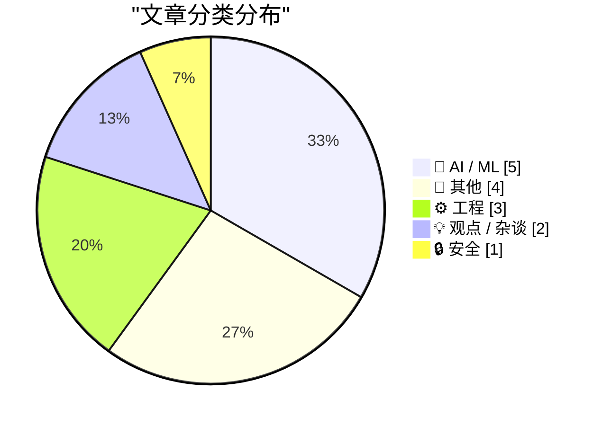
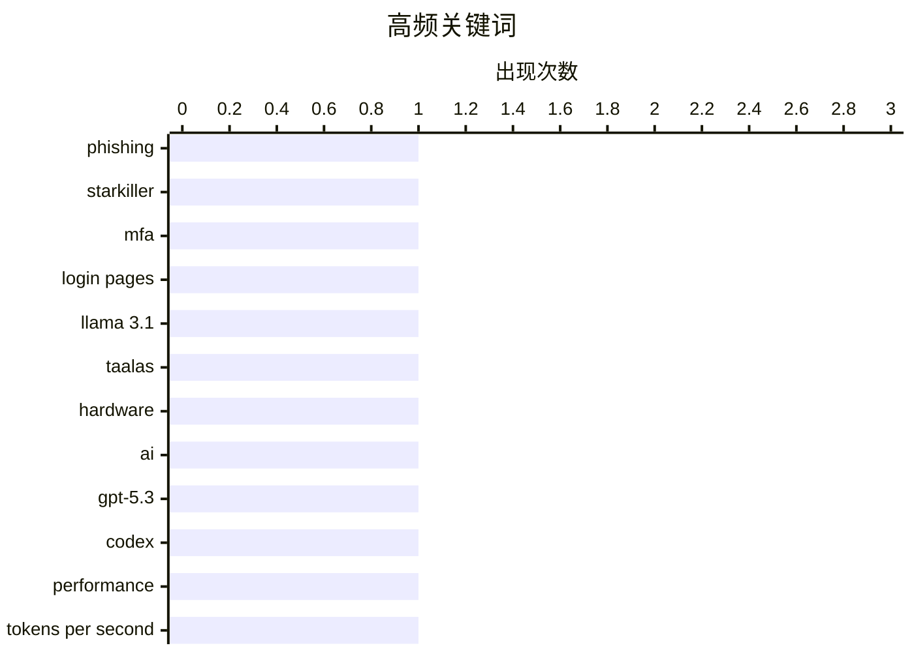

# 📰 AI 博客每日精选 — 2026-02-22

> 来自 Karpathy 推荐的 92 个顶级技术博客，AI 精选 Top 15

## 📝 今日看点

今日看点：AI模型推理速度持续突破，多家公司在硬件加速和prompt优化上取得显著进展。本地AI生态蓬勃发展，Hugging Face等平台积极推动。网络安全形势严峻，新型钓鱼攻击手段更加隐蔽，需警惕。

---

## 🏆 今日必读

🥇 **“星际杀手”钓鱼服务：代理真实登录页面和多因素认证**

[‘Starkiller’ Phishing Service Proxies Real Login Pages, MFA](https://krebsonsecurity.com/2026/02/starkiller-phishing-service-proxies-real-login-pages-mfa/) — krebsonsecurity.com · 1 天前 · 🔒 安全

> 传统的钓鱼网站通常是流行网站登录页面的静态副本，容易被反滥用组织和安全公司查封。而新型钓鱼即服务“星际杀手”通过伪装链接加载目标品牌的真实网站，充当目标和合法网站之间的中继，从而绕过这些陷阱。它会转发受害者的用户名、密码和多因素认证信息。这种隐蔽性使其更难被检测和取缔。

💡 **为什么值得读**: 了解新型钓鱼攻击手段如何规避传统防御，有助于提升安全意识和防御能力。

🏷️ phishing, Starkiller, MFA, login pages

🥈 **Taalas 以每秒 17,000 个 tokens 的速度服务 Llama 3.1 8B 模型**

[Taalas serves Llama 3.1 8B at 17,000 tokens/second](https://simonwillison.net/2026/Feb/20/taalas/#atom-everything) — simonwillison.net · 1 天前 · 🤖 AI / ML

> 加拿大硬件初创公司 Taalas 发布了其首款产品，这是一个 Llama 3.1 8B 模型的定制硬件实现，该模型可以惊人的速度运行，达到每秒 17,000 个 tokens。该硬件加速方案显著提升了 Llama 3.1 8B 的推理速度。这表明专用硬件在加速特定 LLM 模型方面具有巨大潜力。

💡 **为什么值得读**: 关注 AI 芯片领域的最新进展，了解专用硬件如何提升大语言模型的性能。

🏷️ Llama 3.1, Taalas, hardware, AI

🥉 **Thibault Sottiaux 引言**

[Quoting Thibault Sottiaux](https://simonwillison.net/2026/Feb/21/thibault-sottiaux/#atom-everything) — simonwillison.net · 23 小时前 · 🤖 AI / ML

> OpenAI 的 Thibault Sottiaux 宣布 GPT-5.3-Codex-Spark 的速度提升了 30%，目前服务速度超过每秒 1200 个 tokens。这一性能提升表明 OpenAI 在优化模型推理效率方面取得了显著进展。更快的模型服务速度可以降低延迟，提升用户体验。

💡 **为什么值得读**: 快速了解 OpenAI 最新模型的性能优化进展。

🏷️ GPT-5.3, Codex, performance, tokens per second

---

## 📊 数据概览

| 扫描源 | 抓取文章 | 时间范围 | 精选 |
|:---:|:---:|:---:|:---:|
| 82/92 | 2374 篇 → 23 篇 | 48h | **15 篇** |

### 分类分布



### 高频关键词



<details>
<summary>📈 纯文本关键词图（终端友好）</summary>

```
phishing    │ ████████████████████ 1
starkiller  │ ████████████████████ 1
mfa         │ ████████████████████ 1
login pages │ ████████████████████ 1
llama 3.1   │ ████████████████████ 1
taalas      │ ████████████████████ 1
hardware    │ ████████████████████ 1
ai          │ ████████████████████ 1
gpt-5.3     │ ████████████████████ 1
codex       │ ████████████████████ 1
```

</details>

### 🏷️ 话题标签

**phishing**(1) · **starkiller**(1) · **mfa**(1) · login pages(1) · llama 3.1(1) · taalas(1) · hardware(1) · ai(1) · gpt-5.3(1) · codex(1) · performance(1) · tokens per second(1) · ggml(1) · hugging face(1) · local ai(1) · georgi gerganov(1) · anthropic(1) · llm(1) · ai safety(1) · claude code(1)

---

## 🤖 AI / ML

### 1. Taalas 以每秒 17,000 个 tokens 的速度服务 Llama 3.1 8B 模型

[Taalas serves Llama 3.1 8B at 17,000 tokens/second](https://simonwillison.net/2026/Feb/20/taalas/#atom-everything) — **simonwillison.net** · 1 天前 · ⭐ 23/30

> 加拿大硬件初创公司 Taalas 发布了其首款产品，这是一个 Llama 3.1 8B 模型的定制硬件实现，该模型可以惊人的速度运行，达到每秒 17,000 个 tokens。该硬件加速方案显著提升了 Llama 3.1 8B 的推理速度。这表明专用硬件在加速特定 LLM 模型方面具有巨大潜力。

🏷️ Llama 3.1, Taalas, hardware, AI

---

### 2. Thibault Sottiaux 引言

[Quoting Thibault Sottiaux](https://simonwillison.net/2026/Feb/21/thibault-sottiaux/#atom-everything) — **simonwillison.net** · 23 小时前 · ⭐ 21/30

> OpenAI 的 Thibault Sottiaux 宣布 GPT-5.3-Codex-Spark 的速度提升了 30%，目前服务速度超过每秒 1200 个 tokens。这一性能提升表明 OpenAI 在优化模型推理效率方面取得了显著进展。更快的模型服务速度可以降低延迟，提升用户体验。

🏷️ GPT-5.3, Codex, performance, tokens per second

---

### 3. ggml.ai 加入 Hugging Face，以确保本地 AI 的长期发展

[ggml.ai joins Hugging Face to ensure the long-term progress of Local AI](https://simonwillison.net/2026/Feb/20/ggmlai-joins-hugging-face/#atom-everything) — **simonwillison.net** · 1 天前 · ⭐ 21/30

> ggml.ai 加入 Hugging Face，旨在推动本地 AI 的长期发展。Georgi Gerganov 创建的 llama.cpp 项目在本地模型领域产生了巨大影响，使得在消费级硬件上运行本地 LLM 成为可能。此次收购预示着 Hugging Face 将进一步加强其在本地 AI 领域的投入，并整合 ggml.ai 的技术优势。

🏷️ ggml, Hugging Face, Local AI, Georgi Gerganov

---

### 4. 高级：对 Anthropic 的差评指南

[Premium: The Hater's Guide to Anthropic](https://www.wheresyoured.at/premium-the-haters-guide-to-anthropic/) — **wheresyoured.at** · 1 天前 · ⭐ 21/30

> 本文以讽刺的口吻评价了 Anthropic 公司，该公司由前 OpenAI 研究人员于 2021 年成立，致力于构建“最安全”的大型语言模型。文章可能探讨了 Anthropic 在安全方面的策略和市场定位，以及作者对其的负面看法。

🏷️ Anthropic, LLM, AI safety

---

### 5. Thariq Shihipar 引言

[Quoting Thariq Shihipar](https://simonwillison.net/2026/Feb/20/thariq-shihipar/#atom-everything) — **simonwillison.net** · 1 天前 · ⭐ 20/30

> Claude Code 等长期运行的 Agentic 产品得益于 prompt caching 技术，该技术允许重复使用先前 roundtrip 的计算结果，从而显著降低延迟和成本。Claude Code 将整个 harness 构建在 prompt caching 之上，并监控 prompt cache 命中率，以优化成本和提升服务质量。

🏷️ Claude Code, prompt caching, agentic products

---

## 📝 其他

### 6. Andrej Karpathy 谈论“Claws”

[Andrej Karpathy talks about "Claws"](https://simonwillison.net/2026/Feb/21/claws/#atom-everything) — **simonwillison.net** · 1 天前 · ⭐ 19/30

> Andrej Karpathy 在 Twitter 上发表了一篇关于购买 Mac Mini 来研究 Claws 的迷你文章。他提到对运行 OpenClaw 持谨慎态度，但喜欢其概念，并认为 Claws 就像 LLM agents 一样，是 LLM 之上的一个新层。

🏷️ Mac Mini, Claws, Karpathy

---

### 7. OpenBenches 在 FOSDEM 大会上的闪电演讲

[OpenBenches at FOSDEM](https://shkspr.mobi/blog/2026/02/openbenches-at-fosdem/) — **shkspr.mobi** · 12 小时前 · ⭐ 17/30

> 作者在 FOSDEM 大会上进行了一次关于 OpenBenches 项目的闪电演讲。由于音视频团队的失误，视频缺失了一部分内容。作者利用自己的录音和 zipkid 拍摄的照片，使用 Flowblade 视频编辑器重新制作了视频。

🏷️ OpenBenches, FOSDEM, video editing

---

### 8. 阅读清单 02/21/26

[Reading List 02/21/26](https://www.construction-physics.com/p/reading-list-022126) — **construction-physics.com** · 11 小时前 · ⭐ 16/30

> 这是一篇关于建筑、基础设施和工业技术的每周新闻和链接汇总。

🏷️ buildings, infrastructure, technology

---

### 9. 2026/2027 西雅图交响乐团演出季一览

[The 2026/2027 Seattle Symphony subscription season at a glance](https://devblogs.microsoft.com/oldnewthing/20260220-01/?p=112076) — **devblogs.microsoft.com/oldnewthing** · 1 天前 · ⭐ 15/30

> 这是一篇关于 2026/2027 年西雅图交响乐团演出季的简要参考指南。

---

## ⚙️ 工程

### 10. 自定义对话框管理器关闭自身的方式：检测 ESC 键，首次（失败的）尝试

[Customizing the ways the dialog manager dismisses itself: Detecting the ESC key, first (failed) attempt](https://devblogs.microsoft.com/oldnewthing/20260220-00/?p=112074) — **devblogs.microsoft.com/oldnewthing** · 1 天前 · ⭐ 20/30

> 本文讨论了如何自定义对话框管理器关闭自身的方式，重点介绍了检测 ESC 键的首次尝试，但以失败告终。文章涉及异步键盘状态的嗅探。这篇博文可能深入探讨了 Windows API 编程中处理键盘事件的复杂性。

🏷️ dialog manager, ESC key, keyboard state

---

### 11. 计算大的、经过认证的斐波那契数

[Computing big, certified Fibonacci numbers](https://www.johndcook.com/blog/2026/02/21/big-certified-fibonacci/) — **johndcook.com** · 6 小时前 · ⭐ 19/30

> 本文探讨了计算大的斐波那契数以及创建证书来验证斐波那契数计算正确性的方法。文章介绍了一种不同的计算大斐波那契数的方法，该方法在计算过程中生成证书。这种方法可以确保计算结果的准确性。

🏷️ Fibonacci numbers, certificate, algorithm

---

### 12. 代码注释的换行

[Wrapping Code Comments](https://matklad.github.io/2026/02/21/wrapping-code-comments.html) — **matklad.github.io** · 1 天前 · ⭐ 15/30

> 作者分享了一个关于代码注释换行的发现。

🏷️ code comments, formatting

---

## 💡 观点 / 杂谈

### 13. 鲸落

[Whale Fall](https://nesbitt.io/2026/02/21/whale-fall.html) — **nesbitt.io** · 1 天前 · ⭐ 19/30

> 本文讨论了一个大型开源项目死亡时会发生什么。它可能探讨了开源项目生命周期的各个阶段，以及项目衰落的原因和影响。文章也可能分析了如何避免或减轻开源项目死亡带来的负面影响。

🏷️ open source, project death, community

---

### 14. 英伟达只是被邀请投资

[Nvidia was only invited to invest](https://idiallo.com/byte-size/nvidia-was-only-invited-to-invest?src=feed) — **idiallo.com** · 1 小时前 · ⭐ 16/30

> 文章讨论了英伟达 CEO 黄仁勋否认了之前关于英伟达、OpenAI 和 Oracle 之间循环投资的承诺。此前有图表显示，英伟达将投资 1000 亿美元给 OpenAI，OpenAI 再投资 3000 亿美元给 Oracle，Oracle 最终再投资回英伟达。黄仁勋表示，这并非一项承诺，只是被邀请投资。

🏷️ Nvidia, OpenAI, investment, AI companies

---

## 🔒 安全

### 15. “星际杀手”钓鱼服务：代理真实登录页面和多因素认证

[‘Starkiller’ Phishing Service Proxies Real Login Pages, MFA](https://krebsonsecurity.com/2026/02/starkiller-phishing-service-proxies-real-login-pages-mfa/) — **krebsonsecurity.com** · 1 天前 · ⭐ 25/30

> 传统的钓鱼网站通常是流行网站登录页面的静态副本，容易被反滥用组织和安全公司查封。而新型钓鱼即服务“星际杀手”通过伪装链接加载目标品牌的真实网站，充当目标和合法网站之间的中继，从而绕过这些陷阱。它会转发受害者的用户名、密码和多因素认证信息。这种隐蔽性使其更难被检测和取缔。

🏷️ phishing, Starkiller, MFA, login pages

---

*生成于 2026-02-22 01:11 | 扫描 82 源 → 获取 2374 篇 → 精选 15 篇*
*基于 [Hacker News Popularity Contest 2025](https://refactoringenglish.com/tools/hn-popularity/) RSS 源列表，由 [Andrej Karpathy](https://x.com/karpathy) 推荐*
*由「懂点儿AI」制作，欢迎关注同名微信公众号获取更多 AI 实用技巧 💡*
