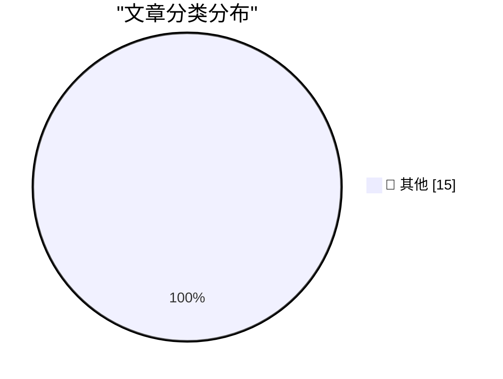

# 📰 AI 博客每日精选 — 2026-02-24

> 来自 Karpathy 推荐的 92 个顶级技术博客，AI 精选 Top 15

## 🏆 今日必读

🥇 **Ladybird adopts Rust, with help from AI**

[Ladybird adopts Rust, with help from AI](https://simonwillison.net/2026/Feb/23/ladybird-adopts-rust/#atom-everything) — simonwillison.net · 6 小时前 · 📝 其他

> Ladybird adopts Rust, with help from AI

🥈 **Writing about Agentic Engineering Patterns**

[Writing about Agentic Engineering Patterns](https://simonwillison.net/2026/Feb/23/agentic-engineering-patterns/#atom-everything) — simonwillison.net · 7 小时前 · 📝 其他

> Writing about Agentic Engineering Patterns

🥉 **Writing code is cheap now**

[Writing code is cheap now](https://simonwillison.net/guides/agentic-engineering-patterns/code-is-cheap/#atom-everything) — simonwillison.net · 9 小时前 · 📝 其他

> Writing code is cheap now

---

## 📊 数据概览

| 扫描源 | 抓取文章 | 时间范围 | 精选 |
|:---:|:---:|:---:|:---:|
| 84/92 | 2415 篇 → 41 篇 | 48h | **15 篇** |

### 分类分布

---

## 📝 其他

### 1. Ladybird adopts Rust, with help from AI

[Ladybird adopts Rust, with help from AI](https://simonwillison.net/2026/Feb/23/ladybird-adopts-rust/#atom-everything) — **simonwillison.net** · 6 小时前 · ⭐ 15/30

> Ladybird adopts Rust, with help from AI

---

### 2. Writing about Agentic Engineering Patterns

[Writing about Agentic Engineering Patterns](https://simonwillison.net/2026/Feb/23/agentic-engineering-patterns/#atom-everything) — **simonwillison.net** · 7 小时前 · ⭐ 15/30

> Writing about Agentic Engineering Patterns

---

### 3. Writing code is cheap now

[Writing code is cheap now](https://simonwillison.net/guides/agentic-engineering-patterns/code-is-cheap/#atom-everything) — **simonwillison.net** · 9 小时前 · ⭐ 15/30

> Writing code is cheap now

---

### 4. Quoting Paul Ford

[Quoting Paul Ford](https://simonwillison.net/2026/Feb/23/paul-ford/#atom-everything) — **simonwillison.net** · 9 小时前 · ⭐ 15/30

> Quoting Paul Ford

---

### 5. Reply guy

[Reply guy](https://simonwillison.net/2026/Feb/23/reply-guy/#atom-everything) — **simonwillison.net** · 12 小时前 · ⭐ 15/30

> Reply guy

---

### 6. Quoting Summer Yue

[Quoting Summer Yue](https://simonwillison.net/2026/Feb/23/summer-yue/#atom-everything) — **simonwillison.net** · 12 小时前 · ⭐ 15/30

> Quoting Summer Yue

---

### 7. Red/green TDD

[Red/green TDD](https://simonwillison.net/guides/agentic-engineering-patterns/red-green-tdd/#atom-everything) — **simonwillison.net** · 18 小时前 · ⭐ 15/30

> Red/green TDD

---

### 8. The Claude C Compiler: What It Reveals About the Future of Software

[The Claude C Compiler: What It Reveals About the Future of Software](https://simonwillison.net/2026/Feb/22/ccc/#atom-everything) — **simonwillison.net** · 1 天前 · ⭐ 15/30

> The Claude C Compiler: What It Reveals About the Future of Software

---

### 9. London Stock Exchange: Raspberry Pi Holdings plc

[London Stock Exchange: Raspberry Pi Holdings plc](https://simonwillison.net/2026/Feb/22/raspberry-pi-openclaw/#atom-everything) — **simonwillison.net** · 1 天前 · ⭐ 15/30

> London Stock Exchange: Raspberry Pi Holdings plc

---

### 10. How I think about Codex

[How I think about Codex](https://simonwillison.net/2026/Feb/22/how-i-think-about-codex/#atom-everything) — **simonwillison.net** · 1 天前 · ⭐ 15/30

> How I think about Codex

---

### 11. Insider amnesia

[Insider amnesia](https://seangoedecke.com/insider-amnesia/) — **seangoedecke.com** · 1 天前 · ⭐ 15/30

> Insider amnesia

---

### 12. What's so hard about continuous learning?

[What's so hard about continuous learning?](https://seangoedecke.com/continuous-learning/) — **seangoedecke.com** · 1 天前 · ⭐ 15/30

> What's so hard about continuous learning?

---

### 13. The Pants-Shitting Saga of Resizing Windows on MacOS 26 Tahoe Continues

[The Pants-Shitting Saga of Resizing Windows on MacOS 26 Tahoe Continues](https://noheger.at/blog/2026/02/12/resizing-windows-on-macos-tahoe-the-saga-continues/) — **daringfireball.net** · 50 分钟前 · ⭐ 15/30

> The Pants-Shitting Saga of Resizing Windows on MacOS 26 Tahoe Continues

---

### 14. NetNewsWire 7 for Mac

[NetNewsWire 7 for Mac](https://netnewswire.blog/2026/01/27/netnewswire-for-mac.html) — **daringfireball.net** · 3 小时前 · ⭐ 15/30

> NetNewsWire 7 for Mac

---

### 15. Trader Joe’s Dark Chocolate Peanut Butter Cups

[Trader Joe’s Dark Chocolate Peanut Butter Cups](https://www.traderjoes.com/home/products/pdp/dark-chocolate-peanut-butter-cups-094064) — **daringfireball.net** · 3 小时前 · ⭐ 15/30

> Trader Joe’s Dark Chocolate Peanut Butter Cups

---

*生成于 2026-02-24 01:21 | 扫描 84 源 → 获取 2415 篇 → 精选 15 篇*
*基于 [Hacker News Popularity Contest 2025](https://refactoringenglish.com/tools/hn-popularity/) RSS 源列表，由 [Andrej Karpathy](https://x.com/karpathy) 推荐*
*由「懂点儿AI」制作，欢迎关注同名微信公众号获取更多 AI 实用技巧 💡*
