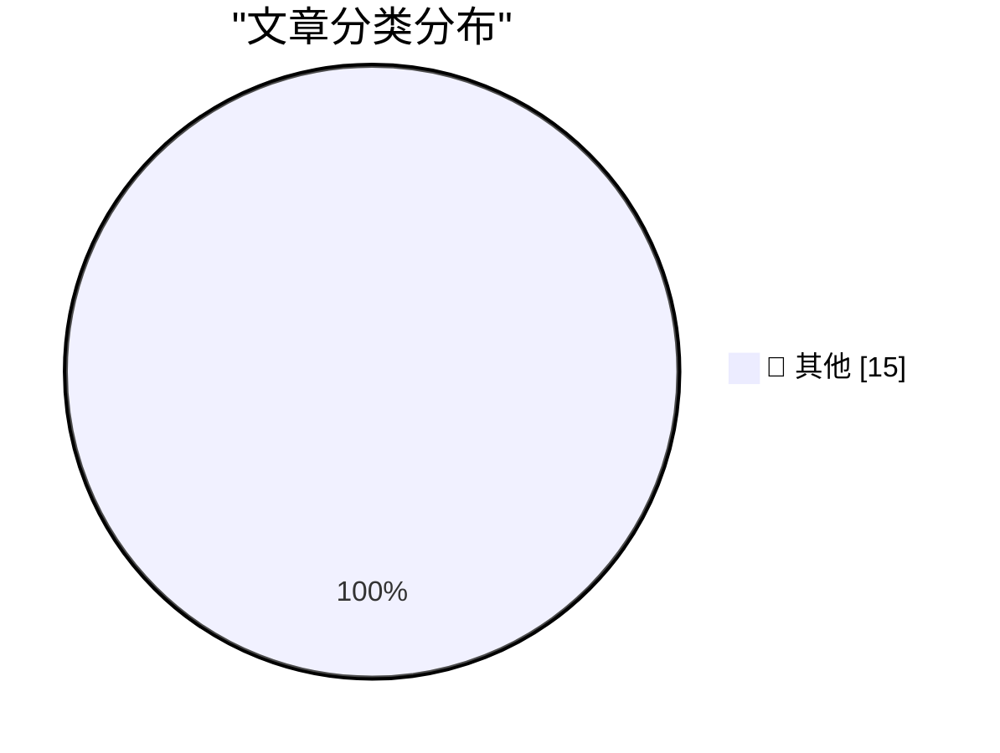

# 📰 AI 博客每日精选 — 2026-02-25

> 来自 Karpathy 推荐的 92 个顶级技术博客，AI 精选 Top 15

## 🏆 今日必读

🥇 **Linear walkthroughs**

[Linear walkthroughs](https://simonwillison.net/guides/agentic-engineering-patterns/linear-walkthroughs/#atom-everything) — simonwillison.net · 7 分钟前 · 📝 其他

> Linear walkthroughs

🥈 **go-size-analyzer**

[go-size-analyzer](https://simonwillison.net/2026/Feb/24/go-size-analyzer/#atom-everything) — simonwillison.net · 9 小时前 · 📝 其他

> go-size-analyzer

🥉 **First run the tests**

[First run the tests](https://simonwillison.net/guides/agentic-engineering-patterns/first-run-the-tests/#atom-everything) — simonwillison.net · 12 小时前 · 📝 其他

> First run the tests

---

## 📊 数据概览

| 扫描源 | 抓取文章 | 时间范围 | 精选 |
|:---:|:---:|:---:|:---:|
| 83/92 | 2405 篇 → 55 篇 | 48h | **15 篇** |

### 分类分布

---

## 📝 其他

### 1. Linear walkthroughs

[Linear walkthroughs](https://simonwillison.net/guides/agentic-engineering-patterns/linear-walkthroughs/#atom-everything) — **simonwillison.net** · 7 分钟前 · ⭐ 15/30

> Linear walkthroughs

---

### 2. go-size-analyzer

[go-size-analyzer](https://simonwillison.net/2026/Feb/24/go-size-analyzer/#atom-everything) — **simonwillison.net** · 9 小时前 · ⭐ 15/30

> go-size-analyzer

---

### 3. First run the tests

[First run the tests](https://simonwillison.net/guides/agentic-engineering-patterns/first-run-the-tests/#atom-everything) — **simonwillison.net** · 12 小时前 · ⭐ 15/30

> First run the tests

---

### 4. Ladybird adopts Rust, with help from AI

[Ladybird adopts Rust, with help from AI](https://simonwillison.net/2026/Feb/23/ladybird-adopts-rust/#atom-everything) — **simonwillison.net** · 1 天前 · ⭐ 15/30

> Ladybird adopts Rust, with help from AI

---

### 5. Writing about Agentic Engineering Patterns

[Writing about Agentic Engineering Patterns](https://simonwillison.net/2026/Feb/23/agentic-engineering-patterns/#atom-everything) — **simonwillison.net** · 1 天前 · ⭐ 15/30

> Writing about Agentic Engineering Patterns

---

### 6. Writing code is cheap now

[Writing code is cheap now](https://simonwillison.net/guides/agentic-engineering-patterns/code-is-cheap/#atom-everything) — **simonwillison.net** · 1 天前 · ⭐ 15/30

> Writing code is cheap now

---

### 7. Quoting Paul Ford

[Quoting Paul Ford](https://simonwillison.net/2026/Feb/23/paul-ford/#atom-everything) — **simonwillison.net** · 1 天前 · ⭐ 15/30

> Quoting Paul Ford

---

### 8. Reply guy

[Reply guy](https://simonwillison.net/2026/Feb/23/reply-guy/#atom-everything) — **simonwillison.net** · 1 天前 · ⭐ 15/30

> Reply guy

---

### 9. Quoting Summer Yue

[Quoting Summer Yue](https://simonwillison.net/2026/Feb/23/summer-yue/#atom-everything) — **simonwillison.net** · 1 天前 · ⭐ 15/30

> Quoting Summer Yue

---

### 10. Red/green TDD

[Red/green TDD](https://simonwillison.net/guides/agentic-engineering-patterns/red-green-tdd/#atom-everything) — **simonwillison.net** · 1 天前 · ⭐ 15/30

> Red/green TDD

---

### 11. [Sponsor] Hands-On Workshop: Fix It Faster — Crash Reporting, Tracing, and Logs for iOS in Sentry

[[Sponsor] Hands-On Workshop: Fix It Faster — Crash Reporting, Tracing, and Logs for iOS in Sentry](https://sentry.io/resources/ios-workshop-jan-2026/?utm_source=daringfireball&amp;utm_medium=paid-display&amp;utm_campaign=general-fy27q1-evergreen&amp;utm_content=static-ad-mobilerss-trysentry) — **daringfireball.net** · 14 分钟前 · ⭐ 15/30

> [Sponsor] Hands-On Workshop: Fix It Faster — Crash Reporting, Tracing, and Logs for iOS in Sentry

---

### 12. Upgrade: ‘The Shifting Sands of Liquid Glass’

[Upgrade: ‘The Shifting Sands of Liquid Glass’](https://www.relay.fm/upgrade/604) — **daringfireball.net** · 1 小时前 · ⭐ 15/30

> Upgrade: ‘The Shifting Sands of Liquid Glass’

---

### 13. Apple in 2025: The Six Colors Report Card

[Apple in 2025: The Six Colors Report Card](https://sixcolors.com/post/2026/02/2025reportcard/) — **daringfireball.net** · 3 小时前 · ⭐ 15/30

> Apple in 2025: The Six Colors Report Card

---

### 14. Apple Will Begin Manufacturing Mac Minis in Houston Later This Year

[Apple Will Begin Manufacturing Mac Minis in Houston Later This Year](https://www.apple.com/newsroom/2026/02/apple-accelerates-us-manufacturing-with-mac-mini-production/) — **daringfireball.net** · 5 小时前 · ⭐ 15/30

> Apple Will Begin Manufacturing Mac Minis in Houston Later This Year

---

### 15. PageMaker Pioneer Paul Brainerd Dies at 78

[PageMaker Pioneer Paul Brainerd Dies at 78](https://www.geekwire.com/2026/pagemaker-pioneer-paul-brainerd-1947-2026-aldus-founder-devoted-his-second-chapter-to-the-planet/) — **daringfireball.net** · 5 小时前 · ⭐ 15/30

> PageMaker Pioneer Paul Brainerd Dies at 78

---

*生成于 2026-02-25 01:14 | 扫描 83 源 → 获取 2405 篇 → 精选 15 篇*
*基于 [Hacker News Popularity Contest 2025](https://refactoringenglish.com/tools/hn-popularity/) RSS 源列表，由 [Andrej Karpathy](https://x.com/karpathy) 推荐*
*由「懂点儿AI」制作，欢迎关注同名微信公众号获取更多 AI 实用技巧 💡*
