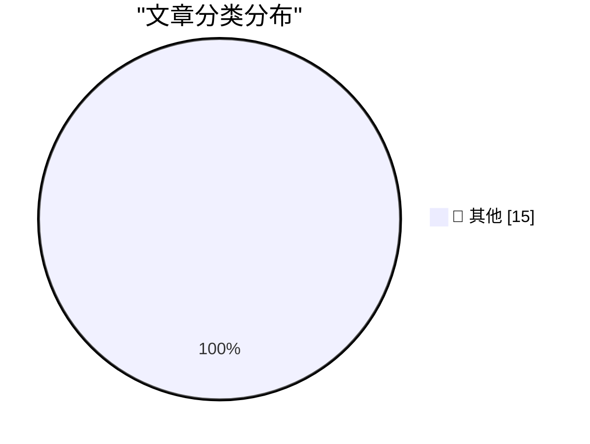

# 📰 AI 博客每日精选 — 2026-02-26

> 来自 Karpathy 推荐的 92 个顶级技术博客，AI 精选 Top 15

## 🏆 今日必读

🥇 **tldraw issue: Move tests to closed source repo**

[tldraw issue: Move tests to closed source repo](https://simonwillison.net/2026/Feb/25/closed-tests/#atom-everything) — simonwillison.net · 4 小时前 · 📝 其他

> tldraw issue: Move tests to closed source repo

🥈 **Claude Code Remote Control**

[Claude Code Remote Control](https://simonwillison.net/2026/Feb/25/claude-code-remote-control/#atom-everything) — simonwillison.net · 7 小时前 · 📝 其他

> Claude Code Remote Control

🥉 **I vibe coded my dream macOS presentation app**

[I vibe coded my dream macOS presentation app](https://simonwillison.net/2026/Feb/25/present/#atom-everything) — simonwillison.net · 8 小时前 · 📝 其他

> I vibe coded my dream macOS presentation app

---

## 📊 数据概览

| 扫描源 | 抓取文章 | 时间范围 | 精选 |
|:---:|:---:|:---:|:---:|
| 84/92 | 2415 篇 → 50 篇 | 48h | **15 篇** |

### 分类分布

---

## 📝 其他

### 1. tldraw issue: Move tests to closed source repo

[tldraw issue: Move tests to closed source repo](https://simonwillison.net/2026/Feb/25/closed-tests/#atom-everything) — **simonwillison.net** · 4 小时前 · ⭐ 15/30

> tldraw issue: Move tests to closed source repo

---

### 2. Claude Code Remote Control

[Claude Code Remote Control](https://simonwillison.net/2026/Feb/25/claude-code-remote-control/#atom-everything) — **simonwillison.net** · 7 小时前 · ⭐ 15/30

> Claude Code Remote Control

---

### 3. I vibe coded my dream macOS presentation app

[I vibe coded my dream macOS presentation app](https://simonwillison.net/2026/Feb/25/present/#atom-everything) — **simonwillison.net** · 8 小时前 · ⭐ 15/30

> I vibe coded my dream macOS presentation app

---

### 4. Quoting Kellan Elliott-McCrea

[Quoting Kellan Elliott-McCrea](https://simonwillison.net/2026/Feb/25/kellan-elliott-mccrea/#atom-everything) — **simonwillison.net** · 21 小时前 · ⭐ 15/30

> Quoting Kellan Elliott-McCrea

---

### 5. Linear walkthroughs

[Linear walkthroughs](https://simonwillison.net/guides/agentic-engineering-patterns/linear-walkthroughs/#atom-everything) — **simonwillison.net** · 1 天前 · ⭐ 15/30

> Linear walkthroughs

---

### 6. go-size-analyzer

[go-size-analyzer](https://simonwillison.net/2026/Feb/24/go-size-analyzer/#atom-everything) — **simonwillison.net** · 1 天前 · ⭐ 15/30

> go-size-analyzer

---

### 7. First run the tests

[First run the tests](https://simonwillison.net/guides/agentic-engineering-patterns/first-run-the-tests/#atom-everything) — **simonwillison.net** · 1 天前 · ⭐ 15/30

> First run the tests

---

### 8. ‘H-Bomb: A Frank Lloyd Wright Typographic Mystery’

[‘H-Bomb: A Frank Lloyd Wright Typographic Mystery’](https://www.inconspicuous.info/p/h-bomb-a-frank-lloyd-wright-typographic) — **daringfireball.net** · 1 小时前 · ⭐ 15/30

> ‘H-Bomb: A Frank Lloyd Wright Typographic Mystery’

---

### 9. Terry Godier: ‘Phantom Obligation’

[Terry Godier: ‘Phantom Obligation’](https://www.terrygodier.com/phantom-obligation) — **daringfireball.net** · 1 小时前 · ⭐ 15/30

> Terry Godier: ‘Phantom Obligation’

---

### 10. Bill Gates Apologizes to Foundation Staff Over Epstein Ties

[Bill Gates Apologizes to Foundation Staff Over Epstein Ties](https://www.wsj.com/articles/bill-gates-apologizes-to-foundation-staff-over-epstein-ties-67f39ef5) — **daringfireball.net** · 1 小时前 · ⭐ 15/30

> Bill Gates Apologizes to Foundation Staff Over Epstein Ties

---

### 11. Greg Knauss: ‘Lose Myself’

[Greg Knauss: ‘Lose Myself’](https://www.eod.com/blog/2026/02/lose-myself/) — **daringfireball.net** · 2 小时前 · ⭐ 15/30

> Greg Knauss: ‘Lose Myself’

---

### 12. The Talk Show: ‘Serious Opinionators’

[The Talk Show: ‘Serious Opinionators’](https://daringfireball.net/thetalkshow/2026/02/25/ep-441) — **daringfireball.net** · 2 小时前 · ⭐ 15/30

> The Talk Show: ‘Serious Opinionators’

---

### 13. Samsung Galaxy S26 Ultra’s Privacy Display

[Samsung Galaxy S26 Ultra’s Privacy Display](https://9to5google.com/2026/02/25/samsung-galaxy-s26-ultra-privacy-display-demo-hands-on/) — **daringfireball.net** · 4 小时前 · ⭐ 15/30

> Samsung Galaxy S26 Ultra’s Privacy Display

---

### 14. ★ My 2025 Apple Report Card

[★ My 2025 Apple Report Card](https://daringfireball.net/2026/02/my_2025_apple_report_card) — **daringfireball.net** · 8 小时前 · ⭐ 15/30

> ★ My 2025 Apple Report Card

---

### 15. Major Candy Brands Are Switching From Actual Chocolate to ‘Chocolatey Candy’ (Read: Brown Candle Wax)

[Major Candy Brands Are Switching From Actual Chocolate to ‘Chocolatey Candy’ (Read: Brown Candle Wax)](https://www.jezebel.com/fake-milk-chocolate-replacements-brands-reeses-hershey-ferrero-compound-coating-candy-climate-change) — **daringfireball.net** · 9 小时前 · ⭐ 15/30

> Major Candy Brands Are Switching From Actual Chocolate to ‘Chocolatey Candy’ (Read: Brown Candle Wax)

---

*生成于 2026-02-26 01:07 | 扫描 84 源 → 获取 2415 篇 → 精选 15 篇*
*基于 [Hacker News Popularity Contest 2025](https://refactoringenglish.com/tools/hn-popularity/) RSS 源列表，由 [Andrej Karpathy](https://x.com/karpathy) 推荐*
*由「懂点儿AI」制作，欢迎关注同名微信公众号获取更多 AI 实用技巧 💡*
