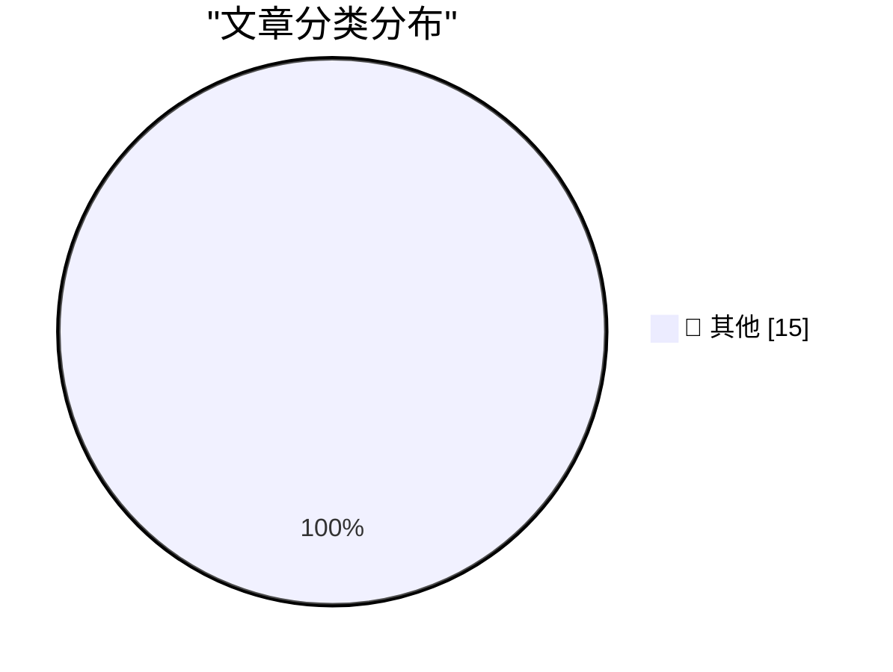

# 📰 AI 博客每日精选 — 2026-03-23

> 来自 Karpathy 推荐的 92 个顶级技术博客，AI 精选 Top 15

## 🏆 今日必读

🥇 **Experimenting with Starlette 1.0 with Claude skills**

[Experimenting with Starlette 1.0 with Claude skills](https://simonwillison.net/2026/Mar/22/starlette/#atom-everything) — simonwillison.net · 1 小时前 · 📝 其他

> Experimenting with Starlette 1.0 with Claude skills

🥈 **Profiling Hacker News users based on their comments**

[Profiling Hacker News users based on their comments](https://simonwillison.net/2026/Mar/21/profiling-hacker-news-users/#atom-everything) — simonwillison.net · 1 天前 · 📝 其他

> Profiling Hacker News users based on their comments

🥉 **Using Git with coding agents**

[Using Git with coding agents](https://simonwillison.net/guides/agentic-engineering-patterns/using-git-with-coding-agents/#atom-everything) — simonwillison.net · 1 天前 · 📝 其他

> Using Git with coding agents

---

## 📊 数据概览

| 扫描源 | 抓取文章 | 时间范围 | 精选 |
|:---:|:---:|:---:|:---:|
| 84/92 | 2435 篇 → 16 篇 | 48h | **15 篇** |

### 分类分布

---

## 📝 其他

### 1. Experimenting with Starlette 1.0 with Claude skills

[Experimenting with Starlette 1.0 with Claude skills](https://simonwillison.net/2026/Mar/22/starlette/#atom-everything) — **simonwillison.net** · 1 小时前 · ⭐ 15/30

> Experimenting with Starlette 1.0 with Claude skills

---

### 2. Profiling Hacker News users based on their comments

[Profiling Hacker News users based on their comments](https://simonwillison.net/2026/Mar/21/profiling-hacker-news-users/#atom-everything) — **simonwillison.net** · 1 天前 · ⭐ 15/30

> Profiling Hacker News users based on their comments

---

### 3. Using Git with coding agents

[Using Git with coding agents](https://simonwillison.net/guides/agentic-engineering-patterns/using-git-with-coding-agents/#atom-everything) — **simonwillison.net** · 1 天前 · ⭐ 15/30

> Using Git with coding agents

---

### 4. Mux — Video API for Developers

[Mux — Video API for Developers](https://www.mux.com/?utm_campaign=fireball&amp;utm_source=DF) — **daringfireball.net** · 7 小时前 · ⭐ 15/30

> Mux — Video API for Developers

---

### 5. ‘Good, I’m Glad He’s Dead.’

[‘Good, I’m Glad He’s Dead.’](https://truthsocial.com/@realDonaldTrump/116268334535345382) — **daringfireball.net** · 7 小时前 · ⭐ 15/30

> ‘Good, I’m Glad He’s Dead.’

---

### 6. Half a Gigabyte of Ads

[Half a Gigabyte of Ads](https://stuartbreckenridge.net/2026-03-19-pc-gamer-recommends-rss-readers-in-a-37mb-article/) — **daringfireball.net** · 8 小时前 · ⭐ 15/30

> Half a Gigabyte of Ads

---

### 7. Reuters: ‘Amazon Plans Smartphone Comeback More Than a Decade After Fire Phone Flop’

[Reuters: ‘Amazon Plans Smartphone Comeback More Than a Decade After Fire Phone Flop’](https://www.reuters.com/technology/amazon-plans-smartphone-comeback-more-than-decade-after-fire-phone-flop-2026-03-20/) — **daringfireball.net** · 1 天前 · ⭐ 15/30

> Reuters: ‘Amazon Plans Smartphone Comeback More Than a Decade After Fire Phone Flop’

---

### 8. Bored of eating your own dogfood? Try smelling your own farts!

[Bored of eating your own dogfood? Try smelling your own farts!](https://shkspr.mobi/blog/2026/03/bored-of-eating-your-own-dogfood-try-smelling-your-own-farts/) — **shkspr.mobi** · 12 小时前 · ⭐ 15/30

> Bored of eating your own dogfood? Try smelling your own farts!

---

### 9. All tests pass: a short story

[All tests pass: a short story](https://evanhahn.com/all-tests-pass-a-short-story/) — **evanhahn.com** · 1 天前 · ⭐ 15/30

> All tests pass: a short story

---

### 10. Little web app to pick a random programming language

[Little web app to pick a random programming language](https://evanhahn.com/random-programming-language/) — **evanhahn.com** · 1 天前 · ⭐ 15/30

> Little web app to pick a random programming language

---

### 11. "Collaboration" is bullshit.

["Collaboration" is bullshit.](https://www.joanwestenberg.com/collaboration-is-bullshit/) — **joanwestenberg.com** · 1 小时前 · ⭐ 15/30

> "Collaboration" is bullshit.

---

### 12. How to Attract AI Bots to Your Open Source Project

[How to Attract AI Bots to Your Open Source Project](https://nesbitt.io/2026/03/21/how-to-attract-ai-bots-to-your-open-source-project.html) — **nesbitt.io** · 1 天前 · ⭐ 15/30

> How to Attract AI Bots to Your Open Source Project

---

### 13. Reading List 03/21/26

[Reading List 03/21/26](https://www.construction-physics.com/p/reading-list-032126) — **construction-physics.com** · 1 天前 · ⭐ 15/30

> Reading List 03/21/26

---

### 14. Hitachi Ltd, Part I

[Hitachi Ltd, Part I](https://www.abortretry.fail/p/hitachi-ltd-part-i) — **abortretry.fail** · 1 小时前 · ⭐ 15/30

> Hitachi Ltd, Part I

---

### 15. Refurb weekend double header: Alpha Micro AM-1000E and AM-1200

[Refurb weekend double header: Alpha Micro AM-1000E and AM-1200](https://oldvcr.blogspot.com/feeds/7375694156480962258/comments/default) — **oldvcr.blogspot.com** · 22 小时前 · ⭐ 15/30

> Refurb weekend double header: Alpha Micro AM-1000E and AM-1200

---

*生成于 2026-03-23 01:14 | 扫描 84 源 → 获取 2435 篇 → 精选 15 篇*
*基于 [Hacker News Popularity Contest 2025](https://refactoringenglish.com/tools/hn-popularity/) RSS 源列表，由 [Andrej Karpathy](https://x.com/karpathy) 推荐*
*由「懂点儿AI」制作，欢迎关注同名微信公众号获取更多 AI 实用技巧 💡*
