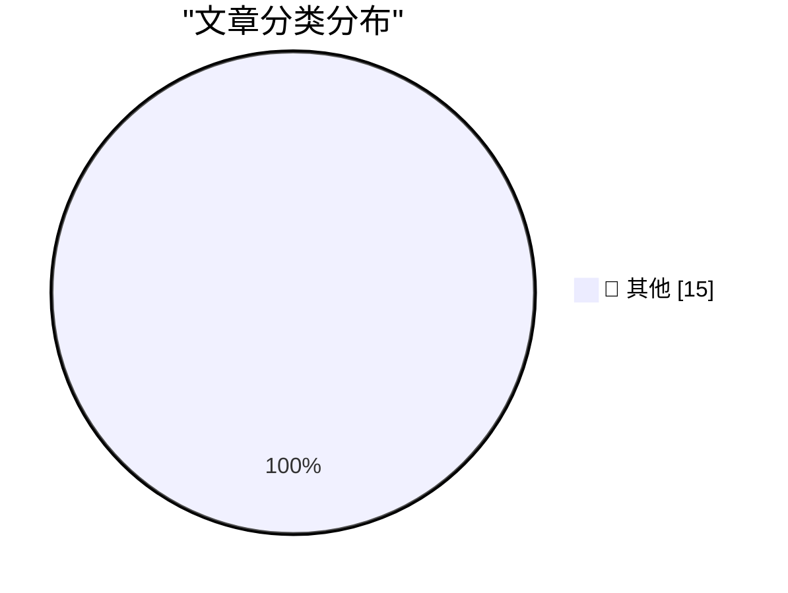

# 📰 AI 博客每日精选 — 2026-04-01

> 来自 Karpathy 推荐的 92 个顶级技术博客，AI 精选 Top 15

## 🏆 今日必读

🥇 **Supply Chain Attack on Axios Pulls Malicious Dependency from npm**

[Supply Chain Attack on Axios Pulls Malicious Dependency from npm](https://simonwillison.net/2026/Mar/31/supply-chain-attack-on-axios/#atom-everything) — simonwillison.net · 1 小时前 · 📝 其他

> Supply Chain Attack on Axios Pulls Malicious Dependency from npm

🥈 **datasette-llm 0.1a4**

[datasette-llm 0.1a4](https://simonwillison.net/2026/Mar/31/datasette-llm/#atom-everything) — simonwillison.net · 4 小时前 · 📝 其他

> datasette-llm 0.1a4

🥉 **llm-all-models-async 0.1**

[llm-all-models-async 0.1](https://simonwillison.net/2026/Mar/31/llm-all-models-async/#atom-everything) — simonwillison.net · 4 小时前 · 📝 其他

> llm-all-models-async 0.1

---

## 📊 数据概览

| 扫描源 | 抓取文章 | 时间范围 | 精选 |
|:---:|:---:|:---:|:---:|
| 80/92 | 2364 篇 → 48 篇 | 48h | **15 篇** |

### 分类分布

---

## 📝 其他

### 1. Supply Chain Attack on Axios Pulls Malicious Dependency from npm

[Supply Chain Attack on Axios Pulls Malicious Dependency from npm](https://simonwillison.net/2026/Mar/31/supply-chain-attack-on-axios/#atom-everything) — **simonwillison.net** · 1 小时前 · ⭐ 15/30

> Supply Chain Attack on Axios Pulls Malicious Dependency from npm

---

### 2. datasette-llm 0.1a4

[datasette-llm 0.1a4](https://simonwillison.net/2026/Mar/31/datasette-llm/#atom-everything) — **simonwillison.net** · 4 小时前 · ⭐ 15/30

> datasette-llm 0.1a4

---

### 3. llm-all-models-async 0.1

[llm-all-models-async 0.1](https://simonwillison.net/2026/Mar/31/llm-all-models-async/#atom-everything) — **simonwillison.net** · 4 小时前 · ⭐ 15/30

> llm-all-models-async 0.1

---

### 4. llm 0.30

[llm 0.30](https://simonwillison.net/2026/Mar/31/llm/#atom-everything) — **simonwillison.net** · 4 小时前 · ⭐ 15/30

> llm 0.30

---

### 5. llm-echo 0.4

[llm-echo 0.4](https://simonwillison.net/2026/Mar/31/llm-echo/#atom-everything) — **simonwillison.net** · 8 小时前 · ⭐ 15/30

> llm-echo 0.4

---

### 6. llm-echo 0.3

[llm-echo 0.3](https://simonwillison.net/2026/Mar/31/llm-echo-2/#atom-everything) — **simonwillison.net** · 9 小时前 · ⭐ 15/30

> llm-echo 0.3

---

### 7. datasette-files 0.1a3

[datasette-files 0.1a3](https://simonwillison.net/2026/Mar/30/datasette-files/#atom-everything) — **simonwillison.net** · 1 天前 · ⭐ 15/30

> datasette-files 0.1a3

---

### 8. Quoting Georgi Gerganov

[Quoting Georgi Gerganov](https://simonwillison.net/2026/Mar/30/georgi-gerganov/#atom-everything) — **simonwillison.net** · 1 天前 · ⭐ 15/30

> Quoting Georgi Gerganov

---

### 9. datasette-llm 0.1a3

[datasette-llm 0.1a3](https://simonwillison.net/2026/Mar/30/datasette-llm/#atom-everything) — **simonwillison.net** · 1 天前 · ⭐ 15/30

> datasette-llm 0.1a3

---

### 10. Mr. Chatterbox is a (weak) Victorian-era ethically trained model you can run on your own computer

[Mr. Chatterbox is a (weak) Victorian-era ethically trained model you can run on your own computer](https://simonwillison.net/2026/Mar/30/mr-chatterbox/#atom-everything) — **simonwillison.net** · 1 天前 · ⭐ 15/30

> Mr. Chatterbox is a (weak) Victorian-era ethically trained model you can run on your own computer

---

### 11. llm-mrchatterbox 0.1

[llm-mrchatterbox 0.1](https://simonwillison.net/2026/Mar/30/llm-mrchatterbox-2/#atom-everything) — **simonwillison.net** · 1 天前 · ⭐ 15/30

> llm-mrchatterbox 0.1

---

### 12. Business Insider Profiles Fidji Simo, OpenAI’s ‘CEO of Applications’

[Business Insider Profiles Fidji Simo, OpenAI’s ‘CEO of Applications’](https://www.businessinsider.com/fidji-simo-openai-product-research-profitability-profile-2026-3) — **daringfireball.net** · 2 小时前 · ⭐ 15/30

> Business Insider Profiles Fidji Simo, OpenAI’s ‘CEO of Applications’

---

### 13. RAM Is the New Bearer Bond

[RAM Is the New Bearer Bond](https://www.theatlantic.com/technology/2026/03/laptop-electronics-ram-ai-tax/686628/) — **daringfireball.net** · 3 小时前 · ⭐ 15/30

> RAM Is the New Bearer Bond

---

### 14. Jensen Huang Doesn’t Smell Anything

[Jensen Huang Doesn’t Smell Anything](https://bsky.app/profile/carnage4life.bsky.social/post/3mhnqozt7fs2n) — **daringfireball.net** · 9 小时前 · ⭐ 15/30

> Jensen Huang Doesn’t Smell Anything

---

### 15. Appointees to Trump’s Council of Advisors on Science and Technology

[Appointees to Trump’s Council of Advisors on Science and Technology](https://www.whitehouse.gov/releases/2026/03/president-trump-announces-appointments-to-presidents-council-of-advisors-on-science-and-technology/) — **daringfireball.net** · 9 小时前 · ⭐ 15/30

> Appointees to Trump’s Council of Advisors on Science and Technology

---

*生成于 2026-04-01 01:26 | 扫描 80 源 → 获取 2364 篇 → 精选 15 篇*
*基于 [Hacker News Popularity Contest 2025](https://refactoringenglish.com/tools/hn-popularity/) RSS 源列表，由 [Andrej Karpathy](https://x.com/karpathy) 推荐*
*由「懂点儿AI」制作，欢迎关注同名微信公众号获取更多 AI 实用技巧 💡*
