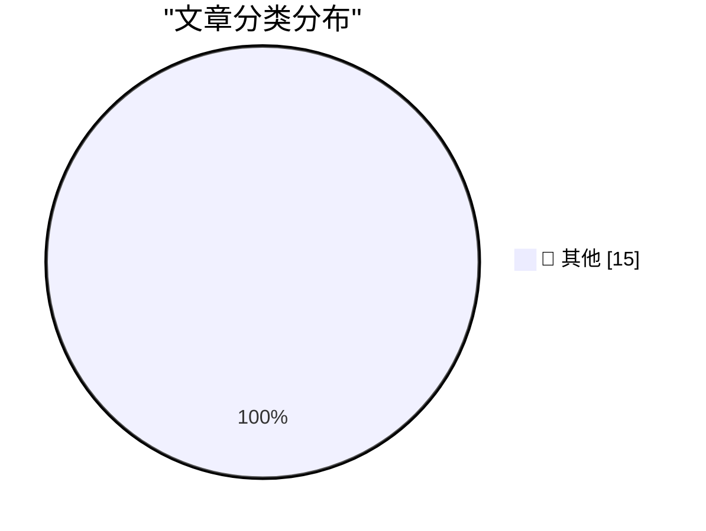

# 📰 AI 博客每日精选 — 2026-04-06

> 来自 Karpathy 推荐的 92 个顶级技术博客，AI 精选 Top 15

## 🏆 今日必读

🥇 **Eight years of wanting, three months of building with AI**

[Eight years of wanting, three months of building with AI](https://simonwillison.net/2026/Apr/5/building-with-ai/#atom-everything) — simonwillison.net · 1 小时前 · 📝 其他

> Eight years of wanting, three months of building with AI

🥈 **Quoting Chengpeng Mou**

[Quoting Chengpeng Mou](https://simonwillison.net/2026/Apr/5/chengpeng-mou/#atom-everything) — simonwillison.net · 3 小时前 · 📝 其他

> Quoting Chengpeng Mou

🥉 **Syntaqlite Playground**

[Syntaqlite Playground](https://simonwillison.net/2026/Apr/5/syntaqlite/#atom-everything) — simonwillison.net · 5 小时前 · 📝 其他

> Syntaqlite Playground

---

## 📊 数据概览

| 扫描源 | 抓取文章 | 时间范围 | 精选 |
|:---:|:---:|:---:|:---:|
| 83/92 | 2418 篇 → 23 篇 | 48h | **15 篇** |

### 分类分布

---

## 📝 其他

### 1. Eight years of wanting, three months of building with AI

[Eight years of wanting, three months of building with AI](https://simonwillison.net/2026/Apr/5/building-with-ai/#atom-everything) — **simonwillison.net** · 1 小时前 · ⭐ 15/30

> Eight years of wanting, three months of building with AI

---

### 2. Quoting Chengpeng Mou

[Quoting Chengpeng Mou](https://simonwillison.net/2026/Apr/5/chengpeng-mou/#atom-everything) — **simonwillison.net** · 3 小时前 · ⭐ 15/30

> Quoting Chengpeng Mou

---

### 3. Syntaqlite Playground

[Syntaqlite Playground](https://simonwillison.net/2026/Apr/5/syntaqlite/#atom-everything) — **simonwillison.net** · 5 小时前 · ⭐ 15/30

> Syntaqlite Playground

---

### 4. scan-for-secrets 0.2

[scan-for-secrets 0.2](https://simonwillison.net/2026/Apr/5/scan-for-secrets/#atom-everything) — **simonwillison.net** · 21 小时前 · ⭐ 15/30

> scan-for-secrets 0.2

---

### 5. scan-for-secrets 0.1.1

[scan-for-secrets 0.1.1](https://simonwillison.net/2026/Apr/5/scan-for-secrets-2/#atom-everything) — **simonwillison.net** · 21 小时前 · ⭐ 15/30

> scan-for-secrets 0.1.1

---

### 6. scan-for-secrets 0.1

[scan-for-secrets 0.1](https://simonwillison.net/2026/Apr/5/scan-for-secrets-3/#atom-everything) — **simonwillison.net** · 21 小时前 · ⭐ 15/30

> scan-for-secrets 0.1

---

### 7. research-llm-apis 2026-04-04

[research-llm-apis 2026-04-04](https://simonwillison.net/2026/Apr/5/research-llm-apis/#atom-everything) — **simonwillison.net** · 1 天前 · ⭐ 15/30

> research-llm-apis 2026-04-04

---

### 8. Quoting Kyle Daigle

[Quoting Kyle Daigle](https://simonwillison.net/2026/Apr/4/kyle-daigle/#atom-everything) — **simonwillison.net** · 1 天前 · ⭐ 15/30

> Quoting Kyle Daigle

---

### 9. An Easter Morning Message of Hope From the Winner of the FIFA Peace Prize

[An Easter Morning Message of Hope From the Winner of the FIFA Peace Prize](https://truthsocial.com/@realDonaldTrump/posts/116351998782539414) — **daringfireball.net** · 9 小时前 · ⭐ 15/30

> An Easter Morning Message of Hope From the Winner of the FIFA Peace Prize

---

### 10. Material Security

[Material Security](https://material.security/lp-cloud-office-security?utm_source=third-party&amp;utm_medium=email&amp;utm_campaign=20260330-daringfireball) — **daringfireball.net** · 1 天前 · ⭐ 15/30

> Material Security

---

### 11. Sponsorship Openings for Daring Fireball

[Sponsorship Openings for Daring Fireball](https://daringfireball.net/feeds/sponsors/) — **daringfireball.net** · 1 天前 · ⭐ 15/30

> Sponsorship Openings for Daring Fireball

---

### 12. iOS 26 Feels Faster Than iOS 18

[iOS 26 Feels Faster Than iOS 18](https://daringfireball.net/linked/2026/04/03/ios-18-update-for-holdouts) — **daringfireball.net** · 1 天前 · ⭐ 15/30

> iOS 26 Feels Faster Than iOS 18

---

### 13. Class Action Lawsuit Says Perplexity’s ‘Incognito Mode’ Is a ‘Sham’

[Class Action Lawsuit Says Perplexity’s ‘Incognito Mode’ Is a ‘Sham’](https://arstechnica.com/tech-policy/2026/04/perplexitys-incognito-mode-is-a-sham-lawsuit-says/) — **daringfireball.net** · 1 天前 · ⭐ 15/30

> Class Action Lawsuit Says Perplexity’s ‘Incognito Mode’ Is a ‘Sham’

---

### 14. It's not that deep

[It's not that deep](https://idiallo.com/blog/its-not-that-deep?src=feed) — **idiallo.com** · 17 小时前 · ⭐ 15/30

> It's not that deep

---

### 15. Pluralistic: EU ready to cave to Trump on tech (04 Apr 2026)

[Pluralistic: EU ready to cave to Trump on tech (04 Apr 2026)](https://pluralistic.net/2026/04/04/digital-subjugation/) — **pluralistic.net** · 1 天前 · ⭐ 15/30

> Pluralistic: EU ready to cave to Trump on tech (04 Apr 2026)

---

*生成于 2026-04-06 01:22 | 扫描 83 源 → 获取 2418 篇 → 精选 15 篇*
*基于 [Hacker News Popularity Contest 2025](https://refactoringenglish.com/tools/hn-popularity/) RSS 源列表，由 [Andrej Karpathy](https://x.com/karpathy) 推荐*
*由「懂点儿AI」制作，欢迎关注同名微信公众号获取更多 AI 实用技巧 💡*
