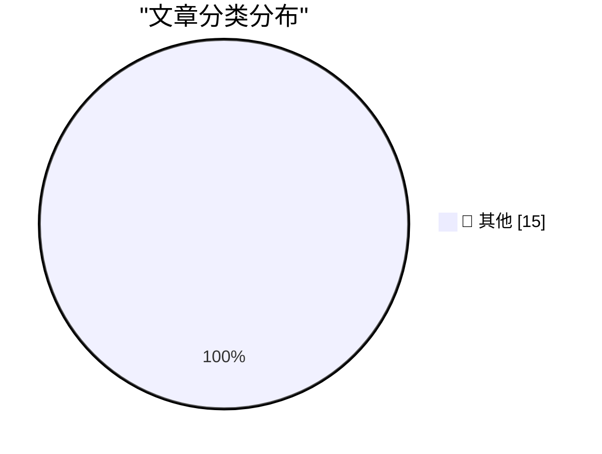

# 📰 AI 博客每日精选 — 2026-04-08

> 来自 Karpathy 推荐的 92 个顶级技术博客，AI 精选 Top 15

## 🏆 今日必读

🥇 **GLM-5.1: Towards Long-Horizon Tasks**

[GLM-5.1: Towards Long-Horizon Tasks](https://simonwillison.net/2026/Apr/7/glm-51/#atom-everything) — simonwillison.net · 3 小时前 · 📝 其他

> GLM-5.1: Towards Long-Horizon Tasks

🥈 **Anthropic's Project Glasswing - restricting Claude Mythos to security researchers - sounds necessary to me**

[Anthropic's Project Glasswing - restricting Claude Mythos to security researchers - sounds necessary to me](https://simonwillison.net/2026/Apr/7/project-glasswing/#atom-everything) — simonwillison.net · 4 小时前 · 📝 其他

> Anthropic's Project Glasswing - restricting Claude Mythos to security researchers - sounds necessary to me

🥉 **SQLite WAL Mode Across Docker Containers Sharing a Volume**

[SQLite WAL Mode Across Docker Containers Sharing a Volume](https://simonwillison.net/2026/Apr/7/sqlite-wal-docker-containers/#atom-everything) — simonwillison.net · 9 小时前 · 📝 其他

> SQLite WAL Mode Across Docker Containers Sharing a Volume

---

## 📊 数据概览

| 扫描源 | 抓取文章 | 时间范围 | 精选 |
|:---:|:---:|:---:|:---:|
| 81/92 | 2379 篇 → 39 篇 | 48h | **15 篇** |

### 分类分布

---

## 📝 其他

### 1. GLM-5.1: Towards Long-Horizon Tasks

[GLM-5.1: Towards Long-Horizon Tasks](https://simonwillison.net/2026/Apr/7/glm-51/#atom-everything) — **simonwillison.net** · 3 小时前 · ⭐ 15/30

> GLM-5.1: Towards Long-Horizon Tasks

---

### 2. Anthropic's Project Glasswing - restricting Claude Mythos to security researchers - sounds necessary to me

[Anthropic's Project Glasswing - restricting Claude Mythos to security researchers - sounds necessary to me](https://simonwillison.net/2026/Apr/7/project-glasswing/#atom-everything) — **simonwillison.net** · 4 小时前 · ⭐ 15/30

> Anthropic's Project Glasswing - restricting Claude Mythos to security researchers - sounds necessary to me

---

### 3. SQLite WAL Mode Across Docker Containers Sharing a Volume

[SQLite WAL Mode Across Docker Containers Sharing a Volume](https://simonwillison.net/2026/Apr/7/sqlite-wal-docker-containers/#atom-everything) — **simonwillison.net** · 9 小时前 · ⭐ 15/30

> SQLite WAL Mode Across Docker Containers Sharing a Volume

---

### 4. Google AI Edge Gallery

[Google AI Edge Gallery](https://simonwillison.net/2026/Apr/6/google-ai-edge-gallery/#atom-everything) — **simonwillison.net** · 1 天前 · ⭐ 15/30

> Google AI Edge Gallery

---

### 5. datasette-ports 0.2

[datasette-ports 0.2](https://simonwillison.net/2026/Apr/6/datasette-ports-2/#atom-everything) — **simonwillison.net** · 1 天前 · ⭐ 15/30

> datasette-ports 0.2

---

### 6. scan-for-secrets 0.3

[scan-for-secrets 0.3](https://simonwillison.net/2026/Apr/6/scan-for-secrets/#atom-everything) — **simonwillison.net** · 1 天前 · ⭐ 15/30

> scan-for-secrets 0.3

---

### 7. Cleanup Claude Code Paste

[Cleanup Claude Code Paste](https://simonwillison.net/2026/Apr/6/cleanup-claude-code-paste/#atom-everything) — **simonwillison.net** · 1 天前 · ⭐ 15/30

> Cleanup Claude Code Paste

---

### 8. Russia Hacked Routers to Steal Microsoft Office Tokens

[Russia Hacked Routers to Steal Microsoft Office Tokens](https://krebsonsecurity.com/2026/04/russia-hacked-routers-to-steal-microsoft-office-tokens/) — **krebsonsecurity.com** · 8 小时前 · ⭐ 15/30

> Russia Hacked Routers to Steal Microsoft Office Tokens

---

### 9. Germany Doxes “UNKN,” Head of RU Ransomware Gangs REvil, GandCrab

[Germany Doxes “UNKN,” Head of RU Ransomware Gangs REvil, GandCrab](https://krebsonsecurity.com/2026/04/germany-doxes-unkn-head-of-ru-ransomware-gangs-revil-gandcrab/) — **krebsonsecurity.com** · 1 天前 · ⭐ 15/30

> Germany Doxes “UNKN,” Head of RU Ransomware Gangs REvil, GandCrab

---

### 10. Solar Eclipse From the Far Side of the Moon

[Solar Eclipse From the Far Side of the Moon](https://kottke.org/26/04/solar-eclipse-far-side-of-the-moon) — **daringfireball.net** · 2 小时前 · ⭐ 15/30

> Solar Eclipse From the Far Side of the Moon

---

### 11. Sam Altman, in a Video Released by OpenAI, Apparently Thinks AGI Is Going to Hit Society Like a Once-a-Century Pandemic

[Sam Altman, in a Video Released by OpenAI, Apparently Thinks AGI Is Going to Hit Society Like a Once-a-Century Pandemic](https://x.com/OpenAINewsroom/status/2041618671236469200?s=20) — **daringfireball.net** · 2 小时前 · ⭐ 15/30

> Sam Altman, in a Video Released by OpenAI, Apparently Thinks AGI Is Going to Hit Society Like a Once-a-Century Pandemic

---

### 12. ★ OpenAI Announces $122 Billion Additional ‘Committed Capital’, and Announces Their ‘Superapp’ Plan for the Future

[★ OpenAI Announces $122 Billion Additional ‘Committed Capital’, and Announces Their ‘Superapp’ Plan for the Future](https://daringfireball.net/2026/04/openai_future) — **daringfireball.net** · 3 小时前 · ⭐ 15/30

> ★ OpenAI Announces $122 Billion Additional ‘Committed Capital’, and Announces Their ‘Superapp’ Plan for the Future

---

### 13. Om Malik and Ben Thompson on OpenAI Buying TBPN

[Om Malik and Ben Thompson on OpenAI Buying TBPN](https://om.co/2026/04/02/openai-masters-of-agitprop-2-0/) — **daringfireball.net** · 8 小时前 · ⭐ 15/30

> Om Malik and Ben Thompson on OpenAI Buying TBPN

---

### 14. Flighty Airports Meltdown Map

[Flighty Airports Meltdown Map](https://flighty.com/airports) — **daringfireball.net** · 8 小时前 · ⭐ 15/30

> Flighty Airports Meltdown Map

---

### 15. The Data Drop: Every iPhone

[The Data Drop: Every iPhone](https://sheets.works/data-viz/every-iphone) — **daringfireball.net** · 8 小时前 · ⭐ 15/30

> The Data Drop: Every iPhone

---

*生成于 2026-04-08 01:21 | 扫描 81 源 → 获取 2379 篇 → 精选 15 篇*
*基于 [Hacker News Popularity Contest 2025](https://refactoringenglish.com/tools/hn-popularity/) RSS 源列表，由 [Andrej Karpathy](https://x.com/karpathy) 推荐*
*由「懂点儿AI」制作，欢迎关注同名微信公众号获取更多 AI 实用技巧 💡*
