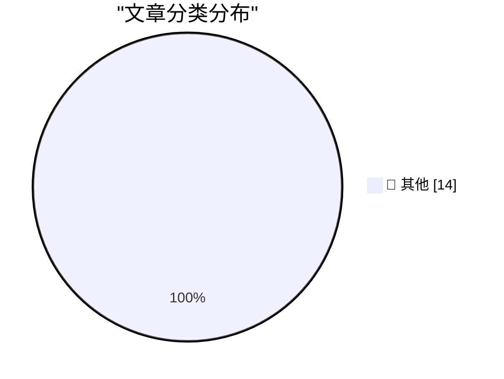

# 📰 AI 博客每日精选 — 2026-04-13

> 来自 Karpathy 推荐的 92 个顶级技术博客，AI 精选 Top 14

## 🏆 今日必读

🥇 **Gemma 4 audio with MLX**

[Gemma 4 audio with MLX](https://simonwillison.net/2026/Apr/12/mlx-audio/#atom-everything) — simonwillison.net · 1 小时前 · 📝 其他

> Gemma 4 audio with MLX

🥈 **SQLite 3.53.0**

[SQLite 3.53.0](https://simonwillison.net/2026/Apr/11/sqlite/#atom-everything) — simonwillison.net · 1 天前 · 📝 其他

> SQLite 3.53.0

🥉 **SQLite Query Result Formatter Demo**

[SQLite Query Result Formatter Demo](https://simonwillison.net/2026/Apr/11/sqlite-qrf/#atom-everything) — simonwillison.net · 1 天前 · 📝 其他

> SQLite Query Result Formatter Demo

---

## 📊 数据概览

| 扫描源 | 抓取文章 | 时间范围 | 精选 |
|:---:|:---:|:---:|:---:|
| 85/92 | 2465 篇 → 14 篇 | 48h | **14 篇** |

### 分类分布

---

## 📝 其他

### 1. Gemma 4 audio with MLX

[Gemma 4 audio with MLX](https://simonwillison.net/2026/Apr/12/mlx-audio/#atom-everything) — **simonwillison.net** · 1 小时前 · ⭐ 15/30

> Gemma 4 audio with MLX

---

### 2. SQLite 3.53.0

[SQLite 3.53.0](https://simonwillison.net/2026/Apr/11/sqlite/#atom-everything) — **simonwillison.net** · 1 天前 · ⭐ 15/30

> SQLite 3.53.0

---

### 3. SQLite Query Result Formatter Demo

[SQLite Query Result Formatter Demo](https://simonwillison.net/2026/Apr/11/sqlite-qrf/#atom-everything) — **simonwillison.net** · 1 天前 · ⭐ 15/30

> SQLite Query Result Formatter Demo

---

### 4. Zed — A Font Superfamily

[Zed — A Font Superfamily](https://www.typotheque.com/blog/zed-a-sans-for-the-needs-of-21century/?utm_source=df) — **daringfireball.net** · 3 小时前 · ⭐ 15/30

> Zed — A Font Superfamily

---

### 5. Viktor Orban Loses Election in Hungary, Concedes Defeat, Congratulates Opposition Winners

[Viktor Orban Loses Election in Hungary, Concedes Defeat, Congratulates Opposition Winners](https://www.nytimes.com/2026/04/12/world/europe/hungary-election-orban-magyar.html) — **daringfireball.net** · 3 小时前 · ⭐ 15/30

> Viktor Orban Loses Election in Hungary, Concedes Defeat, Congratulates Opposition Winners

---

### 6. Golden Tickets

[Golden Tickets](https://www.presentandcorrect.com/blogs/blog/golden-tickets) — **daringfireball.net** · 7 小时前 · ⭐ 15/30

> Golden Tickets

---

### 7. Pan American Luggage Labels

[Pan American Luggage Labels](https://ellafreire.com/collections/pan-american-luggage-labels) — **daringfireball.net** · 1 天前 · ⭐ 15/30

> Pan American Luggage Labels

---

### 8. Your AWS Certificate Makes You an AWS Salesman

[Your AWS Certificate Makes You an AWS Salesman](https://idiallo.com/byte-size/we-are-aws-salesmen?src=feed) — **idiallo.com** · 8 小时前 · ⭐ 15/30

> Your AWS Certificate Makes You an AWS Salesman

---

### 9. Pluralistic: Don't Be Evil (11 Apr 2026)

[Pluralistic: Don't Be Evil (11 Apr 2026)](https://pluralistic.net/2026/04/11/obvious-terrible-ideas/) — **pluralistic.net** · 1 天前 · ⭐ 15/30

> Pluralistic: Don't Be Evil (11 Apr 2026)

---

### 10. Cheapest way to keep a UK mobile number using an eSIM

[Cheapest way to keep a UK mobile number using an eSIM](https://shkspr.mobi/blog/2026/04/cheapest-way-to-keep-a-uk-mobile-number-using-an-esim/) — **shkspr.mobi** · 1 天前 · ⭐ 15/30

> Cheapest way to keep a UK mobile number using an eSIM

---

### 11. Lunar period approximations

[Lunar period approximations](https://www.johndcook.com/blog/2026/04/12/lunations/) — **johndcook.com** · 1 小时前 · ⭐ 15/30

> Lunar period approximations

---

### 12. The gap between Eastern and Western Easter

[The gap between Eastern and Western Easter](https://www.johndcook.com/blog/2026/04/12/orthodox-western-easter/) — **johndcook.com** · 13 小时前 · ⭐ 15/30

> The gap between Eastern and Western Easter

---

### 13. Optimism is not a personality flaw

[Optimism is not a personality flaw](https://www.joanwestenberg.com/optimism-is-not-a-personality-flaw/) — **joanwestenberg.com** · 1 天前 · ⭐ 15/30

> Optimism is not a personality flaw

---

### 14. Reading List 04/11/2026

[Reading List 04/11/2026](https://www.construction-physics.com/p/reading-list-04112026) — **construction-physics.com** · 1 天前 · ⭐ 15/30

> Reading List 04/11/2026

---

*生成于 2026-04-13 01:27 | 扫描 85 源 → 获取 2465 篇 → 精选 14 篇*
*基于 [Hacker News Popularity Contest 2025](https://refactoringenglish.com/tools/hn-popularity/) RSS 源列表，由 [Andrej Karpathy](https://x.com/karpathy) 推荐*
*由「懂点儿AI」制作，欢迎关注同名微信公众号获取更多 AI 实用技巧 💡*
