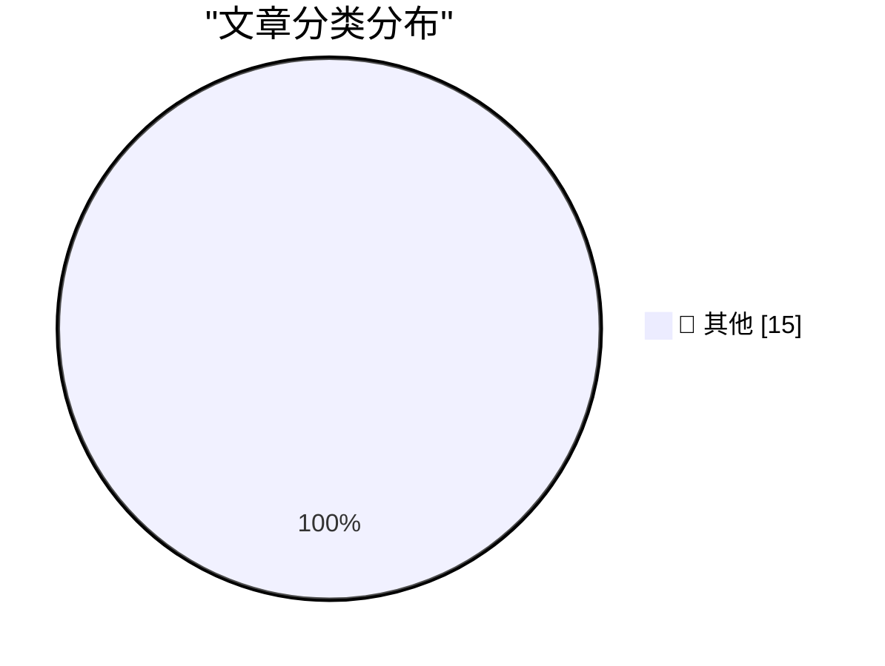

# 📰 AI 博客每日精选 — 2026-04-20

> 来自 Karpathy 推荐的 92 个顶级技术博客，AI 精选 Top 15

## 🏆 今日必读

🥇 **Claude Token Counter, now with model comparisons**

[Claude Token Counter, now with model comparisons](https://simonwillison.net/2026/Apr/20/claude-token-counts/#atom-everything) — simonwillison.net · 37 分钟前 · 📝 其他

> Claude Token Counter, now with model comparisons

🥈 **Headless everything for personal AI**

[Headless everything for personal AI](https://simonwillison.net/2026/Apr/19/headless-everything/#atom-everything) — simonwillison.net · 3 小时前 · 📝 其他

> Headless everything for personal AI

🥉 **Changes in the system prompt between Claude Opus 4.6 and 4.7**

[Changes in the system prompt between Claude Opus 4.6 and 4.7](https://simonwillison.net/2026/Apr/18/opus-system-prompt/#atom-everything) — simonwillison.net · 1 天前 · 📝 其他

> Changes in the system prompt between Claude Opus 4.6 and 4.7

---

## 📊 数据概览

| 扫描源 | 抓取文章 | 时间范围 | 精选 |
|:---:|:---:|:---:|:---:|
| 83/92 | 2440 篇 → 22 篇 | 48h | **15 篇** |

### 分类分布

---

## 📝 其他

### 1. Claude Token Counter, now with model comparisons

[Claude Token Counter, now with model comparisons](https://simonwillison.net/2026/Apr/20/claude-token-counts/#atom-everything) — **simonwillison.net** · 37 分钟前 · ⭐ 15/30

> Claude Token Counter, now with model comparisons

---

### 2. Headless everything for personal AI

[Headless everything for personal AI](https://simonwillison.net/2026/Apr/19/headless-everything/#atom-everything) — **simonwillison.net** · 3 小时前 · ⭐ 15/30

> Headless everything for personal AI

---

### 3. Changes in the system prompt between Claude Opus 4.6 and 4.7

[Changes in the system prompt between Claude Opus 4.6 and 4.7](https://simonwillison.net/2026/Apr/18/opus-system-prompt/#atom-everything) — **simonwillison.net** · 1 天前 · ⭐ 15/30

> Changes in the system prompt between Claude Opus 4.6 and 4.7

---

### 4. Claude system prompts as a git timeline

[Claude system prompts as a git timeline](https://simonwillison.net/2026/Apr/18/extract-system-prompts/#atom-everything) — **simonwillison.net** · 1 天前 · ⭐ 15/30

> Claude system prompts as a git timeline

---

### 5. Adding a new content type to my blog-to-newsletter tool

[Adding a new content type to my blog-to-newsletter tool](https://simonwillison.net/guides/agentic-engineering-patterns/adding-a-new-content-type/#atom-everything) — **simonwillison.net** · 1 天前 · ⭐ 15/30

> Adding a new content type to my blog-to-newsletter tool

---

### 6. Jessica Chastain Says Apple TV Will Finally Release ‘The Savant’

[Jessica Chastain Says Apple TV Will Finally Release ‘The Savant’](https://variety.com/2026/tv/columns/jessica-chastain-apple-tv-finally-release-the-savant-after-postponement-charlie-kirk-assassination-1236725384/) — **daringfireball.net** · 6 小时前 · ⭐ 15/30

> Jessica Chastain Says Apple TV Will Finally Release ‘The Savant’

---

### 7. WorkOS FGA: The Authorization Layer for AI Agents

[WorkOS FGA: The Authorization Layer for AI Agents](https://workos.com/blog/agents-need-authorization-not-just-authentication?utm_source=daringfireball&amp;utm_medium=newsletter&amp;utm_campaign=q22026) — **daringfireball.net** · 7 小时前 · ⭐ 15/30

> WorkOS FGA: The Authorization Layer for AI Agents

---

### 8. ★ ‘A Reading Room on Wheels, a Lover’s Lane, and, After 11 PM, a Flophouse’

[★ ‘A Reading Room on Wheels, a Lover’s Lane, and, After 11 PM, a Flophouse’](https://daringfireball.net/2026/04/kubrick_new_york_subway) — **daringfireball.net** · 1 天前 · ⭐ 15/30

> ★ ‘A Reading Room on Wheels, a Lover’s Lane, and, After 11 PM, a Flophouse’

---

### 9. Mac Mini and Mac Studio Supply Shortages

[Mac Mini and Mac Studio Supply Shortages](https://www.wsj.com/tech/personal-tech/apple-mac-mini-supply-3e7a7509?st=fKpr4Q) — **daringfireball.net** · 1 天前 · ⭐ 15/30

> Mac Mini and Mac Studio Supply Shortages

---

### 10. We Are All Playing Politics at Work

[We Are All Playing Politics at Work](https://idiallo.com/blog/we-are-playing-politics?src=feed) — **idiallo.com** · 1 天前 · ⭐ 15/30

> We Are All Playing Politics at Work

---

### 11. Pluralistic: Georgia's voting technology blunder (18 Apr 2026)

[Pluralistic: Georgia's voting technology blunder (18 Apr 2026)](https://pluralistic.net/2026/04/18/dominion-sucks-actually/) — **pluralistic.net** · 1 天前 · ⭐ 15/30

> Pluralistic: Georgia's voting technology blunder (18 Apr 2026)

---

### 12. Reprojecting Dual Fisheye Videos to Equirectangular (LG 360)

[Reprojecting Dual Fisheye Videos to Equirectangular (LG 360)](https://shkspr.mobi/blog/2026/04/reprojecting-dual-fisheye-videos-to-equirectangular-lg-360/) — **shkspr.mobi** · 13 小时前 · ⭐ 15/30

> Reprojecting Dual Fisheye Videos to Equirectangular (LG 360)

---

### 13. The electromechanical angle computer inside the B-52 bomber's star tracker

[The electromechanical angle computer inside the B-52 bomber's star tracker](http://www.righto.com/feeds/8382904110431912671/comments/default) — **righto.com** · 1 天前 · ⭐ 15/30

> The electromechanical angle computer inside the B-52 bomber's star tracker

---

### 14. Gaussian distributed weights for LLMs

[Gaussian distributed weights for LLMs](https://www.johndcook.com/blog/2026/04/18/qlora/) — **johndcook.com** · 1 天前 · ⭐ 15/30

> Gaussian distributed weights for LLMs

---

### 15. How we lost the living Now

[How we lost the living Now](https://www.joanwestenberg.com/how-we-lost-the-living-now/) — **joanwestenberg.com** · 27 分钟前 · ⭐ 15/30

> How we lost the living Now

---

*生成于 2026-04-20 01:28 | 扫描 83 源 → 获取 2440 篇 → 精选 15 篇*
*基于 [Hacker News Popularity Contest 2025](https://refactoringenglish.com/tools/hn-popularity/) RSS 源列表，由 [Andrej Karpathy](https://x.com/karpathy) 推荐*
*由「懂点儿AI」制作，欢迎关注同名微信公众号获取更多 AI 实用技巧 💡*
