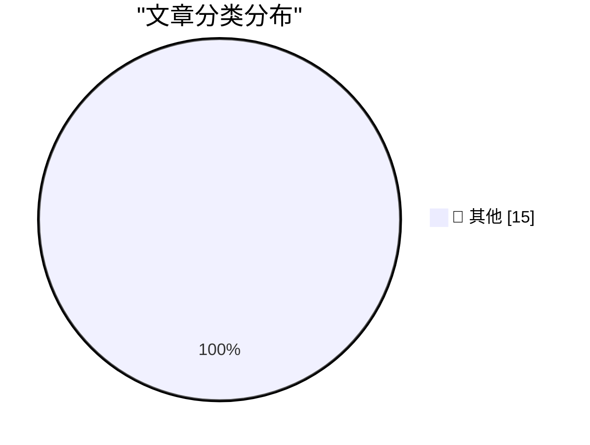

# 📰 AI 博客每日精选 — 2026-04-27

> 来自 Karpathy 推荐的 92 个顶级技术博客，AI 精选 Top 15

## 🏆 今日必读

🥇 **WHY ARE YOU LIKE THIS**

[WHY ARE YOU LIKE THIS](https://simonwillison.net/2026/Apr/25/why-are-you-like-this/#atom-everything) — simonwillison.net · 1 天前 · 📝 其他

> WHY ARE YOU LIKE THIS

🥈 **Quoting Romain Huet**

[Quoting Romain Huet](https://simonwillison.net/2026/Apr/25/romain-huet/#atom-everything) — simonwillison.net · 1 天前 · 📝 其他

> Quoting Romain Huet

🥉 **GPT-5.5 prompting guide**

[GPT-5.5 prompting guide](https://simonwillison.net/2026/Apr/25/gpt-5-5-prompting-guide/#atom-everything) — simonwillison.net · 1 天前 · 📝 其他

> GPT-5.5 prompting guide

---

## 📊 数据概览

| 扫描源 | 抓取文章 | 时间范围 | 精选 |
|:---:|:---:|:---:|:---:|
| 83/92 | 2440 篇 → 15 篇 | 48h | **15 篇** |

### 分类分布

---

## 📝 其他

### 1. WHY ARE YOU LIKE THIS

[WHY ARE YOU LIKE THIS](https://simonwillison.net/2026/Apr/25/why-are-you-like-this/#atom-everything) — **simonwillison.net** · 1 天前 · ⭐ 15/30

> WHY ARE YOU LIKE THIS

---

### 2. Quoting Romain Huet

[Quoting Romain Huet](https://simonwillison.net/2026/Apr/25/romain-huet/#atom-everything) — **simonwillison.net** · 1 天前 · ⭐ 15/30

> Quoting Romain Huet

---

### 3. GPT-5.5 prompting guide

[GPT-5.5 prompting guide](https://simonwillison.net/2026/Apr/25/gpt-5-5-prompting-guide/#atom-everything) — **simonwillison.net** · 1 天前 · ⭐ 15/30

> GPT-5.5 prompting guide

---

### 4. DF Paraphernalia: Last Call for This Round of T-Shirts and Hoodies

[DF Paraphernalia: Last Call for This Round of T-Shirts and Hoodies](https://store.daringfireball.net/) — **daringfireball.net** · 6 小时前 · ⭐ 15/30

> DF Paraphernalia: Last Call for This Round of T-Shirts and Hoodies

---

### 5. ★ The New York Times Printed the Wrong Crossword Grid Last Sunday, and I Find That Timing Serendipitous

[★ The New York Times Printed the Wrong Crossword Grid Last Sunday, and I Find That Timing Serendipitous](https://daringfireball.net/2026/04/nyt_wrong_crossword_grid) — **daringfireball.net** · 6 小时前 · ⭐ 15/30

> ★ The New York Times Printed the Wrong Crossword Grid Last Sunday, and I Find That Timing Serendipitous

---

### 6. Report Claims Samsung Might Post Its First-Ever Mobile Division Loss This Year, Blaming RAM Crisis

[Report Claims Samsung Might Post Its First-Ever Mobile Division Loss This Year, Blaming RAM Crisis](https://9to5google.com/2026/04/22/samsung-is-increasingly-worried-about-first-ever-mobile-division-loss-in-ram-crisis-report/) — **daringfireball.net** · 7 小时前 · ⭐ 15/30

> Report Claims Samsung Might Post Its First-Ever Mobile Division Loss This Year, Blaming RAM Crisis

---

### 7. The Satisfaction of a ChatGPT Plan

[The Satisfaction of a ChatGPT Plan](https://idiallo.com/byte-size/the-satisfaction-of-a-chatgpt-plan?src=feed) — **idiallo.com** · 1 天前 · ⭐ 15/30

> The Satisfaction of a ChatGPT Plan

---

### 8. What Do You Charge For?

[What Do You Charge For?](https://idiallo.com/blog/what-do-you-charge-for?src=feed) — **idiallo.com** · 1 天前 · ⭐ 15/30

> What Do You Charge For?

---

### 9. Pluralistic: Ada Palmer's "Inventing the Renaissance" (25 Apr 2026)

[Pluralistic: Ada Palmer's "Inventing the Renaissance" (25 Apr 2026)](https://pluralistic.net/2026/04/25/machiavellian/) — **pluralistic.net** · 1 天前 · ⭐ 15/30

> Pluralistic: Ada Palmer's "Inventing the Renaissance" (25 Apr 2026)

---

### 10. You can parse an .env file as an .ini with PHP - but there's a catch

[You can parse an .env file as an .ini with PHP - but there's a catch](https://shkspr.mobi/blog/2026/04/you-can-parse-an-env-file-as-an-ini-with-php-but-theres-a-catch/) — **shkspr.mobi** · 1 天前 · ⭐ 15/30

> You can parse an .env file as an .ini with PHP - but there's a catch

---

### 11. Closed-form solution to the nonlinear pendulum equation

[Closed-form solution to the nonlinear pendulum equation](https://www.johndcook.com/blog/2026/04/25/exact-solution-nonlinear-pendulum/) — **johndcook.com** · 1 天前 · ⭐ 15/30

> Closed-form solution to the nonlinear pendulum equation

---

### 12. nth derivative of a quotient

[nth derivative of a quotient](https://www.johndcook.com/blog/2026/04/25/nth-derivative-of-a-quotient/) — **johndcook.com** · 1 天前 · ⭐ 15/30

> nth derivative of a quotient

---

### 13. Reading List 04/25/26

[Reading List 04/25/26](https://www.construction-physics.com/p/reading-list-042526) — **construction-physics.com** · 1 天前 · ⭐ 15/30

> Reading List 04/25/26

---

### 14. How Bitwarden Encrypts and Decrypts Secrets

[How Bitwarden Encrypts and Decrypts Secrets](https://blog.miguelgrinberg.com/post/how-bitwarden-encrypts-and-decrypts-secrets) — **miguelgrinberg.com** · 11 小时前 · ⭐ 15/30

> How Bitwarden Encrypts and Decrypts Secrets

---

### 15. voice modems

[voice modems](https://computer.rip/2026-04-26-voice-modems.html) — **computer.rip** · 1 天前 · ⭐ 15/30

> voice modems

---

*生成于 2026-04-27 01:31 | 扫描 83 源 → 获取 2440 篇 → 精选 15 篇*
*基于 [Hacker News Popularity Contest 2025](https://refactoringenglish.com/tools/hn-popularity/) RSS 源列表，由 [Andrej Karpathy](https://x.com/karpathy) 推荐*
*由「懂点儿AI」制作，欢迎关注同名微信公众号获取更多 AI 实用技巧 💡*
