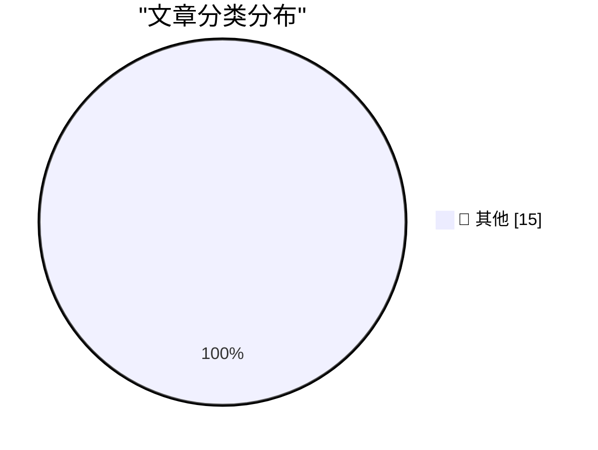

# 📰 AI 博客每日精选 — 2026-04-28

> 来自 Karpathy 推荐的 92 个顶级技术博客，AI 精选 Top 15

## 🏆 今日必读

🥇 **microsoft/VibeVoice**

[microsoft/VibeVoice](https://simonwillison.net/2026/Apr/27/vibevoice/#atom-everything) — simonwillison.net · 2 小时前 · 📝 其他

> microsoft/VibeVoice

🥈 **Tracking the history of the now-deceased OpenAI Microsoft AGI clause**

[Tracking the history of the now-deceased OpenAI Microsoft AGI clause](https://simonwillison.net/2026/Apr/27/now-deceased-agi-clause/#atom-everything) — simonwillison.net · 7 小时前 · 📝 其他

> Tracking the history of the now-deceased OpenAI Microsoft AGI clause

🥉 **Speech translation in Google Meet is now rolling out to mobile devices**

[Speech translation in Google Meet is now rolling out to mobile devices](https://simonwillison.net/2026/Apr/27/speech-translation-in-google-meet-is-now-rolling-out-to-mobile-d/#atom-everything) — simonwillison.net · 8 小时前 · 📝 其他

> Speech translation in Google Meet is now rolling out to mobile devices

---

## 📊 数据概览

| 扫描源 | 抓取文章 | 时间范围 | 精选 |
|:---:|:---:|:---:|:---:|
| 80/92 | 2387 篇 → 19 篇 | 48h | **15 篇** |

### 分类分布

---

## 📝 其他

### 1. microsoft/VibeVoice

[microsoft/VibeVoice](https://simonwillison.net/2026/Apr/27/vibevoice/#atom-everything) — **simonwillison.net** · 2 小时前 · ⭐ 15/30

> microsoft/VibeVoice

---

### 2. Tracking the history of the now-deceased OpenAI Microsoft AGI clause

[Tracking the history of the now-deceased OpenAI Microsoft AGI clause](https://simonwillison.net/2026/Apr/27/now-deceased-agi-clause/#atom-everything) — **simonwillison.net** · 7 小时前 · ⭐ 15/30

> Tracking the history of the now-deceased OpenAI Microsoft AGI clause

---

### 3. Speech translation in Google Meet is now rolling out to mobile devices

[Speech translation in Google Meet is now rolling out to mobile devices](https://simonwillison.net/2026/Apr/27/speech-translation-in-google-meet-is-now-rolling-out-to-mobile-d/#atom-everything) — **simonwillison.net** · 8 小时前 · ⭐ 15/30

> Speech translation in Google Meet is now rolling out to mobile devices

---

### 4. Rec League

[Rec League](https://recleague.com/?lyr_campaign=df) — **daringfireball.net** · 1 小时前 · ⭐ 15/30

> Rec League

---

### 5. Sponsor The Talk Show

[Sponsor The Talk Show](https://daringfireball.net/feeds/sponsors/) — **daringfireball.net** · 2 小时前 · ⭐ 15/30

> Sponsor The Talk Show

---

### 6. Yours Truly on The Vergecast

[Yours Truly on The Vergecast](https://www.theverge.com/podcast/917965/apple-ceo-cook-ternus-transition) — **daringfireball.net** · 7 小时前 · ⭐ 15/30

> Yours Truly on The Vergecast

---

### 7. DF Paraphernalia: Last Call for This Round of T-Shirts and Hoodies

[DF Paraphernalia: Last Call for This Round of T-Shirts and Hoodies](https://store.daringfireball.net/) — **daringfireball.net** · 1 天前 · ⭐ 15/30

> DF Paraphernalia: Last Call for This Round of T-Shirts and Hoodies

---

### 8. ★ The New York Times Printed the Wrong Crossword Grid Last Sunday, and I Find That Timing Serendipitous

[★ The New York Times Printed the Wrong Crossword Grid Last Sunday, and I Find That Timing Serendipitous](https://daringfireball.net/2026/04/nyt_wrong_crossword_grid) — **daringfireball.net** · 1 天前 · ⭐ 15/30

> ★ The New York Times Printed the Wrong Crossword Grid Last Sunday, and I Find That Timing Serendipitous

---

### 9. Report Claims Samsung Might Post Its First-Ever Mobile Division Loss This Year, Blaming RAM Crisis

[Report Claims Samsung Might Post Its First-Ever Mobile Division Loss This Year, Blaming RAM Crisis](https://9to5google.com/2026/04/22/samsung-is-increasingly-worried-about-first-ever-mobile-division-loss-in-ram-crisis-report/) — **daringfireball.net** · 1 天前 · ⭐ 15/30

> Report Claims Samsung Might Post Its First-Ever Mobile Division Loss This Year, Blaming RAM Crisis

---

### 10. Don't use localhost:3000, use your own custom domain

[Don't use localhost:3000, use your own custom domain](https://idiallo.com/blog/say-no-to-localhost3000-use-custom-domains?src=feed) — **idiallo.com** · 2 小时前 · ⭐ 15/30

> Don't use localhost:3000, use your own custom domain

---

### 11. Pluralistic: The enshittification multiverse (27 Apr 2026)

[Pluralistic: The enshittification multiverse (27 Apr 2026)](https://pluralistic.net/2026/04/27/analogs-and-analogies/) — **pluralistic.net** · 17 小时前 · ⭐ 15/30

> Pluralistic: The enshittification multiverse (27 Apr 2026)

---

### 12. Theatre Review: Hadestown ★★★★★

[Theatre Review: Hadestown ★★★★★](https://shkspr.mobi/blog/2026/04/theatre-review-hadestown/) — **shkspr.mobi** · 14 小时前 · ⭐ 15/30

> Theatre Review: Hadestown ★★★★★

---

### 13. Looking at consequences of passing too few register parameters to a C function on various architectures

[Looking at consequences of passing too few register parameters to a C function on various architectures](https://devblogs.microsoft.com/oldnewthing/20260427-00/?p=112271) — **devblogs.microsoft.com/oldnewthing** · 11 小时前 · ⭐ 15/30

> Looking at consequences of passing too few register parameters to a C function on various architectures

---

### 14. The Loop: everything has happened before, and everything will happen again

[The Loop: everything has happened before, and everything will happen again](https://www.joanwestenberg.com/the-loop-everything-has-happened-before-and-everything-will-happen-again/) — **joanwestenberg.com** · 3 小时前 · ⭐ 15/30

> The Loop: everything has happened before, and everything will happen again

---

### 15. The stages of package installation

[The stages of package installation](https://nesbitt.io/2026/04/27/the-stages-of-package-installation.html) — **nesbitt.io** · 15 小时前 · ⭐ 15/30

> The stages of package installation

---

*生成于 2026-04-28 01:53 | 扫描 80 源 → 获取 2387 篇 → 精选 15 篇*
*基于 [Hacker News Popularity Contest 2025](https://refactoringenglish.com/tools/hn-popularity/) RSS 源列表，由 [Andrej Karpathy](https://x.com/karpathy) 推荐*
*由「懂点儿AI」制作，欢迎关注同名微信公众号获取更多 AI 实用技巧 💡*
