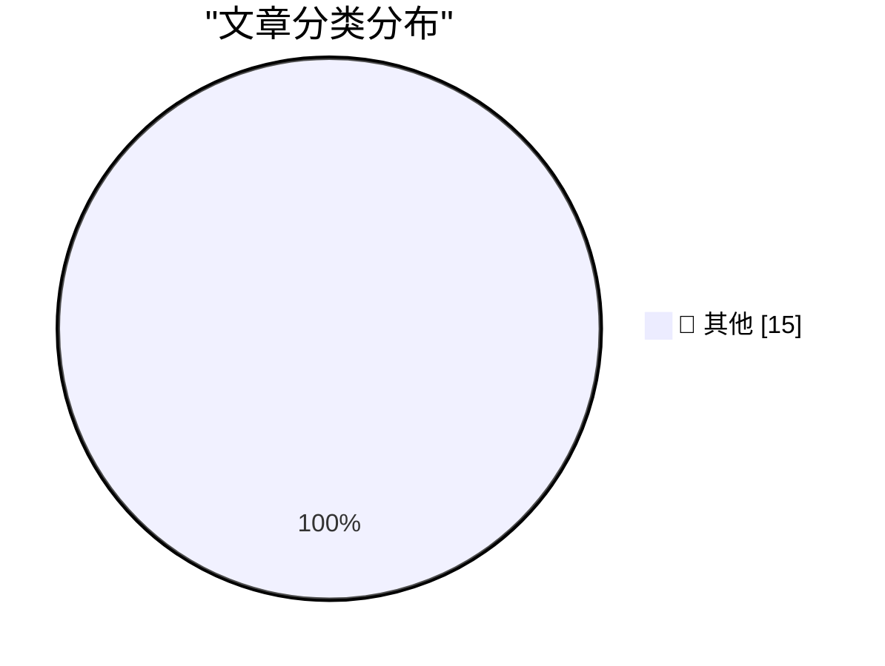

# 📰 AI 博客每日精选 — 2026-05-02

> 来自 Karpathy 推荐的 92 个顶级技术博客，AI 精选 Top 15

## 🏆 今日必读

🥇 **iNaturalist Sightings**

[iNaturalist Sightings](https://simonwillison.net/2026/May/1/inat-sightings/#atom-everything) — simonwillison.net · 6 小时前 · 📝 其他

> iNaturalist Sightings

🥈 **Codex CLI 0.128.0 adds /goal**

[Codex CLI 0.128.0 adds /goal](https://simonwillison.net/2026/Apr/30/codex-goals/#atom-everything) — simonwillison.net · 1 天前 · 📝 其他

> Codex CLI 0.128.0 adds /goal

🥉 **Our evaluation of OpenAI's GPT-5.5 cyber capabilities**

[Our evaluation of OpenAI's GPT-5.5 cyber capabilities](https://simonwillison.net/2026/Apr/30/gpt-55-cyber-capabilities/#atom-everything) — simonwillison.net · 1 天前 · 📝 其他

> Our evaluation of OpenAI's GPT-5.5 cyber capabilities

---

## 📊 数据概览

| 扫描源 | 抓取文章 | 时间范围 | 精选 |
|:---:|:---:|:---:|:---:|
| 82/92 | 2423 篇 → 34 篇 | 48h | **15 篇** |

### 分类分布

---

## 📝 其他

### 1. iNaturalist Sightings

[iNaturalist Sightings](https://simonwillison.net/2026/May/1/inat-sightings/#atom-everything) — **simonwillison.net** · 6 小时前 · ⭐ 15/30

> iNaturalist Sightings

---

### 2. Codex CLI 0.128.0 adds /goal

[Codex CLI 0.128.0 adds /goal](https://simonwillison.net/2026/Apr/30/codex-goals/#atom-everything) — **simonwillison.net** · 1 天前 · ⭐ 15/30

> Codex CLI 0.128.0 adds /goal

---

### 3. Our evaluation of OpenAI's GPT-5.5 cyber capabilities

[Our evaluation of OpenAI's GPT-5.5 cyber capabilities](https://simonwillison.net/2026/Apr/30/gpt-55-cyber-capabilities/#atom-everything) — **simonwillison.net** · 1 天前 · ⭐ 15/30

> Our evaluation of OpenAI's GPT-5.5 cyber capabilities

---

### 4. Quoting Andrew Kelley

[Quoting Andrew Kelley](https://simonwillison.net/2026/Apr/30/andrew-kelley/#atom-everything) — **simonwillison.net** · 1 天前 · ⭐ 15/30

> Quoting Andrew Kelley

---

### 5. We need RSS for sharing abundant vibe-coded apps

[We need RSS for sharing abundant vibe-coded apps](https://simonwillison.net/2026/Apr/30/rss-vibe-coded-apps/#atom-everything) — **simonwillison.net** · 1 天前 · ⭐ 15/30

> We need RSS for sharing abundant vibe-coded apps

---

### 6. SBC Clusters are a terrible value, but they're fun anyway

[SBC Clusters are a terrible value, but they're fun anyway](https://www.jeffgeerling.com/blog/2026/deskpi-super4c-sbc-cluster/) — **jeffgeerling.com** · 11 小时前 · ⭐ 15/30

> SBC Clusters are a terrible value, but they're fun anyway

---

### 7. Anti-DDoS Firm Heaped Attacks on Brazilian ISPs

[Anti-DDoS Firm Heaped Attacks on Brazilian ISPs](https://krebsonsecurity.com/2026/04/anti-ddos-firm-heaped-attacks-on-brazilian-isps/) — **krebsonsecurity.com** · 1 天前 · ⭐ 15/30

> Anti-DDoS Firm Heaped Attacks on Brazilian ISPs

---

### 8. More on Apple’s Logically Elegant Tariff Refund Puzzle Solution

[More on Apple’s Logically Elegant Tariff Refund Puzzle Solution](https://daringfireball.net/linked/2026/05/01/tim-cooks-clever-solution-to-the-tariff-refund-puzzle) — **daringfireball.net** · 39 分钟前 · ⭐ 15/30

> More on Apple’s Logically Elegant Tariff Refund Puzzle Solution

---

### 9. Meta Solved Their Problem With Kenyan Contractors Seeing Footage of AI Glasses Wearers on the Toilet

[Meta Solved Their Problem With Kenyan Contractors Seeing Footage of AI Glasses Wearers on the Toilet](https://www.bbc.com/news/articles/c5y7yvgy0w6o) — **daringfireball.net** · 4 小时前 · ⭐ 15/30

> Meta Solved Their Problem With Kenyan Contractors Seeing Footage of AI Glasses Wearers on the Toilet

---

### 10. Tim Cook’s Clever Solution to the Tariff Refund Puzzle

[Tim Cook’s Clever Solution to the Tariff Refund Puzzle](https://sixcolors.com/post/2026/04/apple-results-analysis-net-net-over-the-moon/) — **daringfireball.net** · 5 小时前 · ⭐ 15/30

> Tim Cook’s Clever Solution to the Tariff Refund Puzzle

---

### 11. The Talk Show: ‘Food and Beverage Director’

[The Talk Show: ‘Food and Beverage Director’](https://daringfireball.net/thetalkshow/2026/04/30/ep-446) — **daringfireball.net** · 22 小时前 · ⭐ 15/30

> The Talk Show: ‘Food and Beverage Director’

---

### 12. Scientology ‘Speed Running’ Trend

[Scientology ‘Speed Running’ Trend](https://www.theguardian.com/us-news/2026/apr/30/hollywood-church-of-scientology-speed-runs?CMP=bsky_gu) — **daringfireball.net** · 23 小时前 · ⭐ 15/30

> Scientology ‘Speed Running’ Trend

---

### 13. Apple Q2 2026 Results

[Apple Q2 2026 Results](https://www.apple.com/newsroom/2026/04/apple-reports-second-quarter-results/) — **daringfireball.net** · 1 天前 · ⭐ 15/30

> Apple Q2 2026 Results

---

### 14. ★ On the Future of Apple’s Vision Platform

[★ On the Future of Apple’s Vision Platform](https://daringfireball.net/2026/04/on_the_future_of_apples_vision_platform) — **daringfireball.net** · 1 天前 · ⭐ 15/30

> ★ On the Future of Apple’s Vision Platform

---

### 15. I’m Starting to Wonder What They’re Smoking Over There at MacRumors

[I’m Starting to Wonder What They’re Smoking Over There at MacRumors](https://www.macrumors.com/2026/04/29/apple-questioning-iphone-magsafe/) — **daringfireball.net** · 1 天前 · ⭐ 15/30

> I’m Starting to Wonder What They’re Smoking Over There at MacRumors

---

*生成于 2026-05-02 01:45 | 扫描 82 源 → 获取 2423 篇 → 精选 15 篇*
*基于 [Hacker News Popularity Contest 2025](https://refactoringenglish.com/tools/hn-popularity/) RSS 源列表，由 [Andrej Karpathy](https://x.com/karpathy) 推荐*
*由「懂点儿AI」制作，欢迎关注同名微信公众号获取更多 AI 实用技巧 💡*
