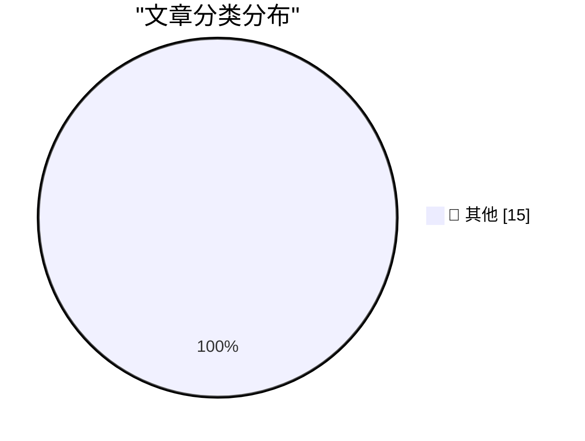

# 📰 AI 博客每日精选 — 2026-05-03

> 来自 Karpathy 推荐的 92 个顶级技术博客，AI 精选 Top 15

## 🏆 今日必读

🥇 **Sightings**

[Sightings](https://simonwillison.net/2026/May/2/sightings/#atom-everything) — simonwillison.net · 8 小时前 · 📝 其他

> Sightings

🥈 **iNaturalist Sightings**

[iNaturalist Sightings](https://simonwillison.net/2026/May/1/inat-sightings/#atom-everything) — simonwillison.net · 1 天前 · 📝 其他

> iNaturalist Sightings

🥉 **SBC Clusters are a terrible value, but they're fun anyway**

[SBC Clusters are a terrible value, but they're fun anyway](https://www.jeffgeerling.com/blog/2026/deskpi-super4c-sbc-cluster/) — jeffgeerling.com · 1 天前 · 📝 其他

> SBC Clusters are a terrible value, but they're fun anyway

---

## 📊 数据概览

| 扫描源 | 抓取文章 | 时间范围 | 精选 |
|:---:|:---:|:---:|:---:|
| 80/92 | 2386 篇 → 20 篇 | 48h | **15 篇** |

### 分类分布

---

## 📝 其他

### 1. Sightings

[Sightings](https://simonwillison.net/2026/May/2/sightings/#atom-everything) — **simonwillison.net** · 8 小时前 · ⭐ 15/30

> Sightings

---

### 2. iNaturalist Sightings

[iNaturalist Sightings](https://simonwillison.net/2026/May/1/inat-sightings/#atom-everything) — **simonwillison.net** · 1 天前 · ⭐ 15/30

> iNaturalist Sightings

---

### 3. SBC Clusters are a terrible value, but they're fun anyway

[SBC Clusters are a terrible value, but they're fun anyway](https://www.jeffgeerling.com/blog/2026/deskpi-super4c-sbc-cluster/) — **jeffgeerling.com** · 1 天前 · ⭐ 15/30

> SBC Clusters are a terrible value, but they're fun anyway

---

### 4. More on Apple’s Logically Elegant Tariff Refund Puzzle Solution

[More on Apple’s Logically Elegant Tariff Refund Puzzle Solution](https://daringfireball.net/linked/2026/05/01/tim-cooks-clever-solution-to-the-tariff-refund-puzzle) — **daringfireball.net** · 1 天前 · ⭐ 15/30

> More on Apple’s Logically Elegant Tariff Refund Puzzle Solution

---

### 5. Meta Solved Their Problem With Kenyan Contractors Seeing Footage of AI Glasses Wearers on the Toilet

[Meta Solved Their Problem With Kenyan Contractors Seeing Footage of AI Glasses Wearers on the Toilet](https://www.bbc.com/news/articles/c5y7yvgy0w6o) — **daringfireball.net** · 1 天前 · ⭐ 15/30

> Meta Solved Their Problem With Kenyan Contractors Seeing Footage of AI Glasses Wearers on the Toilet

---

### 6. Tim Cook’s Clever Solution to the Tariff Refund Puzzle

[Tim Cook’s Clever Solution to the Tariff Refund Puzzle](https://sixcolors.com/post/2026/04/apple-results-analysis-net-net-over-the-moon/) — **daringfireball.net** · 1 天前 · ⭐ 15/30

> Tim Cook’s Clever Solution to the Tariff Refund Puzzle

---

### 7. The Talk Show: ‘Food and Beverage Director’

[The Talk Show: ‘Food and Beverage Director’](https://daringfireball.net/thetalkshow/2026/04/30/ep-446) — **daringfireball.net** · 1 天前 · ⭐ 15/30

> The Talk Show: ‘Food and Beverage Director’

---

### 8. Scientology ‘Speed Running’ Trend

[Scientology ‘Speed Running’ Trend](https://www.theguardian.com/us-news/2026/apr/30/hollywood-church-of-scientology-speed-runs?CMP=bsky_gu) — **daringfireball.net** · 1 天前 · ⭐ 15/30

> Scientology ‘Speed Running’ Trend

---

### 9. Editing my LLM assisted Articles

[Editing my LLM assisted Articles](https://idiallo.com/byte-size/editing-llm-assisted-articles?src=feed) — **idiallo.com** · 22 小时前 · ⭐ 15/30

> Editing my LLM assisted Articles

---

### 10. Disable Auto-Update

[Disable Auto-Update](https://idiallo.com/blog/disable-auto-update?src=feed) — **idiallo.com** · 1 天前 · ⭐ 15/30

> Disable Auto-Update

---

### 11. Pluralistic: The prehistory of the Democratic Nuremberg Caucus (02 May 2026)

[Pluralistic: The prehistory of the Democratic Nuremberg Caucus (02 May 2026)](https://pluralistic.net/2026/05/02/denazification/) — **pluralistic.net** · 14 小时前 · ⭐ 15/30

> Pluralistic: The prehistory of the Democratic Nuremberg Caucus (02 May 2026)

---

### 12. Developing a cross-process reader/writer lock with limited readers, part 4: Abandonment

[Developing a cross-process reader/writer lock with limited readers, part 4: Abandonment](https://devblogs.microsoft.com/oldnewthing/20260501-00/?p=112291) — **devblogs.microsoft.com/oldnewthing** · 1 天前 · ⭐ 15/30

> Developing a cross-process reader/writer lock with limited readers, part 4: Abandonment

---

### 13. A GitHub for maintainers

[A GitHub for maintainers](https://nesbitt.io/2026/05/02/a-github-for-maintainers.html) — **nesbitt.io** · 15 小时前 · ⭐ 15/30

> A GitHub for maintainers

---

### 14. Patching and forking in package managers

[Patching and forking in package managers](https://nesbitt.io/2026/05/01/patching-and-forking-in-package-managers.html) — **nesbitt.io** · 1 天前 · ⭐ 15/30

> Patching and forking in package managers

---

### 15. Reading List 05/02/2026

[Reading List 05/02/2026](https://www.construction-physics.com/p/reading-list-05022026) — **construction-physics.com** · 13 小时前 · ⭐ 15/30

> Reading List 05/02/2026

---

*生成于 2026-05-03 01:49 | 扫描 80 源 → 获取 2386 篇 → 精选 15 篇*
*基于 [Hacker News Popularity Contest 2025](https://refactoringenglish.com/tools/hn-popularity/) RSS 源列表，由 [Andrej Karpathy](https://x.com/karpathy) 推荐*
*由「懂点儿AI」制作，欢迎关注同名微信公众号获取更多 AI 实用技巧 💡*
