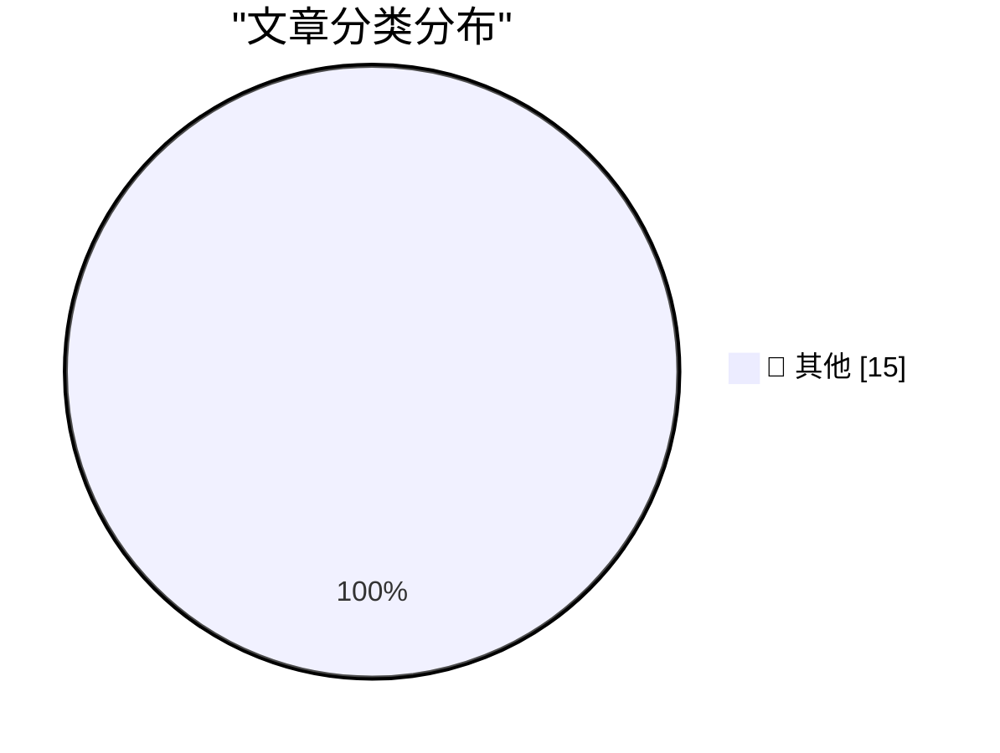

# 📰 AI 博客每日精选 — 2026-05-04

> 来自 Karpathy 推荐的 92 个顶级技术博客，AI 精选 Top 15

## 🏆 今日必读

🥇 **Quoting Anthropic**

[Quoting Anthropic](https://simonwillison.net/2026/May/3/anthropic/#atom-everything) — simonwillison.net · 10 小时前 · 📝 其他

> Quoting Anthropic

🥈 **Sightings**

[Sightings](https://simonwillison.net/2026/May/2/sightings/#atom-everything) — simonwillison.net · 1 天前 · 📝 其他

> Sightings

🥉 **Why I don't like the "staff engineer archetypes"**

[Why I don't like the "staff engineer archetypes"](https://seangoedecke.com/staff-engineer-archetypes/) — seangoedecke.com · 1 天前 · 📝 其他

> Why I don't like the "staff engineer archetypes"

---

## 📊 数据概览

| 扫描源 | 抓取文章 | 时间范围 | 精选 |
|:---:|:---:|:---:|:---:|
| 84/92 | 2446 篇 → 22 篇 | 48h | **15 篇** |

### 分类分布

---

## 📝 其他

### 1. Quoting Anthropic

[Quoting Anthropic](https://simonwillison.net/2026/May/3/anthropic/#atom-everything) — **simonwillison.net** · 10 小时前 · ⭐ 15/30

> Quoting Anthropic

---

### 2. Sightings

[Sightings](https://simonwillison.net/2026/May/2/sightings/#atom-everything) — **simonwillison.net** · 1 天前 · ⭐ 15/30

> Sightings

---

### 3. Why I don't like the "staff engineer archetypes"

[Why I don't like the "staff engineer archetypes"](https://seangoedecke.com/staff-engineer-archetypes/) — **seangoedecke.com** · 1 天前 · ⭐ 15/30

> Why I don't like the "staff engineer archetypes"

---

### 4. X, the Platform of Free Speech

[X, the Platform of Free Speech](https://bsky.app/profile/gilduran.com/post/3mky5taqg3222) — **daringfireball.net** · 1 小时前 · ⭐ 15/30

> X, the Platform of Free Speech

---

### 5. ‘2 Letters From Steve’

[‘2 Letters From Steve’](https://davidgelphman.wordpress.com/2013/03/29/2-letters-from-steve/) — **daringfireball.net** · 2 小时前 · ⭐ 15/30

> ‘2 Letters From Steve’

---

### 6. ★ Crimes Against Decency Need as Much Cover-Up as Crimes Against the Law

[★ Crimes Against Decency Need as Much Cover-Up as Crimes Against the Law](https://daringfireball.net/2026/05/crimes_against_decency_need_as_much_cover-up_as_crimes_against_the_law) — **daringfireball.net** · 2 小时前 · ⭐ 15/30

> ★ Crimes Against Decency Need as Much Cover-Up as Crimes Against the Law

---

### 7. Editing my LLM assisted Articles

[Editing my LLM assisted Articles](https://idiallo.com/byte-size/editing-llm-assisted-articles?src=feed) — **idiallo.com** · 1 天前 · ⭐ 15/30

> Editing my LLM assisted Articles

---

### 8. Pluralistic: The prehistory of the Democratic Nuremberg Caucus (02 May 2026)

[Pluralistic: The prehistory of the Democratic Nuremberg Caucus (02 May 2026)](https://pluralistic.net/2026/05/02/denazification/) — **pluralistic.net** · 1 天前 · ⭐ 15/30

> Pluralistic: The prehistory of the Democratic Nuremberg Caucus (02 May 2026)

---

### 9. Vertically Aligning Roman Numerals in Code

[Vertically Aligning Roman Numerals in Code](https://shkspr.mobi/blog/2026/05/vertically-aligning-roman-numerals-in-code/) — **shkspr.mobi** · 14 小时前 · ⭐ 15/30

> Vertically Aligning Roman Numerals in Code

---

### 10. The shape of a guitar pick

[The shape of a guitar pick](https://www.johndcook.com/blog/2026/05/03/guitar-pick/) — **johndcook.com** · 4 小时前 · ⭐ 15/30

> The shape of a guitar pick

---

### 11. Minimal Viable Zig Error Contexts

[Minimal Viable Zig Error Contexts](https://matklad.github.io/2026/05/03/zig-error-context.html) — **matklad.github.io** · 1 天前 · ⭐ 15/30

> Minimal Viable Zig Error Contexts

---

### 12. png-cmp: like cmp for PNGs

[png-cmp: like cmp for PNGs](https://evanhahn.com/png-cmp-is-cmp-but-for-pngs/) — **evanhahn.com** · 1 天前 · ⭐ 15/30

> png-cmp: like cmp for PNGs

---

### 13. A GitHub for maintainers

[A GitHub for maintainers](https://nesbitt.io/2026/05/02/a-github-for-maintainers.html) — **nesbitt.io** · 1 天前 · ⭐ 15/30

> A GitHub for maintainers

---

### 14. Reading List 05/02/2026

[Reading List 05/02/2026](https://www.construction-physics.com/p/reading-list-05022026) — **construction-physics.com** · 1 天前 · ⭐ 15/30

> Reading List 05/02/2026

---

### 15. Reinventing the Wheel

[Reinventing the Wheel](https://feed.tedium.co/link/15204/17331178/wheel-reinvention-technology-history) — **tedium.co** · 12 小时前 · ⭐ 15/30

> Reinventing the Wheel

---

*生成于 2026-05-04 01:49 | 扫描 84 源 → 获取 2446 篇 → 精选 15 篇*
*基于 [Hacker News Popularity Contest 2025](https://refactoringenglish.com/tools/hn-popularity/) RSS 源列表，由 [Andrej Karpathy](https://x.com/karpathy) 推荐*
*由「懂点儿AI」制作，欢迎关注同名微信公众号获取更多 AI 实用技巧 💡*
