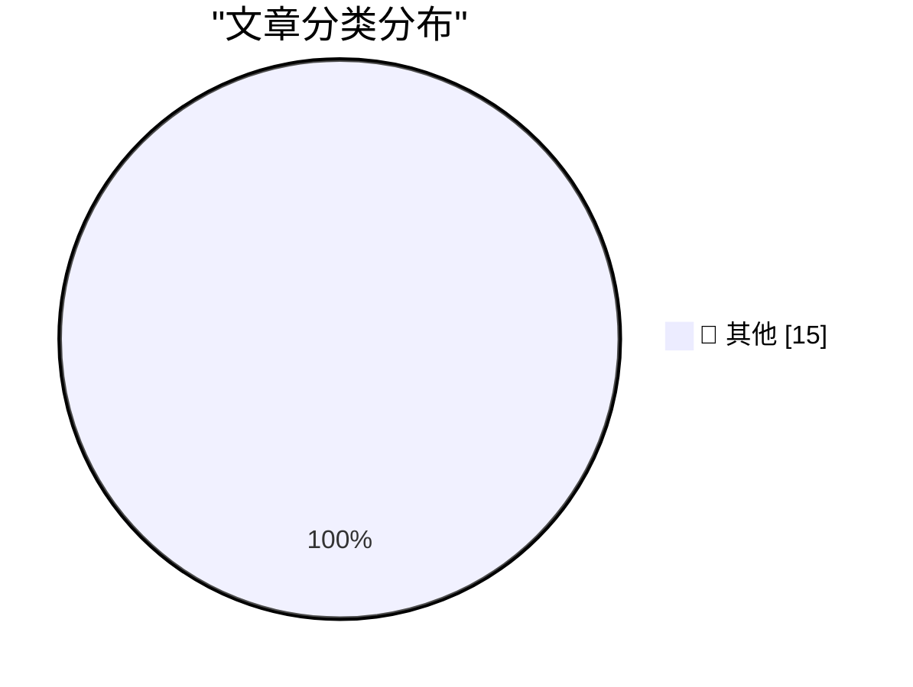

# 📰 AI 博客每日精选 — 2026-05-05

> 来自 Karpathy 推荐的 92 个顶级技术博客，AI 精选 Top 15

## 🏆 今日必读

🥇 **Quoting John Gruber**

[Quoting John Gruber](https://simonwillison.net/2026/May/5/john-gruber/#atom-everything) — simonwillison.net · 1 小时前 · 📝 其他

> Quoting John Gruber

🥈 **Granite 4.1 3B SVG Pelican Gallery**

[Granite 4.1 3B SVG Pelican Gallery](https://simonwillison.net/2026/May/4/granite-41-3b-svg-pelican-gallery/#atom-everything) — simonwillison.net · 2 小时前 · 📝 其他

> Granite 4.1 3B SVG Pelican Gallery

🥉 **Quoting Andy Masley**

[Quoting Andy Masley](https://simonwillison.net/2026/May/4/andy-masley/#atom-everything) — simonwillison.net · 2 小时前 · 📝 其他

> Quoting Andy Masley

---

## 📊 数据概览

| 扫描源 | 抓取文章 | 时间范围 | 精选 |
|:---:|:---:|:---:|:---:|
| 84/92 | 2447 篇 → 38 篇 | 48h | **15 篇** |

### 分类分布

---

## 📝 其他

### 1. Quoting John Gruber

[Quoting John Gruber](https://simonwillison.net/2026/May/5/john-gruber/#atom-everything) — **simonwillison.net** · 1 小时前 · ⭐ 15/30

> Quoting John Gruber

---

### 2. Granite 4.1 3B SVG Pelican Gallery

[Granite 4.1 3B SVG Pelican Gallery](https://simonwillison.net/2026/May/4/granite-41-3b-svg-pelican-gallery/#atom-everything) — **simonwillison.net** · 2 小时前 · ⭐ 15/30

> Granite 4.1 3B SVG Pelican Gallery

---

### 3. Quoting Andy Masley

[Quoting Andy Masley](https://simonwillison.net/2026/May/4/andy-masley/#atom-everything) — **simonwillison.net** · 2 小时前 · ⭐ 15/30

> Quoting Andy Masley

---

### 4. April 2026 newsletter

[April 2026 newsletter](https://simonwillison.net/2026/May/4/april-newsletter/#atom-everything) — **simonwillison.net** · 3 小时前 · ⭐ 15/30

> April 2026 newsletter

---

### 5. TRE Python binding — ReDoS robustness demo

[TRE Python binding — ReDoS robustness demo](https://simonwillison.net/2026/May/4/tre-python-binding/#atom-everything) — **simonwillison.net** · 7 小时前 · ⭐ 15/30

> TRE Python binding — ReDoS robustness demo

---

### 6. Redis Array Playground

[Redis Array Playground](https://simonwillison.net/2026/May/4/redis-array/#atom-everything) — **simonwillison.net** · 9 小时前 · ⭐ 15/30

> Redis Array Playground

---

### 7. Quoting Anthropic

[Quoting Anthropic](https://simonwillison.net/2026/May/3/anthropic/#atom-everything) — **simonwillison.net** · 1 天前 · ⭐ 15/30

> Quoting Anthropic

---

### 8. Paul Thurrott Might Write a Book on Markdown

[Paul Thurrott Might Write a Book on Markdown](https://www.thurrott.com/paul/334577/the-markdown-book-on-writing?utm_source=dlvr.it&amp;utm_medium=mastodon) — **daringfireball.net** · 2 小时前 · ⭐ 15/30

> Paul Thurrott Might Write a Book on Markdown

---

### 9. ★ Y Combinator’s Stake in OpenAI

[★ Y Combinator’s Stake in OpenAI](https://daringfireball.net/2026/05/y_combinators_stake_in_openai) — **daringfireball.net** · 3 小时前 · ⭐ 15/30

> ★ Y Combinator’s Stake in OpenAI

---

### 10. Google Owns a Big Chunk of Anthropic

[Google Owns a Big Chunk of Anthropic](https://www.nytimes.com/2025/03/11/technology/google-investment-anthropic.html?unlocked_article_code=1.f1A.eSTf.D5ECvk6f4DZ7) — **daringfireball.net** · 4 小时前 · ⭐ 15/30

> Google Owns a Big Chunk of Anthropic

---

### 11. App Store Search Ads and the Slippery Slope

[App Store Search Ads and the Slippery Slope](https://blog.thinktapwork.com/post/812803664980967425/ios-app-store-search-is-rotten) — **daringfireball.net** · 4 小时前 · ⭐ 15/30

> App Store Search Ads and the Slippery Slope

---

### 12. ‘Noir, Japan’s Hard-Boiled Bittersweet Answer to Oreos’

[‘Noir, Japan’s Hard-Boiled Bittersweet Answer to Oreos’](https://tokyopaladin.substack.com/p/the-japanese-oreo-noir-kills-the) — **daringfireball.net** · 6 小时前 · ⭐ 15/30

> ‘Noir, Japan’s Hard-Boiled Bittersweet Answer to Oreos’

---

### 13. Photoshop’s ‘Modern User Interface’ Sucks (and Doesn’t Feel Modern)

[Photoshop’s ‘Modern User Interface’ Sucks (and Doesn’t Feel Modern)](https://unsung.aresluna.org/photoshops-challenges-with-focus-pt-2/) — **daringfireball.net** · 6 小时前 · ⭐ 15/30

> Photoshop’s ‘Modern User Interface’ Sucks (and Doesn’t Feel Modern)

---

### 14. Anthropic Executive, One Year Ago: Fully AI Employees Are a Year Away

[Anthropic Executive, One Year Ago: Fully AI Employees Are a Year Away](https://www.axios.com/2025/04/22/ai-anthropic-virtual-employees-security) — **daringfireball.net** · 7 小时前 · ⭐ 15/30

> Anthropic Executive, One Year Ago: Fully AI Employees Are a Year Away

---

### 15. Commits on GitHub Are Up 14× Year-Over-Year

[Commits on GitHub Are Up 14× Year-Over-Year](https://daringfireball.net/linked/2026/03/13/amodei-ai-code-claim-chowder) — **daringfireball.net** · 10 小时前 · ⭐ 15/30

> Commits on GitHub Are Up 14× Year-Over-Year

---

*生成于 2026-05-05 01:50 | 扫描 84 源 → 获取 2447 篇 → 精选 15 篇*
*基于 [Hacker News Popularity Contest 2025](https://refactoringenglish.com/tools/hn-popularity/) RSS 源列表，由 [Andrej Karpathy](https://x.com/karpathy) 推荐*
*由「懂点儿AI」制作，欢迎关注同名微信公众号获取更多 AI 实用技巧 💡*
