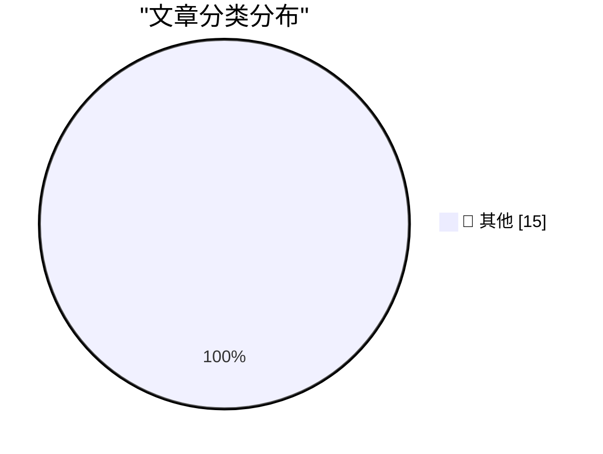

# 📰 AI 博客每日精选 — 2026-05-06

> 来自 Karpathy 推荐的 92 个顶级技术博客，AI 精选 Top 15

## 🏆 今日必读

🥇 **datasette-referrer-policy 0.1**

[datasette-referrer-policy 0.1](https://simonwillison.net/2026/May/5/datasette-referrer-policy/#atom-everything) — simonwillison.net · 2 小时前 · 📝 其他

> datasette-referrer-policy 0.1

🥈 **Our AI started a cafe in Stockholm**

[Our AI started a cafe in Stockholm](https://simonwillison.net/2026/May/5/our-ai-started-a-cafe-in-stockholm/#atom-everything) — simonwillison.net · 3 小时前 · 📝 其他

> Our AI started a cafe in Stockholm

🥉 **datasette-llm 0.1a7**

[datasette-llm 0.1a7](https://simonwillison.net/2026/May/5/datasette-llm/#atom-everything) — simonwillison.net · 23 小时前 · 📝 其他

> datasette-llm 0.1a7

---

## 📊 数据概览

| 扫描源 | 抓取文章 | 时间范围 | 精选 |
|:---:|:---:|:---:|:---:|
| 83/92 | 2423 篇 → 47 篇 | 48h | **15 篇** |

### 分类分布

---

## 📝 其他

### 1. datasette-referrer-policy 0.1

[datasette-referrer-policy 0.1](https://simonwillison.net/2026/May/5/datasette-referrer-policy/#atom-everything) — **simonwillison.net** · 2 小时前 · ⭐ 15/30

> datasette-referrer-policy 0.1

---

### 2. Our AI started a cafe in Stockholm

[Our AI started a cafe in Stockholm](https://simonwillison.net/2026/May/5/our-ai-started-a-cafe-in-stockholm/#atom-everything) — **simonwillison.net** · 3 小时前 · ⭐ 15/30

> Our AI started a cafe in Stockholm

---

### 3. datasette-llm 0.1a7

[datasette-llm 0.1a7](https://simonwillison.net/2026/May/5/datasette-llm/#atom-everything) — **simonwillison.net** · 23 小时前 · ⭐ 15/30

> datasette-llm 0.1a7

---

### 4. llm-echo 0.5a0

[llm-echo 0.5a0](https://simonwillison.net/2026/May/5/llm-echo/#atom-everything) — **simonwillison.net** · 1 天前 · ⭐ 15/30

> llm-echo 0.5a0

---

### 5. Quoting John Gruber

[Quoting John Gruber](https://simonwillison.net/2026/May/5/john-gruber/#atom-everything) — **simonwillison.net** · 1 天前 · ⭐ 15/30

> Quoting John Gruber

---

### 6. Granite 4.1 3B SVG Pelican Gallery

[Granite 4.1 3B SVG Pelican Gallery](https://simonwillison.net/2026/May/4/granite-41-3b-svg-pelican-gallery/#atom-everything) — **simonwillison.net** · 1 天前 · ⭐ 15/30

> Granite 4.1 3B SVG Pelican Gallery

---

### 7. Quoting Andy Masley

[Quoting Andy Masley](https://simonwillison.net/2026/May/4/andy-masley/#atom-everything) — **simonwillison.net** · 1 天前 · ⭐ 15/30

> Quoting Andy Masley

---

### 8. April 2026 newsletter

[April 2026 newsletter](https://simonwillison.net/2026/May/4/april-newsletter/#atom-everything) — **simonwillison.net** · 1 天前 · ⭐ 15/30

> April 2026 newsletter

---

### 9. TRE Python binding — ReDoS robustness demo

[TRE Python binding — ReDoS robustness demo](https://simonwillison.net/2026/May/4/tre-python-binding/#atom-everything) — **simonwillison.net** · 1 天前 · ⭐ 15/30

> TRE Python binding — ReDoS robustness demo

---

### 10. Redis Array Playground

[Redis Array Playground](https://simonwillison.net/2026/May/4/redis-array/#atom-everything) — **simonwillison.net** · 1 天前 · ⭐ 15/30

> Redis Array Playground

---

### 11. Apple Cuts More Mac Studio and Mac Mini RAM Options as Memory Shortage Worsens

[Apple Cuts More Mac Studio and Mac Mini RAM Options as Memory Shortage Worsens](https://www.macrumors.com/2026/05/05/apple-mac-studio-mac-mini-ram-cuts/) — **daringfireball.net** · 1 小时前 · ⭐ 15/30

> Apple Cuts More Mac Studio and Mac Mini RAM Options as Memory Shortage Worsens

---

### 12. Apple Settles Class Action Lawsuit Over AI Features That Were Advertised but Didn’t Ship for $250 Million

[Apple Settles Class Action Lawsuit Over AI Features That Were Advertised but Didn’t Ship for $250 Million](https://9to5mac.com/2026/05/05/apple-reaches-250m-settlement-over-siri-delays-users-could-get-up-to-95-per-device/) — **daringfireball.net** · 1 小时前 · ⭐ 15/30

> Apple Settles Class Action Lawsuit Over AI Features That Were Advertised but Didn’t Ship for $250 Million

---

### 13. The Pentagon Pegs the Cost of the Iran War, So Far, at $25 Billion

[The Pentagon Pegs the Cost of the Iran War, So Far, at $25 Billion](https://politicalwire.com/2026/04/29/iran-war-has-cost-25-billion-so-far/) — **daringfireball.net** · 3 小时前 · ⭐ 15/30

> The Pentagon Pegs the Cost of the Iran War, So Far, at $25 Billion

---

### 14. ★ Software as the Product of Obsession Times Voice

[★ Software as the Product of Obsession Times Voice](https://daringfireball.net/2026/05/software_as_the_product_of_obsession_times_voice) — **daringfireball.net** · 4 小时前 · ⭐ 15/30

> ★ Software as the Product of Obsession Times Voice

---

### 15. Pedometer++ 8.0

[Pedometer++ 8.0](https://david-smith.org/blog/2026/04/29/maps-on-watchos/) — **daringfireball.net** · 7 小时前 · ⭐ 15/30

> Pedometer++ 8.0

---

*生成于 2026-05-06 01:49 | 扫描 83 源 → 获取 2423 篇 → 精选 15 篇*
*基于 [Hacker News Popularity Contest 2025](https://refactoringenglish.com/tools/hn-popularity/) RSS 源列表，由 [Andrej Karpathy](https://x.com/karpathy) 推荐*
*由「懂点儿AI」制作，欢迎关注同名微信公众号获取更多 AI 实用技巧 💡*
