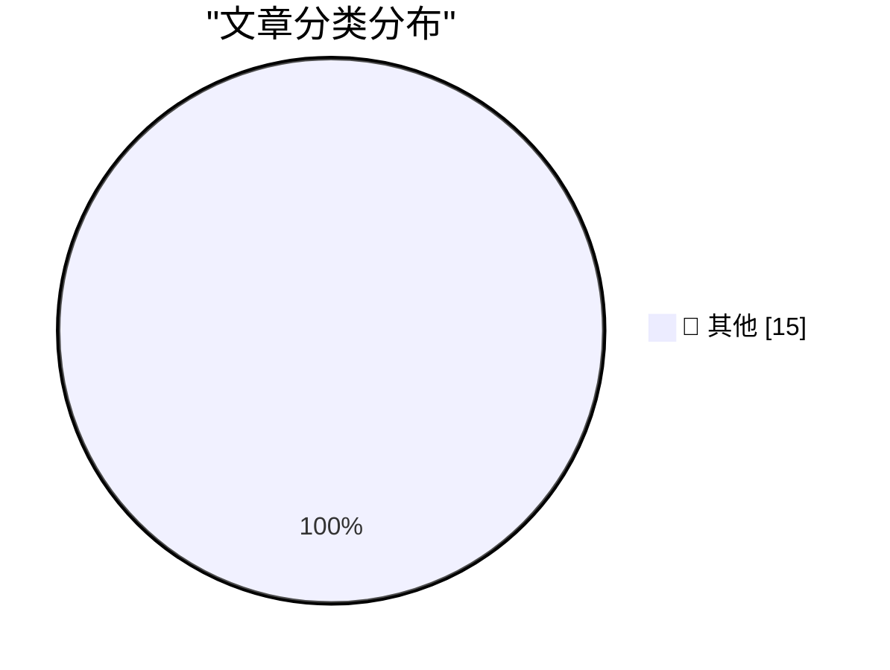

# 📰 AI 博客每日精选 — 2026-05-07

> 来自 Karpathy 推荐的 92 个顶级技术博客，AI 精选 Top 15

## 🏆 今日必读

🥇 **Live blog: Code w/ Claude 2026**

[Live blog: Code w/ Claude 2026](https://simonwillison.net/2026/May/6/code-w-claude-2026/#atom-everything) — simonwillison.net · 9 小时前 · 📝 其他

> Live blog: Code w/ Claude 2026

🥈 **Vibe coding and agentic engineering are getting closer than I'd like**

[Vibe coding and agentic engineering are getting closer than I'd like](https://simonwillison.net/2026/May/6/vibe-coding-and-agentic-engineering/#atom-everything) — simonwillison.net · 11 小时前 · 📝 其他

> Vibe coding and agentic engineering are getting closer than I'd like

🥉 **datasette-referrer-policy 0.1**

[datasette-referrer-policy 0.1](https://simonwillison.net/2026/May/5/datasette-referrer-policy/#atom-everything) — simonwillison.net · 1 天前 · 📝 其他

> datasette-referrer-policy 0.1

---

## 📊 数据概览

| 扫描源 | 抓取文章 | 时间范围 | 精选 |
|:---:|:---:|:---:|:---:|
| 82/92 | 2403 篇 → 39 篇 | 48h | **15 篇** |

### 分类分布

---

## 📝 其他

### 1. Live blog: Code w/ Claude 2026

[Live blog: Code w/ Claude 2026](https://simonwillison.net/2026/May/6/code-w-claude-2026/#atom-everything) — **simonwillison.net** · 9 小时前 · ⭐ 15/30

> Live blog: Code w/ Claude 2026

---

### 2. Vibe coding and agentic engineering are getting closer than I'd like

[Vibe coding and agentic engineering are getting closer than I'd like](https://simonwillison.net/2026/May/6/vibe-coding-and-agentic-engineering/#atom-everything) — **simonwillison.net** · 11 小时前 · ⭐ 15/30

> Vibe coding and agentic engineering are getting closer than I'd like

---

### 3. datasette-referrer-policy 0.1

[datasette-referrer-policy 0.1](https://simonwillison.net/2026/May/5/datasette-referrer-policy/#atom-everything) — **simonwillison.net** · 1 天前 · ⭐ 15/30

> datasette-referrer-policy 0.1

---

### 4. Our AI started a cafe in Stockholm

[Our AI started a cafe in Stockholm](https://simonwillison.net/2026/May/5/our-ai-started-a-cafe-in-stockholm/#atom-everything) — **simonwillison.net** · 1 天前 · ⭐ 15/30

> Our AI started a cafe in Stockholm

---

### 5. datasette-llm 0.1a7

[datasette-llm 0.1a7](https://simonwillison.net/2026/May/5/datasette-llm/#atom-everything) — **simonwillison.net** · 1 天前 · ⭐ 15/30

> datasette-llm 0.1a7

---

### 6. Broadcast Booths Around Baseball Tip Their Caps to John Sterling

[Broadcast Booths Around Baseball Tip Their Caps to John Sterling](https://www.mlb.com/news/broadcast-booths-around-baseball-mirror-john-sterling-signature-calls) — **daringfireball.net** · 5 小时前 · ⭐ 15/30

> Broadcast Booths Around Baseball Tip Their Caps to John Sterling

---

### 7. Claris CEO Ryan McCann on FileMaker in the Age of Agentic Coding

[Claris CEO Ryan McCann on FileMaker in the Age of Agentic Coding](https://www.claris.com/blog/2026/how-claris-is-building-for-what-comes-next) — **daringfireball.net** · 6 小时前 · ⭐ 15/30

> Claris CEO Ryan McCann on FileMaker in the Age of Agentic Coding

---

### 8. Luca Maestri Runs the Cafeteria

[Luca Maestri Runs the Cafeteria](https://www.apple.com/leadership/luca-maestri/) — **daringfireball.net** · 6 小时前 · ⭐ 15/30

> Luca Maestri Runs the Cafeteria

---

### 9. Apple Cuts More Mac Studio and Mac Mini RAM Options as Memory Shortage Worsens

[Apple Cuts More Mac Studio and Mac Mini RAM Options as Memory Shortage Worsens](https://www.macrumors.com/2026/05/05/apple-mac-studio-mac-mini-ram-cuts/) — **daringfireball.net** · 1 天前 · ⭐ 15/30

> Apple Cuts More Mac Studio and Mac Mini RAM Options as Memory Shortage Worsens

---

### 10. Apple Settles Class Action Lawsuit Over AI Features That Were Advertised but Didn’t Ship for $250 Million

[Apple Settles Class Action Lawsuit Over AI Features That Were Advertised but Didn’t Ship for $250 Million](https://9to5mac.com/2026/05/05/apple-reaches-250m-settlement-over-siri-delays-users-could-get-up-to-95-per-device/) — **daringfireball.net** · 1 天前 · ⭐ 15/30

> Apple Settles Class Action Lawsuit Over AI Features That Were Advertised but Didn’t Ship for $250 Million

---

### 11. The Pentagon Pegs the Cost of the Iran War, So Far, at $25 Billion

[The Pentagon Pegs the Cost of the Iran War, So Far, at $25 Billion](https://politicalwire.com/2026/04/29/iran-war-has-cost-25-billion-so-far/) — **daringfireball.net** · 1 天前 · ⭐ 15/30

> The Pentagon Pegs the Cost of the Iran War, So Far, at $25 Billion

---

### 12. ★ Software as the Product of Obsession Times Voice

[★ Software as the Product of Obsession Times Voice](https://daringfireball.net/2026/05/software_as_the_product_of_obsession_times_voice) — **daringfireball.net** · 1 天前 · ⭐ 15/30

> ★ Software as the Product of Obsession Times Voice

---

### 13. Pedometer++ 8.0

[Pedometer++ 8.0](https://david-smith.org/blog/2026/04/29/maps-on-watchos/) — **daringfireball.net** · 1 天前 · ⭐ 15/30

> Pedometer++ 8.0

---

### 14. [Sponsor] WorkOS: Ready to Sell to Enterprise? Your Product Is Ready, Your Auth Infrastructure Isn’t.

[[Sponsor] WorkOS: Ready to Sell to Enterprise? Your Product Is Ready, Your Auth Infrastructure Isn’t.](https://workos.com/?utm_source=daringfireball&amp;utm_medium=newsletter&amp;utm_campaign=q22026) — **daringfireball.net** · 1 天前 · ⭐ 15/30

> [Sponsor] WorkOS: Ready to Sell to Enterprise? Your Product Is Ready, Your Auth Infrastructure Isn’t.

---

### 15. Chess Peace

[Chess Peace](https://chesspeace.app/) — **daringfireball.net** · 1 天前 · ⭐ 15/30

> Chess Peace

---

*生成于 2026-05-07 01:53 | 扫描 82 源 → 获取 2403 篇 → 精选 15 篇*
*基于 [Hacker News Popularity Contest 2025](https://refactoringenglish.com/tools/hn-popularity/) RSS 源列表，由 [Andrej Karpathy](https://x.com/karpathy) 推荐*
*由「懂点儿AI」制作，欢迎关注同名微信公众号获取更多 AI 实用技巧 💡*
