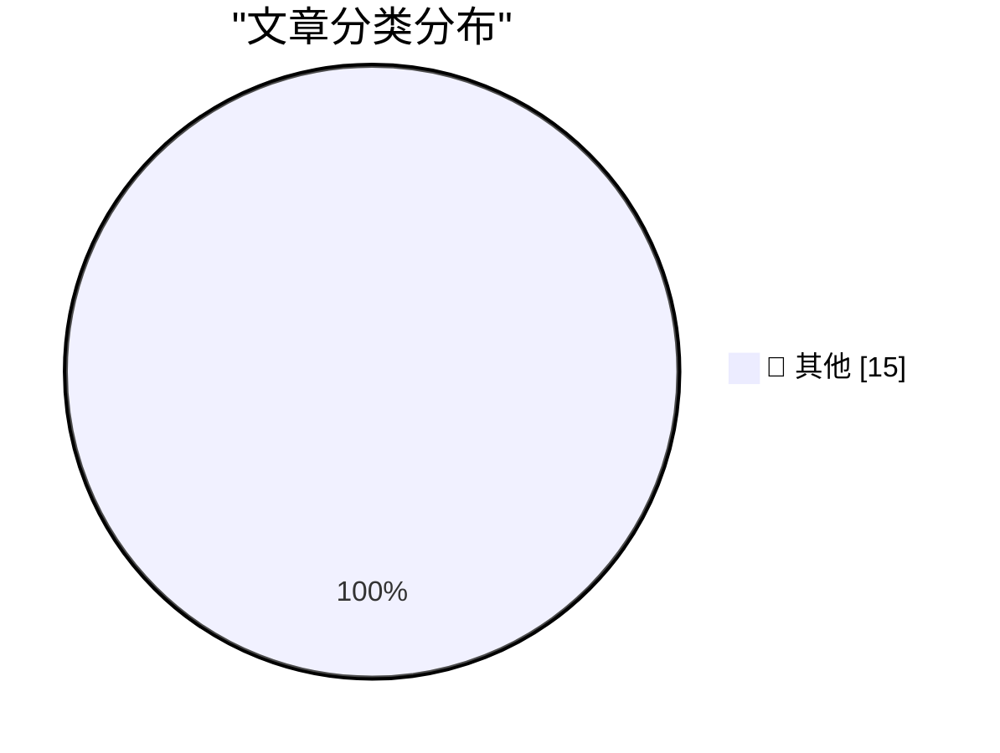

# 📰 AI 博客每日精选 — 2026-05-08

> 来自 Karpathy 推荐的 92 个顶级技术博客，AI 精选 Top 15

## 🏆 今日必读

🥇 **llm-gemini 0.31**

[llm-gemini 0.31](https://simonwillison.net/2026/May/7/llm-gemini/#atom-everything) — simonwillison.net · 6 小时前 · 📝 其他

> llm-gemini 0.31

🥈 **Big Words**

[Big Words](https://simonwillison.net/2026/May/7/big-words/#atom-everything) — simonwillison.net · 7 小时前 · 📝 其他

> Big Words

🥉 **Behind the Scenes Hardening Firefox with Claude Mythos Preview**

[Behind the Scenes Hardening Firefox with Claude Mythos Preview](https://simonwillison.net/2026/May/7/firefox-claude-mythos/#atom-everything) — simonwillison.net · 8 小时前 · 📝 其他

> Behind the Scenes Hardening Firefox with Claude Mythos Preview

---

## 📊 数据概览

| 扫描源 | 抓取文章 | 时间范围 | 精选 |
|:---:|:---:|:---:|:---:|
| 83/92 | 2431 篇 → 38 篇 | 48h | **15 篇** |

### 分类分布

---

## 📝 其他

### 1. llm-gemini 0.31

[llm-gemini 0.31](https://simonwillison.net/2026/May/7/llm-gemini/#atom-everything) — **simonwillison.net** · 6 小时前 · ⭐ 15/30

> llm-gemini 0.31

---

### 2. Big Words

[Big Words](https://simonwillison.net/2026/May/7/big-words/#atom-everything) — **simonwillison.net** · 7 小时前 · ⭐ 15/30

> Big Words

---

### 3. Behind the Scenes Hardening Firefox with Claude Mythos Preview

[Behind the Scenes Hardening Firefox with Claude Mythos Preview](https://simonwillison.net/2026/May/7/firefox-claude-mythos/#atom-everything) — **simonwillison.net** · 8 小时前 · ⭐ 15/30

> Behind the Scenes Hardening Firefox with Claude Mythos Preview

---

### 4. Notes on the xAI/Anthropic data center deal

[Notes on the xAI/Anthropic data center deal](https://simonwillison.net/2026/May/7/xai-anthropic/#atom-everything) — **simonwillison.net** · 8 小时前 · ⭐ 15/30

> Notes on the xAI/Anthropic data center deal

---

### 5. GitHub Repo Stats

[GitHub Repo Stats](https://simonwillison.net/2026/May/7/github-repo-stats/#atom-everything) — **simonwillison.net** · 18 小时前 · ⭐ 15/30

> GitHub Repo Stats

---

### 6. Live blog: Code w/ Claude 2026

[Live blog: Code w/ Claude 2026](https://simonwillison.net/2026/May/6/code-w-claude-2026/#atom-everything) — **simonwillison.net** · 1 天前 · ⭐ 15/30

> Live blog: Code w/ Claude 2026

---

### 7. Vibe coding and agentic engineering are getting closer than I'd like

[Vibe coding and agentic engineering are getting closer than I'd like](https://simonwillison.net/2026/May/6/vibe-coding-and-agentic-engineering/#atom-everything) — **simonwillison.net** · 1 天前 · ⭐ 15/30

> Vibe coding and agentic engineering are getting closer than I'd like

---

### 8. Why hasn't longer-horizon training slowed AI progress?

[Why hasn't longer-horizon training slowed AI progress?](https://seangoedecke.com/why-hasnt-longer-horizon-training-slowed-ai-progress/) — **seangoedecke.com** · 1 天前 · ⭐ 15/30

> Why hasn't longer-horizon training slowed AI progress?

---

### 9. Prolost Watches 1.0

[Prolost Watches 1.0](https://prolost.com/blog/prolostwatches) — **daringfireball.net** · 4 小时前 · ⭐ 15/30

> Prolost Watches 1.0

---

### 10. The Greatest Match Cut in Cinematic History, Improved by Amazon Prime

[The Greatest Match Cut in Cinematic History, Improved by Amazon Prime](https://bsky.app/profile/gethill.bsky.social/post/3ml6fyfv7kc2l) — **daringfireball.net** · 10 小时前 · ⭐ 15/30

> The Greatest Match Cut in Cinematic History, Improved by Amazon Prime

---

### 11. Broadcast Booths Around Baseball Tip Their Caps to John Sterling

[Broadcast Booths Around Baseball Tip Their Caps to John Sterling](https://www.mlb.com/news/broadcast-booths-around-baseball-mirror-john-sterling-signature-calls) — **daringfireball.net** · 1 天前 · ⭐ 15/30

> Broadcast Booths Around Baseball Tip Their Caps to John Sterling

---

### 12. Claris CEO Ryan McCann on FileMaker in the Age of Agentic Coding

[Claris CEO Ryan McCann on FileMaker in the Age of Agentic Coding](https://www.claris.com/blog/2026/how-claris-is-building-for-what-comes-next) — **daringfireball.net** · 1 天前 · ⭐ 15/30

> Claris CEO Ryan McCann on FileMaker in the Age of Agentic Coding

---

### 13. Luca Maestri Runs the Cafeteria

[Luca Maestri Runs the Cafeteria](https://www.apple.com/leadership/luca-maestri/) — **daringfireball.net** · 1 天前 · ⭐ 15/30

> Luca Maestri Runs the Cafeteria

---

### 14. Asimov's three laws are merely a suggestion

[Asimov's three laws are merely a suggestion](https://idiallo.com/blog/asimov-three-laws-dont-work-with-ai?src=feed) — **idiallo.com** · 1 天前 · ⭐ 15/30

> Asimov's three laws are merely a suggestion

---

### 15. Pluralistic: Bubbles are REALLY evil (07 May 2026)

[Pluralistic: Bubbles are REALLY evil (07 May 2026)](https://pluralistic.net/2026/05/07/dump-the-pumpers/) — **pluralistic.net** · 17 小时前 · ⭐ 15/30

> Pluralistic: Bubbles are REALLY evil (07 May 2026)

---

*生成于 2026-05-08 01:58 | 扫描 83 源 → 获取 2431 篇 → 精选 15 篇*
*基于 [Hacker News Popularity Contest 2025](https://refactoringenglish.com/tools/hn-popularity/) RSS 源列表，由 [Andrej Karpathy](https://x.com/karpathy) 推荐*
*由「懂点儿AI」制作，欢迎关注同名微信公众号获取更多 AI 实用技巧 💡*
