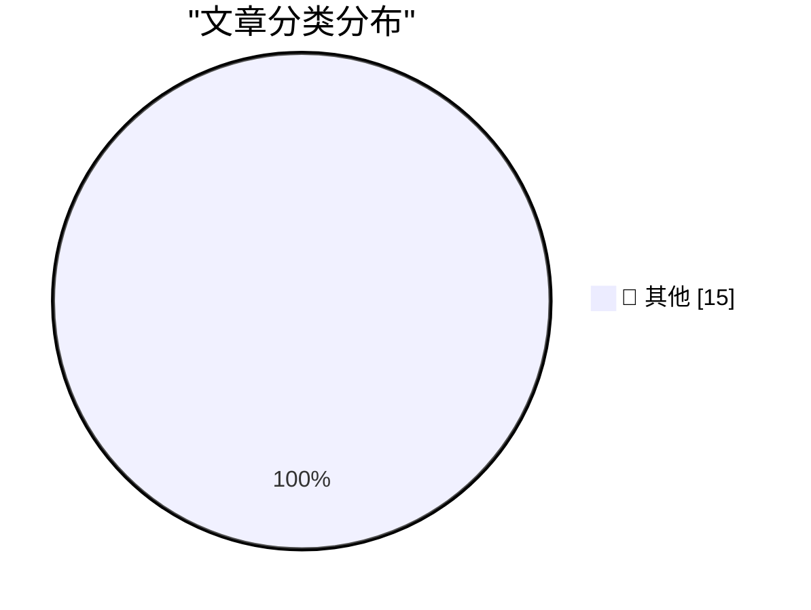

# 📰 AI 博客每日精选 — 2026-05-09

> 来自 Karpathy 推荐的 92 个顶级技术博客，AI 精选 Top 15

## 🏆 今日必读

🥇 **Quoting Luke Curley**

[Quoting Luke Curley](https://simonwillison.net/2026/May/9/luke-curley/#atom-everything) — simonwillison.net · 49 分钟前 · 📝 其他

> Quoting Luke Curley

🥈 **Using Claude Code: The Unreasonable Effectiveness of HTML**

[Using Claude Code: The Unreasonable Effectiveness of HTML](https://simonwillison.net/2026/May/8/unreasonable-effectiveness-of-html/#atom-everything) — simonwillison.net · 4 小时前 · 📝 其他

> Using Claude Code: The Unreasonable Effectiveness of HTML

🥉 **llm-gemini 0.31**

[llm-gemini 0.31](https://simonwillison.net/2026/May/7/llm-gemini/#atom-everything) — simonwillison.net · 1 天前 · 📝 其他

> llm-gemini 0.31

---

## 📊 数据概览

| 扫描源 | 抓取文章 | 时间范围 | 精选 |
|:---:|:---:|:---:|:---:|
| 83/92 | 2434 篇 → 38 篇 | 48h | **15 篇** |

### 分类分布

---

## 📝 其他

### 1. Quoting Luke Curley

[Quoting Luke Curley](https://simonwillison.net/2026/May/9/luke-curley/#atom-everything) — **simonwillison.net** · 49 分钟前 · ⭐ 15/30

> Quoting Luke Curley

---

### 2. Using Claude Code: The Unreasonable Effectiveness of HTML

[Using Claude Code: The Unreasonable Effectiveness of HTML](https://simonwillison.net/2026/May/8/unreasonable-effectiveness-of-html/#atom-everything) — **simonwillison.net** · 4 小时前 · ⭐ 15/30

> Using Claude Code: The Unreasonable Effectiveness of HTML

---

### 3. llm-gemini 0.31

[llm-gemini 0.31](https://simonwillison.net/2026/May/7/llm-gemini/#atom-everything) — **simonwillison.net** · 1 天前 · ⭐ 15/30

> llm-gemini 0.31

---

### 4. Big Words

[Big Words](https://simonwillison.net/2026/May/7/big-words/#atom-everything) — **simonwillison.net** · 1 天前 · ⭐ 15/30

> Big Words

---

### 5. Behind the Scenes Hardening Firefox with Claude Mythos Preview

[Behind the Scenes Hardening Firefox with Claude Mythos Preview](https://simonwillison.net/2026/May/7/firefox-claude-mythos/#atom-everything) — **simonwillison.net** · 1 天前 · ⭐ 15/30

> Behind the Scenes Hardening Firefox with Claude Mythos Preview

---

### 6. Notes on the xAI/Anthropic data center deal

[Notes on the xAI/Anthropic data center deal](https://simonwillison.net/2026/May/7/xai-anthropic/#atom-everything) — **simonwillison.net** · 1 天前 · ⭐ 15/30

> Notes on the xAI/Anthropic data center deal

---

### 7. GitHub Repo Stats

[GitHub Repo Stats](https://simonwillison.net/2026/May/7/github-repo-stats/#atom-everything) — **simonwillison.net** · 1 天前 · ⭐ 15/30

> GitHub Repo Stats

---

### 8. HomePod mini feels like magic, but it's just good timing

[HomePod mini feels like magic, but it's just good timing](https://www.jeffgeerling.com/blog/2026/homepod-mini-feels-like-magic--but-it-s-just-good-timing/) — **jeffgeerling.com** · 11 小时前 · ⭐ 15/30

> HomePod mini feels like magic, but it's just good timing

---

### 9. AI makes weak engineers less harmful

[AI makes weak engineers less harmful](https://seangoedecke.com/ai-makes-weak-engineers-less-harmful/) — **seangoedecke.com** · 1 小时前 · ⭐ 15/30

> AI makes weak engineers less harmful

---

### 10. Notes on incidents

[Notes on incidents](https://seangoedecke.com/notes-on-incidents/) — **seangoedecke.com** · 1 天前 · ⭐ 15/30

> Notes on incidents

---

### 11. Canvas Breach Disrupts Schools & Colleges Nationwide

[Canvas Breach Disrupts Schools & Colleges Nationwide](https://krebsonsecurity.com/2026/05/canvas-breach-disrupts-schools-colleges-nationwide/) — **krebsonsecurity.com** · 22 小时前 · ⭐ 15/30

> Canvas Breach Disrupts Schools & Colleges Nationwide

---

### 12. Prolost Watches 1.0

[Prolost Watches 1.0](https://prolost.com/blog/prolostwatches) — **daringfireball.net** · 1 天前 · ⭐ 15/30

> Prolost Watches 1.0

---

### 13. The Greatest Match Cut in Cinematic History, Improved by Amazon Prime

[The Greatest Match Cut in Cinematic History, Improved by Amazon Prime](https://bsky.app/profile/gethill.bsky.social/post/3ml6fyfv7kc2l) — **daringfireball.net** · 1 天前 · ⭐ 15/30

> The Greatest Match Cut in Cinematic History, Improved by Amazon Prime

---

### 14. Hi stranger

[Hi stranger](https://idiallo.com/blog/hi?src=feed) — **idiallo.com** · 11 小时前 · ⭐ 15/30

> Hi stranger

---

### 15. Pluralistic: Lee Lai's "Cannon" (08 May 2026)

[Pluralistic: Lee Lai's "Cannon" (08 May 2026)](https://pluralistic.net/2026/05/08/gung-gung/) — **pluralistic.net** · 13 小时前 · ⭐ 15/30

> Pluralistic: Lee Lai's "Cannon" (08 May 2026)

---

*生成于 2026-05-09 01:53 | 扫描 83 源 → 获取 2434 篇 → 精选 15 篇*
*基于 [Hacker News Popularity Contest 2025](https://refactoringenglish.com/tools/hn-popularity/) RSS 源列表，由 [Andrej Karpathy](https://x.com/karpathy) 推荐*
*由「懂点儿AI」制作，欢迎关注同名微信公众号获取更多 AI 实用技巧 💡*
