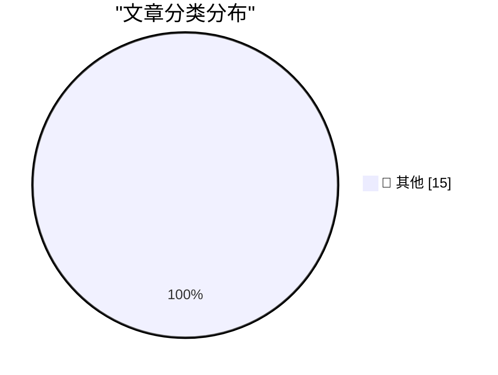

# 📰 AI 博客每日精选 — 2026-05-10

> 来自 Karpathy 推荐的 92 个顶级技术博客，AI 精选 Top 15

## 🏆 今日必读

🥇 **Quoting Luke Curley**

[Quoting Luke Curley](https://simonwillison.net/2026/May/9/luke-curley/#atom-everything) — simonwillison.net · 1 天前 · 📝 其他

> Quoting Luke Curley

🥈 **Using Claude Code: The Unreasonable Effectiveness of HTML**

[Using Claude Code: The Unreasonable Effectiveness of HTML](https://simonwillison.net/2026/May/8/unreasonable-effectiveness-of-html/#atom-everything) — simonwillison.net · 1 天前 · 📝 其他

> Using Claude Code: The Unreasonable Effectiveness of HTML

🥉 **HomePod mini feels like magic, but it's just good timing**

[HomePod mini feels like magic, but it's just good timing](https://www.jeffgeerling.com/blog/2026/homepod-mini-feels-like-magic--but-it-s-just-good-timing/) — jeffgeerling.com · 1 天前 · 📝 其他

> HomePod mini feels like magic, but it's just good timing

---

## 📊 数据概览

| 扫描源 | 抓取文章 | 时间范围 | 精选 |
|:---:|:---:|:---:|:---:|
| 82/92 | 2423 篇 → 22 篇 | 48h | **15 篇** |

### 分类分布

---

## 📝 其他

### 1. Quoting Luke Curley

[Quoting Luke Curley](https://simonwillison.net/2026/May/9/luke-curley/#atom-everything) — **simonwillison.net** · 1 天前 · ⭐ 15/30

> Quoting Luke Curley

---

### 2. Using Claude Code: The Unreasonable Effectiveness of HTML

[Using Claude Code: The Unreasonable Effectiveness of HTML](https://simonwillison.net/2026/May/8/unreasonable-effectiveness-of-html/#atom-everything) — **simonwillison.net** · 1 天前 · ⭐ 15/30

> Using Claude Code: The Unreasonable Effectiveness of HTML

---

### 3. HomePod mini feels like magic, but it's just good timing

[HomePod mini feels like magic, but it's just good timing](https://www.jeffgeerling.com/blog/2026/homepod-mini-feels-like-magic--but-it-s-just-good-timing/) — **jeffgeerling.com** · 1 天前 · ⭐ 15/30

> HomePod mini feels like magic, but it's just good timing

---

### 4. AI makes weak engineers less harmful

[AI makes weak engineers less harmful](https://seangoedecke.com/ai-makes-weak-engineers-less-harmful/) — **seangoedecke.com** · 1 天前 · ⭐ 15/30

> AI makes weak engineers less harmful

---

### 5. Canvas Breach Disrupts Schools & Colleges Nationwide

[Canvas Breach Disrupts Schools & Colleges Nationwide](https://krebsonsecurity.com/2026/05/canvas-breach-disrupts-schools-colleges-nationwide/) — **krebsonsecurity.com** · 1 天前 · ⭐ 15/30

> Canvas Breach Disrupts Schools & Colleges Nationwide

---

### 6. Hi stranger

[Hi stranger](https://idiallo.com/blog/hi?src=feed) — **idiallo.com** · 1 天前 · ⭐ 15/30

> Hi stranger

---

### 7. Pluralistic: Trump's fruitless search for a goreable ox (09 May 2026)

[Pluralistic: Trump's fruitless search for a goreable ox (09 May 2026)](https://pluralistic.net/2026/05/09/cossie-livvie-crissie/) — **pluralistic.net** · 13 小时前 · ⭐ 15/30

> Pluralistic: Trump's fruitless search for a goreable ox (09 May 2026)

---

### 8. Pluralistic: Lee Lai's "Cannon" (08 May 2026)

[Pluralistic: Lee Lai's "Cannon" (08 May 2026)](https://pluralistic.net/2026/05/08/gung-gung/) — **pluralistic.net** · 1 天前 · ⭐ 15/30

> Pluralistic: Lee Lai's "Cannon" (08 May 2026)

---

### 9. Book Review: The Names by Florence Knapp ★★⯪☆☆

[Book Review: The Names by Florence Knapp ★★⯪☆☆](https://shkspr.mobi/blog/2026/05/book-review-the-names-by-florence-knapp/) — **shkspr.mobi** · 14 小时前 · ⭐ 15/30

> Book Review: The Names by Florence Knapp ★★⯪☆☆

---

### 10. Developing more confidence when tracking renames via Read­Directory­ChangesW

[Developing more confidence when tracking renames via Read­Directory­ChangesW](https://devblogs.microsoft.com/oldnewthing/20260508-00/?p=112310) — **devblogs.microsoft.com/oldnewthing** · 1 天前 · ⭐ 15/30

> Developing more confidence when tracking renames via Read­Directory­ChangesW

---

### 11. Calculating curvature

[Calculating curvature](https://www.johndcook.com/blog/2026/05/08/calculating-curvature/) — **johndcook.com** · 1 天前 · ⭐ 15/30

> Calculating curvature

---

### 12. The Mismeasure of Open Source

[The Mismeasure of Open Source](https://nesbitt.io/2026/05/09/the-mismeasure-of-open-source.html) — **nesbitt.io** · 15 小时前 · ⭐ 15/30

> The Mismeasure of Open Source

---

### 13. Weekend at Bernie’s

[Weekend at Bernie’s](https://nesbitt.io/2026/05/08/weekend-at-bernies.html) — **nesbitt.io** · 1 天前 · ⭐ 15/30

> Weekend at Bernie’s

---

### 14. Reading List 05/09/2026

[Reading List 05/09/2026](https://www.construction-physics.com/p/reading-list-05092026) — **construction-physics.com** · 13 小时前 · ⭐ 15/30

> Reading List 05/09/2026

---

### 15. I Will Not Add Query Strings to Your URLs

[I Will Not Add Query Strings to Your URLs](https://susam.net/no-query-strings.html) — **susam.net** · 1 天前 · ⭐ 15/30

> I Will Not Add Query Strings to Your URLs

---

*生成于 2026-05-10 01:52 | 扫描 82 源 → 获取 2423 篇 → 精选 15 篇*
*基于 [Hacker News Popularity Contest 2025](https://refactoringenglish.com/tools/hn-popularity/) RSS 源列表，由 [Andrej Karpathy](https://x.com/karpathy) 推荐*
*由「懂点儿AI」制作，欢迎关注同名微信公众号获取更多 AI 实用技巧 💡*
