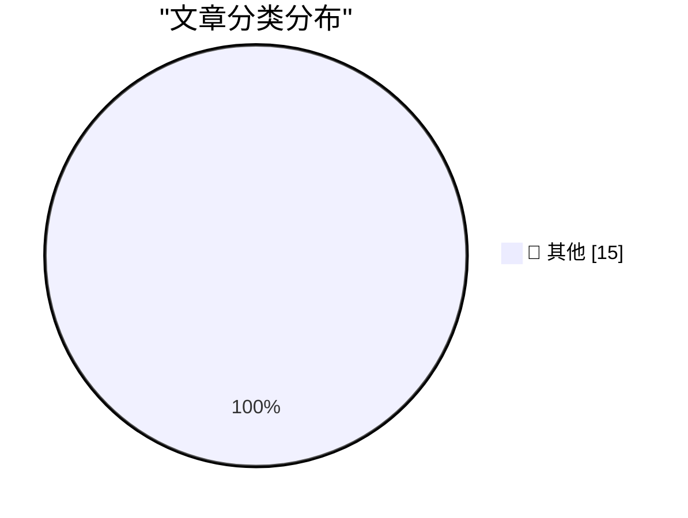

# 📰 AI 博客每日精选 — 2026-05-11

> 来自 Karpathy 推荐的 92 个顶级技术博客，AI 精选 Top 15

## 🏆 今日必读

🥇 **Quoting New York Times Editors’ Note**

[Quoting New York Times Editors’ Note](https://simonwillison.net/2026/May/10/new-york-times-editors-note/#atom-everything) — simonwillison.net · 2 小时前 · 📝 其他

> Quoting New York Times Editors’ Note

🥈 **Quoting Andrew Quinn**

[Quoting Andrew Quinn](https://simonwillison.net/2026/May/10/andrew-quinn/#atom-everything) — simonwillison.net · 11 小时前 · 📝 其他

> Quoting Andrew Quinn

🥉 **WorkOS**

[WorkOS](https://workos.com/?utm_source=daringfireball&amp;utm_medium=newsletter&amp;utm_campaign=q22026) — daringfireball.net · 11 小时前 · 📝 其他

> WorkOS

---

## 📊 数据概览

| 扫描源 | 抓取文章 | 时间范围 | 精选 |
|:---:|:---:|:---:|:---:|
| 79/92 | 2372 篇 → 15 篇 | 48h | **15 篇** |

### 分类分布

---

## 📝 其他

### 1. Quoting New York Times Editors’ Note

[Quoting New York Times Editors’ Note](https://simonwillison.net/2026/May/10/new-york-times-editors-note/#atom-everything) — **simonwillison.net** · 2 小时前 · ⭐ 15/30

> Quoting New York Times Editors’ Note

---

### 2. Quoting Andrew Quinn

[Quoting Andrew Quinn](https://simonwillison.net/2026/May/10/andrew-quinn/#atom-everything) — **simonwillison.net** · 11 小时前 · ⭐ 15/30

> Quoting Andrew Quinn

---

### 3. WorkOS

[WorkOS](https://workos.com/?utm_source=daringfireball&amp;utm_medium=newsletter&amp;utm_campaign=q22026) — **daringfireball.net** · 11 小时前 · ⭐ 15/30

> WorkOS

---

### 4. Meta to Start Capturing Employee Mouse Movements, Keystrokes for AI Training Data

[Meta to Start Capturing Employee Mouse Movements, Keystrokes for AI Training Data](https://www.reuters.com/sustainability/boards-policy-regulation/meta-start-capturing-employee-mouse-movements-keystrokes-ai-training-data-2026-04-21/) — **daringfireball.net** · 11 小时前 · ⭐ 15/30

> Meta to Start Capturing Employee Mouse Movements, Keystrokes for AI Training Data

---

### 5. Pluralistic: Trump's fruitless search for a goreable ox (09 May 2026)

[Pluralistic: Trump's fruitless search for a goreable ox (09 May 2026)](https://pluralistic.net/2026/05/09/cossie-livvie-crissie/) — **pluralistic.net** · 1 天前 · ⭐ 15/30

> Pluralistic: Trump's fruitless search for a goreable ox (09 May 2026)

---

### 6. [RSS Club] A Sneak Preview of Upcoming Posts

[[RSS Club] A Sneak Preview of Upcoming Posts](https://shkspr.mobi/blog/2026/05/rss-club-a-sneak-preview-of-upcoming-posts/) — **shkspr.mobi** · 14 小时前 · ⭐ 15/30

> [RSS Club] A Sneak Preview of Upcoming Posts

---

### 7. Book Review: The Names by Florence Knapp ★★⯪☆☆

[Book Review: The Names by Florence Knapp ★★⯪☆☆](https://shkspr.mobi/blog/2026/05/book-review-the-names-by-florence-knapp/) — **shkspr.mobi** · 1 天前 · ⭐ 15/30

> Book Review: The Names by Florence Knapp ★★⯪☆☆

---

### 8. The linear algebra of bit twiddling

[The linear algebra of bit twiddling](https://www.johndcook.com/blog/2026/05/10/the-linear-algebra-of-bit-twiddling/) — **johndcook.com** · 7 小时前 · ⭐ 15/30

> The linear algebra of bit twiddling

---

### 9. Reverse engineering Mersenne Twister with Linear Algebra

[Reverse engineering Mersenne Twister with Linear Algebra](https://www.johndcook.com/blog/2026/05/10/reverse-mersenne-twister/) — **johndcook.com** · 8 小时前 · ⭐ 15/30

> Reverse engineering Mersenne Twister with Linear Algebra

---

### 10. Madame Semver Will See You Now

[Madame Semver Will See You Now](https://nesbitt.io/2026/05/10/madame-semver-will-see-you-now.html) — **nesbitt.io** · 16 小时前 · ⭐ 15/30

> Madame Semver Will See You Now

---

### 11. The Mismeasure of Open Source

[The Mismeasure of Open Source](https://nesbitt.io/2026/05/09/the-mismeasure-of-open-source.html) — **nesbitt.io** · 1 天前 · ⭐ 15/30

> The Mismeasure of Open Source

---

### 12. Reading List 05/09/2026

[Reading List 05/09/2026](https://www.construction-physics.com/p/reading-list-05092026) — **construction-physics.com** · 1 天前 · ⭐ 15/30

> Reading List 05/09/2026

---

### 13. The Real Singularity is the Friends We Made Along the Way

[The Real Singularity is the Friends We Made Along the Way](https://geohot.github.io//blog/jekyll/update/2026/05/09/real-singularity.html) — **geohot.github.io** · 1 天前 · ⭐ 15/30

> The Real Singularity is the Friends We Made Along the Way

---

### 14. Welcoming the Costa Rican Government to Have I Been Pwned

[Welcoming the Costa Rican Government to Have I Been Pwned](https://www.troyhunt.com/welcoming-the-costa-rican-government-to-have-i-been-pwned/) — **troyhunt.com** · 1 小时前 · ⭐ 15/30

> Welcoming the Costa Rican Government to Have I Been Pwned

---

### 15. Weekly Update 503

[Weekly Update 503](https://www.troyhunt.com/weekly-update-503/) — **troyhunt.com** · 2 小时前 · ⭐ 15/30

> Weekly Update 503

---

*生成于 2026-05-11 02:01 | 扫描 79 源 → 获取 2372 篇 → 精选 15 篇*
*基于 [Hacker News Popularity Contest 2025](https://refactoringenglish.com/tools/hn-popularity/) RSS 源列表，由 [Andrej Karpathy](https://x.com/karpathy) 推荐*
*由「懂点儿AI」制作，欢迎关注同名微信公众号获取更多 AI 实用技巧 💡*
