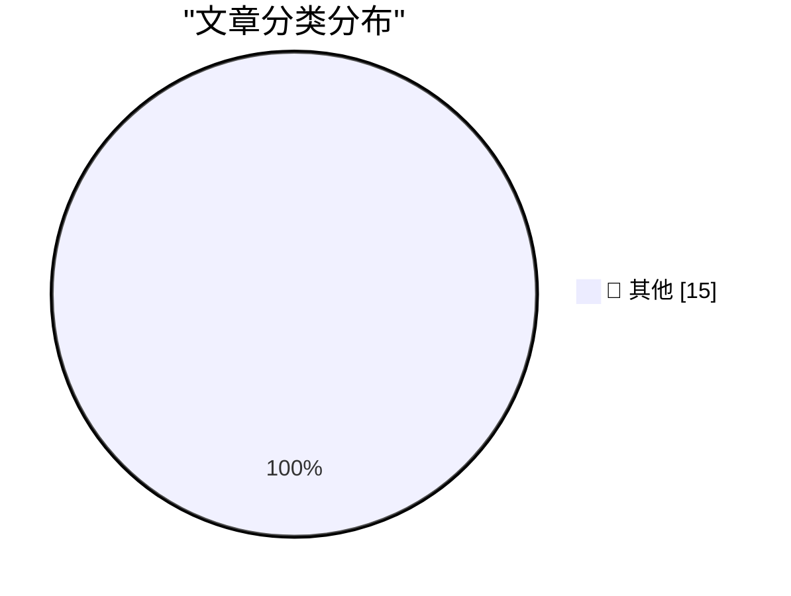

# 📰 AI 博客每日精选 — 2026-05-13

> 来自 Karpathy 推荐的 92 个顶级技术博客，AI 精选 Top 15

## 🏆 今日必读

🥇 **datasette 1.0a29**

[datasette 1.0a29](https://simonwillison.net/2026/May/12/datasette/#atom-everything) — simonwillison.net · 2 小时前 · 📝 其他

> datasette 1.0a29

🥈 **Quoting Mo Bitar**

[Quoting Mo Bitar](https://simonwillison.net/2026/May/12/mo-bitar/#atom-everything) — simonwillison.net · 3 小时前 · 📝 其他

> Quoting Mo Bitar

🥉 **Quoting Mitchell Hashimoto**

[Quoting Mitchell Hashimoto](https://simonwillison.net/2026/May/12/mitchell-hashimoto/#atom-everything) — simonwillison.net · 3 小时前 · 📝 其他

> Quoting Mitchell Hashimoto

---

## 📊 数据概览

| 扫描源 | 抓取文章 | 时间范围 | 精选 |
|:---:|:---:|:---:|:---:|
| 83/92 | 2436 篇 → 46 篇 | 48h | **15 篇** |

### 分类分布

---

## 📝 其他

### 1. datasette 1.0a29

[datasette 1.0a29](https://simonwillison.net/2026/May/12/datasette/#atom-everything) — **simonwillison.net** · 2 小时前 · ⭐ 15/30

> datasette 1.0a29

---

### 2. Quoting Mo Bitar

[Quoting Mo Bitar](https://simonwillison.net/2026/May/12/mo-bitar/#atom-everything) — **simonwillison.net** · 3 小时前 · ⭐ 15/30

> Quoting Mo Bitar

---

### 3. Quoting Mitchell Hashimoto

[Quoting Mitchell Hashimoto](https://simonwillison.net/2026/May/12/mitchell-hashimoto/#atom-everything) — **simonwillison.net** · 3 小时前 · ⭐ 15/30

> Quoting Mitchell Hashimoto

---

### 4. llm 0.32a2

[llm 0.32a2](https://simonwillison.net/2026/May/12/llm/#atom-everything) — **simonwillison.net** · 8 小时前 · ⭐ 15/30

> llm 0.32a2

---

### 5. Thoughts on GitLab's workforce reduction" and "structural and strategic decisions"

[Thoughts on GitLab's workforce reduction" and "structural and strategic decisions"](https://simonwillison.net/2026/May/11/gitlab-act-2/#atom-everything) — **simonwillison.net** · 1 天前 · ⭐ 15/30

> Thoughts on GitLab's workforce reduction" and "structural and strategic decisions"

---

### 6. Quoting James Shore

[Quoting James Shore](https://simonwillison.net/2026/May/11/james-shore/#atom-everything) — **simonwillison.net** · 1 天前 · ⭐ 15/30

> Quoting James Shore

---

### 7. Your AI Use Is Breaking My Brain

[Your AI Use Is Breaking My Brain](https://simonwillison.net/2026/May/11/zombie-internet/#atom-everything) — **simonwillison.net** · 1 天前 · ⭐ 15/30

> Your AI Use Is Breaking My Brain

---

### 8. Using LLM in the shebang line of a script

[Using LLM in the shebang line of a script](https://simonwillison.net/2026/May/11/llm-shebang/#atom-everything) — **simonwillison.net** · 1 天前 · ⭐ 15/30

> Using LLM in the shebang line of a script

---

### 9. Learning on the Shop floor

[Learning on the Shop floor](https://simonwillison.net/2026/May/11/learning-on-the-shop-floor/#atom-everything) — **simonwillison.net** · 1 天前 · ⭐ 15/30

> Learning on the Shop floor

---

### 10. Bambu Lab is abusing the open source social contract

[Bambu Lab is abusing the open source social contract](https://www.jeffgeerling.com/blog/2026/bambu-lab-abusing-open-source-social-contract/) — **jeffgeerling.com** · 12 小时前 · ⭐ 15/30

> Bambu Lab is abusing the open source social contract

---

### 11. Thinking Machines and interaction models

[Thinking Machines and interaction models](https://seangoedecke.com/interaction-models/) — **seangoedecke.com** · 1 天前 · ⭐ 15/30

> Thinking Machines and interaction models

---

### 12. Patch Tuesday, May 2026 Edition

[Patch Tuesday, May 2026 Edition](https://krebsonsecurity.com/2026/05/patch-tuesday-may-2026-edition/) — **krebsonsecurity.com** · 4 小时前 · ⭐ 15/30

> Patch Tuesday, May 2026 Edition

---

### 13. Nextpad++

[Nextpad++](https://notepad-plus-plus.org/news/npp-trademark-infringement/) — **daringfireball.net** · 20 分钟前 · ⭐ 15/30

> Nextpad++

---

### 14. Kagi Snaps

[Kagi Snaps](https://help.kagi.com/kagi/features/snaps.html) — **daringfireball.net** · 4 小时前 · ⭐ 15/30

> Kagi Snaps

---

### 15. Seriously, Give Kagi a Try

[Seriously, Give Kagi a Try](https://daringfireball.net/2025/04/try_switching_to_kagi) — **daringfireball.net** · 5 小时前 · ⭐ 15/30

> Seriously, Give Kagi a Try

---

*生成于 2026-05-13 02:02 | 扫描 83 源 → 获取 2436 篇 → 精选 15 篇*
*基于 [Hacker News Popularity Contest 2025](https://refactoringenglish.com/tools/hn-popularity/) RSS 源列表，由 [Andrej Karpathy](https://x.com/karpathy) 推荐*
*由「懂点儿AI」制作，欢迎关注同名微信公众号获取更多 AI 实用技巧 💡*
