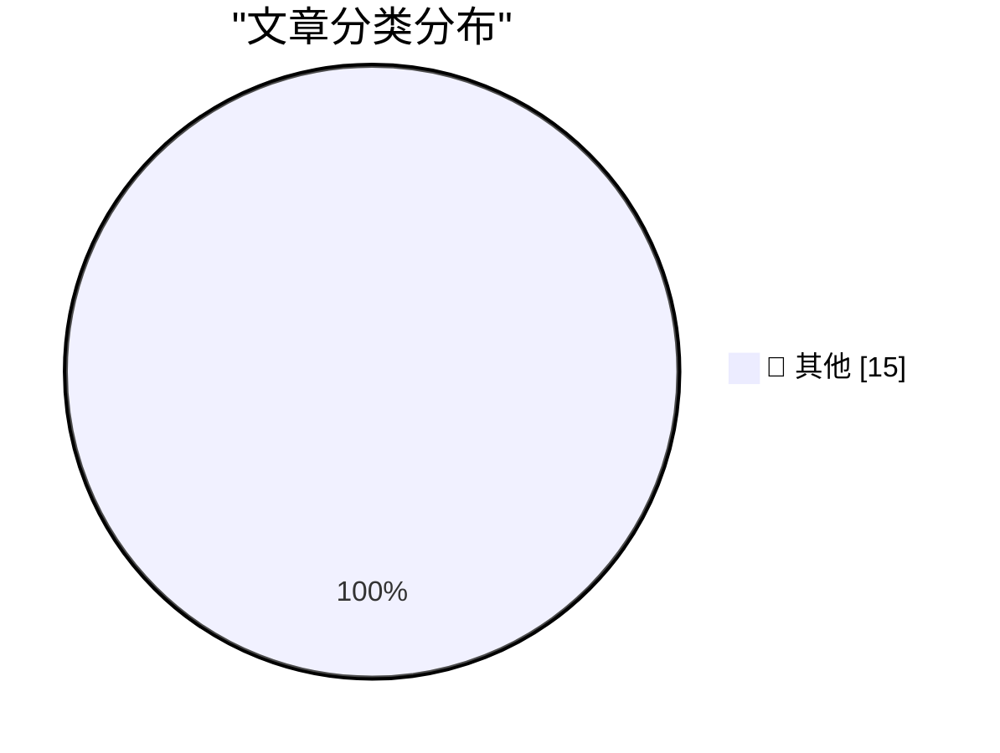

# 📰 AI 博客每日精选 — 2026-05-14

> 来自 Karpathy 推荐的 92 个顶级技术博客，AI 精选 Top 15

## 🏆 今日必读

🥇 **Welcome to the Datasette blog**

[Welcome to the Datasette blog](https://simonwillison.net/2026/May/13/welcome-to-the-datasette-blog/#atom-everything) — simonwillison.net · 2 小时前 · 📝 其他

> Welcome to the Datasette blog

🥈 **Quoting Boris Mann**

[Quoting Boris Mann](https://simonwillison.net/2026/May/13/boris-mann/#atom-everything) — simonwillison.net · 9 小时前 · 📝 其他

> Quoting Boris Mann

🥉 **CSP Allow-list Experiment**

[CSP Allow-list Experiment](https://simonwillison.net/2026/May/13/csp-allow/#atom-everything) — simonwillison.net · 21 小时前 · 📝 其他

> CSP Allow-list Experiment

---

## 📊 数据概览

| 扫描源 | 抓取文章 | 时间范围 | 精选 |
|:---:|:---:|:---:|:---:|
| 84/92 | 2455 篇 → 37 篇 | 48h | **15 篇** |

### 分类分布

---

## 📝 其他

### 1. Welcome to the Datasette blog

[Welcome to the Datasette blog](https://simonwillison.net/2026/May/13/welcome-to-the-datasette-blog/#atom-everything) — **simonwillison.net** · 2 小时前 · ⭐ 15/30

> Welcome to the Datasette blog

---

### 2. Quoting Boris Mann

[Quoting Boris Mann](https://simonwillison.net/2026/May/13/boris-mann/#atom-everything) — **simonwillison.net** · 9 小时前 · ⭐ 15/30

> Quoting Boris Mann

---

### 3. CSP Allow-list Experiment

[CSP Allow-list Experiment](https://simonwillison.net/2026/May/13/csp-allow/#atom-everything) — **simonwillison.net** · 21 小时前 · ⭐ 15/30

> CSP Allow-list Experiment

---

### 4. datasette 1.0a29

[datasette 1.0a29](https://simonwillison.net/2026/May/12/datasette/#atom-everything) — **simonwillison.net** · 1 天前 · ⭐ 15/30

> datasette 1.0a29

---

### 5. Quoting Mo Bitar

[Quoting Mo Bitar](https://simonwillison.net/2026/May/12/mo-bitar/#atom-everything) — **simonwillison.net** · 1 天前 · ⭐ 15/30

> Quoting Mo Bitar

---

### 6. Quoting Mitchell Hashimoto

[Quoting Mitchell Hashimoto](https://simonwillison.net/2026/May/12/mitchell-hashimoto/#atom-everything) — **simonwillison.net** · 1 天前 · ⭐ 15/30

> Quoting Mitchell Hashimoto

---

### 7. llm 0.32a2

[llm 0.32a2](https://simonwillison.net/2026/May/12/llm/#atom-everything) — **simonwillison.net** · 1 天前 · ⭐ 15/30

> llm 0.32a2

---

### 8. Bambu Lab is abusing the open source social contract

[Bambu Lab is abusing the open source social contract](https://www.jeffgeerling.com/blog/2026/bambu-lab-abusing-open-source-social-contract/) — **jeffgeerling.com** · 1 天前 · ⭐ 15/30

> Bambu Lab is abusing the open source social contract

---

### 9. AI datacenters in space do not have a cooling problem

[AI datacenters in space do not have a cooling problem](https://seangoedecke.com/space-ai-datacenters-do-not-have-a-cooling-problem/) — **seangoedecke.com** · 1 天前 · ⭐ 15/30

> AI datacenters in space do not have a cooling problem

---

### 10. Patch Tuesday, May 2026 Edition

[Patch Tuesday, May 2026 Edition](https://krebsonsecurity.com/2026/05/patch-tuesday-may-2026-edition/) — **krebsonsecurity.com** · 1 天前 · ⭐ 15/30

> Patch Tuesday, May 2026 Edition

---

### 11. ★ Nextpad++

[★ Nextpad++](https://daringfireball.net/2026/05/nextpad) — **daringfireball.net** · 23 小时前 · ⭐ 15/30

> ★ Nextpad++

---

### 12. Kagi Snaps

[Kagi Snaps](https://help.kagi.com/kagi/features/snaps.html) — **daringfireball.net** · 1 天前 · ⭐ 15/30

> Kagi Snaps

---

### 13. Seriously, Give Kagi a Try

[Seriously, Give Kagi a Try](https://daringfireball.net/2025/04/try_switching_to_kagi) — **daringfireball.net** · 1 天前 · ⭐ 15/30

> Seriously, Give Kagi a Try

---

### 14. Search Ads as a Vector for Travel Scams

[Search Ads as a Vector for Travel Scams](https://www.wsj.com/lifestyle/travel/the-simple-travel-scam-that-cost-a-seasoned-traveler-over-12-000-7d317f20?st=WDTpv5) — **daringfireball.net** · 1 天前 · ⭐ 15/30

> Search Ads as a Vector for Travel Scams

---

### 15. Teresa Ribera Visited the U.S. and No One Noticed

[Teresa Ribera Visited the U.S. and No One Noticed](https://www.politico.eu/article/eu-big-tech-rulebook-shifting-digital-economy-ribera-dma-pulse-forum/) — **daringfireball.net** · 1 天前 · ⭐ 15/30

> Teresa Ribera Visited the U.S. and No One Noticed

---

*生成于 2026-05-14 02:04 | 扫描 84 源 → 获取 2455 篇 → 精选 15 篇*
*基于 [Hacker News Popularity Contest 2025](https://refactoringenglish.com/tools/hn-popularity/) RSS 源列表，由 [Andrej Karpathy](https://x.com/karpathy) 推荐*
*由「懂点儿AI」制作，欢迎关注同名微信公众号获取更多 AI 实用技巧 💡*
