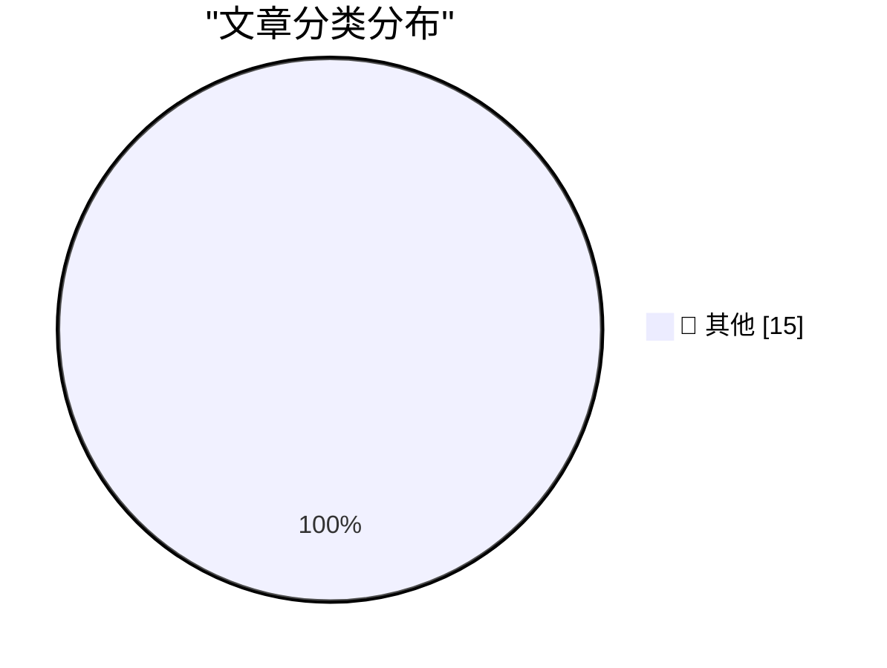

# 📰 AI 博客每日精选 — 2026-05-17

> 来自 Karpathy 推荐的 92 个顶级技术博客，AI 精选 Top 15

## 🏆 今日必读

🥇 **Warelay -> OpenClaw**

[Warelay -> OpenClaw](https://simonwillison.net/2026/May/16/openclaw-names/#atom-everything) — simonwillison.net · 5 小时前 · 📝 其他

> Warelay -> OpenClaw

🥈 **Quoting Julia Evans**

[Quoting Julia Evans](https://simonwillison.net/2026/May/16/julia-evans/#atom-everything) — simonwillison.net · 9 小时前 · 📝 其他

> Quoting Julia Evans

🥉 **inaturalist-clumper 0.1**

[inaturalist-clumper 0.1](https://simonwillison.net/2026/May/15/inaturalist-clumper/#atom-everything) — simonwillison.net · 1 天前 · 📝 其他

> inaturalist-clumper 0.1

---

## 📊 数据概览

| 扫描源 | 抓取文章 | 时间范围 | 精选 |
|:---:|:---:|:---:|:---:|
| 84/92 | 2458 篇 → 34 篇 | 48h | **15 篇** |

### 分类分布

---

## 📝 其他

### 1. Warelay -> OpenClaw

[Warelay -> OpenClaw](https://simonwillison.net/2026/May/16/openclaw-names/#atom-everything) — **simonwillison.net** · 5 小时前 · ⭐ 15/30

> Warelay -> OpenClaw

---

### 2. Quoting Julia Evans

[Quoting Julia Evans](https://simonwillison.net/2026/May/16/julia-evans/#atom-everything) — **simonwillison.net** · 9 小时前 · ⭐ 15/30

> Quoting Julia Evans

---

### 3. inaturalist-clumper 0.1

[inaturalist-clumper 0.1](https://simonwillison.net/2026/May/15/inaturalist-clumper/#atom-everything) — **simonwillison.net** · 1 天前 · ⭐ 15/30

> inaturalist-clumper 0.1

---

### 4. Western Gull, Rock Pigeon

[Western Gull, Rock Pigeon](https://simonwillison.net/2026/May/15/sighting-361818285/#atom-everything) — **simonwillison.net** · 1 天前 · ⭐ 15/30

> Western Gull, Rock Pigeon

---

### 5. QR code generator

[QR code generator](https://simonwillison.net/2026/May/15/qr-code-generator/#atom-everything) — **simonwillison.net** · 1 天前 · ⭐ 15/30

> QR code generator

---

### 6. How I use LLMs as a staff engineer in 2026

[How I use LLMs as a staff engineer in 2026](https://seangoedecke.com/how-i-use-llms-in-2026/) — **seangoedecke.com** · 1 小时前 · ⭐ 15/30

> How I use LLMs as a staff engineer in 2026

---

### 7. DeepSeek-V4-Flash means LLM steering is interesting again

[DeepSeek-V4-Flash means LLM steering is interesting again](https://seangoedecke.com/steering-vectors/) — **seangoedecke.com** · 1 天前 · ⭐ 15/30

> DeepSeek-V4-Flash means LLM steering is interesting again

---

### 8. Reddit Is Blocking Some Users From Accessing Its Website From Mobile Devices

[Reddit Is Blocking Some Users From Accessing Its Website From Mobile Devices](https://arstechnica.com/information-technology/2026/05/why-reddit-blocked-my-daily-visit-to-its-mobile-website/) — **daringfireball.net** · 4 小时前 · ⭐ 15/30

> Reddit Is Blocking Some Users From Accessing Its Website From Mobile Devices

---

### 9. Santa Clara County Sues Meta Over Alleged Scam Ads

[Santa Clara County Sues Meta Over Alleged Scam Ads](https://sanjosespotlight.com/santa-clara-county-sues-meta-over-alleged-scam-ads/) — **daringfireball.net** · 4 小时前 · ⭐ 15/30

> Santa Clara County Sues Meta Over Alleged Scam Ads

---

### 10. ★ AI Is Technology, Not a Product

[★ AI Is Technology, Not a Product](https://daringfireball.net/2026/05/ai_is_technology_not_a_product) — **daringfireball.net** · 5 小时前 · ⭐ 15/30

> ★ AI Is Technology, Not a Product

---

### 11. ArXiv to Ban Researchers for a Year if They Submit AI Slop

[ArXiv to Ban Researchers for a Year if They Submit AI Slop](https://www.404media.co/new-arxiv-rules-ai-generated-papers-ban/) — **daringfireball.net** · 6 小时前 · ⭐ 15/30

> ArXiv to Ban Researchers for a Year if They Submit AI Slop

---

### 12. The Talk Show: ‘A Sociopathic Father’

[The Talk Show: ‘A Sociopathic Father’](https://daringfireball.net/thetalkshow/2026/05/15/ep-447) — **daringfireball.net** · 1 天前 · ⭐ 15/30

> The Talk Show: ‘A Sociopathic Father’

---

### 13. Greg Brockman Officially Takes Control of Products at OpenAI, a Very Stable Well-Run Company

[Greg Brockman Officially Takes Control of Products at OpenAI, a Very Stable Well-Run Company](https://www.wired.com/story/openai-reorg-greg-brockman-product/) — **daringfireball.net** · 1 天前 · ⭐ 15/30

> Greg Brockman Officially Takes Control of Products at OpenAI, a Very Stable Well-Run Company

---

### 14. Wanton Destruction of CBS Property

[Wanton Destruction of CBS Property](https://www.youtube.com/watch?v=eBKWKu2Rqxc) — **daringfireball.net** · 1 天前 · ⭐ 15/30

> Wanton Destruction of CBS Property

---

### 15. Dropover, a Mac Shelf Utility That Makes Clever Use of Mouse Shaking

[Dropover, a Mac Shelf Utility That Makes Clever Use of Mouse Shaking](https://dropoverapp.com/) — **daringfireball.net** · 1 天前 · ⭐ 15/30

> Dropover, a Mac Shelf Utility That Makes Clever Use of Mouse Shaking

---

*生成于 2026-05-17 01:58 | 扫描 84 源 → 获取 2458 篇 → 精选 15 篇*
*基于 [Hacker News Popularity Contest 2025](https://refactoringenglish.com/tools/hn-popularity/) RSS 源列表，由 [Andrej Karpathy](https://x.com/karpathy) 推荐*
*由「懂点儿AI」制作，欢迎关注同名微信公众号获取更多 AI 实用技巧 💡*
