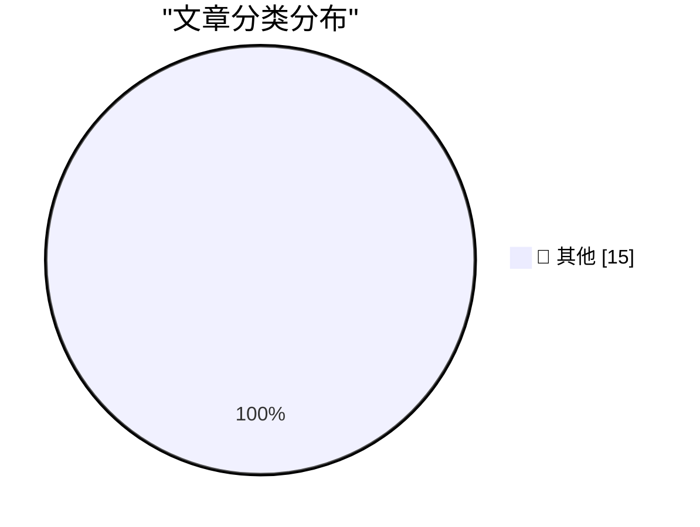

# 📰 AI 博客每日精选 — 2026-05-19

> 来自 Karpathy 推荐的 92 个顶级技术博客，AI 精选 Top 15

## 🏆 今日必读

🥇 **The last six months in LLMs in five minutes**

[The last six months in LLMs in five minutes](https://simonwillison.net/2026/May/19/5-minute-llms/#atom-everything) — simonwillison.net · 1 小时前 · 📝 其他

> The last six months in LLMs in five minutes

🥈 **Glaucous-winged Gull, Brown Pelican, Snowy Egret, Canada Goose**

[Glaucous-winged Gull, Brown Pelican, Snowy Egret, Canada Goose](https://simonwillison.net/2026/May/18/sighting-362781627/#atom-everything) — simonwillison.net · 11 小时前 · 📝 其他

> Glaucous-winged Gull, Brown Pelican, Snowy Egret, Canada Goose

🥉 **GDS weighs in on the NHS's decision to retreat from Open Source**

[GDS weighs in on the NHS's decision to retreat from Open Source](https://simonwillison.net/2026/May/17/gds-weighs-in/#atom-everything) — simonwillison.net · 1 天前 · 📝 其他

> GDS weighs in on the NHS's decision to retreat from Open Source

---

## 📊 数据概览

| 扫描源 | 抓取文章 | 时间范围 | 精选 |
|:---:|:---:|:---:|:---:|
| 81/92 | 2404 篇 → 28 篇 | 48h | **15 篇** |

### 分类分布

---

## 📝 其他

### 1. The last six months in LLMs in five minutes

[The last six months in LLMs in five minutes](https://simonwillison.net/2026/May/19/5-minute-llms/#atom-everything) — **simonwillison.net** · 1 小时前 · ⭐ 15/30

> The last six months in LLMs in five minutes

---

### 2. Glaucous-winged Gull, Brown Pelican, Snowy Egret, Canada Goose

[Glaucous-winged Gull, Brown Pelican, Snowy Egret, Canada Goose](https://simonwillison.net/2026/May/18/sighting-362781627/#atom-everything) — **simonwillison.net** · 11 小时前 · ⭐ 15/30

> Glaucous-winged Gull, Brown Pelican, Snowy Egret, Canada Goose

---

### 3. GDS weighs in on the NHS's decision to retreat from Open Source

[GDS weighs in on the NHS's decision to retreat from Open Source](https://simonwillison.net/2026/May/17/gds-weighs-in/#atom-everything) — **simonwillison.net** · 1 天前 · ⭐ 15/30

> GDS weighs in on the NHS's decision to retreat from Open Source

---

### 4. The just-say-no engineer was a ZIRP phenomenon

[The just-say-no engineer was a ZIRP phenomenon](https://seangoedecke.com/the-just-say-no-engineer-was-a-zirp-phenomenon/) — **seangoedecke.com** · 1 天前 · ⭐ 15/30

> The just-say-no engineer was a ZIRP phenomenon

---

### 5. CISA Admin Leaked AWS GovCloud Keys on Github

[CISA Admin Leaked AWS GovCloud Keys on Github](https://krebsonsecurity.com/2026/05/cisa-admin-leaked-aws-govcloud-keys-on-github/) — **krebsonsecurity.com** · 5 小时前 · ⭐ 15/30

> CISA Admin Leaked AWS GovCloud Keys on Github

---

### 6. [Sponsor] WorkOS: Agents Need Context. Ship the Integrations That Give It to Them.

[[Sponsor] WorkOS: Agents Need Context. Ship the Integrations That Give It to Them.](https://workos.com/docs/pipes?utm_source=daringfireball&amp;utm_medium=newsletter&amp;utm_campaign=q22026) — **daringfireball.net** · 43 分钟前 · ⭐ 15/30

> [Sponsor] WorkOS: Agents Need Context. Ship the Integrations That Give It to Them.

---

### 7. Jury Rejects Elon Musk’s Claim Against Sam Altman in Unanimous Verdict

[Jury Rejects Elon Musk’s Claim Against Sam Altman in Unanimous Verdict](https://www.nytimes.com/live/2026/05/18/technology/openai-trial-verdict-altman-musk?unlocked_article_code=1.jVA.Cc2V.IwYuu2r4SJfQ) — **daringfireball.net** · 8 小时前 · ⭐ 15/30

> Jury Rejects Elon Musk’s Claim Against Sam Altman in Unanimous Verdict

---

### 8. ‘John Appleseed’

[‘John Appleseed’](https://om.co/2026/04/20/john-appleseed/) — **daringfireball.net** · 8 小时前 · ⭐ 15/30

> ‘John Appleseed’

---

### 9. Define ‘Boom’ Please

[Define ‘Boom’ Please](https://www.nytimes.com/2026/04/21/business/how-apple-became-a-4-trillion-company-under-tim-cook.html?unlocked_article_code=1.jVA.MV8m.0JfUOJOME5WH) — **daringfireball.net** · 8 小时前 · ⭐ 15/30

> Define ‘Boom’ Please

---

### 10. Ted Turner’s Small Apartment Above the Former CNN Center

[Ted Turner’s Small Apartment Above the Former CNN Center](https://www.youtube.com/watch?v=OUIVs58oyPI) — **daringfireball.net** · 9 小时前 · ⭐ 15/30

> Ted Turner’s Small Apartment Above the Former CNN Center

---

### 11. Existing Stakeholders Have a Say in the Future

[Existing Stakeholders Have a Say in the Future](https://daringfireball.net/2026/05/ai_is_technology_not_a_product) — **daringfireball.net** · 9 小时前 · ⭐ 15/30

> Existing Stakeholders Have a Say in the Future

---

### 12. ‘AI, “Humanity”, and Dr. Manhattan Syndrome’

[‘AI, “Humanity”, and Dr. Manhattan Syndrome’](https://www.personfamiliar.com/p/ai-humanity-and-dr-manhattan-syndrome) — **daringfireball.net** · 9 小时前 · ⭐ 15/30

> ‘AI, “Humanity”, and Dr. Manhattan Syndrome’

---

### 13. The Alaska Permanent Fund as Loose Precedent for AI Data Center ‘UBI’ Payments

[The Alaska Permanent Fund as Loose Precedent for AI Data Center ‘UBI’ Payments](https://en.wikipedia.org/wiki/Alaska_Permanent_Fund) — **daringfireball.net** · 10 小时前 · ⭐ 15/30

> The Alaska Permanent Fund as Loose Precedent for AI Data Center ‘UBI’ Payments

---

### 14. AI Data Centers Are Deeply Unpopular, Across the Political Spectrum

[AI Data Centers Are Deeply Unpopular, Across the Political Spectrum](https://news.gallup.com/poll/709772/americans-oppose-data-centers-area.aspx) — **daringfireball.net** · 11 小时前 · ⭐ 15/30

> AI Data Centers Are Deeply Unpopular, Across the Political Spectrum

---

### 15. Drata

[Drata](https://drata.com/daring) — **daringfireball.net** · 1 天前 · ⭐ 15/30

> Drata

---

*生成于 2026-05-19 02:10 | 扫描 81 源 → 获取 2404 篇 → 精选 15 篇*
*基于 [Hacker News Popularity Contest 2025](https://refactoringenglish.com/tools/hn-popularity/) RSS 源列表，由 [Andrej Karpathy](https://x.com/karpathy) 推荐*
*由「懂点儿AI」制作，欢迎关注同名微信公众号获取更多 AI 实用技巧 💡*
