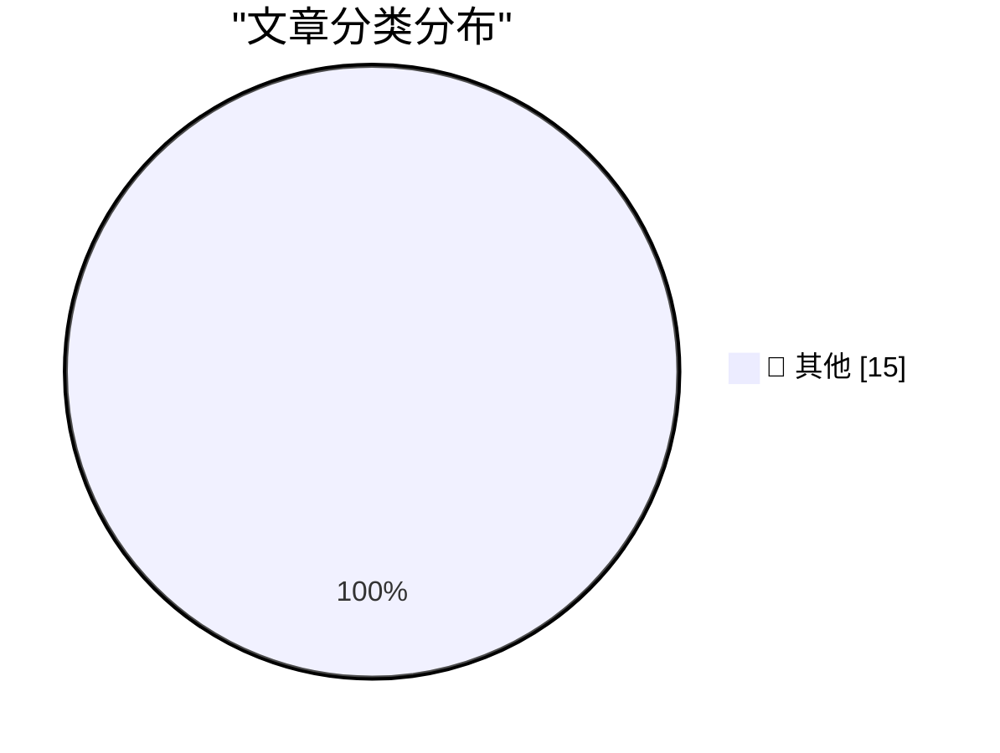

# 📰 AI 博客每日精选 — 2026-05-20

> 来自 Karpathy 推荐的 92 个顶级技术博客，AI 精选 Top 15

## 🏆 今日必读

🥇 **llm-gemini 0.32**

[llm-gemini 0.32](https://simonwillison.net/2026/May/19/llm-gemini-2/#atom-everything) — simonwillison.net · 2 小时前 · 📝 其他

> llm-gemini 0.32

🥈 **Gemini 3.5 Flash: more expensive, but Google plan to use it for everything**

[Gemini 3.5 Flash: more expensive, but Google plan to use it for everything](https://simonwillison.net/2026/May/19/gemini-35-flash/#atom-everything) — simonwillison.net · 3 小时前 · 📝 其他

> Gemini 3.5 Flash: more expensive, but Google plan to use it for everything

🥉 **datasette-llm-accountant 0.1a4**

[datasette-llm-accountant 0.1a4](https://simonwillison.net/2026/May/19/datasette-llm-accountant/#atom-everything) — simonwillison.net · 5 小时前 · 📝 其他

> datasette-llm-accountant 0.1a4

---

## 📊 数据概览

| 扫描源 | 抓取文章 | 时间范围 | 精选 |
|:---:|:---:|:---:|:---:|
| 81/92 | 2424 篇 → 36 篇 | 48h | **15 篇** |

### 分类分布

---

## 📝 其他

### 1. llm-gemini 0.32

[llm-gemini 0.32](https://simonwillison.net/2026/May/19/llm-gemini-2/#atom-everything) — **simonwillison.net** · 2 小时前 · ⭐ 15/30

> llm-gemini 0.32

---

### 2. Gemini 3.5 Flash: more expensive, but Google plan to use it for everything

[Gemini 3.5 Flash: more expensive, but Google plan to use it for everything](https://simonwillison.net/2026/May/19/gemini-35-flash/#atom-everything) — **simonwillison.net** · 3 小时前 · ⭐ 15/30

> Gemini 3.5 Flash: more expensive, but Google plan to use it for everything

---

### 3. datasette-llm-accountant 0.1a4

[datasette-llm-accountant 0.1a4](https://simonwillison.net/2026/May/19/datasette-llm-accountant/#atom-everything) — **simonwillison.net** · 5 小时前 · ⭐ 15/30

> datasette-llm-accountant 0.1a4

---

### 4. llm-gemini 0.32a0

[llm-gemini 0.32a0](https://simonwillison.net/2026/May/19/llm-gemini/#atom-everything) — **simonwillison.net** · 5 小时前 · ⭐ 15/30

> llm-gemini 0.32a0

---

### 5. datasette-llm 0.1a8

[datasette-llm 0.1a8](https://simonwillison.net/2026/May/19/datasette-llm/#atom-everything) — **simonwillison.net** · 5 小时前 · ⭐ 15/30

> datasette-llm 0.1a8

---

### 6. The last six months in LLMs in five minutes

[The last six months in LLMs in five minutes](https://simonwillison.net/2026/May/19/5-minute-llms/#atom-everything) — **simonwillison.net** · 1 天前 · ⭐ 15/30

> The last six months in LLMs in five minutes

---

### 7. Glaucous-winged Gull, Brown Pelican, Snowy Egret, Canada Goose

[Glaucous-winged Gull, Brown Pelican, Snowy Egret, Canada Goose](https://simonwillison.net/2026/May/18/sighting-362781627/#atom-everything) — **simonwillison.net** · 1 天前 · ⭐ 15/30

> Glaucous-winged Gull, Brown Pelican, Snowy Egret, Canada Goose

---

### 8. Wi-Wi Is Wireless Time Sync at 1 nanosecond

[Wi-Wi Is Wireless Time Sync at 1 nanosecond](https://www.jeffgeerling.com/blog/2026/wi-wi-is-wireless-time-sync-less-than-5ns/) — **jeffgeerling.com** · 12 小时前 · ⭐ 15/30

> Wi-Wi Is Wireless Time Sync at 1 nanosecond

---

### 9. CISA Admin Leaked AWS GovCloud Keys on Github

[CISA Admin Leaked AWS GovCloud Keys on Github](https://krebsonsecurity.com/2026/05/cisa-admin-leaked-aws-govcloud-keys-on-github/) — **krebsonsecurity.com** · 1 天前 · ⭐ 15/30

> CISA Admin Leaked AWS GovCloud Keys on Github

---

### 10. Andrej Karpathy Joined Anthropic

[Andrej Karpathy Joined Anthropic](https://x.com/karpathy/status/2056753169888334312) — **daringfireball.net** · 10 小时前 · ⭐ 15/30

> Andrej Karpathy Joined Anthropic

---

### 11. [Sponsor] WorkOS: Agents Need Context. Ship the Integrations That Give It to Them.

[[Sponsor] WorkOS: Agents Need Context. Ship the Integrations That Give It to Them.](https://workos.com/docs/pipes?utm_source=daringfireball&amp;utm_medium=newsletter&amp;utm_campaign=q22026) — **daringfireball.net** · 1 天前 · ⭐ 15/30

> [Sponsor] WorkOS: Agents Need Context. Ship the Integrations That Give It to Them.

---

### 12. Jury Rejects Elon Musk’s Claim Against Sam Altman in Unanimous Verdict

[Jury Rejects Elon Musk’s Claim Against Sam Altman in Unanimous Verdict](https://www.nytimes.com/live/2026/05/18/technology/openai-trial-verdict-altman-musk?unlocked_article_code=1.jVA.Cc2V.IwYuu2r4SJfQ) — **daringfireball.net** · 1 天前 · ⭐ 15/30

> Jury Rejects Elon Musk’s Claim Against Sam Altman in Unanimous Verdict

---

### 13. ‘John Appleseed’

[‘John Appleseed’](https://om.co/2026/04/20/john-appleseed/) — **daringfireball.net** · 1 天前 · ⭐ 15/30

> ‘John Appleseed’

---

### 14. Define ‘Boom’ Please

[Define ‘Boom’ Please](https://www.nytimes.com/2026/04/21/business/how-apple-became-a-4-trillion-company-under-tim-cook.html?unlocked_article_code=1.jVA.MV8m.0JfUOJOME5WH) — **daringfireball.net** · 1 天前 · ⭐ 15/30

> Define ‘Boom’ Please

---

### 15. Ted Turner’s Small Apartment Above the Former CNN Center

[Ted Turner’s Small Apartment Above the Former CNN Center](https://www.youtube.com/watch?v=OUIVs58oyPI) — **daringfireball.net** · 1 天前 · ⭐ 15/30

> Ted Turner’s Small Apartment Above the Former CNN Center

---

*生成于 2026-05-20 02:08 | 扫描 81 源 → 获取 2424 篇 → 精选 15 篇*
*基于 [Hacker News Popularity Contest 2025](https://refactoringenglish.com/tools/hn-popularity/) RSS 源列表，由 [Andrej Karpathy](https://x.com/karpathy) 推荐*
*由「懂点儿AI」制作，欢迎关注同名微信公众号获取更多 AI 实用技巧 💡*
