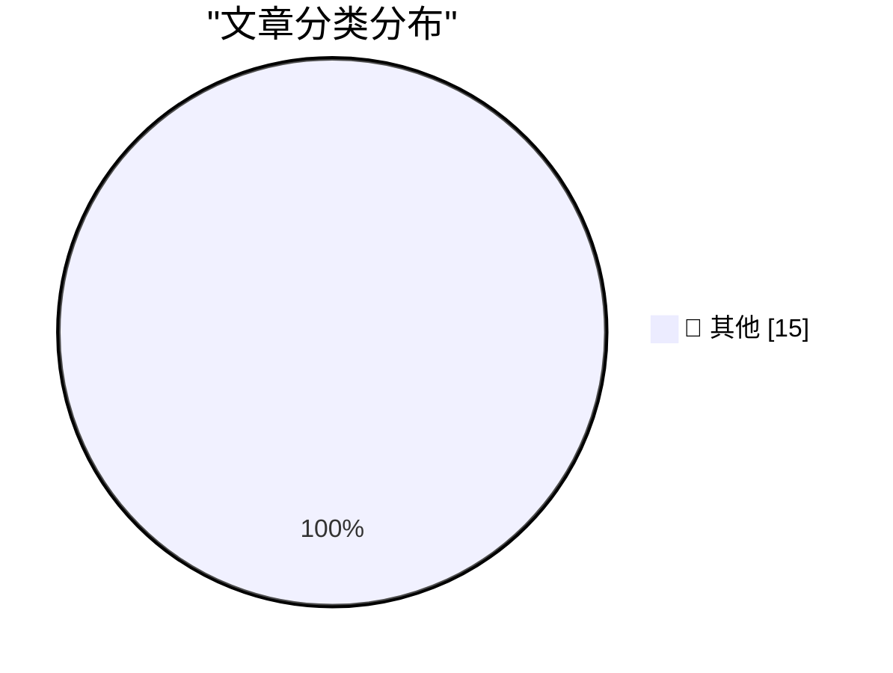

# 📰 AI 博客每日精选 — 2026-05-22

> 来自 Karpathy 推荐的 92 个顶级技术博客，AI 精选 Top 15

## 🏆 今日必读

🥇 **Datasette Agent**

[Datasette Agent](https://simonwillison.net/2026/May/21/datasette-agent/#atom-everything) — simonwillison.net · 6 小时前 · 📝 其他

> Datasette Agent

🥈 **datasette-agent-sprites 0.1a0**

[datasette-agent-sprites 0.1a0](https://simonwillison.net/2026/May/21/datasette-agent-sprites/#atom-everything) — simonwillison.net · 7 小时前 · 📝 其他

> datasette-agent-sprites 0.1a0

🥉 **datasette-agent-charts 0.1a2**

[datasette-agent-charts 0.1a2](https://simonwillison.net/2026/May/21/datasette-agent-charts/#atom-everything) — simonwillison.net · 10 小时前 · 📝 其他

> datasette-agent-charts 0.1a2

---

## 📊 数据概览

| 扫描源 | 抓取文章 | 时间范围 | 精选 |
|:---:|:---:|:---:|:---:|
| 82/92 | 2451 篇 → 41 篇 | 48h | **15 篇** |

### 分类分布

---

## 📝 其他

### 1. Datasette Agent

[Datasette Agent](https://simonwillison.net/2026/May/21/datasette-agent/#atom-everything) — **simonwillison.net** · 6 小时前 · ⭐ 15/30

> Datasette Agent

---

### 2. datasette-agent-sprites 0.1a0

[datasette-agent-sprites 0.1a0](https://simonwillison.net/2026/May/21/datasette-agent-sprites/#atom-everything) — **simonwillison.net** · 7 小时前 · ⭐ 15/30

> datasette-agent-sprites 0.1a0

---

### 3. datasette-agent-charts 0.1a2

[datasette-agent-charts 0.1a2](https://simonwillison.net/2026/May/21/datasette-agent-charts/#atom-everything) — **simonwillison.net** · 10 小时前 · ⭐ 15/30

> datasette-agent-charts 0.1a2

---

### 4. datasette-agent 0.1a3

[datasette-agent 0.1a3](https://simonwillison.net/2026/May/21/datasette-agent-2/#atom-everything) — **simonwillison.net** · 11 小时前 · ⭐ 15/30

> datasette-agent 0.1a3

---

### 5. Quoting SpaceX S-1

[Quoting SpaceX S-1](https://simonwillison.net/2026/May/20/spacex-s1/#atom-everything) — **simonwillison.net** · 1 天前 · ⭐ 15/30

> Quoting SpaceX S-1

---

### 6. How fast is 10 tokens per second really?

[How fast is 10 tokens per second really?](https://simonwillison.net/2026/May/20/tokens-per-second/#atom-everything) — **simonwillison.net** · 1 天前 · ⭐ 15/30

> How fast is 10 tokens per second really?

---

### 7. Google I/O, Gemini Spark, Antigravity

[Google I/O, Gemini Spark, Antigravity](https://simonwillison.net/2026/May/20/google-io/#atom-everything) — **simonwillison.net** · 1 天前 · ⭐ 15/30

> Google I/O, Gemini Spark, Antigravity

---

### 8. datasette-agent-charts 0.1a1

[datasette-agent-charts 0.1a1](https://simonwillison.net/2026/May/20/datasette-agent-charts/#atom-everything) — **simonwillison.net** · 1 天前 · ⭐ 15/30

> datasette-agent-charts 0.1a1

---

### 9. The famous o3 "GeoGuessr" prompt did not work

[The famous o3 "GeoGuessr" prompt did not work](https://seangoedecke.com/the-o3-geoguessr-prompt-did-not-work/) — **seangoedecke.com** · 1 天前 · ⭐ 15/30

> The famous o3 "GeoGuessr" prompt did not work

---

### 10. Alleged Kimwolf Botmaster ‘Dort’ Arrested, Charged in U.S. and Canada

[Alleged Kimwolf Botmaster ‘Dort’ Arrested, Charged in U.S. and Canada](https://krebsonsecurity.com/2026/05/alleged-kimwolf-botmaster-dort-arrested-charged-in-u-s-and-canada/) — **krebsonsecurity.com** · 4 小时前 · ⭐ 15/30

> Alleged Kimwolf Botmaster ‘Dort’ Arrested, Charged in U.S. and Canada

---

### 11. Apple Seeks Supreme Court Review of Contempt Finding and Injunction Scope in Epic Games Case

[Apple Seeks Supreme Court Review of Contempt Finding and Injunction Scope in Epic Games Case](https://9to5mac.com/2026/05/21/apple-seeks-supreme-court-review-of-contempt-finding-and-injunction-scope-in-epic-games-case/) — **daringfireball.net** · 1 小时前 · ⭐ 15/30

> Apple Seeks Supreme Court Review of Contempt Finding and Injunction Scope in Epic Games Case

---

### 12. Apple TV to Broadcast Entire MLS Match Shot Using iPhones

[Apple TV to Broadcast Entire MLS Match Shot Using iPhones](https://www.apple.com/newsroom/2026/05/apple-tv-to-air-first-major-live-pro-sports-event-shot-on-iphone-17-pro/) — **daringfireball.net** · 2 小时前 · ⭐ 15/30

> Apple TV to Broadcast Entire MLS Match Shot Using iPhones

---

### 13. Apple Sports Expands to More Than 90 New Countries on Cusp of World Cup

[Apple Sports Expands to More Than 90 New Countries on Cusp of World Cup](https://www.apple.com/newsroom/2026/05/apple-sports-expands-to-more-than-90-new-countries-and-regions/) — **daringfireball.net** · 6 小时前 · ⭐ 15/30

> Apple Sports Expands to More Than 90 New Countries on Cusp of World Cup

---

### 14. Google I/O Keynote in 54 Seconds

[Google I/O Keynote in 54 Seconds](https://x.com/ArtemR/status/2056961743142957143) — **daringfireball.net** · 10 小时前 · ⭐ 15/30

> Google I/O Keynote in 54 Seconds

---

### 15. ‘Geography Is Four-Dimensional’

[‘Geography Is Four-Dimensional’](https://sive.rs/4d) — **daringfireball.net** · 11 小时前 · ⭐ 15/30

> ‘Geography Is Four-Dimensional’

---

*生成于 2026-05-22 02:10 | 扫描 82 源 → 获取 2451 篇 → 精选 15 篇*
*基于 [Hacker News Popularity Contest 2025](https://refactoringenglish.com/tools/hn-popularity/) RSS 源列表，由 [Andrej Karpathy](https://x.com/karpathy) 推荐*
*由「懂点儿AI」制作，欢迎关注同名微信公众号获取更多 AI 实用技巧 💡*
