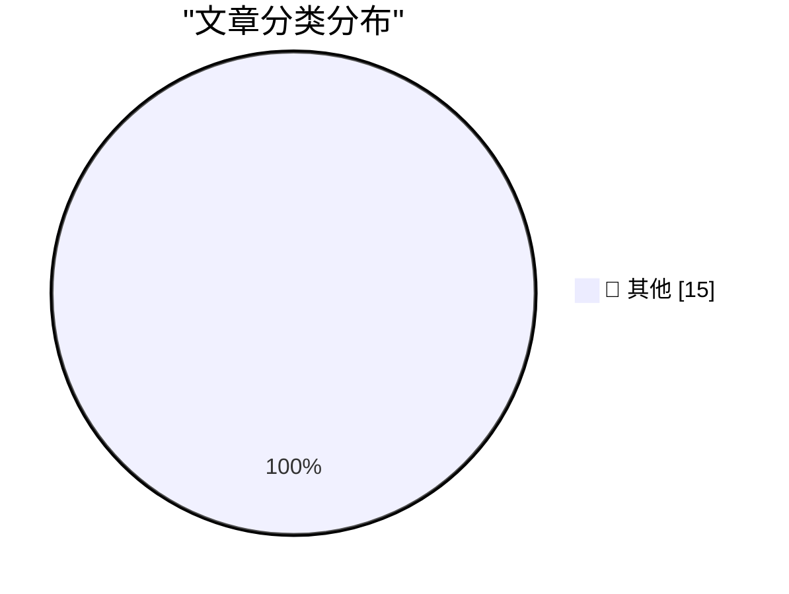

# 📰 AI 博客每日精选 — 2026-05-23

> 来自 Karpathy 推荐的 92 个顶级技术博客，AI 精选 Top 15

## 🏆 今日必读

🥇 **The memory shortage is causing a repricing of consumer electronics**

[The memory shortage is causing a repricing of consumer electronics](https://simonwillison.net/2026/May/22/memory-shortage/#atom-everything) — simonwillison.net · 3 小时前 · 📝 其他

> The memory shortage is causing a repricing of consumer electronics

🥈 **FTC to Require Cox Media Group, Two Other Firms to Pay Nearly $1 Million to Settle Charges They Deceived Customers About “Active Listening” AI-Powered Marketing Service**

[FTC to Require Cox Media Group, Two Other Firms to Pay Nearly $1 Million to Settle Charges They Deceived Customers About “Active Listening” AI-Powered Marketing Service](https://simonwillison.net/2026/May/22/ftc-active-listening/#atom-everything) — simonwillison.net · 21 小时前 · 📝 其他

> FTC to Require Cox Media Group, Two Other Firms to Pay Nearly $1 Million to Settle Charges They Deceived Customers About “Active Listening” AI-Powered Marketing Service

🥉 **Datasette Agent**

[Datasette Agent](https://simonwillison.net/2026/May/21/datasette-agent/#atom-everything) — simonwillison.net · 1 天前 · 📝 其他

> Datasette Agent

---

## 📊 数据概览

| 扫描源 | 抓取文章 | 时间范围 | 精选 |
|:---:|:---:|:---:|:---:|
| 84/92 | 2482 篇 → 40 篇 | 48h | **15 篇** |

### 分类分布

---

## 📝 其他

### 1. The memory shortage is causing a repricing of consumer electronics

[The memory shortage is causing a repricing of consumer electronics](https://simonwillison.net/2026/May/22/memory-shortage/#atom-everything) — **simonwillison.net** · 3 小时前 · ⭐ 15/30

> The memory shortage is causing a repricing of consumer electronics

---

### 2. FTC to Require Cox Media Group, Two Other Firms to Pay Nearly $1 Million to Settle Charges They Deceived Customers About “Active Listening” AI-Powered Marketing Service

[FTC to Require Cox Media Group, Two Other Firms to Pay Nearly $1 Million to Settle Charges They Deceived Customers About “Active Listening” AI-Powered Marketing Service](https://simonwillison.net/2026/May/22/ftc-active-listening/#atom-everything) — **simonwillison.net** · 21 小时前 · ⭐ 15/30

> FTC to Require Cox Media Group, Two Other Firms to Pay Nearly $1 Million to Settle Charges They Deceived Customers About “Active Listening” AI-Powered Marketing Service

---

### 3. Datasette Agent

[Datasette Agent](https://simonwillison.net/2026/May/21/datasette-agent/#atom-everything) — **simonwillison.net** · 1 天前 · ⭐ 15/30

> Datasette Agent

---

### 4. datasette-agent-sprites 0.1a0

[datasette-agent-sprites 0.1a0](https://simonwillison.net/2026/May/21/datasette-agent-sprites/#atom-everything) — **simonwillison.net** · 1 天前 · ⭐ 15/30

> datasette-agent-sprites 0.1a0

---

### 5. datasette-agent-charts 0.1a2

[datasette-agent-charts 0.1a2](https://simonwillison.net/2026/May/21/datasette-agent-charts/#atom-everything) — **simonwillison.net** · 1 天前 · ⭐ 15/30

> datasette-agent-charts 0.1a2

---

### 6. datasette-agent 0.1a3

[datasette-agent 0.1a3](https://simonwillison.net/2026/May/21/datasette-agent-2/#atom-everything) — **simonwillison.net** · 1 天前 · ⭐ 15/30

> datasette-agent 0.1a3

---

### 7. News about Raspberry Pi 6 and Microcontroller Development

[News about Raspberry Pi 6 and Microcontroller Development](https://www.jeffgeerling.com/blog/2026/news-about-raspberry-pi-6-and-microcontroller-development/) — **jeffgeerling.com** · 5 小时前 · ⭐ 15/30

> News about Raspberry Pi 6 and Microcontroller Development

---

### 8. Lawmakers Demand Answers as CISA Tries to Contain Data Leak

[Lawmakers Demand Answers as CISA Tries to Contain Data Leak](https://krebsonsecurity.com/2026/05/lawmakers-demand-answers-as-cisa-tries-to-contain-data-leak/) — **krebsonsecurity.com** · 9 小时前 · ⭐ 15/30

> Lawmakers Demand Answers as CISA Tries to Contain Data Leak

---

### 9. Alleged Kimwolf Botmaster ‘Dort’ Arrested, Charged in U.S. and Canada

[Alleged Kimwolf Botmaster ‘Dort’ Arrested, Charged in U.S. and Canada](https://krebsonsecurity.com/2026/05/alleged-kimwolf-botmaster-dort-arrested-charged-in-u-s-and-canada/) — **krebsonsecurity.com** · 1 天前 · ⭐ 15/30

> Alleged Kimwolf Botmaster ‘Dort’ Arrested, Charged in U.S. and Canada

---

### 10. ★ The Fonts of the U.S. Federal Courts

[★ The Fonts of the U.S. Federal Courts](https://daringfireball.net/2026/05/the_fonts_of_the_us_federal_courts) — **daringfireball.net** · 5 小时前 · ⭐ 15/30

> ★ The Fonts of the U.S. Federal Courts

---

### 11. The Ninth Circuit Appeal Ruling in ‘Epic v. Apple’ That Apple Is Seeking to Overturn at the Supreme Court (PDF)

[The Ninth Circuit Appeal Ruling in ‘Epic v. Apple’ That Apple Is Seeking to Overturn at the Supreme Court (PDF)](https://cdn.ca9.uscourts.gov/datastore/opinions/2025/12/11/25-2935.pdf) — **daringfireball.net** · 8 小时前 · ⭐ 15/30

> The Ninth Circuit Appeal Ruling in ‘Epic v. Apple’ That Apple Is Seeking to Overturn at the Supreme Court (PDF)

---

### 12. Zero Sum Problems and Apple Sports

[Zero Sum Problems and Apple Sports](https://kieranhealy.org/blog/archives/2026/05/21/zero-sum-problems/) — **daringfireball.net** · 8 小时前 · ⭐ 15/30

> Zero Sum Problems and Apple Sports

---

### 13. Stephen Colbert’s ‘The Late Show’ Finale

[Stephen Colbert’s ‘The Late Show’ Finale](https://www.nytimes.com/2026/05/22/arts/television/colbert-last-late-show.html?unlocked_article_code=1.kVA.GO3I.gVq9KeUrHEyM) — **daringfireball.net** · 8 小时前 · ⭐ 15/30

> Stephen Colbert’s ‘The Late Show’ Finale

---

### 14. Apple Seeks Supreme Court Review of Contempt Finding and Injunction Scope in Epic Games Case

[Apple Seeks Supreme Court Review of Contempt Finding and Injunction Scope in Epic Games Case](https://9to5mac.com/2026/05/21/apple-seeks-supreme-court-review-of-contempt-finding-and-injunction-scope-in-epic-games-case/) — **daringfireball.net** · 1 天前 · ⭐ 15/30

> Apple Seeks Supreme Court Review of Contempt Finding and Injunction Scope in Epic Games Case

---

### 15. Apple TV to Broadcast Entire MLS Match Shot Using iPhones

[Apple TV to Broadcast Entire MLS Match Shot Using iPhones](https://www.apple.com/newsroom/2026/05/apple-tv-to-air-first-major-live-pro-sports-event-shot-on-iphone-17-pro/) — **daringfireball.net** · 1 天前 · ⭐ 15/30

> Apple TV to Broadcast Entire MLS Match Shot Using iPhones

---

*生成于 2026-05-23 01:57 | 扫描 84 源 → 获取 2482 篇 → 精选 15 篇*
*基于 [Hacker News Popularity Contest 2025](https://refactoringenglish.com/tools/hn-popularity/) RSS 源列表，由 [Andrej Karpathy](https://x.com/karpathy) 推荐*
*由「懂点儿AI」制作，欢迎关注同名微信公众号获取更多 AI 实用技巧 💡*
