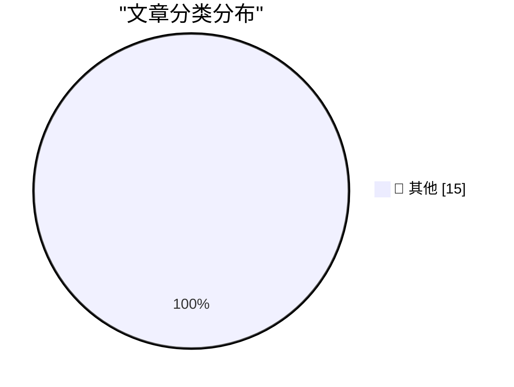

# 📰 AI 博客每日精选 — 2026-05-24

> 来自 Karpathy 推荐的 92 个顶级技术博客，AI 精选 Top 15

## 🏆 今日必读

🥇 **On the <dl>**

[On the <dl>](https://simonwillison.net/2026/May/23/on-the-dl/#atom-everything) — simonwillison.net · 5 小时前 · 📝 其他

> On the <dl>

🥈 **The memory shortage is causing a repricing of consumer electronics**

[The memory shortage is causing a repricing of consumer electronics](https://simonwillison.net/2026/May/22/memory-shortage/#atom-everything) — simonwillison.net · 1 天前 · 📝 其他

> The memory shortage is causing a repricing of consumer electronics

🥉 **FTC to Require Cox Media Group, Two Other Firms to Pay Nearly $1 Million to Settle Charges They Deceived Customers About “Active Listening” AI-Powered Marketing Service**

[FTC to Require Cox Media Group, Two Other Firms to Pay Nearly $1 Million to Settle Charges They Deceived Customers About “Active Listening” AI-Powered Marketing Service](https://simonwillison.net/2026/May/22/ftc-active-listening/#atom-everything) — simonwillison.net · 1 天前 · 📝 其他

> FTC to Require Cox Media Group, Two Other Firms to Pay Nearly $1 Million to Settle Charges They Deceived Customers About “Active Listening” AI-Powered Marketing Service

---

## 📊 数据概览

| 扫描源 | 抓取文章 | 时间范围 | 精选 |
|:---:|:---:|:---:|:---:|
| 84/92 | 2484 篇 → 29 篇 | 48h | **15 篇** |

### 分类分布

---

## 📝 其他

### 1. On the <dl>

[On the <dl>](https://simonwillison.net/2026/May/23/on-the-dl/#atom-everything) — **simonwillison.net** · 5 小时前 · ⭐ 15/30

> On the <dl>

---

### 2. The memory shortage is causing a repricing of consumer electronics

[The memory shortage is causing a repricing of consumer electronics](https://simonwillison.net/2026/May/22/memory-shortage/#atom-everything) — **simonwillison.net** · 1 天前 · ⭐ 15/30

> The memory shortage is causing a repricing of consumer electronics

---

### 3. FTC to Require Cox Media Group, Two Other Firms to Pay Nearly $1 Million to Settle Charges They Deceived Customers About “Active Listening” AI-Powered Marketing Service

[FTC to Require Cox Media Group, Two Other Firms to Pay Nearly $1 Million to Settle Charges They Deceived Customers About “Active Listening” AI-Powered Marketing Service](https://simonwillison.net/2026/May/22/ftc-active-listening/#atom-everything) — **simonwillison.net** · 1 天前 · ⭐ 15/30

> FTC to Require Cox Media Group, Two Other Firms to Pay Nearly $1 Million to Settle Charges They Deceived Customers About “Active Listening” AI-Powered Marketing Service

---

### 4. News about Raspberry Pi 6 and Microcontroller Development

[News about Raspberry Pi 6 and Microcontroller Development](https://www.jeffgeerling.com/blog/2026/news-about-raspberry-pi-6-and-microcontroller-development/) — **jeffgeerling.com** · 1 天前 · ⭐ 15/30

> News about Raspberry Pi 6 and Microcontroller Development

---

### 5. Lawmakers Demand Answers as CISA Tries to Contain Data Leak

[Lawmakers Demand Answers as CISA Tries to Contain Data Leak](https://krebsonsecurity.com/2026/05/lawmakers-demand-answers-as-cisa-tries-to-contain-data-leak/) — **krebsonsecurity.com** · 1 天前 · ⭐ 15/30

> Lawmakers Demand Answers as CISA Tries to Contain Data Leak

---

### 6. ★ The Fonts of the U.S. Federal Courts

[★ The Fonts of the U.S. Federal Courts](https://daringfireball.net/2026/05/the_fonts_of_the_us_federal_courts) — **daringfireball.net** · 1 天前 · ⭐ 15/30

> ★ The Fonts of the U.S. Federal Courts

---

### 7. The Ninth Circuit Appeal Ruling in ‘Epic v. Apple’ That Apple Is Seeking to Overturn at the Supreme Court (PDF)

[The Ninth Circuit Appeal Ruling in ‘Epic v. Apple’ That Apple Is Seeking to Overturn at the Supreme Court (PDF)](https://cdn.ca9.uscourts.gov/datastore/opinions/2025/12/11/25-2935.pdf) — **daringfireball.net** · 1 天前 · ⭐ 15/30

> The Ninth Circuit Appeal Ruling in ‘Epic v. Apple’ That Apple Is Seeking to Overturn at the Supreme Court (PDF)

---

### 8. Zero Sum Problems and Apple Sports

[Zero Sum Problems and Apple Sports](https://kieranhealy.org/blog/archives/2026/05/21/zero-sum-problems/) — **daringfireball.net** · 1 天前 · ⭐ 15/30

> Zero Sum Problems and Apple Sports

---

### 9. Stephen Colbert’s ‘The Late Show’ Finale

[Stephen Colbert’s ‘The Late Show’ Finale](https://www.nytimes.com/2026/05/22/arts/television/colbert-last-late-show.html?unlocked_article_code=1.kVA.GO3I.gVq9KeUrHEyM) — **daringfireball.net** · 1 天前 · ⭐ 15/30

> Stephen Colbert’s ‘The Late Show’ Finale

---

### 10. The commencement speech that shook the world

[The commencement speech that shook the world](https://idiallo.com/blog/the-commencement-speech-that-shook-the-world?src=feed) — **idiallo.com** · 1 天前 · ⭐ 15/30

> The commencement speech that shook the world

---

### 11. How to Talk to Your Coworkers

[How to Talk to Your Coworkers](https://idiallo.com/blog/how-to-talk-to-your-coworkers?src=feed) — **idiallo.com** · 1 天前 · ⭐ 15/30

> How to Talk to Your Coworkers

---

### 12. Which age-gates should be skill-gates and vice-versa?

[Which age-gates should be skill-gates and vice-versa?](https://shkspr.mobi/blog/2026/05/which-age-gates-should-be-skill-gates-and-vice-versa/) — **shkspr.mobi** · 14 小时前 · ⭐ 15/30

> Which age-gates should be skill-gates and vice-versa?

---

### 13. Why do you say that a COM STA thread must pump messages if I see sample code creating STA threads and not pumping messages?

[Why do you say that a COM STA thread must pump messages if I see sample code creating STA threads and not pumping messages?](https://devblogs.microsoft.com/oldnewthing/20260522-00/?p=112348) — **devblogs.microsoft.com/oldnewthing** · 1 天前 · ⭐ 15/30

> Why do you say that a COM STA thread must pump messages if I see sample code creating STA threads and not pumping messages?

---

### 14. Reverse engineering circuitry in a Spacelab computer from 1980

[Reverse engineering circuitry in a Spacelab computer from 1980](http://www.righto.com/feeds/872292081485114047/comments/default) — **righto.com** · 9 小时前 · ⭐ 15/30

> Reverse engineering circuitry in a Spacelab computer from 1980

---

### 15. Hilbert transform as an infinite matrix

[Hilbert transform as an infinite matrix](https://www.johndcook.com/blog/2026/05/23/hilbert-transform-as-an-infinite-matrix/) — **johndcook.com** · 10 小时前 · ⭐ 15/30

> Hilbert transform as an infinite matrix

---

*生成于 2026-05-24 02:05 | 扫描 84 源 → 获取 2484 篇 → 精选 15 篇*
*基于 [Hacker News Popularity Contest 2025](https://refactoringenglish.com/tools/hn-popularity/) RSS 源列表，由 [Andrej Karpathy](https://x.com/karpathy) 推荐*
*由「懂点儿AI」制作，欢迎关注同名微信公众号获取更多 AI 实用技巧 💡*
