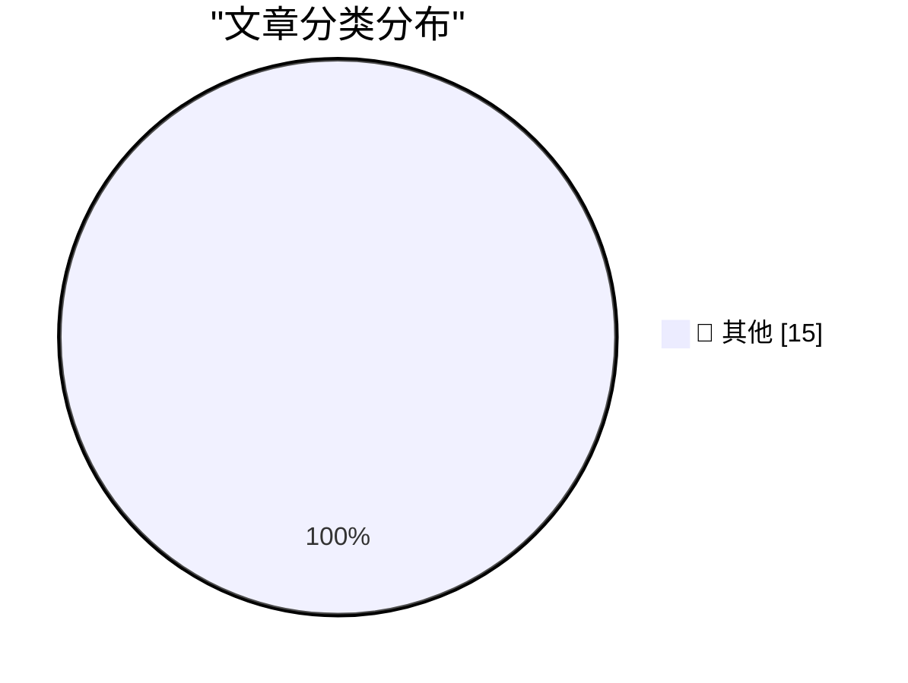

# 📰 AI 博客每日精选 — 2026-05-25

> 来自 Karpathy 推荐的 92 个顶级技术博客，AI 精选 Top 15

## 🏆 今日必读

🥇 **datasette 1.0a30**

[datasette 1.0a30](https://simonwillison.net/2026/May/24/datasette/#atom-everything) — simonwillison.net · 2 小时前 · 📝 其他

> datasette 1.0a30

🥈 **datasette-agent 0.1a4**

[datasette-agent 0.1a4](https://simonwillison.net/2026/May/24/datasette-agent/#atom-everything) — simonwillison.net · 2 小时前 · 📝 其他

> datasette-agent 0.1a4

🥉 **datasette-fixtures 0.1a0**

[datasette-fixtures 0.1a0](https://simonwillison.net/2026/May/24/datasette-fixtures/#atom-everything) — simonwillison.net · 4 小时前 · 📝 其他

> datasette-fixtures 0.1a0

---

## 📊 数据概览

| 扫描源 | 抓取文章 | 时间范围 | 精选 |
|:---:|:---:|:---:|:---:|
| 82/92 | 2444 篇 → 24 篇 | 48h | **15 篇** |

### 分类分布

---

## 📝 其他

### 1. datasette 1.0a30

[datasette 1.0a30](https://simonwillison.net/2026/May/24/datasette/#atom-everything) — **simonwillison.net** · 2 小时前 · ⭐ 15/30

> datasette 1.0a30

---

### 2. datasette-agent 0.1a4

[datasette-agent 0.1a4](https://simonwillison.net/2026/May/24/datasette-agent/#atom-everything) — **simonwillison.net** · 2 小时前 · ⭐ 15/30

> datasette-agent 0.1a4

---

### 3. datasette-fixtures 0.1a0

[datasette-fixtures 0.1a0](https://simonwillison.net/2026/May/24/datasette-fixtures/#atom-everything) — **simonwillison.net** · 4 小时前 · ⭐ 15/30

> datasette-fixtures 0.1a0

---

### 4. Quoting Armin Ronacher

[Quoting Armin Ronacher](https://simonwillison.net/2026/May/24/armin-ronacher/#atom-everything) — **simonwillison.net** · 7 小时前 · ⭐ 15/30

> Quoting Armin Ronacher

---

### 5. Mad House — Usborne Creepy Computer Games

[Mad House — Usborne Creepy Computer Games](https://simonwillison.net/2026/May/24/usborne-mad-house/#atom-everything) — **simonwillison.net** · 8 小时前 · ⭐ 15/30

> Mad House — Usborne Creepy Computer Games

---

### 6. On the <dl>

[On the <dl>](https://simonwillison.net/2026/May/23/on-the-dl/#atom-everything) — **simonwillison.net** · 1 天前 · ⭐ 15/30

> On the <dl>

---

### 7. Why Steve Kerr Stayed With the Warriors

[Why Steve Kerr Stayed With the Warriors](https://www.espn.com/nba/story/_/id/48686303/steve-kerr-decision-return-coach-golden-state-warriors-steph-curry) — **daringfireball.net** · 8 小时前 · ⭐ 15/30

> Why Steve Kerr Stayed With the Warriors

---

### 8. Which age-gates should be skill-gates and vice-versa?

[Which age-gates should be skill-gates and vice-versa?](https://shkspr.mobi/blog/2026/05/which-age-gates-should-be-skill-gates-and-vice-versa/) — **shkspr.mobi** · 1 天前 · ⭐ 15/30

> Which age-gates should be skill-gates and vice-versa?

---

### 9. Reverse engineering circuitry in a Spacelab computer from 1980

[Reverse engineering circuitry in a Spacelab computer from 1980](http://www.righto.com/feeds/872292081485114047/comments/default) — **righto.com** · 1 天前 · ⭐ 15/30

> Reverse engineering circuitry in a Spacelab computer from 1980

---

### 10. Building Pi With Pi

[Building Pi With Pi](https://lucumr.pocoo.org/2026/5/24/pi-oss/) — **lucumr.pocoo.org** · 1 天前 · ⭐ 15/30

> Building Pi With Pi

---

### 11. Hilbert transform as an infinite matrix

[Hilbert transform as an infinite matrix](https://www.johndcook.com/blog/2026/05/23/hilbert-transform-as-an-infinite-matrix/) — **johndcook.com** · 1 天前 · ⭐ 15/30

> Hilbert transform as an infinite matrix

---

### 12. Real and imaginary parts

[Real and imaginary parts](https://www.johndcook.com/blog/2026/05/23/real-and-imaginary-parts/) — **johndcook.com** · 1 天前 · ⭐ 15/30

> Real and imaginary parts

---

### 13. Building complex functions out of real parts

[Building complex functions out of real parts](https://www.johndcook.com/blog/2026/05/22/complex-functions-real-parts/) — **johndcook.com** · 1 天前 · ⭐ 15/30

> Building complex functions out of real parts

---

### 14. Why I can't stand the word "driven"

[Why I can't stand the word "driven"](https://www.joanwestenberg.com/why-i-cant-stand-the-word-driven/) — **joanwestenberg.com** · 2 小时前 · ⭐ 15/30

> Why I can't stand the word "driven"

---

### 15. Walking the dog with Claude

[Walking the dog with Claude](http://xania.org/202605/walking-the-dog?utm_source=feed&amp;utm_medium=rss) — **xania.org** · 9 小时前 · ⭐ 15/30

> Walking the dog with Claude

---

*生成于 2026-05-25 02:14 | 扫描 82 源 → 获取 2444 篇 → 精选 15 篇*
*基于 [Hacker News Popularity Contest 2025](https://refactoringenglish.com/tools/hn-popularity/) RSS 源列表，由 [Andrej Karpathy](https://x.com/karpathy) 推荐*
*由「懂点儿AI」制作，欢迎关注同名微信公众号获取更多 AI 实用技巧 💡*
