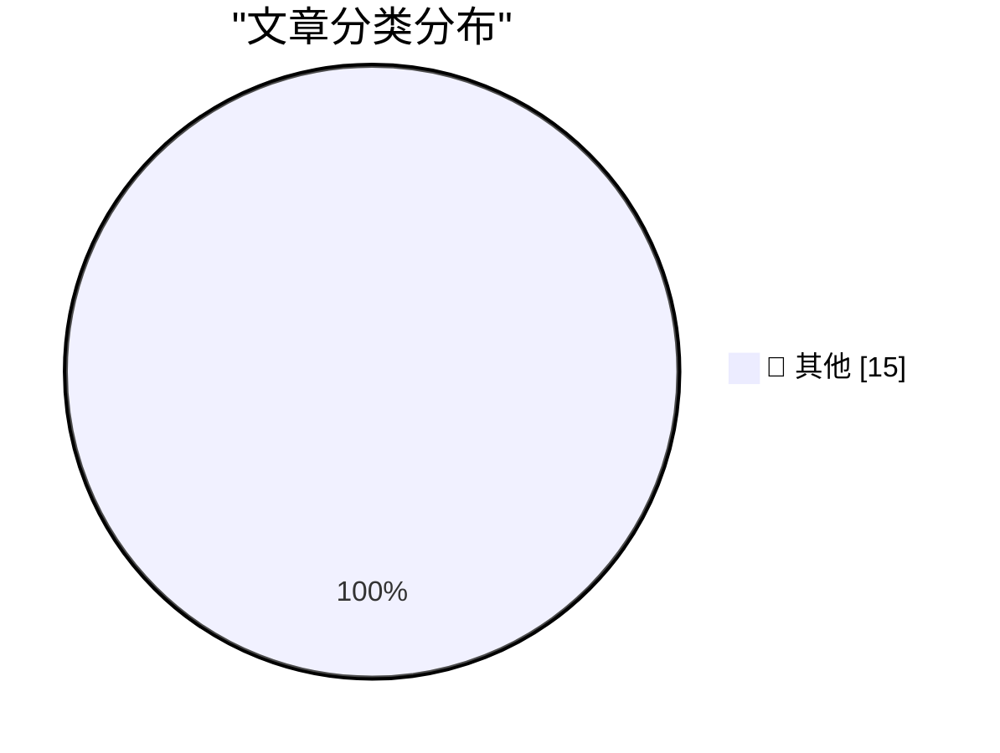

# 📰 AI 博客每日精选 — 2026-05-26

> 来自 Karpathy 推荐的 92 个顶级技术博客，AI 精选 Top 15

## 🏆 今日必读

🥇 **Notes on Pope Leo XIV's encyclical on AI**

[Notes on Pope Leo XIV's encyclical on AI](https://simonwillison.net/2026/May/25/encyclical-on-ai/#atom-everything) — simonwillison.net · 2 小时前 · 📝 其他

> Notes on Pope Leo XIV's encyclical on AI

🥈 **datasette 1.0a30**

[datasette 1.0a30](https://simonwillison.net/2026/May/24/datasette/#atom-everything) — simonwillison.net · 1 天前 · 📝 其他

> datasette 1.0a30

🥉 **datasette-agent 0.1a4**

[datasette-agent 0.1a4](https://simonwillison.net/2026/May/24/datasette-agent/#atom-everything) — simonwillison.net · 1 天前 · 📝 其他

> datasette-agent 0.1a4

---

## 📊 数据概览

| 扫描源 | 抓取文章 | 时间范围 | 精选 |
|:---:|:---:|:---:|:---:|
| 84/92 | 2488 篇 → 27 篇 | 48h | **15 篇** |

### 分类分布

---

## 📝 其他

### 1. Notes on Pope Leo XIV's encyclical on AI

[Notes on Pope Leo XIV's encyclical on AI](https://simonwillison.net/2026/May/25/encyclical-on-ai/#atom-everything) — **simonwillison.net** · 2 小时前 · ⭐ 15/30

> Notes on Pope Leo XIV's encyclical on AI

---

### 2. datasette 1.0a30

[datasette 1.0a30](https://simonwillison.net/2026/May/24/datasette/#atom-everything) — **simonwillison.net** · 1 天前 · ⭐ 15/30

> datasette 1.0a30

---

### 3. datasette-agent 0.1a4

[datasette-agent 0.1a4](https://simonwillison.net/2026/May/24/datasette-agent/#atom-everything) — **simonwillison.net** · 1 天前 · ⭐ 15/30

> datasette-agent 0.1a4

---

### 4. datasette-fixtures 0.1a0

[datasette-fixtures 0.1a0](https://simonwillison.net/2026/May/24/datasette-fixtures/#atom-everything) — **simonwillison.net** · 1 天前 · ⭐ 15/30

> datasette-fixtures 0.1a0

---

### 5. Quoting Armin Ronacher

[Quoting Armin Ronacher](https://simonwillison.net/2026/May/24/armin-ronacher/#atom-everything) — **simonwillison.net** · 1 天前 · ⭐ 15/30

> Quoting Armin Ronacher

---

### 6. Mad House — Usborne Creepy Computer Games

[Mad House — Usborne Creepy Computer Games](https://simonwillison.net/2026/May/24/usborne-mad-house/#atom-everything) — **simonwillison.net** · 1 天前 · ⭐ 15/30

> Mad House — Usborne Creepy Computer Games

---

### 7. Netherlands Seizes 800 Servers, Arrests 2 for Aiding Cyberattacks

[Netherlands Seizes 800 Servers, Arrests 2 for Aiding Cyberattacks](https://krebsonsecurity.com/2026/05/netherlands-seizes-800-servers-arrests-2-for-aiding-cyberattacks/) — **krebsonsecurity.com** · 12 小时前 · ⭐ 15/30

> Netherlands Seizes 800 Servers, Arrests 2 for Aiding Cyberattacks

---

### 8. [Sponsor] exe.dev

[[Sponsor] exe.dev](https://exe.dev/?df) — **daringfireball.net** · 2 小时前 · ⭐ 15/30

> [Sponsor] exe.dev

---

### 9. Awarding Jay Haynes His Being Right Points for Predicting Apple Hitting $3 Trillion in Market Cap

[Awarding Jay Haynes His Being Right Points for Predicting Apple Hitting $3 Trillion in Market Cap](https://daringfireball.net/linked/2014/01/29/haynes-aapl) — **daringfireball.net** · 5 小时前 · ⭐ 15/30

> Awarding Jay Haynes His Being Right Points for Predicting Apple Hitting $3 Trillion in Market Cap

---

### 10. Thieves Are Texting Threats to Victims of iPhone Theft in London

[Thieves Are Texting Threats to Victims of iPhone Theft in London](https://www.nytimes.com/2026/05/23/world/europe/phone-theft-threats-london.html?unlocked_article_code=1.lFA.OUt7.VJ_FoDpINr0L) — **daringfireball.net** · 6 小时前 · ⭐ 15/30

> Thieves Are Texting Threats to Victims of iPhone Theft in London

---

### 11. Trump Mobile Website Exposed the Number of Pre-Orders — Both Completed and Abandoned — and the Associated Customer Information

[Trump Mobile Website Exposed the Number of Pre-Orders — Both Completed and Abandoned — and the Associated Customer Information](https://www.theguardian.com/us-news/2026/may/23/trump-mobile-investigating-potential-exposure-of-would-be-customers-personal-information) — **daringfireball.net** · 7 小时前 · ⭐ 15/30

> Trump Mobile Website Exposed the Number of Pre-Orders — Both Completed and Abandoned — and the Associated Customer Information

---

### 12. The History of ‘OK’

[The History of ‘OK’](https://www.merriam-webster.com/wordplay/the-hilarious-history-of-ok-okay) — **daringfireball.net** · 8 小时前 · ⭐ 15/30

> The History of ‘OK’

---

### 13. WorkOS: ‘Agents Need Context. Ship the Integrations That Give It to Them.’

[WorkOS: ‘Agents Need Context. Ship the Integrations That Give It to Them.’](https://workos.com/docs/pipes?utm_source=daringfireball&amp;utm_medium=newsletter&amp;utm_campaign=q22026) — **daringfireball.net** · 10 小时前 · ⭐ 15/30

> WorkOS: ‘Agents Need Context. Ship the Integrations That Give It to Them.’

---

### 14. Why Steve Kerr Stayed With the Warriors

[Why Steve Kerr Stayed With the Warriors](https://www.espn.com/nba/story/_/id/48686303/steve-kerr-decision-return-coach-golden-state-warriors-steph-curry) — **daringfireball.net** · 1 天前 · ⭐ 15/30

> Why Steve Kerr Stayed With the Warriors

---

### 15. Distributing LLM inference in DwarfStar

[Distributing LLM inference in DwarfStar](http://antirez.com/news/167) — **antirez.com** · 11 小时前 · ⭐ 15/30

> Distributing LLM inference in DwarfStar

---

*生成于 2026-05-26 02:05 | 扫描 84 源 → 获取 2488 篇 → 精选 15 篇*
*基于 [Hacker News Popularity Contest 2025](https://refactoringenglish.com/tools/hn-popularity/) RSS 源列表，由 [Andrej Karpathy](https://x.com/karpathy) 推荐*
*由「懂点儿AI」制作，欢迎关注同名微信公众号获取更多 AI 实用技巧 💡*
