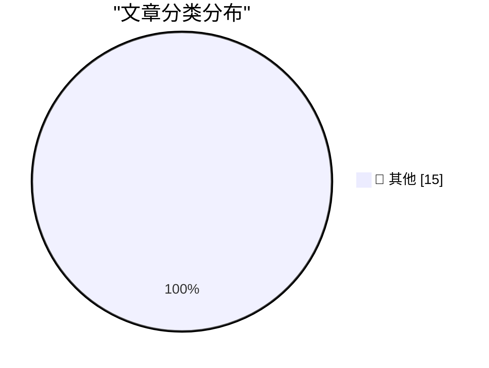

# 📰 AI 博客每日精选 — 2026-05-27

> 来自 Karpathy 推荐的 92 个顶级技术博客，AI 精选 Top 15

## 🏆 今日必读

🥇 **The pressure**

[The pressure](https://simonwillison.net/2026/May/26/the-pressure/#atom-everything) — simonwillison.net · 2 小时前 · 📝 其他

> The pressure

🥈 **Microsoft Copilot Cowork Exfiltrates Files**

[Microsoft Copilot Cowork Exfiltrates Files](https://simonwillison.net/2026/May/26/copilot-cowork-exfiltrates-files/#atom-everything) — simonwillison.net · 10 小时前 · 📝 其他

> Microsoft Copilot Cowork Exfiltrates Files

🥉 **Quoting Paul Graham**

[Quoting Paul Graham](https://simonwillison.net/2026/May/26/paul-graham/#atom-everything) — simonwillison.net · 11 小时前 · 📝 其他

> Quoting Paul Graham

---

## 📊 数据概览

| 扫描源 | 抓取文章 | 时间范围 | 精选 |
|:---:|:---:|:---:|:---:|
| 83/92 | 2470 篇 → 38 篇 | 48h | **15 篇** |

### 分类分布

---

## 📝 其他

### 1. The pressure

[The pressure](https://simonwillison.net/2026/May/26/the-pressure/#atom-everything) — **simonwillison.net** · 2 小时前 · ⭐ 15/30

> The pressure

---

### 2. Microsoft Copilot Cowork Exfiltrates Files

[Microsoft Copilot Cowork Exfiltrates Files](https://simonwillison.net/2026/May/26/copilot-cowork-exfiltrates-files/#atom-everything) — **simonwillison.net** · 10 小时前 · ⭐ 15/30

> Microsoft Copilot Cowork Exfiltrates Files

---

### 3. Quoting Paul Graham

[Quoting Paul Graham](https://simonwillison.net/2026/May/26/paul-graham/#atom-everything) — **simonwillison.net** · 11 小时前 · ⭐ 15/30

> Quoting Paul Graham

---

### 4. Quoting Corey Quinn

[Quoting Corey Quinn](https://simonwillison.net/2026/May/26/corey-quinn/#atom-everything) — **simonwillison.net** · 23 小时前 · ⭐ 15/30

> Quoting Corey Quinn

---

### 5. Notes on Pope Leo XIV's encyclical on AI

[Notes on Pope Leo XIV's encyclical on AI](https://simonwillison.net/2026/May/25/encyclical-on-ai/#atom-everything) — **simonwillison.net** · 1 天前 · ⭐ 15/30

> Notes on Pope Leo XIV's encyclical on AI

---

### 6. California Brown Pelican, Snowy Egret, California Sea Lion, Harbor Seal

[California Brown Pelican, Snowy Egret, California Sea Lion, Harbor Seal](https://simonwillison.net/2026/May/25/sighting-365297287/#atom-everything) — **simonwillison.net** · 1 天前 · ⭐ 15/30

> California Brown Pelican, Snowy Egret, California Sea Lion, Harbor Seal

---

### 7. I patched iozone for better disk benchmarks on modern macOS

[I patched iozone for better disk benchmarks on modern macOS](https://www.jeffgeerling.com/blog/2026/i-patched-iozone-for-better-disk-benchmarks-on-modern-macos/) — **jeffgeerling.com** · 41 分钟前 · ⭐ 15/30

> I patched iozone for better disk benchmarks on modern macOS

---

### 8. Netherlands Seizes 800 Servers, Arrests 2 for Aiding Cyberattacks

[Netherlands Seizes 800 Servers, Arrests 2 for Aiding Cyberattacks](https://krebsonsecurity.com/2026/05/netherlands-seizes-800-servers-arrests-2-for-aiding-cyberattacks/) — **krebsonsecurity.com** · 1 天前 · ⭐ 15/30

> Netherlands Seizes 800 Servers, Arrests 2 for Aiding Cyberattacks

---

### 9. [Sponsor] exe.dev

[[Sponsor] exe.dev](https://exe.dev/?df) — **daringfireball.net** · 1 天前 · ⭐ 15/30

> [Sponsor] exe.dev

---

### 10. Awarding Jay Haynes His Being Right Points for Predicting Apple Hitting $3 Trillion in Market Cap

[Awarding Jay Haynes His Being Right Points for Predicting Apple Hitting $3 Trillion in Market Cap](https://daringfireball.net/linked/2014/01/29/haynes-aapl) — **daringfireball.net** · 1 天前 · ⭐ 15/30

> Awarding Jay Haynes His Being Right Points for Predicting Apple Hitting $3 Trillion in Market Cap

---

### 11. Thieves Are Texting Threats to Victims of iPhone Theft in London

[Thieves Are Texting Threats to Victims of iPhone Theft in London](https://www.nytimes.com/2026/05/23/world/europe/phone-theft-threats-london.html?unlocked_article_code=1.lFA.OUt7.VJ_FoDpINr0L) — **daringfireball.net** · 1 天前 · ⭐ 15/30

> Thieves Are Texting Threats to Victims of iPhone Theft in London

---

### 12. Trump Mobile Website Exposed the Number of Pre-Orders — Both Completed and Abandoned — and the Associated Customer Information

[Trump Mobile Website Exposed the Number of Pre-Orders — Both Completed and Abandoned — and the Associated Customer Information](https://www.theguardian.com/us-news/2026/may/23/trump-mobile-investigating-potential-exposure-of-would-be-customers-personal-information) — **daringfireball.net** · 1 天前 · ⭐ 15/30

> Trump Mobile Website Exposed the Number of Pre-Orders — Both Completed and Abandoned — and the Associated Customer Information

---

### 13. The History of ‘OK’

[The History of ‘OK’](https://www.merriam-webster.com/wordplay/the-hilarious-history-of-ok-okay) — **daringfireball.net** · 1 天前 · ⭐ 15/30

> The History of ‘OK’

---

### 14. WorkOS: ‘Agents Need Context. Ship the Integrations That Give It to Them.’

[WorkOS: ‘Agents Need Context. Ship the Integrations That Give It to Them.’](https://workos.com/docs/pipes?utm_source=daringfireball&amp;utm_medium=newsletter&amp;utm_campaign=q22026) — **daringfireball.net** · 1 天前 · ⭐ 15/30

> WorkOS: ‘Agents Need Context. Ship the Integrations That Give It to Them.’

---

### 15. Distributing LLM inference in DwarfStar

[Distributing LLM inference in DwarfStar](http://antirez.com/news/167) — **antirez.com** · 1 天前 · ⭐ 15/30

> Distributing LLM inference in DwarfStar

---

*生成于 2026-05-27 02:13 | 扫描 83 源 → 获取 2470 篇 → 精选 15 篇*
*基于 [Hacker News Popularity Contest 2025](https://refactoringenglish.com/tools/hn-popularity/) RSS 源列表，由 [Andrej Karpathy](https://x.com/karpathy) 推荐*
*由「懂点儿AI」制作，欢迎关注同名微信公众号获取更多 AI 实用技巧 💡*
