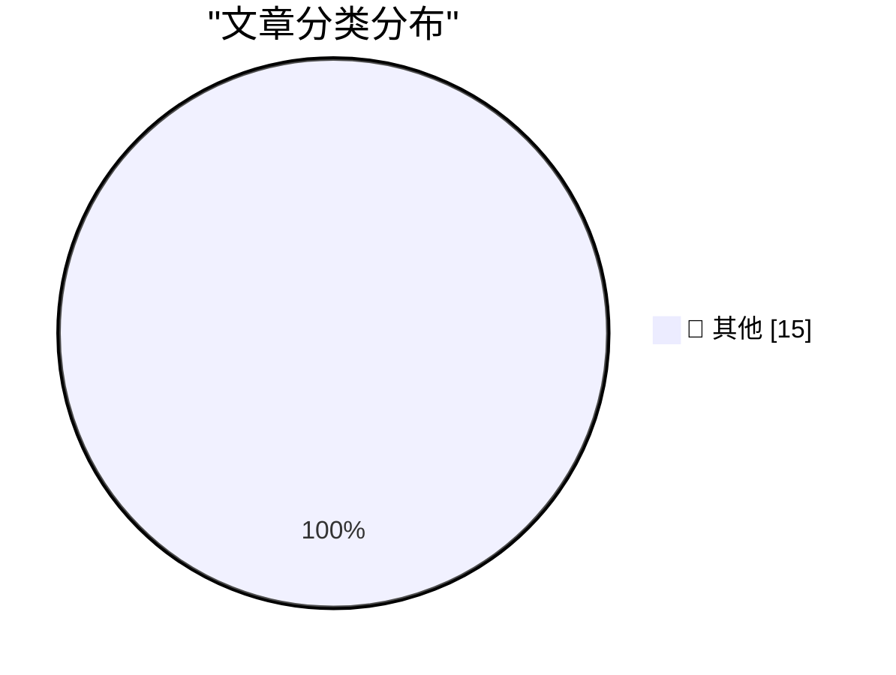

# 📰 AI 博客每日精选 — 2026-05-28

> 来自 Karpathy 推荐的 92 个顶级技术博客，AI 精选 Top 15

## 🏆 今日必读

🥇 **sqlite AGENTS.md**

[sqlite AGENTS.md](https://simonwillison.net/2026/May/27/sqlite-agents/#atom-everything) — simonwillison.net · 2 小时前 · 📝 其他

> sqlite AGENTS.md

🥈 **I think Anthropic and OpenAI have found product-market fit**

[I think Anthropic and OpenAI have found product-market fit](https://simonwillison.net/2026/May/27/product-market-fit/#atom-everything) — simonwillison.net · 9 小时前 · 📝 其他

> I think Anthropic and OpenAI have found product-market fit

🥉 **Quoting Kyle Ferrana**

[Quoting Kyle Ferrana](https://simonwillison.net/2026/May/27/kyle-ferrana/#atom-everything) — simonwillison.net · 19 小时前 · 📝 其他

> Quoting Kyle Ferrana

---

## 📊 数据概览

| 扫描源 | 抓取文章 | 时间范围 | 精选 |
|:---:|:---:|:---:|:---:|
| 83/92 | 2471 篇 → 33 篇 | 48h | **15 篇** |

### 分类分布

---

## 📝 其他

### 1. sqlite AGENTS.md

[sqlite AGENTS.md](https://simonwillison.net/2026/May/27/sqlite-agents/#atom-everything) — **simonwillison.net** · 2 小时前 · ⭐ 15/30

> sqlite AGENTS.md

---

### 2. I think Anthropic and OpenAI have found product-market fit

[I think Anthropic and OpenAI have found product-market fit](https://simonwillison.net/2026/May/27/product-market-fit/#atom-everything) — **simonwillison.net** · 9 小时前 · ⭐ 15/30

> I think Anthropic and OpenAI have found product-market fit

---

### 3. Quoting Kyle Ferrana

[Quoting Kyle Ferrana](https://simonwillison.net/2026/May/27/kyle-ferrana/#atom-everything) — **simonwillison.net** · 19 小时前 · ⭐ 15/30

> Quoting Kyle Ferrana

---

### 4. The pressure

[The pressure](https://simonwillison.net/2026/May/26/the-pressure/#atom-everything) — **simonwillison.net** · 1 天前 · ⭐ 15/30

> The pressure

---

### 5. Microsoft Copilot Cowork Exfiltrates Files

[Microsoft Copilot Cowork Exfiltrates Files](https://simonwillison.net/2026/May/26/copilot-cowork-exfiltrates-files/#atom-everything) — **simonwillison.net** · 1 天前 · ⭐ 15/30

> Microsoft Copilot Cowork Exfiltrates Files

---

### 6. Quoting Paul Graham

[Quoting Paul Graham](https://simonwillison.net/2026/May/26/paul-graham/#atom-everything) — **simonwillison.net** · 1 天前 · ⭐ 15/30

> Quoting Paul Graham

---

### 7. Quoting Corey Quinn

[Quoting Corey Quinn](https://simonwillison.net/2026/May/26/corey-quinn/#atom-everything) — **simonwillison.net** · 1 天前 · ⭐ 15/30

> Quoting Corey Quinn

---

### 8. I patched iozone for better disk benchmarks on modern macOS

[I patched iozone for better disk benchmarks on modern macOS](https://www.jeffgeerling.com/blog/2026/i-patched-iozone-for-better-disk-benchmarks-on-modern-macos/) — **jeffgeerling.com** · 1 天前 · ⭐ 15/30

> I patched iozone for better disk benchmarks on modern macOS

---

### 9. How Many Tokens Did You Burn Today

[How Many Tokens Did You Burn Today](https://idiallo.com/blog/how-many-tokens-did-you-burn-today?src=feed) — **idiallo.com** · 1 天前 · ⭐ 15/30

> How Many Tokens Did You Burn Today

---

### 10. Amber Alert sends Spam URL?

[Amber Alert sends Spam URL?](https://idiallo.com/byte-size/amber-alert-with-spam-link?src=feed) — **idiallo.com** · 1 天前 · ⭐ 15/30

> Amber Alert sends Spam URL?

---

### 11. Pluralistic: AI and a world without migrants (27 May 2026)

[Pluralistic: AI and a world without migrants (27 May 2026)](https://pluralistic.net/2026/05/27/unnecessariat/) — **pluralistic.net** · 17 小时前 · ⭐ 15/30

> Pluralistic: AI and a world without migrants (27 May 2026)

---

### 12. Pluralistic: The AI bubble isn't like the internet bubble (26 May 2026)

[Pluralistic: The AI bubble isn't like the internet bubble (26 May 2026)](https://pluralistic.net/2026/05/26/the-ai-will-continue/) — **pluralistic.net** · 1 天前 · ⭐ 15/30

> Pluralistic: The AI bubble isn't like the internet bubble (26 May 2026)

---

### 13. Gadget Review: Chuwi Minibook X N150 + Linux ★★★★☆

[Gadget Review: Chuwi Minibook X N150 + Linux ★★★★☆](https://shkspr.mobi/blog/2026/05/gadget-review-chuwi-minibook-x-n150-linux/) — **shkspr.mobi** · 14 小时前 · ⭐ 15/30

> Gadget Review: Chuwi Minibook X N150 + Linux ★★★★☆

---

### 14. Sharing the result of a single Windows Runtime IAsyncOperation among multiple coroutines, part 1

[Sharing the result of a single Windows Runtime IAsyncOperation among multiple coroutines, part 1](https://devblogs.microsoft.com/oldnewthing/20260527-00/?p=112361) — **devblogs.microsoft.com/oldnewthing** · 11 小时前 · ⭐ 15/30

> Sharing the result of a single Windows Runtime IAsyncOperation among multiple coroutines, part 1

---

### 15. If C# and JavaScript lets me await a Windows Runtime asynchronous operation more than once, why not C++/WinRT?

[If C# and JavaScript lets me await a Windows Runtime asynchronous operation more than once, why not C++/WinRT?](https://devblogs.microsoft.com/oldnewthing/20260526-00/?p=112354) — **devblogs.microsoft.com/oldnewthing** · 1 天前 · ⭐ 15/30

> If C# and JavaScript lets me await a Windows Runtime asynchronous operation more than once, why not C++/WinRT?

---

*生成于 2026-05-28 01:56 | 扫描 83 源 → 获取 2471 篇 → 精选 15 篇*
*基于 [Hacker News Popularity Contest 2025](https://refactoringenglish.com/tools/hn-popularity/) RSS 源列表，由 [Andrej Karpathy](https://x.com/karpathy) 推荐*
*由「懂点儿AI」制作，欢迎关注同名微信公众号获取更多 AI 实用技巧 💡*
