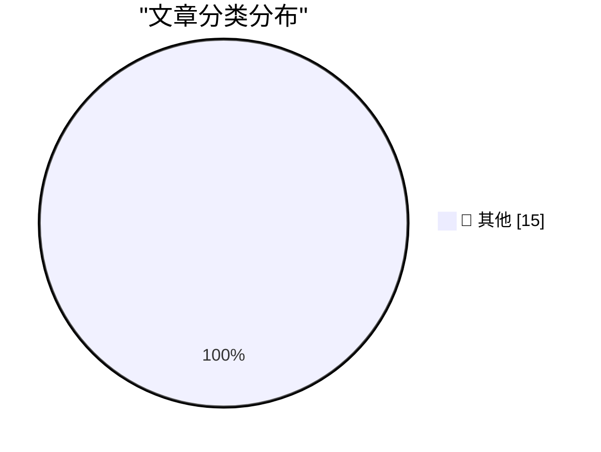

# 📰 AI 博客每日精选 — 2026-05-29

> 来自 Karpathy 推荐的 92 个顶级技术博客，AI 精选 Top 15

## 🏆 今日必读

🥇 **Anthropic's run-rate revenue hits $47 billion**

[Anthropic's run-rate revenue hits $47 billion](https://simonwillison.net/2026/May/29/anthropic/#atom-everything) — simonwillison.net · 41 分钟前 · 📝 其他

> Anthropic's run-rate revenue hits $47 billion

🥈 **Claude Opus 4.8: "a modest but tangible improvement"**

[Claude Opus 4.8: "a modest but tangible improvement"](https://simonwillison.net/2026/May/28/claude-opus-4-8/#atom-everything) — simonwillison.net · 2 小时前 · 📝 其他

> Claude Opus 4.8: "a modest but tangible improvement"

🥉 **llm-anthropic 0.25.1**

[llm-anthropic 0.25.1](https://simonwillison.net/2026/May/28/llm-anthropic/#atom-everything) — simonwillison.net · 2 小时前 · 📝 其他

> llm-anthropic 0.25.1

---

## 📊 数据概览

| 扫描源 | 抓取文章 | 时间范围 | 精选 |
|:---:|:---:|:---:|:---:|
| 84/92 | 2490 篇 → 32 篇 | 48h | **15 篇** |

### 分类分布

---

## 📝 其他

### 1. Anthropic's run-rate revenue hits $47 billion

[Anthropic's run-rate revenue hits $47 billion](https://simonwillison.net/2026/May/29/anthropic/#atom-everything) — **simonwillison.net** · 41 分钟前 · ⭐ 15/30

> Anthropic's run-rate revenue hits $47 billion

---

### 2. Claude Opus 4.8: "a modest but tangible improvement"

[Claude Opus 4.8: "a modest but tangible improvement"](https://simonwillison.net/2026/May/28/claude-opus-4-8/#atom-everything) — **simonwillison.net** · 2 小时前 · ⭐ 15/30

> Claude Opus 4.8: "a modest but tangible improvement"

---

### 3. llm-anthropic 0.25.1

[llm-anthropic 0.25.1](https://simonwillison.net/2026/May/28/llm-anthropic/#atom-everything) — **simonwillison.net** · 2 小时前 · ⭐ 15/30

> llm-anthropic 0.25.1

---

### 4. sqlite AGENTS.md

[sqlite AGENTS.md](https://simonwillison.net/2026/May/27/sqlite-agents/#atom-everything) — **simonwillison.net** · 1 天前 · ⭐ 15/30

> sqlite AGENTS.md

---

### 5. I think Anthropic and OpenAI have found product-market fit

[I think Anthropic and OpenAI have found product-market fit](https://simonwillison.net/2026/May/27/product-market-fit/#atom-everything) — **simonwillison.net** · 1 天前 · ⭐ 15/30

> I think Anthropic and OpenAI have found product-market fit

---

### 6. Quoting Kyle Ferrana

[Quoting Kyle Ferrana](https://simonwillison.net/2026/May/27/kyle-ferrana/#atom-everything) — **simonwillison.net** · 1 天前 · ⭐ 15/30

> Quoting Kyle Ferrana

---

### 7. Tuning in FM Radio on a 3D Printer Heatbed

[Tuning in FM Radio on a 3D Printer Heatbed](https://www.jeffgeerling.com/blog/2026/tuning-in-fm-radio-on-a-3d-printer-heatbed/) — **jeffgeerling.com** · 12 小时前 · ⭐ 15/30

> Tuning in FM Radio on a 3D Printer Heatbed

---

### 8. Footage From the LA-Houston MLS Match That Apple Shot Using iPhone 17 Pro Cameras

[Footage From the LA-Houston MLS Match That Apple Shot Using iPhone 17 Pro Cameras](https://tv.apple.com/us/sporting-event/mls-wrap-up/umc.cse.3a198p24hrehwhonbhgx2zvhv) — **daringfireball.net** · 9 小时前 · ⭐ 15/30

> Footage From the LA-Houston MLS Match That Apple Shot Using iPhone 17 Pro Cameras

---

### 9. Researchers Publish Method to Surveil Web Page Visitors by Analyzing Their SSD Activity

[Researchers Publish Method to Surveil Web Page Visitors by Analyzing Their SSD Activity](https://arstechnica.com/security/2026/05/websites-have-a-new-way-to-spy-on-visitors-analyzing-their-ssd-activity/) — **daringfireball.net** · 11 小时前 · ⭐ 15/30

> Researchers Publish Method to Surveil Web Page Visitors by Analyzing Their SSD Activity

---

### 10. Pluralistic: Hold on for dear life (28 May 2026)

[Pluralistic: Hold on for dear life (28 May 2026)](https://pluralistic.net/2026/05/28/we-live-in-a-society/) — **pluralistic.net** · 14 小时前 · ⭐ 15/30

> Pluralistic: Hold on for dear life (28 May 2026)

---

### 11. Pluralistic: AI and a world without migrants (27 May 2026)

[Pluralistic: AI and a world without migrants (27 May 2026)](https://pluralistic.net/2026/05/27/unnecessariat/) — **pluralistic.net** · 1 天前 · ⭐ 15/30

> Pluralistic: AI and a world without migrants (27 May 2026)

---

### 12. Gadget Review: Chuwi Minibook X N150 + Linux ★★★★☆

[Gadget Review: Chuwi Minibook X N150 + Linux ★★★★☆](https://shkspr.mobi/blog/2026/05/gadget-review-chuwi-minibook-x-n150-linux/) — **shkspr.mobi** · 1 天前 · ⭐ 15/30

> Gadget Review: Chuwi Minibook X N150 + Linux ★★★★☆

---

### 13. Dancing mad with sandboxing

[Dancing mad with sandboxing](https://xeiaso.net/blog/2026/dancing-mad-sandboxing/) — **xeiaso.net** · 1 天前 · ⭐ 15/30

> Dancing mad with sandboxing

---

### 14. Sharing the result of a single Windows Runtime IAsyncOperation among multiple coroutines, part 2

[Sharing the result of a single Windows Runtime IAsyncOperation among multiple coroutines, part 2](https://devblogs.microsoft.com/oldnewthing/20260528-00/?p=112365) — **devblogs.microsoft.com/oldnewthing** · 12 小时前 · ⭐ 15/30

> Sharing the result of a single Windows Runtime IAsyncOperation among multiple coroutines, part 2

---

### 15. Sharing the result of a single Windows Runtime IAsyncOperation among multiple coroutines, part 1

[Sharing the result of a single Windows Runtime IAsyncOperation among multiple coroutines, part 1](https://devblogs.microsoft.com/oldnewthing/20260527-00/?p=112361) — **devblogs.microsoft.com/oldnewthing** · 1 天前 · ⭐ 15/30

> Sharing the result of a single Windows Runtime IAsyncOperation among multiple coroutines, part 1

---

*生成于 2026-05-29 02:05 | 扫描 84 源 → 获取 2490 篇 → 精选 15 篇*
*基于 [Hacker News Popularity Contest 2025](https://refactoringenglish.com/tools/hn-popularity/) RSS 源列表，由 [Andrej Karpathy](https://x.com/karpathy) 推荐*
*由「懂点儿AI」制作，欢迎关注同名微信公众号获取更多 AI 实用技巧 💡*
