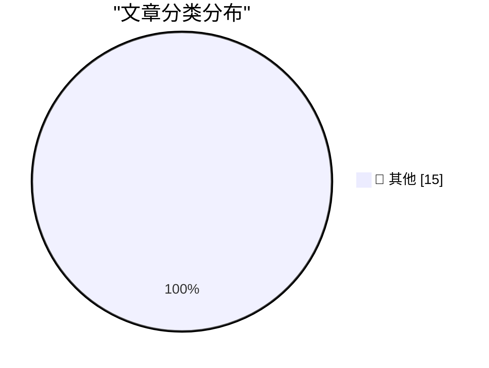

# 📰 AI 博客每日精选 — 2026-05-31

> 来自 Karpathy 推荐的 92 个顶级技术博客，AI 精选 Top 15

## 🏆 今日必读

🥇 **Quoting Karen Kwok for Reuters Breakingviews**

[Quoting Karen Kwok for Reuters Breakingviews](https://simonwillison.net/2026/May/31/anthropic-run-rate/#atom-everything) — simonwillison.net · 26 分钟前 · 📝 其他

> Quoting Karen Kwok for Reuters Breakingviews

🥈 **How we contain Claude across products**

[How we contain Claude across products](https://simonwillison.net/2026/May/30/how-we-contain-claude/#atom-everything) — simonwillison.net · 4 小时前 · 📝 其他

> How we contain Claude across products

🥉 **Running Python ASGI apps in the browser via Pyodide + a service worker**

[Running Python ASGI apps in the browser via Pyodide + a service worker](https://simonwillison.net/2026/May/30/pyodide-asgi-browser/#atom-everything) — simonwillison.net · 5 小时前 · 📝 其他

> Running Python ASGI apps in the browser via Pyodide + a service worker

---

## 📊 数据概览

| 扫描源 | 抓取文章 | 时间范围 | 精选 |
|:---:|:---:|:---:|:---:|
| 84/92 | 2491 篇 → 28 篇 | 48h | **15 篇** |

### 分类分布

---

## 📝 其他

### 1. Quoting Karen Kwok for Reuters Breakingviews

[Quoting Karen Kwok for Reuters Breakingviews](https://simonwillison.net/2026/May/31/anthropic-run-rate/#atom-everything) — **simonwillison.net** · 26 分钟前 · ⭐ 15/30

> Quoting Karen Kwok for Reuters Breakingviews

---

### 2. How we contain Claude across products

[How we contain Claude across products](https://simonwillison.net/2026/May/30/how-we-contain-claude/#atom-everything) — **simonwillison.net** · 4 小时前 · ⭐ 15/30

> How we contain Claude across products

---

### 3. Running Python ASGI apps in the browser via Pyodide + a service worker

[Running Python ASGI apps in the browser via Pyodide + a service worker](https://simonwillison.net/2026/May/30/pyodide-asgi-browser/#atom-everything) — **simonwillison.net** · 5 小时前 · ⭐ 15/30

> Running Python ASGI apps in the browser via Pyodide + a service worker

---

### 4. I Am Retiring from Tech to Live Offline

[I Am Retiring from Tech to Live Offline](https://simonwillison.net/2026/May/30/retiring-from-tech-to-live-offline/#atom-everything) — **simonwillison.net** · 6 小时前 · ⭐ 15/30

> I Am Retiring from Tech to Live Offline

---

### 5. Quoting Daniel Jalkut

[Quoting Daniel Jalkut](https://simonwillison.net/2026/May/30/daniel-jalkut/#atom-everything) — **simonwillison.net** · 8 小时前 · ⭐ 15/30

> Quoting Daniel Jalkut

---

### 6. datasette 1.0a31

[datasette 1.0a31](https://simonwillison.net/2026/May/29/datasette/#atom-everything) — **simonwillison.net** · 1 天前 · ⭐ 15/30

> datasette 1.0a31

---

### 7. It's hard to justify buying a Framework 12

[It's hard to justify buying a Framework 12](https://www.jeffgeerling.com/blog/2026/its-hard-to-justify-framework-12/) — **jeffgeerling.com** · 1 天前 · ⭐ 15/30

> It's hard to justify buying a Framework 12

---

### 8. Meta Is Launching Instagram, Facebook, and WhatsApp Subscriptions for ‘Fun Features’

[Meta Is Launching Instagram, Facebook, and WhatsApp Subscriptions for ‘Fun Features’](https://techcrunch.com/2026/05/27/meta-officially-launches-instagram-facebook-and-whatsapp-subscriptions-with-more-to-come-including-ai-plans/) — **daringfireball.net** · 10 小时前 · ⭐ 15/30

> Meta Is Launching Instagram, Facebook, and WhatsApp Subscriptions for ‘Fun Features’

---

### 9. Daniel Jalkut on AI

[Daniel Jalkut on AI](https://mastodon.social/@danielpunkass/116639318125898071) — **daringfireball.net** · 10 小时前 · ⭐ 15/30

> Daniel Jalkut on AI

---

### 10. Yours Truly on TBPN Yesterday

[Yours Truly on TBPN Yesterday](https://www.youtube.com/live/sQVwLUxFdMY?t=1997) — **daringfireball.net** · 13 小时前 · ⭐ 15/30

> Yours Truly on TBPN Yesterday

---

### 11. ★ What Is a Dickover?

[★ What Is a Dickover?](https://daringfireball.net/2026/05/what_is_a_dickover) — **daringfireball.net** · 1 天前 · ⭐ 15/30

> ★ What Is a Dickover?

---

### 12. One Group, Clearly, Is Deranged

[One Group, Clearly, Is Deranged](https://paulkrugman.substack.com/p/whos-deranged-exactly) — **daringfireball.net** · 1 天前 · ⭐ 15/30

> One Group, Clearly, Is Deranged

---

### 13. Arp 114:

[Arp 114:](https://maurycyz.com/astro/arp114/) — **maurycyz.com** · 1 天前 · ⭐ 15/30

> Arp 114:

---

### 14. Pluralistic: Carneyism without Carney (30 May 2026)

[Pluralistic: Carneyism without Carney (30 May 2026)](https://pluralistic.net/2026/05/30/rupture/) — **pluralistic.net** · 16 小时前 · ⭐ 15/30

> Pluralistic: Carneyism without Carney (30 May 2026)

---

### 15. The UK Government's Low Value Purchase System is a Waste of Time

[The UK Government's Low Value Purchase System is a Waste of Time](https://shkspr.mobi/blog/2026/05/the-uk-governments-low-value-purchase-system-is-a-waste-of-time/) — **shkspr.mobi** · 1 天前 · ⭐ 15/30

> The UK Government's Low Value Purchase System is a Waste of Time

---

*生成于 2026-05-31 02:14 | 扫描 84 源 → 获取 2491 篇 → 精选 15 篇*
*基于 [Hacker News Popularity Contest 2025](https://refactoringenglish.com/tools/hn-popularity/) RSS 源列表，由 [Andrej Karpathy](https://x.com/karpathy) 推荐*
*由「懂点儿AI」制作，欢迎关注同名微信公众号获取更多 AI 实用技巧 💡*
