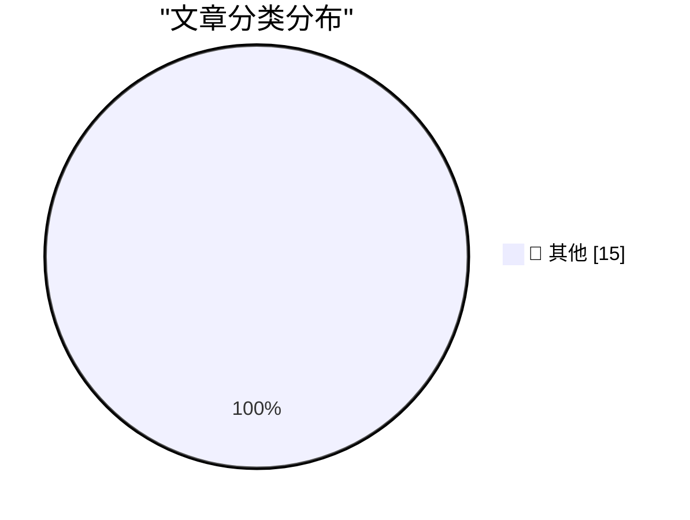

# 📰 AI 博客每日精选 — 2026-06-01

> 来自 Karpathy 推荐的 92 个顶级技术博客，AI 精选 Top 15

## 🏆 今日必读

🥇 **datasette 1.0a32**

[datasette 1.0a32](https://simonwillison.net/2026/May/31/datasette/#atom-everything) — simonwillison.net · 3 小时前 · 📝 其他

> datasette 1.0a32

🥈 **The solution might be cancelling my AI subscription**

[The solution might be cancelling my AI subscription](https://simonwillison.net/2026/May/31/the-solution-might-be-cancelling-my-ai-subscription/#atom-everything) — simonwillison.net · 10 小时前 · 📝 其他

> The solution might be cancelling my AI subscription

🥉 **Quoting Karen Kwok for Reuters Breakingviews**

[Quoting Karen Kwok for Reuters Breakingviews](https://simonwillison.net/2026/May/31/anthropic-run-rate/#atom-everything) — simonwillison.net · 1 天前 · 📝 其他

> Quoting Karen Kwok for Reuters Breakingviews

---

## 📊 数据概览

| 扫描源 | 抓取文章 | 时间范围 | 精选 |
|:---:|:---:|:---:|:---:|
| 83/92 | 2474 篇 → 29 篇 | 48h | **15 篇** |

### 分类分布

---

## 📝 其他

### 1. datasette 1.0a32

[datasette 1.0a32](https://simonwillison.net/2026/May/31/datasette/#atom-everything) — **simonwillison.net** · 3 小时前 · ⭐ 15/30

> datasette 1.0a32

---

### 2. The solution might be cancelling my AI subscription

[The solution might be cancelling my AI subscription](https://simonwillison.net/2026/May/31/the-solution-might-be-cancelling-my-ai-subscription/#atom-everything) — **simonwillison.net** · 10 小时前 · ⭐ 15/30

> The solution might be cancelling my AI subscription

---

### 3. Quoting Karen Kwok for Reuters Breakingviews

[Quoting Karen Kwok for Reuters Breakingviews](https://simonwillison.net/2026/May/31/anthropic-run-rate/#atom-everything) — **simonwillison.net** · 1 天前 · ⭐ 15/30

> Quoting Karen Kwok for Reuters Breakingviews

---

### 4. How we contain Claude across products

[How we contain Claude across products](https://simonwillison.net/2026/May/30/how-we-contain-claude/#atom-everything) — **simonwillison.net** · 1 天前 · ⭐ 15/30

> How we contain Claude across products

---

### 5. Running Python ASGI apps in the browser via Pyodide + a service worker

[Running Python ASGI apps in the browser via Pyodide + a service worker](https://simonwillison.net/2026/May/30/pyodide-asgi-browser/#atom-everything) — **simonwillison.net** · 1 天前 · ⭐ 15/30

> Running Python ASGI apps in the browser via Pyodide + a service worker

---

### 6. I Am Retiring from Tech to Live Offline

[I Am Retiring from Tech to Live Offline](https://simonwillison.net/2026/May/30/retiring-from-tech-to-live-offline/#atom-everything) — **simonwillison.net** · 1 天前 · ⭐ 15/30

> I Am Retiring from Tech to Live Offline

---

### 7. Quoting Daniel Jalkut

[Quoting Daniel Jalkut](https://simonwillison.net/2026/May/30/daniel-jalkut/#atom-everything) — **simonwillison.net** · 1 天前 · ⭐ 15/30

> Quoting Daniel Jalkut

---

### 8. Build agents, not pipelines

[Build agents, not pipelines](https://seangoedecke.com/build-agents-not-pipelines/) — **seangoedecke.com** · 1 天前 · ⭐ 15/30

> Build agents, not pipelines

---

### 9. The Talk Show Live From WWDC 2026: Tuesday June 9

[The Talk Show Live From WWDC 2026: Tuesday June 9](https://ti.to/daringfireball/the-talk-show-live-from-wwdc-2026) — **daringfireball.net** · 37 分钟前 · ⭐ 15/30

> The Talk Show Live From WWDC 2026: Tuesday June 9

---

### 10. exe.dev

[exe.dev](https://exe.dev/?df) — **daringfireball.net** · 40 分钟前 · ⭐ 15/30

> exe.dev

---

### 11. Take Two

[Take Two](https://x.com/markgurman/status/2061236259843182813) — **daringfireball.net** · 2 小时前 · ⭐ 15/30

> Take Two

---

### 12. Meta Is Launching Instagram, Facebook, and WhatsApp Subscriptions for ‘Fun Features’

[Meta Is Launching Instagram, Facebook, and WhatsApp Subscriptions for ‘Fun Features’](https://techcrunch.com/2026/05/27/meta-officially-launches-instagram-facebook-and-whatsapp-subscriptions-with-more-to-come-including-ai-plans/) — **daringfireball.net** · 1 天前 · ⭐ 15/30

> Meta Is Launching Instagram, Facebook, and WhatsApp Subscriptions for ‘Fun Features’

---

### 13. Daniel Jalkut on AI

[Daniel Jalkut on AI](https://mastodon.social/@danielpunkass/116639318125898071) — **daringfireball.net** · 1 天前 · ⭐ 15/30

> Daniel Jalkut on AI

---

### 14. Yours Truly on TBPN Yesterday

[Yours Truly on TBPN Yesterday](https://www.youtube.com/live/sQVwLUxFdMY?t=1997) — **daringfireball.net** · 1 天前 · ⭐ 15/30

> Yours Truly on TBPN Yesterday

---

### 15. Please don't mess with links:

[Please don't mess with links:](https://maurycyz.com/misc/real_links/) — **maurycyz.com** · 1 天前 · ⭐ 15/30

> Please don't mess with links:

---

*生成于 2026-06-01 02:36 | 扫描 83 源 → 获取 2474 篇 → 精选 15 篇*
*基于 [Hacker News Popularity Contest 2025](https://refactoringenglish.com/tools/hn-popularity/) RSS 源列表，由 [Andrej Karpathy](https://x.com/karpathy) 推荐*
*由「懂点儿AI」制作，欢迎关注同名微信公众号获取更多 AI 实用技巧 💡*
