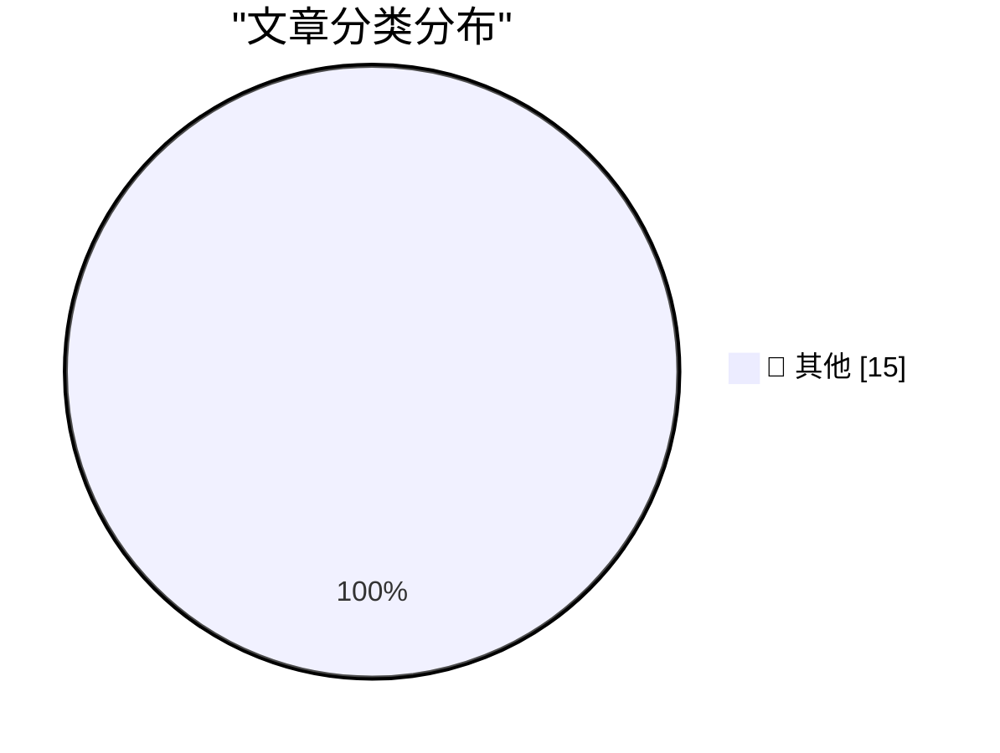

# 📰 AI 博客每日精选 — 2026-06-02

> 来自 Karpathy 推荐的 92 个顶级技术博客，AI 精选 Top 15

## 🏆 今日必读

🥇 **Hackers Simply Asked Meta AI to Give Them Access to High-Profile Instagram Accounts. It Worked**

[Hackers Simply Asked Meta AI to Give Them Access to High-Profile Instagram Accounts. It Worked](https://simonwillison.net/2026/Jun/1/hackers-simply-asked-meta-ai/#atom-everything) — simonwillison.net · 5 小时前 · 📝 其他

> Hackers Simply Asked Meta AI to Give Them Access to High-Profile Instagram Accounts. It Worked

🥈 **May 2026 newsletter**

[May 2026 newsletter](https://simonwillison.net/2026/Jun/1/may-newsletter/#atom-everything) — simonwillison.net · 21 小时前 · 📝 其他

> May 2026 newsletter

🥉 **datasette 1.0a32**

[datasette 1.0a32](https://simonwillison.net/2026/May/31/datasette/#atom-everything) — simonwillison.net · 1 天前 · 📝 其他

> datasette 1.0a32

---

## 📊 数据概览

| 扫描源 | 抓取文章 | 时间范围 | 精选 |
|:---:|:---:|:---:|:---:|
| 82/92 | 2464 篇 → 30 篇 | 48h | **15 篇** |

### 分类分布

---

## 📝 其他

### 1. Hackers Simply Asked Meta AI to Give Them Access to High-Profile Instagram Accounts. It Worked

[Hackers Simply Asked Meta AI to Give Them Access to High-Profile Instagram Accounts. It Worked](https://simonwillison.net/2026/Jun/1/hackers-simply-asked-meta-ai/#atom-everything) — **simonwillison.net** · 5 小时前 · ⭐ 15/30

> Hackers Simply Asked Meta AI to Give Them Access to High-Profile Instagram Accounts. It Worked

---

### 2. May 2026 newsletter

[May 2026 newsletter](https://simonwillison.net/2026/Jun/1/may-newsletter/#atom-everything) — **simonwillison.net** · 21 小时前 · ⭐ 15/30

> May 2026 newsletter

---

### 3. datasette 1.0a32

[datasette 1.0a32](https://simonwillison.net/2026/May/31/datasette/#atom-everything) — **simonwillison.net** · 1 天前 · ⭐ 15/30

> datasette 1.0a32

---

### 4. The solution might be cancelling my AI subscription

[The solution might be cancelling my AI subscription](https://simonwillison.net/2026/May/31/the-solution-might-be-cancelling-my-ai-subscription/#atom-everything) — **simonwillison.net** · 1 天前 · ⭐ 15/30

> The solution might be cancelling my AI subscription

---

### 5. Weird projects I shipped with AI

[Weird projects I shipped with AI](https://seangoedecke.com/weird-projects-i-shipped-with-ai/) — **seangoedecke.com** · 1 天前 · ⭐ 15/30

> Weird projects I shipped with AI

---

### 6. Hackers Used Meta’s AI Support Bot to Seize Instagram Accounts

[Hackers Used Meta’s AI Support Bot to Seize Instagram Accounts](https://krebsonsecurity.com/2026/06/hackers-used-metas-ai-support-bot-to-seize-instagram-accounts/) — **krebsonsecurity.com** · 9 小时前 · ⭐ 15/30

> Hackers Used Meta’s AI Support Bot to Seize Instagram Accounts

---

### 7. [Sponsor] Mux — Video for Developers

[[Sponsor] Mux — Video for Developers](https://www.mux.com/?utm_campaign=fireball&amp;utm_source=DF) — **daringfireball.net** · 49 分钟前 · ⭐ 15/30

> [Sponsor] Mux — Video for Developers

---

### 8. ‘The Metaverse Fever Dream’

[‘The Metaverse Fever Dream’](https://pxlnv.com/blog/metaverse-fever-dream/) — **daringfireball.net** · 2 小时前 · ⭐ 15/30

> ‘The Metaverse Fever Dream’

---

### 9. ‘If You Take the Weasel Job Then You Must Be the Weasel’

[‘If You Take the Weasel Job Then You Must Be the Weasel’](https://www.hamiltonnolan.com/p/if-you-take-the-weasel-job-then-you?r=qy6gq) — **daringfireball.net** · 3 小时前 · ⭐ 15/30

> ‘If You Take the Weasel Job Then You Must Be the Weasel’

---

### 10. ‘We Are Living in Pinocchio’s World’

[‘We Are Living in Pinocchio’s World’](https://om.co/2026/05/25/we-are-living-in-pinocchios-world/) — **daringfireball.net** · 6 小时前 · ⭐ 15/30

> ‘We Are Living in Pinocchio’s World’

---

### 11. Amazon Made AI Podcasts for Products

[Amazon Made AI Podcasts for Products](https://www.businessinsider.com/amazon-ai-generated-podcasts-products-2026-4) — **daringfireball.net** · 9 小时前 · ⭐ 15/30

> Amazon Made AI Podcasts for Products

---

### 12. The Talk Show Live From WWDC 2026: Tuesday June 9

[The Talk Show Live From WWDC 2026: Tuesday June 9](https://ti.to/daringfireball/the-talk-show-live-from-wwdc-2026) — **daringfireball.net** · 1 天前 · ⭐ 15/30

> The Talk Show Live From WWDC 2026: Tuesday June 9

---

### 13. exe.dev

[exe.dev](https://exe.dev/?df) — **daringfireball.net** · 1 天前 · ⭐ 15/30

> exe.dev

---

### 14. Take Two

[Take Two](https://x.com/markgurman/status/2061236259843182813) — **daringfireball.net** · 1 天前 · ⭐ 15/30

> Take Two

---

### 15. The web is changing, and we are not going back

[The web is changing, and we are not going back](https://idiallo.com/blog/web-is-changing-we-are-not-going-back?src=feed) — **idiallo.com** · 7 小时前 · ⭐ 15/30

> The web is changing, and we are not going back

---

*生成于 2026-06-02 02:35 | 扫描 82 源 → 获取 2464 篇 → 精选 15 篇*
*基于 [Hacker News Popularity Contest 2025](https://refactoringenglish.com/tools/hn-popularity/) RSS 源列表，由 [Andrej Karpathy](https://x.com/karpathy) 推荐*
*由「懂点儿AI」制作，欢迎关注同名微信公众号获取更多 AI 实用技巧 💡*
