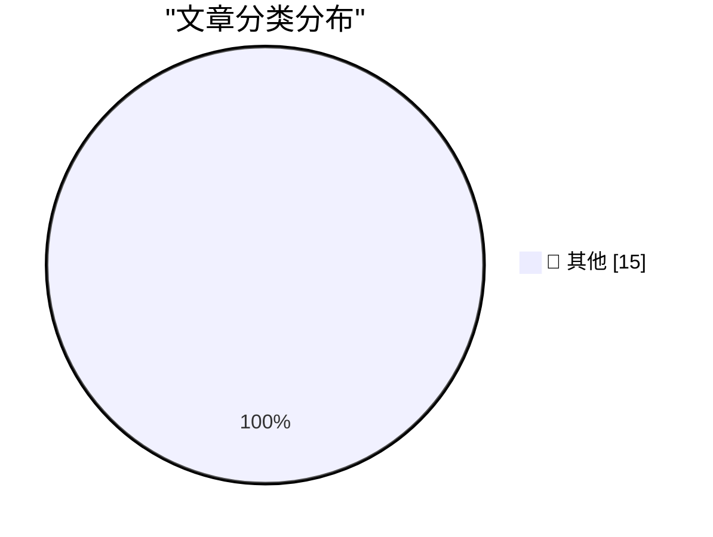

# 📰 AI 博客每日精选 — 2026-06-03

> 来自 Karpathy 推荐的 92 个顶级技术博客，AI 精选 Top 15

## 🏆 今日必读

🥇 **Microsoft's new MAI models**

[Microsoft's new MAI models](https://simonwillison.net/2026/Jun/2/microsofts-new-models/#atom-everything) — simonwillison.net · 4 小时前 · 📝 其他

> Microsoft's new MAI models

🥈 **datasette-agent-micropython 0.1a0**

[datasette-agent-micropython 0.1a0](https://simonwillison.net/2026/Jun/2/datasette-agent-micropython/#atom-everything) — simonwillison.net · 7 小时前 · 📝 其他

> datasette-agent-micropython 0.1a0

🥉 **micropython-wasm 0.1a1**

[micropython-wasm 0.1a1](https://simonwillison.net/2026/Jun/2/micropython-wasm/#atom-everything) — simonwillison.net · 7 小时前 · 📝 其他

> micropython-wasm 0.1a1

---

## 📊 数据概览

| 扫描源 | 抓取文章 | 时间范围 | 精选 |
|:---:|:---:|:---:|:---:|
| 83/92 | 2477 篇 → 37 篇 | 48h | **15 篇** |

### 分类分布

---

## 📝 其他

### 1. Microsoft's new MAI models

[Microsoft's new MAI models](https://simonwillison.net/2026/Jun/2/microsofts-new-models/#atom-everything) — **simonwillison.net** · 4 小时前 · ⭐ 15/30

> Microsoft's new MAI models

---

### 2. datasette-agent-micropython 0.1a0

[datasette-agent-micropython 0.1a0](https://simonwillison.net/2026/Jun/2/datasette-agent-micropython/#atom-everything) — **simonwillison.net** · 7 小时前 · ⭐ 15/30

> datasette-agent-micropython 0.1a0

---

### 3. micropython-wasm 0.1a1

[micropython-wasm 0.1a1](https://simonwillison.net/2026/Jun/2/micropython-wasm/#atom-everything) — **simonwillison.net** · 7 小时前 · ⭐ 15/30

> micropython-wasm 0.1a1

---

### 4. California Brown Pelican

[California Brown Pelican](https://simonwillison.net/2026/Jun/2/sighting-367841339/#atom-everything) — **simonwillison.net** · 8 小时前 · ⭐ 15/30

> California Brown Pelican

---

### 5. Pasted File Editor

[Pasted File Editor](https://simonwillison.net/2026/Jun/2/pasted-file-editor/#atom-everything) — **simonwillison.net** · 22 小时前 · ⭐ 15/30

> Pasted File Editor

---

### 6. micropython-wasm 0.1a0

[micropython-wasm 0.1a0](https://simonwillison.net/2026/Jun/2/micropython-wasm-2/#atom-everything) — **simonwillison.net** · 22 小时前 · ⭐ 15/30

> micropython-wasm 0.1a0

---

### 7. Hackers Simply Asked Meta AI to Give Them Access to High-Profile Instagram Accounts. It Worked

[Hackers Simply Asked Meta AI to Give Them Access to High-Profile Instagram Accounts. It Worked](https://simonwillison.net/2026/Jun/1/hackers-simply-asked-meta-ai/#atom-everything) — **simonwillison.net** · 1 天前 · ⭐ 15/30

> Hackers Simply Asked Meta AI to Give Them Access to High-Profile Instagram Accounts. It Worked

---

### 8. May 2026 newsletter

[May 2026 newsletter](https://simonwillison.net/2026/Jun/1/may-newsletter/#atom-everything) — **simonwillison.net** · 1 天前 · ⭐ 15/30

> May 2026 newsletter

---

### 9. Hackers Used Meta’s AI Support Bot to Seize Instagram Accounts

[Hackers Used Meta’s AI Support Bot to Seize Instagram Accounts](https://krebsonsecurity.com/2026/06/hackers-used-metas-ai-support-bot-to-seize-instagram-accounts/) — **krebsonsecurity.com** · 1 天前 · ⭐ 15/30

> Hackers Used Meta’s AI Support Bot to Seize Instagram Accounts

---

### 10. Meta Reportedly Has a Slew of New Smart Glasses Planned for This Year

[Meta Reportedly Has a Slew of New Smart Glasses Planned for This Year](https://gizmodo.com/meta-has-a-ridiculous-amount-of-smart-glasses-planned-for-this-year-2000765741) — **daringfireball.net** · 4 小时前 · ⭐ 15/30

> Meta Reportedly Has a Slew of New Smart Glasses Planned for This Year

---

### 11. Apple, the Anti-‘Metaverse’ VR Company

[Apple, the Anti-‘Metaverse’ VR Company](https://daringfireball.net/2025/12/meta_says_fuck_that_metaverse_shit) — **daringfireball.net** · 5 小时前 · ⭐ 15/30

> Apple, the Anti-‘Metaverse’ VR Company

---

### 12. The Metaverse Was Snake Oil for Isolation

[The Metaverse Was Snake Oil for Isolation](https://daringfireball.net/linked/2026/06/01/the-metaverse-fever-dream) — **daringfireball.net** · 5 小时前 · ⭐ 15/30

> The Metaverse Was Snake Oil for Isolation

---

### 13. Scott Pelley Accuses CBS News Boss of ‘Murdering’ ‘60 Minutes’

[Scott Pelley Accuses CBS News Boss of ‘Murdering’ ‘60 Minutes’](https://www.nytimes.com/2026/06/01/business/media/cbs-60-minutes-scott-pelley-nick-bilton.html?unlocked_article_code=1.nFA.TDGJ.HbBmlXuQWmcQ&amp;smid=url-share) — **daringfireball.net** · 6 小时前 · ⭐ 15/30

> Scott Pelley Accuses CBS News Boss of ‘Murdering’ ‘60 Minutes’

---

### 14. Three Ways to Get Paid

[Three Ways to Get Paid](https://jasonzweig.com/three-ways-to-get-paid/) — **daringfireball.net** · 10 小时前 · ⭐ 15/30

> Three Ways to Get Paid

---

### 15. The First-Time-Buyer-Discount Dickover Scheme

[The First-Time-Buyer-Discount Dickover Scheme](https://x.com/usgraphics/status/2060559523585355986) — **daringfireball.net** · 11 小时前 · ⭐ 15/30

> The First-Time-Buyer-Discount Dickover Scheme

---

*生成于 2026-06-03 02:41 | 扫描 83 源 → 获取 2477 篇 → 精选 15 篇*
*基于 [Hacker News Popularity Contest 2025](https://refactoringenglish.com/tools/hn-popularity/) RSS 源列表，由 [Andrej Karpathy](https://x.com/karpathy) 推荐*
*由「懂点儿AI」制作，欢迎关注同名微信公众号获取更多 AI 实用技巧 💡*
