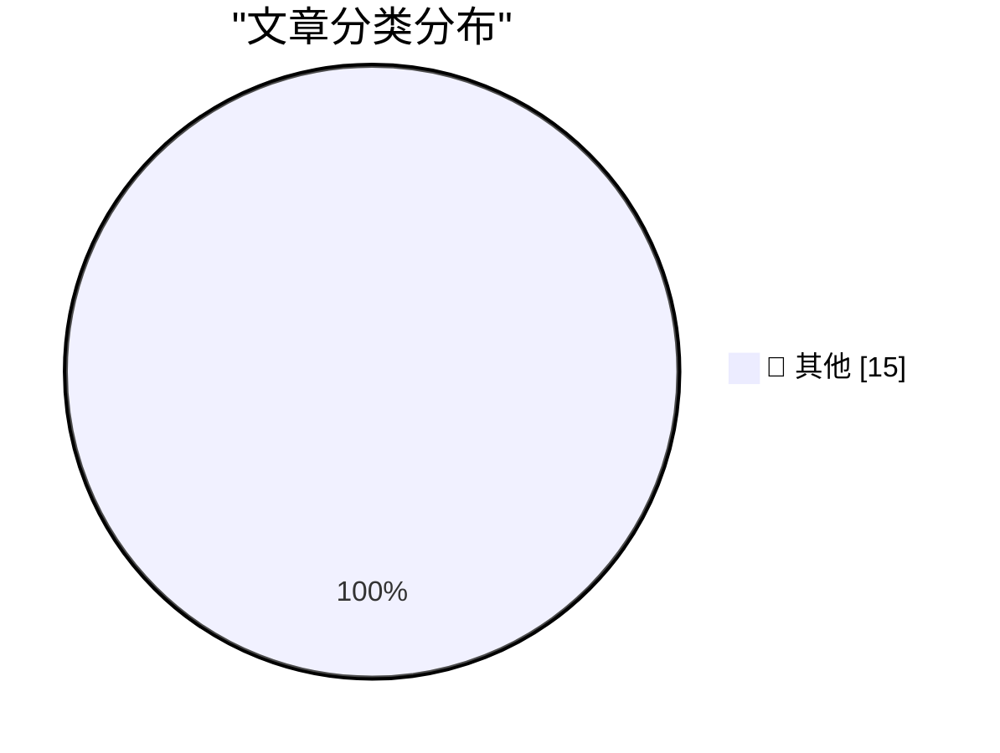

# 📰 AI 博客每日精选 — 2026-06-07

> 来自 Karpathy 推荐的 92 个顶级技术博客，AI 精选 Top 15

## 🏆 今日必读

🥇 **micropython-wasm 0.1a2**

[micropython-wasm 0.1a2](https://simonwillison.net/2026/Jun/6/micropython-wasm/#atom-everything) — simonwillison.net · 22 小时前 · 📝 其他

> micropython-wasm 0.1a2

🥈 **Running Python code in a sandbox with MicroPython and WASM**

[Running Python code in a sandbox with MicroPython and WASM](https://simonwillison.net/2026/Jun/6/micropython-in-a-sandbox/#atom-everything) — simonwillison.net · 22 小时前 · 📝 其他

> Running Python code in a sandbox with MicroPython and WASM

🥉 **OpenAI Help: Lockdown Mode**

[OpenAI Help: Lockdown Mode](https://simonwillison.net/2026/Jun/5/openai-help-lockdown-mode/#atom-everything) — simonwillison.net · 1 天前 · 📝 其他

> OpenAI Help: Lockdown Mode

---

## 📊 数据概览

| 扫描源 | 抓取文章 | 时间范围 | 精选 |
|:---:|:---:|:---:|:---:|
| 83/92 | 2478 篇 → 34 篇 | 48h | **15 篇** |

### 分类分布

---

## 📝 其他

### 1. micropython-wasm 0.1a2

[micropython-wasm 0.1a2](https://simonwillison.net/2026/Jun/6/micropython-wasm/#atom-everything) — **simonwillison.net** · 22 小时前 · ⭐ 15/30

> micropython-wasm 0.1a2

---

### 2. Running Python code in a sandbox with MicroPython and WASM

[Running Python code in a sandbox with MicroPython and WASM](https://simonwillison.net/2026/Jun/6/micropython-in-a-sandbox/#atom-everything) — **simonwillison.net** · 22 小时前 · ⭐ 15/30

> Running Python code in a sandbox with MicroPython and WASM

---

### 3. OpenAI Help: Lockdown Mode

[OpenAI Help: Lockdown Mode](https://simonwillison.net/2026/Jun/5/openai-help-lockdown-mode/#atom-everything) — **simonwillison.net** · 1 天前 · ⭐ 15/30

> OpenAI Help: Lockdown Mode

---

### 4. Quoting Andreas Kling

[Quoting Andreas Kling](https://simonwillison.net/2026/Jun/5/andreas-kling/#atom-everything) — **simonwillison.net** · 1 天前 · ⭐ 15/30

> Quoting Andreas Kling

---

### 5. I tested every IP KVM in my Homelab

[I tested every IP KVM in my Homelab](https://www.jeffgeerling.com/blog/2026/i-tested-every-ip-kvm/) — **jeffgeerling.com** · 1 天前 · ⭐ 15/30

> I tested every IP KVM in my Homelab

---

### 6. Halide Mark III

[Halide Mark III](https://www.lux.camera/halide-mark-iii/) — **daringfireball.net** · 1 小时前 · ⭐ 15/30

> Halide Mark III

---

### 7. 60 Minutes Correspondents Lesley Stahl, Bill Whitaker, and the Other Guy Will Stay at Show

[60 Minutes Correspondents Lesley Stahl, Bill Whitaker, and the Other Guy Will Stay at Show](https://www.nytimes.com/2026/06/05/business/media/60-minutes-cbs-stahl-whitaker-wertheim.html?unlocked_article_code=1.oFA.xooG.Pz8cQv8odz7Z) — **daringfireball.net** · 6 小时前 · ⭐ 15/30

> 60 Minutes Correspondents Lesley Stahl, Bill Whitaker, and the Other Guy Will Stay at Show

---

### 8. Trump Lawyer Argues Trump Can Tear Down Statue of Liberty

[Trump Lawyer Argues Trump Can Tear Down Statue of Liberty](https://talkingpointsmemo.com/edblog/trump-can-tear-down-statue-of-liberty-says-trump-lawyer) — **daringfireball.net** · 6 小时前 · ⭐ 15/30

> Trump Lawyer Argues Trump Can Tear Down Statue of Liberty

---

### 9. Nieman Journalism Lab: Twitter/X Punishes Accounts That Post Links

[Nieman Journalism Lab: Twitter/X Punishes Accounts That Post Links](https://www.niemanlab.org/2026/04/do-links-hurt-news-publishers-on-twitter-our-analysis-suggests-yes/) — **daringfireball.net** · 1 天前 · ⭐ 15/30

> Nieman Journalism Lab: Twitter/X Punishes Accounts That Post Links

---

### 10. Elon Musk’s X Is a Freak Show

[Elon Musk’s X Is a Freak Show](https://www.natesilver.net/p/social-media-has-become-a-freak-show) — **daringfireball.net** · 1 天前 · ⭐ 15/30

> Elon Musk’s X Is a Freak Show

---

### 11. Checking in on Perplexity

[Checking in on Perplexity](https://daringfireball.net/linked/2025/08/05/regarding-those-rumors-of-apple-pursuing-an-acquisition-of-perplexity) — **daringfireball.net** · 1 天前 · ⭐ 15/30

> Checking in on Perplexity

---

### 12. Why all the PRs?

[Why all the PRs?](https://idiallo.com/blog/why-all-the-prs) — **idiallo.com** · 1 天前 · ⭐ 15/30

> Why all the PRs?

---

### 13. Pluralistic: Criticizing the everything machine (06 Jun 2026)

[Pluralistic: Criticizing the everything machine (06 Jun 2026)](https://pluralistic.net/2026/06/06/applied-counterescatology/) — **pluralistic.net** · 8 小时前 · ⭐ 15/30

> Pluralistic: Criticizing the everything machine (06 Jun 2026)

---

### 14. Pluralistic: Refining humanity (05 Jun 2026)

[Pluralistic: Refining humanity (05 Jun 2026)](https://pluralistic.net/2026/06/05/defining-humanity/) — **pluralistic.net** · 1 天前 · ⭐ 15/30

> Pluralistic: Refining humanity (05 Jun 2026)

---

### 15. There's still no point in gigabit broadband

[There's still no point in gigabit broadband](https://shkspr.mobi/blog/2026/06/theres-still-no-point-in-gigabit-broadband/) — **shkspr.mobi** · 14 小时前 · ⭐ 15/30

> There's still no point in gigabit broadband

---

*生成于 2026-06-07 02:33 | 扫描 83 源 → 获取 2478 篇 → 精选 15 篇*
*基于 [Hacker News Popularity Contest 2025](https://refactoringenglish.com/tools/hn-popularity/) RSS 源列表，由 [Andrej Karpathy](https://x.com/karpathy) 推荐*
*由「懂点儿AI」制作，欢迎关注同名微信公众号获取更多 AI 实用技巧 💡*
