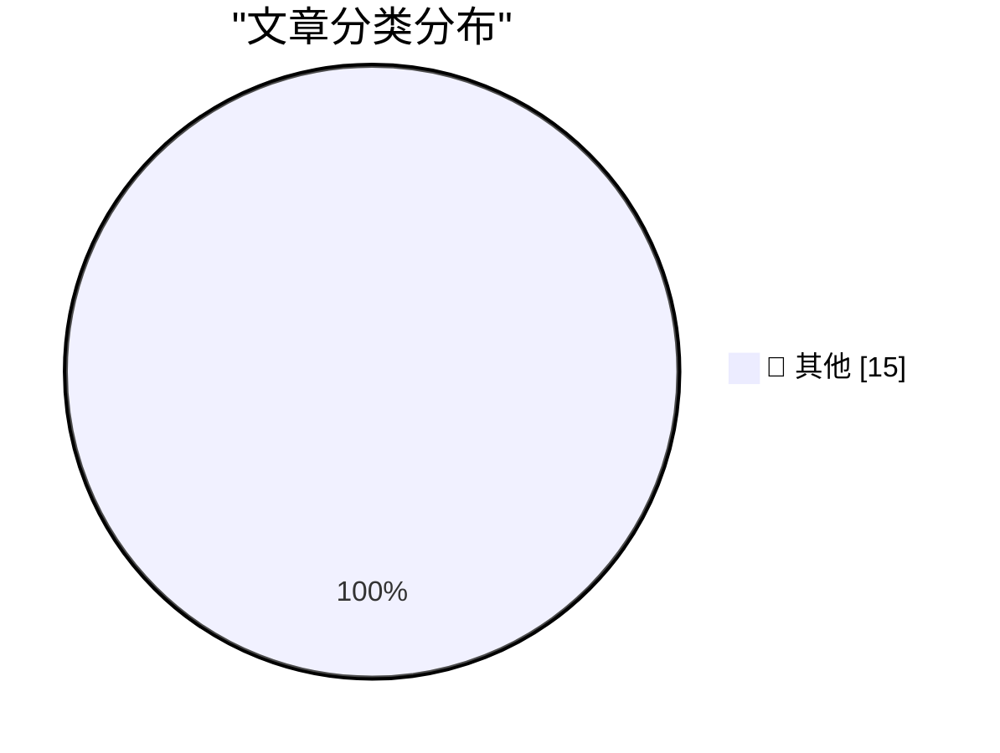

# 📰 AI 博客每日精选 — 2026-06-09

> 来自 Karpathy 推荐的 92 个顶级技术博客，AI 精选 Top 15

## 🏆 今日必读

🥇 **Siri AI at WWDC 2026**

[Siri AI at WWDC 2026](https://simonwillison.net/2026/Jun/8/wwdc/#atom-everything) — simonwillison.net · 2 小时前 · 📝 其他

> Siri AI at WWDC 2026

🥈 **datasette-agent-edit 0.1a0**

[datasette-agent-edit 0.1a0](https://simonwillison.net/2026/Jun/7/datasette-agent-edit/#atom-everything) — simonwillison.net · 1 天前 · 📝 其他

> datasette-agent-edit 0.1a0

🥉 **From the Annals of People Having Knowledge of the Matter, Siri AI Extensions Edition**

[From the Annals of People Having Knowledge of the Matter, Siri AI Extensions Edition](https://www.bloomberg.com/news/articles/2026-03-26/apple-plans-to-open-up-siri-to-rival-ai-assistants-beyond-chatgpt-in-ios-27) — daringfireball.net · 21 分钟前 · 📝 其他

> From the Annals of People Having Knowledge of the Matter, Siri AI Extensions Edition

---

## 📊 数据概览

| 扫描源 | 抓取文章 | 时间范围 | 精选 |
|:---:|:---:|:---:|:---:|
| 80/92 | 2415 篇 → 25 篇 | 48h | **15 篇** |

### 分类分布

---

## 📝 其他

### 1. Siri AI at WWDC 2026

[Siri AI at WWDC 2026](https://simonwillison.net/2026/Jun/8/wwdc/#atom-everything) — **simonwillison.net** · 2 小时前 · ⭐ 15/30

> Siri AI at WWDC 2026

---

### 2. datasette-agent-edit 0.1a0

[datasette-agent-edit 0.1a0](https://simonwillison.net/2026/Jun/7/datasette-agent-edit/#atom-everything) — **simonwillison.net** · 1 天前 · ⭐ 15/30

> datasette-agent-edit 0.1a0

---

### 3. From the Annals of People Having Knowledge of the Matter, Siri AI Extensions Edition

[From the Annals of People Having Knowledge of the Matter, Siri AI Extensions Edition](https://www.bloomberg.com/news/articles/2026-03-26/apple-plans-to-open-up-siri-to-rival-ai-assistants-beyond-chatgpt-in-ios-27) — **daringfireball.net** · 21 分钟前 · ⭐ 15/30

> From the Annals of People Having Knowledge of the Matter, Siri AI Extensions Edition

---

### 4. Mux — Video for Developers

[Mux — Video for Developers](https://www.mux.com/?utm_campaign=fireball&amp;utm_source=DF) — **daringfireball.net** · 1 天前 · ⭐ 15/30

> Mux — Video for Developers

---

### 5. ★ SwiftUI Only Makes It Easy to Develop Bad Apps

[★ SwiftUI Only Makes It Easy to Develop Bad Apps](https://daringfireball.net/2026/06/swiftui_only_makes_it_easy_to_develop_bad_apps) — **daringfireball.net** · 1 天前 · ⭐ 15/30

> ★ SwiftUI Only Makes It Easy to Develop Bad Apps

---

### 6. Alberto Romero on Apple’s AI Spending

[Alberto Romero on Apple’s AI Spending](https://www.thealgorithmicbridge.com/p/what-apple-knows-about-ai-that-silicon) — **daringfireball.net** · 1 天前 · ⭐ 15/30

> Alberto Romero on Apple’s AI Spending

---

### 7. A new era for software testing

[A new era for software testing](http://antirez.com/news/168) — **antirez.com** · 1 天前 · ⭐ 15/30

> A new era for software testing

---

### 8. ppclp.ai announces 100x Productivity Gains

[ppclp.ai announces 100x Productivity Gains](https://idiallo.com/blog/100x-productivity-gain) — **idiallo.com** · 6 小时前 · ⭐ 15/30

> ppclp.ai announces 100x Productivity Gains

---

### 9. Giving your Go apps Tigris superpowers

[Giving your Go apps Tigris superpowers](https://www.tigrisdata.com/blog/storage-sdk-go/) — **xeiaso.net** · 1 小时前 · ⭐ 15/30

> Giving your Go apps Tigris superpowers

---

### 10. Powering up a module from the IBM 604: an electronic calculator from 1948

[Powering up a module from the IBM 604: an electronic calculator from 1948](http://www.righto.com/feeds/3379514160039863191/comments/default) — **righto.com** · 1 天前 · ⭐ 15/30

> Powering up a module from the IBM 604: an electronic calculator from 1948

---

### 11. Aitken acceleration before Aitken

[Aitken acceleration before Aitken](https://www.johndcook.com/blog/2026/06/07/aitkin-acceleration-kepler/) — **johndcook.com** · 1 天前 · ⭐ 15/30

> Aitken acceleration before Aitken

---

### 12. The Laplace limit

[The Laplace limit](https://www.johndcook.com/blog/2026/06/07/the-laplace-limit/) — **johndcook.com** · 1 天前 · ⭐ 15/30

> The Laplace limit

---

### 13. A crank formula for π

[A crank formula for π](https://www.johndcook.com/blog/2026/06/07/a-crank-formula-for-%cf%80/) — **johndcook.com** · 1 天前 · ⭐ 15/30

> A crank formula for π

---

### 14. Package Manager Patents

[Package Manager Patents](https://nesbitt.io/2026/06/08/package-manager-patents.html) — **nesbitt.io** · 15 小时前 · ⭐ 15/30

> Package Manager Patents

---

### 15. Copping My Style

[Copping My Style](https://feed.tedium.co/link/15204/17355475/adobe-creator-act-style-protection-commentary) — **tedium.co** · 1 天前 · ⭐ 15/30

> Copping My Style

---

*生成于 2026-06-09 01:59 | 扫描 80 源 → 获取 2415 篇 → 精选 15 篇*
*基于 [Hacker News Popularity Contest 2025](https://refactoringenglish.com/tools/hn-popularity/) RSS 源列表，由 [Andrej Karpathy](https://x.com/karpathy) 推荐*
*由「懂点儿AI」制作，欢迎关注同名微信公众号获取更多 AI 实用技巧 💡*
